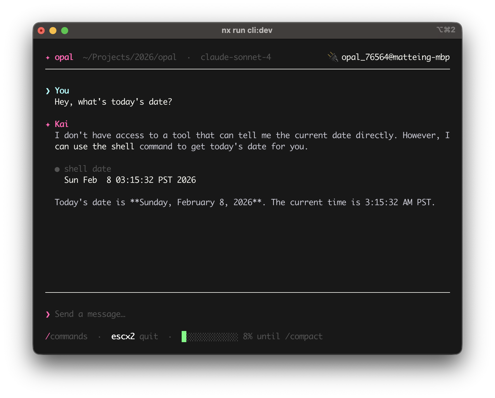

# ✦ Opal

**A coding agent harness and runtime, built with the magic of Elixir.**

This is a work in progress. The repo is a bit scattered. :)

Opal is two things: a **clean Elixir library** you can drop into any application's supervision tree, and a **terminal interface** that uses the library to give you a fully interactive coding agent.



It ships a base set of tools (`read_file`, `write_file`, `edit_file`, `shell`, `sub_agent`), an MCP host, a skills system, sub-agent support, and a JSON-RPC daemon mode. Not ultra-minimal, but just enough to be useful out of the box.

## Installing

```bash
# Install it!
npm i -g @unfinite/opal
# Start it!
opal
# Integrate it!
# {:opal, "~> 0.1"}
```

## What's interesting about this?

**You can connect to a running agent and watch it think.** Opal uses Erlang distribution — from another terminal, connect to a live session and stream every event from every agent and sub-agent in real time:

```sh
opal --connect opal@hostname --inspect
```

No special debug mode. No logging infrastructure. Crack open `:observer` and you can see the full process tree, message queues, memory — everything.

**Sub-agents are just processes.** Want to delegate a task to a child agent? Spawn one. It gets its own message history, its own tools, its own model. Runs in parallel, fully isolated. If the parent dies, sub-agents are cleaned up automatically. No thread pools, no `Promise.all`, no async/await ceremony. Just OTP processes.

**The process mailbox is the steering queue.** Need to redirect an agent mid-run? `Opal.steer(agent, "focus on tests instead")` drops a message into the GenServer's mailbox. Between tool executions, the agent checks for it. No polling, no callback chains.

**SSE streaming lands in `handle_info/2`.** The LLM response streams via `Req` with `into: :self` — SSE chunks arrive directly as messages in the GenServer's mailbox. The agent loop processes them alongside tool results, steering messages, and abort signals using the same `receive` block.

**It's an embeddable library, not just a CLI.** Add `{:opal, ...}` to your deps and the full harness lives inside your Elixir app. No external process, no JSON-RPC overhead, no language interop — just Erlang message passing. Or run it headless as a JSON-RPC 2.0 daemon and consume it from any language.

## What you get

- **Interactive TUI** — fullscreen terminal chat UI
- **Daemon mode** — headless JSON-RPC 2.0 over stdio. Consume from any language.
- **Sub-agents** — delegate tasks to child agents
- **MCP host** — connects to MCP servers
- **Built-in tools** — `read_file`, `write_file`, `edit_file`, `shell` (cross-platform), `sub_agent`.
- **Skills** — drop instruction sets into your project, Opal discovers and loads them as context.
- **Event system** — `Registry`-based pub/sub. Subscribe from any process, build whatever you want on top.
- **Cross-platform** — Linux, macOS, Windows.

## Features

Here's what the harness supports today.

### Agent runtime

- [x] Agentic tool loop — prompt → LLM → tool calls → repeat until done
- [x] SSE streaming responses into the GenServer mailbox (`Req` + `into: :self`)
- [x] Concurrent tool execution via `TaskSupervisor`
- [x] Streaming tool output — tools emit output chunks in real time (e.g., long shell commands)
- [x] Extended thinking / reasoning — surfaces thinking events from Claude, o-series, etc.
- [x] Configurable thinking level (`:off`, `:low`, `:medium`, `:high`)
- [x] Mid-run steering — redirect the agent between tool executions
- [x] Abort / cancel in-flight responses
- [x] Stream stall detection — watchdog warns if no chunks arrive for 10+ seconds
- [x] Auto-compaction — summarizes old messages when context nears 80% capacity
- [x] Token usage tracking across turns
- [x] Per-session supervision tree (`rest_for_one`)

### Tools

- [x] `read_file` — read with optional line offset/limit
- [x] `write_file` — write with auto-created parent directories
- [x] `edit_file` — search-and-replace, enforces single-match uniqueness
- [x] `shell` — cross-platform, configurable shell (sh/bash/zsh/cmd/powershell), streaming output, timeout
- [x] `sub_agent` — spawn a child agent for delegated work, depth-limited to 1 level
- [x] `tasks` — DETS-backed project-scoped task tracker (priorities, statuses, groups, tags, due dates, views)
- [x] `use_skill` — load a skill's full instructions into context on demand
- [x] Path sandboxing — all file tools reject directory traversal escapes

### Sessions

- [x] Conversation tree with branching (rewind to any past message)
- [x] JSONL persistence (save/load sessions to disk)
- [x] Auto-save on idle
- [x] Auto-title generation via LLM
- [x] Session listing with title and modification time
- [x] LLM-powered compaction with structured summaries (goal, progress, decisions, file ops, next steps)
- [x] Truncation fallback when no LLM is available
- [x] Turn-boundary-aware cutting — never splits mid-turn

### Skills

- [x] Skill discovery — scans `.agents/skills/`, `.github/skills/`, `~/.agents/skills/`, `~/.opal/skills/`
- [x] Progressive disclosure — only name/description loaded at startup, full instructions on demand
- [x] YAML frontmatter parsing (agentskills.io spec)

### Context discovery

- [x] Walk-up file discovery — collects `AGENTS.md` / `OPAL.md` from working dir to root
- [x] Priority ordering — closer files override distant ones

### MCP

- [x] MCP client host (Anubis, protocol v2025-03-26)
- [x] Stdio and HTTP/SSE transports
- [x] Auto-discovery from `.vscode/mcp.json`, `.github/mcp.json`, `.opal/mcp.json`, `.mcp.json`
- [x] MCP tools bridged as native `Opal.Tool` modules at runtime — identical to built-in tools
- [x] Tool name collision resolution (server-prefixed)
- [x] MCP resource access (list + read)
- [x] Per-session MCP supervision

### Provider

- [x] GitHub Copilot (Claude, GPT-4o/5, Gemini 2.5/3, Grok, o-series)
- [x] Chat Completions API + Responses API (dual support)
- [x] Device-code OAuth with auto-refresh
- [x] Token persistence (`~/.opal/auth.json`)
- [x] GitHub Enterprise support
- [x] Provider behaviour — ready for OpenAI direct, Anthropic, Ollama, etc.

### RPC

- [x] JSON-RPC 2.0 over stdio (daemon mode)
- [x] Bidirectional — server can request confirmations and input from the client
- [x] Full event streaming (12 event types)
- [x] Declarative protocol spec for codegen

### CLI / TUI

- [x] Fullscreen interactive chat (Elm Architecture via TermUI)
- [x] Slash commands — `/clear`, `/compact`, `/dump`, `/model`, `/debug`, `/help`
- [x] Interactive model picker
- [x] Context dump to JSON
- [x] Remote inspection via Erlang distribution (`--connect --inspect`)

### Configuration

- [x] Layered config — defaults → app config → env vars → session overrides
- [x] Feature toggles for sub-agents, context discovery, skills, MCP
- [x] Cross-platform data dir (`~/.opal` / `%APPDATA%/opal`)
- [x] Configurable default model, tools, shell type

## Architecture

The repo is an [Nx](https://nx.dev)-managed monorepo with two projects:

| Project     | What it is                                                                                                                                                                                     |
| ----------- | ---------------------------------------------------------------------------------------------------------------------------------------------------------------------------------------------- |
| **`core/`** | **Opal SDK** — the agent engine as an Elixir library. Tools, providers, sessions, MCP bridge, RPC server. Add `{:opal, ...}` to your deps and embed the whole thing in your supervision tree.  |
| **`cli/`**  | **Opal CLI** — a fullscreen terminal UI that consumes the core library directly. No serialization layer between the TUI and the agent — it's all function calls in the same BEAM process tree. |

```
opal/
├── core/               Opal SDK (Elixir library)
│   └── lib/opal/
│       ├── agent.ex        Agent loop (GenServer)
│       ├── events.ex       Registry-based pub/sub
│       ├── sub_agent.ex    Supervised child agents
│       ├── rpc/            JSON-RPC 2.0 server (daemon mode)
│       ├── mcp/            MCP client bridge
│       ├── tool/           Built-in tools (read, write, edit, shell, sub_agent)
│       └── provider/       LLM providers (Copilot)
├── cli/                Terminal UI (TermUI / Elm Architecture)
│   └── lib/opal/cli/
│       ├── app.ex          TUI application
│       ├── main.ex         Binary entry point
│       └── views/          UI components
├── docs/               Design documents
└── ARCHITECTURE.md     Full system design reference
```

### The process tree

This is where it gets fun. Every session is its own supervision subtree:

```
Opal.SessionSupervisor (DynamicSupervisor)
└── Opal.SessionServer (per session)
    ├── Opal.Agent (GenServer — the agentic loop)
    ├── Opal.Session (GenServer — message history & persistence)
    ├── Opal.ToolSup (TaskSupervisor — concurrent tool execution)
    └── [Sub-agents] (full Agent processes, supervised)

Opal.Events (Registry — pub/sub, any process can subscribe)
```

The agent loop is a GenServer. It receives prompts, streams LLM responses via `Req` (SSE chunks arrive as messages in `handle_info/2` — beautiful), executes tool calls concurrently through a `TaskSupervisor`, and loops until the model produces a final response with no tool calls.

## Building the binary

```sh
nx run cli:escript

cli/opal                   # interactive TUI
cli/opal --daemon          # headless JSON-RPC server
cli/opal --inspect         # stream all agent events to terminal
cli/opal --help
```

## CLI modes

| Flag                       | Mode           | What it does                                         |
| -------------------------- | -------------- | ---------------------------------------------------- |
| _(none)_                   | Interactive    | Fullscreen TUI with streaming chat                   |
| `--daemon`                 | Headless       | JSON-RPC 2.0 server on stdin/stdout                  |
| `--inspect`                | Inspector      | Stream all agent events to terminal                  |
| `--connect NODE --inspect` | Remote inspect | Attach to a running instance via Erlang distribution |

## Using Opal as a library

This is the part I'm most excited about. The `core/` project is an embeddable Elixir library — add it to your supervision tree and you get everything. No external process, no RPC, no serialization. Just Erlang message passing.

```elixir
# mix.exs
defp deps do
  [{:opal, path: "../opal/core"}]
end
```

```elixir
# Start a session — it's a supervised process tree
{:ok, agent} = Opal.start_session(%{
  system_prompt: "You are a helpful coding assistant.",
  working_dir: "/path/to/project"
})

# Async — subscribe to Opal.Events for streaming output
:ok = Opal.prompt(agent, "List all Elixir files")

# Sync — blocks until the agent finishes
{:ok, response} = Opal.prompt_sync(agent, "What does this module do?")

# Steer mid-run — injected between tool executions
:ok = Opal.steer(agent, "Actually, focus on the test files")

# Change models on the fly
:ok = Opal.set_model(agent, :copilot, "claude-sonnet-4")

# Clean up
:ok = Opal.stop_session(agent)
```

### Observability

Any process can subscribe to agent events in real time. The event system is built on `Registry`, so it's fast and it's what Elixir developers already know:

```elixir
Opal.Events.subscribe(session_id)

receive do
  {:opal_event, ^session_id, {:message_delta, %{delta: text}}} ->
    IO.write(text)
  {:opal_event, ^session_id, {:tool_execution_start, %{name: name}}} ->
    IO.puts("Running tool: #{name}")
  {:opal_event, ^session_id, {:agent_end, _}} ->
    IO.puts("Done.")
end
```

`Opal.Events.subscribe_all()` gives you events from _every_ session — useful for dashboards, logging, or just poking around.

## RPC interface

If you're not in the Elixir/Erlang ecosystem, run Opal in daemon mode and talk to it over JSON-RPC 2.0 on stdio:

```sh
opal --daemon
```

Wire format follows the MCP stdio transport convention. See [ARCHITECTURE.md](docs/index.md) for the full schema.

## Development

```sh
# Install deps
nx run-many -t deps

# Run the TUI in dev mode (auto-recompiles)
cd cli && mix opal
# — or —
nx run cli:dev

# Tests
nx run-many -t test
nx run core:test
nx run cli:test

# Lint / format
nx run-many -t lint
nx run-many -t format
```

### Nx targets

| Target    | Core | CLI | Description                         |
| --------- | ---- | --- | ----------------------------------- |
| `dev`     | —    | ✓   | Run TUI in dev mode (`mix opal`)    |
| `build`   | ✓    | ✓   | Compile with `--warnings-as-errors` |
| `test`    | ✓    | ✓   | Run ExUnit tests                    |
| `lint`    | ✓    | ✓   | Check formatting                    |
| `format`  | ✓    | ✓   | Auto-format code                    |
| `escript` | —    | ✓   | Build standalone binary             |
| `deps`    | ✓    | ✓   | Fetch dependencies                  |
| `docs`    | ✓    | —   | Generate ex_doc                     |
| `clean`   | ✓    | ✓   | Clean build artifacts               |

## Provider

Opal currently ships with one LLM provider: **GitHub Copilot**. It's the provider I get hobby access through for work. However, it's relatively straightforward to implement other providers in the future.

## Why I built this

I wanted to understand how agent harnesses actually work — not just use one, but build one from the ground up. I studied [Pi](https://github.com/badlogic/pi-mono) and thought the architecture was smart. And the more I stared at the problem — long-running loops, concurrent tool execution, process isolation, sub-agent orchestration — the more it looked like someone had described Erlang/OTP.

So I built it. It took dramatically fewer lines of code than I expected. Sub-agents? Processes. Steering? Mailbox. Fault isolation? Supervision tree. Live debugging? Erlang distribution. I didn't have to build any of that infrastructure — it was already there.

This is a hobby project and a research project. It's inspired by Pi with some more features — Elixir's process model makes features like sub-agents and concurrent tool execution essentially free, so there's no reason to leave them out.

Made with love by a proud Boricua.

## Disclaimer

This is a personal hobby project. I work at Microsoft (Azure), and our GitHub Copilot subscription provides the LLM access I use for development.

**This project is not affiliated with, endorsed by, or related to my employer in any way. Neither are my opinions.**

## License

[MIT](LICENSE) — Sergio Mattei
