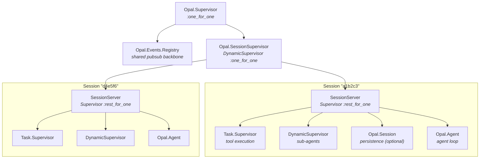
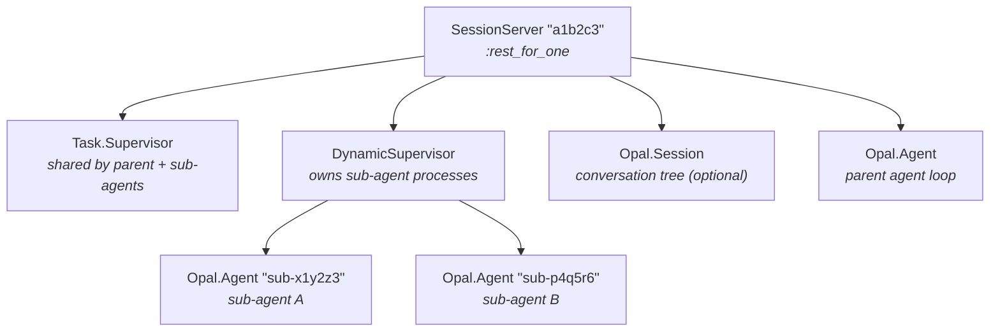
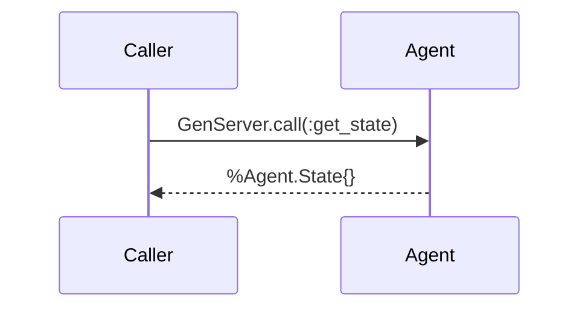
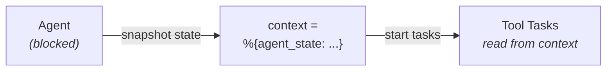
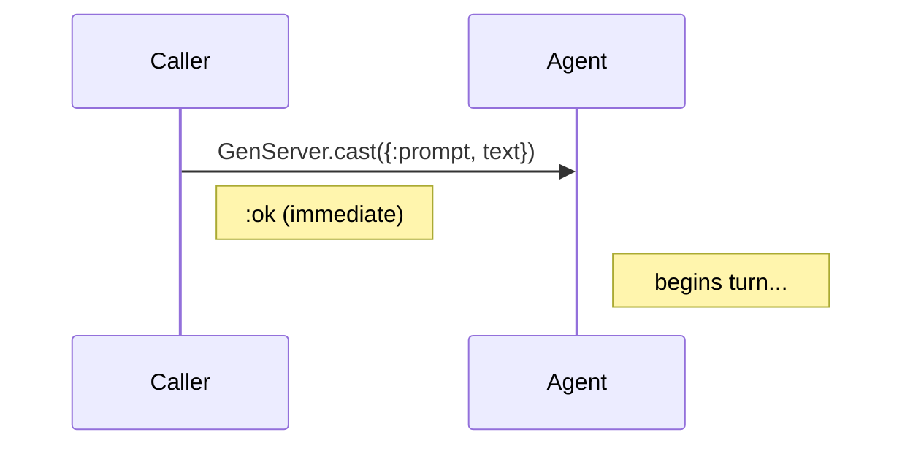
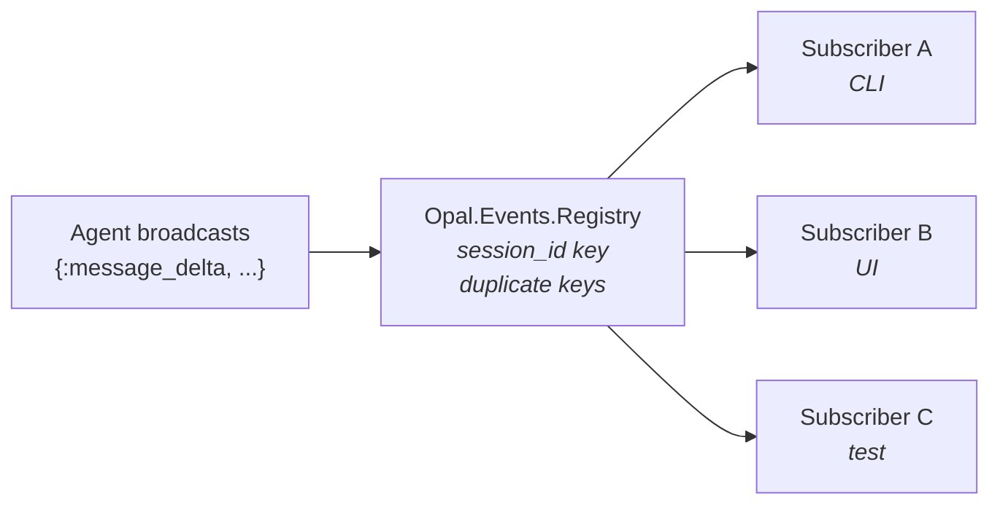
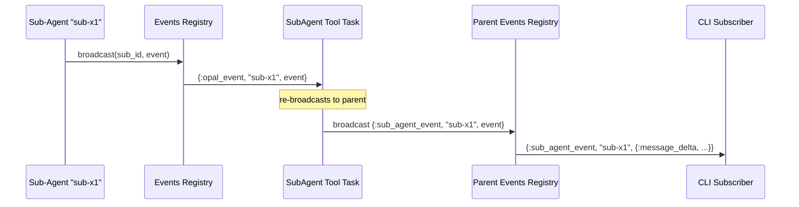
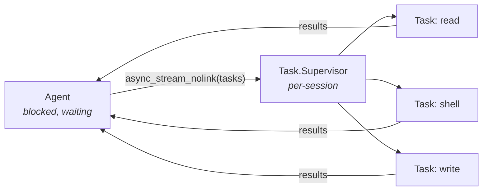
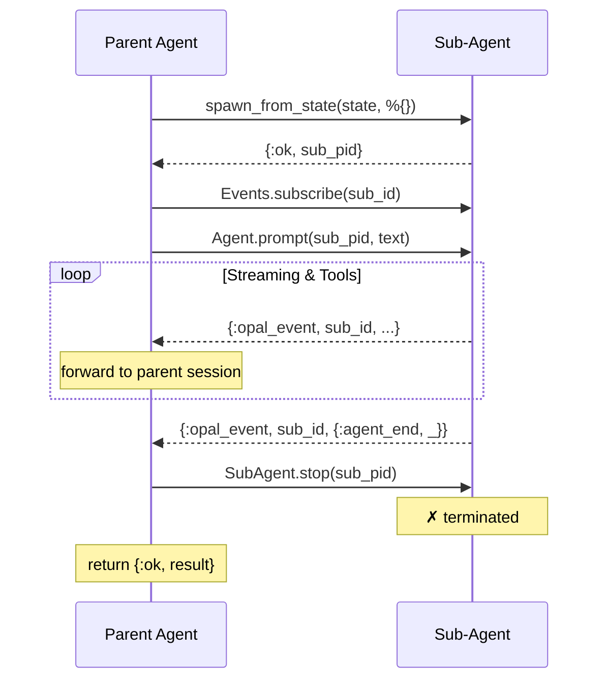
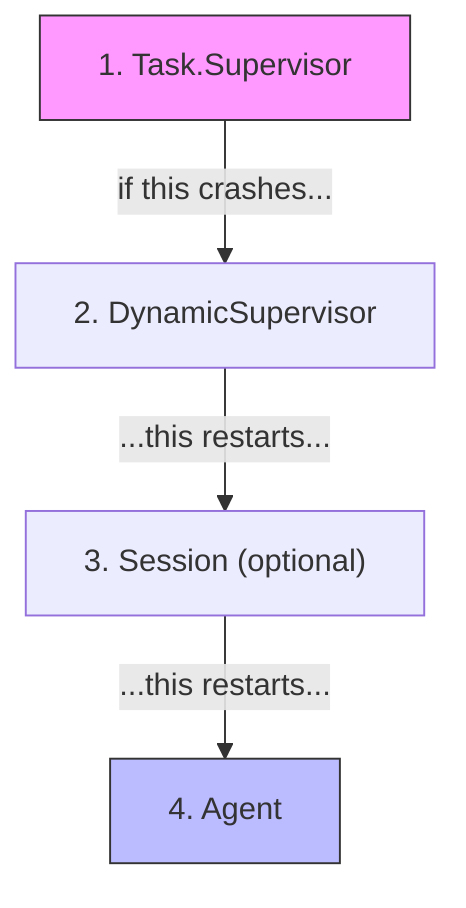

# Supervision & Message Passing

This document describes Opal's OTP supervision architecture, process lifecycle,
message passing patterns, and the design rationale behind each decision.

---

## Supervision Tree

Opal uses a **per-session supervision tree** so that every active session is a
fully isolated unit — its own processes, its own failure domain, its own cleanup.



### When sub-agents are active

Sub-agents are regular `Opal.Agent` processes started under the session's own
`DynamicSupervisor`. They share the parent's `Task.Supervisor` for tool
execution but cannot spawn further sub-agents (depth = 1).



---

## Process Roles

### `Opal.Events.Registry`

A `Registry` with `:duplicate` keys. Any process can subscribe to a session ID
and receive events. This is the **only shared global process** — everything else
is per-session. The registry never holds state; it simply routes messages.

### `Opal.SessionSupervisor`

A `DynamicSupervisor` that acts as the container for all active sessions. When
`Opal.start_session/1` is called, a new `SessionServer` child is started here.
When `Opal.stop_session/1` is called, the entire `SessionServer` subtree is
terminated — one call cleans up the agent, all running tools, all sub-agents,
and the session store.

### `Opal.SessionServer`

A per-session `Supervisor` using the `:rest_for_one` strategy. Children are
started in order:

1. **`Task.Supervisor`** — executes tool calls as supervised tasks
2. **`DynamicSupervisor`** — manages sub-agent processes
3. **`Opal.Session`** — conversation persistence *(optional, started when `session: true`)*
4. **`Opal.Agent`** — the agent loop

The `:rest_for_one` strategy means if the `Task.Supervisor` or
`DynamicSupervisor` crashes, the Agent (which depends on them) is restarted
too. But a crash in the Agent does not affect the supervisors above it.

Each child is registered with a session-scoped atom name for discoverability:

| Process           | Name                                  |
|-------------------|---------------------------------------|
| Task.Supervisor   | `:"opal_tool_sup_#{session_id}"`      |
| DynamicSupervisor | `:"opal_sub_agent_sup_#{session_id}"` |
| Session           | `:"opal_session_#{session_id}"`       |

### `Opal.Agent`

A `GenServer` that implements the core agent loop:

1. Receive a user prompt (`handle_cast`)
2. Stream an LLM response via the configured `Provider`
3. If the LLM returns tool calls → execute them concurrently → loop to step 2
4. If the LLM returns text only → broadcast `agent_end` → go idle

The Agent holds references to its session-local `tool_supervisor` and
`sub_agent_supervisor` in its state — it never touches global process names.

### `Opal.Session`

A `GenServer` backed by an ETS table that stores conversation messages in a
tree structure (each message has a `parent_id`). Supports branching — rewinding
to any past message and forking the conversation. Persistence is via ETF
serialization to disk.

---

## Message Passing

Opal uses three distinct message passing patterns, each chosen for a specific
purpose.

### 1. GenServer Calls — Synchronous State Access



Used for: `Agent.get_state/1`, `Session.append/2`, `Session.get_path/1`

These are standard GenServer synchronous calls — the caller blocks until the
server replies. Used when the caller needs a consistent snapshot of state.

**Key design decision:** Tool tasks never call `Agent.get_state(agent_pid)`
during execution. The Agent is blocked in `Task.Supervisor.async_stream_nolink`
waiting for tool results — a `GenServer.call` from a tool task back to the
Agent would deadlock. Instead, the Agent snapshots its state into the tool
execution context *before* dispatching tasks:



### 2. GenServer Casts — Asynchronous Commands



Used for: `Agent.prompt/2`, `Agent.steer/2`, `Agent.abort/1`

Prompts are fire-and-forget casts. The caller gets `:ok` immediately and
observes progress through events (pattern 3). This keeps the caller
non-blocking — critical for interactive CLI and web UIs.

### 3. Registry PubSub — Event Broadcasting



Used for: all agent lifecycle events

The Agent (and tool tasks) call `Opal.Events.broadcast(session_id, event)`.
Every process that called `Opal.Events.subscribe(session_id)` receives the
event as a regular Erlang message:

```elixir
{:opal_event, session_id, event}
```

**Event types:**

| Event                                | Emitted when                         |
|--------------------------------------|--------------------------------------|
| `{:agent_start}`                     | Agent begins processing a prompt     |
| `{:message_delta, %{delta: text}}`   | Streaming text token from the LLM    |
| `{:thinking_delta, %{delta: text}}`  | Streaming thinking/reasoning token   |
| `{:turn_end, message, tool_calls}`   | LLM turn complete, tool calls follow |
| `{:tool_execution_start, name, args}`| Tool begins executing                |
| `{:tool_execution_end, name, result}`| Tool finished executing              |
| `{:agent_end, messages}`             | Agent is done, returning to idle     |
| `{:error, reason}`                   | Unrecoverable error occurred         |
| `{:sub_agent_event, sub_id, event}`  | Forwarded event from a sub-agent     |

This is built on OTP's `Registry` — no external dependencies, no message
broker, no serialization overhead. Events are plain Erlang terms sent via
`send/2` under the hood.

### 4. Sub-Agent Event Forwarding

Sub-agents broadcast events to their own session ID. The `SubAgent` tool
subscribes to those events, collects the response, and **re-broadcasts** each
event to the parent session tagged with the sub-agent's ID:



This gives the parent session **real-time observability** into sub-agent
activity without any direct process coupling. The CLI renders sub-agent events
with a tree border (┌─ / │ / └─) to visually distinguish them from the parent.

---

## Tool Execution

Tool calls are executed concurrently using `Task.Supervisor.async_stream_nolink`:



**Why `async_stream_nolink`?**

- **`async_stream`** — tasks are linked to the caller. If one crashes, the
  Agent crashes. Bad for reliability.
- **`async_stream_nolink`** — tasks are *not* linked. A crashing tool produces
  `{:exit, reason}` in the result stream. The Agent converts this to an error
  tool result and continues.

**Why per-session `Task.Supervisor`?**

- **Isolation:** If session A's tool tasks are misbehaving, session B is
  unaffected.
- **Cleanup:** Terminating the `SessionServer` automatically kills all running
  tool tasks for that session.
- **Observability:** You can inspect `Task.Supervisor.children(sup)` to see
  what tools are currently running in a specific session.

### Crash Recovery

When a tool task crashes, the Agent preserves the original tool call metadata
by zipping results with the original task list:

```elixir
results
|> Enum.zip(tasks)
|> Enum.map(fn
  {{:ok, {tc, result}}, _}        -> {tc, result}
  {{:exit, reason}, {tc, _mod}}   -> {tc, {:error, "crashed: #{inspect(reason)}"}}
end)
```

This ensures the LLM always receives a `tool_result` message with the correct
`call_id` — even if the tool crashed. Without this, the LLM API rejects the
request with "tool call must have a tool call ID".

---

## Sub-Agent Architecture

### Spawning

Sub-agents are started under the session's `DynamicSupervisor`:

```elixir
DynamicSupervisor.start_child(
  state.sub_agent_supervisor,   # per-session, not global
  {Opal.Agent, opts}
)
```

They inherit the parent's config, provider, and working directory by default.
Any of these can be overridden — including the model (e.g., use a cheaper model
for simple tasks).

### Depth Enforcement

Sub-agents are limited to **one level** — no recursive spawning. This is
enforced by simply excluding the `Opal.Tool.SubAgent` module from the
sub-agent's tool list:

```elixir
parent_tools = parent_state.tools -- [Opal.Tool.SubAgent]
```

No runtime depth counter needed. The sub-agent literally does not have the tool
available, so the LLM cannot request it. Clean, declarative, zero overhead.

### Tool Sharing

Sub-agents share the parent's `Task.Supervisor` for tool execution. This means:

- Tool tasks from both the parent and sub-agents run under the same supervisor
- Terminating the session cleans up *all* tool tasks (parent + sub-agents)
- No need for sub-agents to have their own `Task.Supervisor`

### Lifecycle



---

## Failure Domains & Isolation

### Session Isolation

Each session is a self-contained subtree. Failures in one session cannot
propagate to another:

| Failure                            | Impact                              |
|------------------------------------|-------------------------------------|
| Tool task crashes                  | Error result to LLM, agent continues|
| Sub-agent crashes                  | Tool returns error, parent continues|
| Agent GenServer crashes            | SessionServer restarts it (`:rest_for_one`) |
| Task.Supervisor crashes            | Agent restarts too (`:rest_for_one`)  |
| Entire SessionServer crashes       | Only that session is lost             |
| `Events.Registry` crashes          | All sessions lose pubsub temporarily  |

### `:rest_for_one` Strategy

The SessionServer uses `:rest_for_one` — if a child crashes, all children
started *after* it are restarted. The child order is:



This guarantees the Agent never runs without a working `Task.Supervisor`. But
if the Agent crashes, the supervisors and session store remain intact.

### Deadlock Prevention

The Agent loop is a GenServer that blocks during tool execution (waiting for
`async_stream_nolink` results). Any `GenServer.call` to the Agent from a tool
task would deadlock with a 5-second timeout.

**Solution:** Before dispatching tool tasks, the Agent snapshots its entire
state into the execution context:

```elixir
context = %{
  working_dir: state.working_dir,
  session_id: state.session_id,
  config: state.config,
  agent_pid: self(),          # for reference only, never call into it
  agent_state: state          # snapshot — tools read from this
}
```

Tools (including `SubAgent`) use `context.agent_state` instead of calling back
to the Agent. The `SubAgent` tool uses `spawn_from_state/2` (takes a state
struct) rather than `spawn/2` (takes a pid and calls `get_state`).

---

## Design Rationale

### Why per-session supervision trees?

**Before:** A single global `Task.Supervisor` handled all tool execution across
all sessions. This had several problems:

- No isolation between sessions
- No way to cleanly shut down one session's tasks without affecting others
- No way to inspect what a specific session is doing
- Cleanup required manual tracking

**After:** Each session owns its entire process tree. `stop_session/1` is a
single `DynamicSupervisor.terminate_child/2` call that cleanly shuts down
everything.

### Why Registry-based pubsub?

- **No external dependencies** — built into OTP
- **No serialization** — events are plain Erlang terms, delivered via `send/2`
- **Duplicate keys** — multiple subscribers per session ID
- **Process-native** — subscribers just use `receive`, no callback modules
- **Automatic cleanup** — when a subscriber process dies, its registrations
  are removed

### Why `async_stream_nolink` for tools?

- **Concurrent execution** — multiple tools run in parallel automatically
- **Fault isolation** — one crashing tool doesn't take down the agent
- **Ordered results** — results come back in the same order as the input,
  making it easy to match results with their original tool calls
- **Back-pressure** — the Agent blocks until all tools complete before
  starting the next LLM turn (required for correct conversation flow)

### Why sub-agents share the parent's Task.Supervisor?

- **Simplicity** — fewer processes to manage
- **Unified cleanup** — one supervisor termination kills everything
- **Resource sharing** — sub-agent tool tasks are supervised identically to
  parent tool tasks
- **No nesting complexity** — sub-agents don't need their own SessionServer

### Why depth-1 sub-agents only?

- **Predictability** — recursive agent spawning can lead to unbounded resource
  consumption
- **Debuggability** — a flat parent→child relationship is easy to observe and
  reason about
- **Cost control** — each sub-agent gets its own LLM conversation, so costs
  multiply. One level is sufficient for task delegation patterns (e.g., "read
  these 5 files in parallel") without enabling runaway recursion
