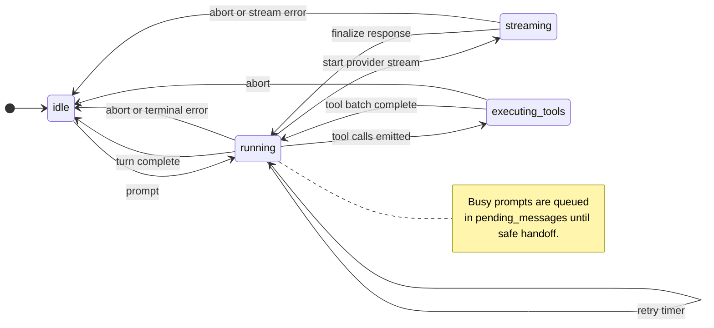
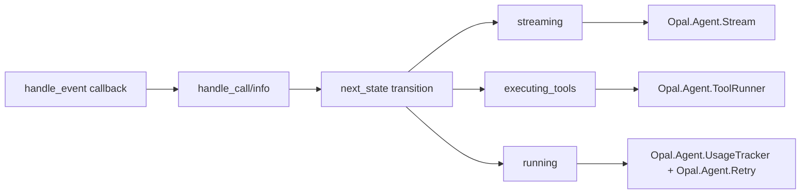

# Agent Loop

`Opal.Agent` is the runtime loop that drives prompt handling, model streaming, tool execution, retries, and completion. The loop is now implemented as an OTP `:gen_statem` (`lib/opal/agent/agent.ex`) with explicit lifecycle states, while helper modules under `lib/opal/agent/` keep stream parsing, tool orchestration, retries, and compaction concerns separated.

## Interface

The public API remains stable and routes into the state machine:

```elixir
Opal.Agent.start_link(opts)
Opal.Agent.prompt(agent, text) #=> %{queued: boolean()}
Opal.Agent.abort(agent)
Opal.Agent.get_state(agent)
Opal.Agent.get_context(agent)
Opal.Agent.set_model(agent, model)
Opal.Agent.set_provider(agent, provider_module)
Opal.Agent.sync_messages(agent, messages)
Opal.Agent.configure(agent, %{features: ..., enabled_tools: ...})
```

The runtime callback model is explicit:

```elixir
@behaviour :gen_statem

callback_mode() :: :state_functions
idle(event_type, event_content, state)
running(event_type, event_content, state)
streaming(event_type, event_content, state)
executing_tools(event_type, event_content, state)
```

## FSM States

| State              | Meaning                                       | External commands                 |
| ------------------ | --------------------------------------------- | --------------------------------- |
| `:idle`            | Waiting for prompt input                      | prompt, abort, calls              |
| `:running`         | Building context and starting provider stream | prompt queued, abort, calls       |
| `:streaming`       | Processing provider SSE events                | prompt queued, abort, calls       |
| `:executing_tools` | Running tool calls through supervised tasks   | prompt queued, abort, calls       |



## How it works

### 1. Prompt intake and gating

`prompt/2` uses `:gen_statem.call`. In `:idle`, input is appended as a user message, the state transitions to `:running`, and the caller receives `%{queued: false}`. In non-idle states, prompts are queued in `pending_messages` and the caller receives `%{queued: true}`.

### 2. Turn start in `:running`

`run_turn/1` builds the message list, applies compaction checks, resolves active tools, and starts streaming through the configured provider. The machine then transitions to `:streaming`.

### 3. Streaming in `:streaming`

The loop consumes SSE chunks via `Req.parse_message/2`, then passes each JSON line through `provider.parse_stream_event/1`.

`Opal.Agent.Stream` normalizes provider events (`:text_delta`, `:tool_call_done`, `:usage`, `:response_done`, etc.) and updates accumulated response fields.

### 4. Finalization and branch

On stream completion, the assistant message is appended and the machine re-enters `:running`. If tool calls are present, control moves to `:executing_tools`. Otherwise the loop emits `{:agent_end, ...}` and returns to `:idle`.

### 5. Tool execution in `:executing_tools`

Tool calls are started concurrently using `Task.Supervisor.async_nolink`. Results are received through state-machine `:info` messages, converted to `:tool_result` messages, and the machine returns to `:running` for the next provider turn.



### 6. Resilience paths

- `Opal.Agent.Retry` classifies transient provider errors and schedules exponential backoff.
- `Opal.Agent.UsageTracker` and `Opal.Agent.Overflow` handle auto-compaction and overflow recovery before retrying turns.
- `abort/1` cancels in-flight stream/tool work and forces `:idle`.

## Agent module layout

The agent runtime now follows a responsibility-first layout under `lib/opal/agent/`:

- `agent.ex` — `:gen_statem` loop and state transitions
- `state.ex` — runtime state struct/types
- `stream.ex` — provider event parsing and stream-state updates
- `tool_runner.ex` — concurrent tool lifecycle orchestration
- `retry.ex` — retry policy and backoff classification
- `usage_tracker.ex` + `overflow.ex` — usage tracking, compaction, and overflow handling
- `repair.ex` + `system_prompt.ex` + `emitter.ex` — message repair, prompt assembly, and event broadcasting
- `spawner.ex` + `collector.ex` — sub-agent orchestration and response collection

## References

- [Erlang `gen_statem`](https://www.erlang.org/doc/man/gen_statem.html) — OTP state machine behaviour used by `Opal.Agent`.
- [Elixir `GenServer`](https://hexdocs.pm/elixir/GenServer.html) — messaging model still used by sibling subsystems and APIs around the loop.
- [Erlang/OTP Supervisor Principles](https://www.erlang.org/doc/design_principles/sup_princ.html) — supervision strategy used by session-local processes and tool tasks.
