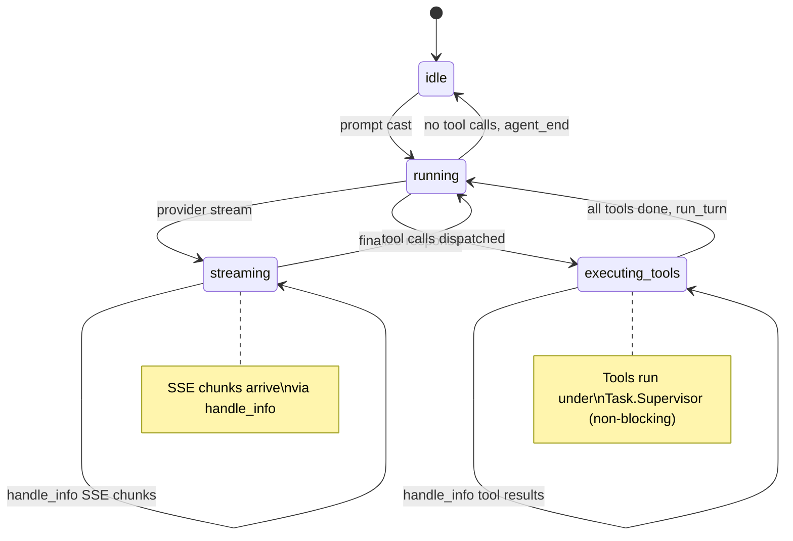
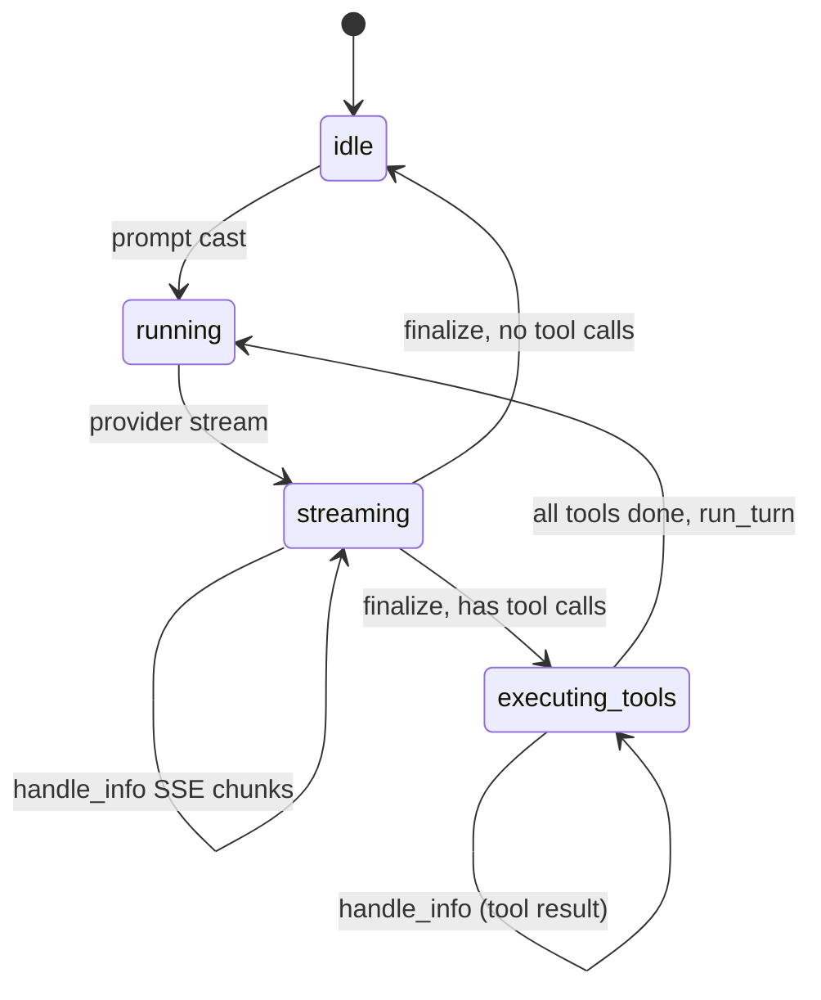
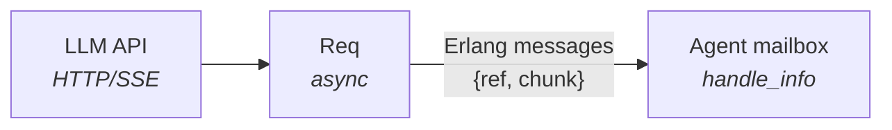
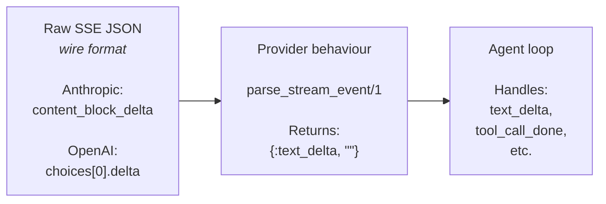
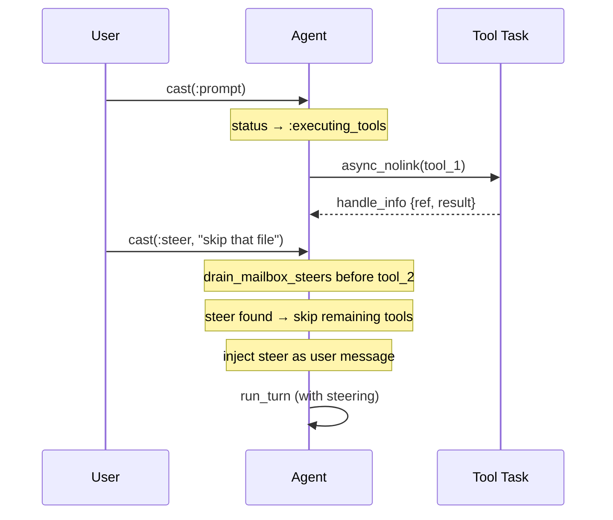
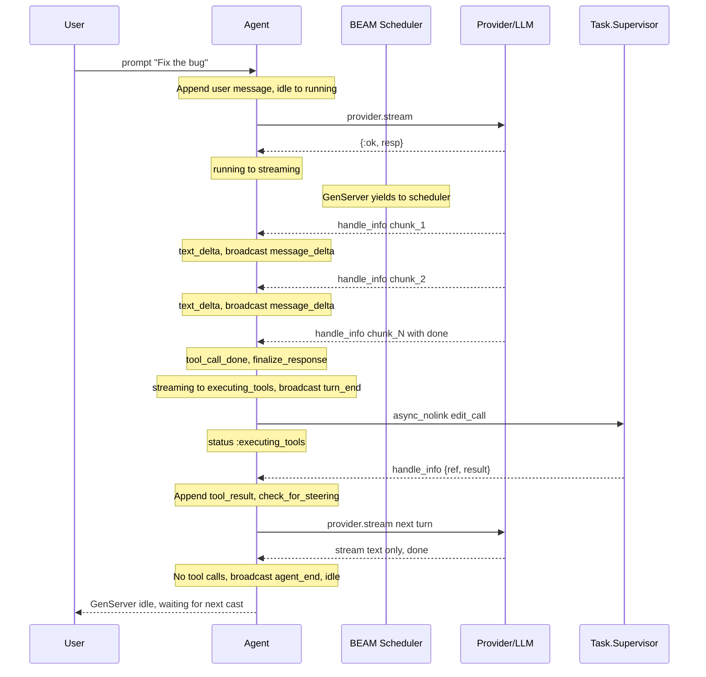
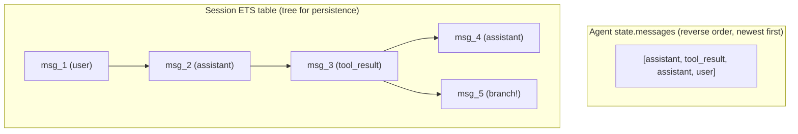
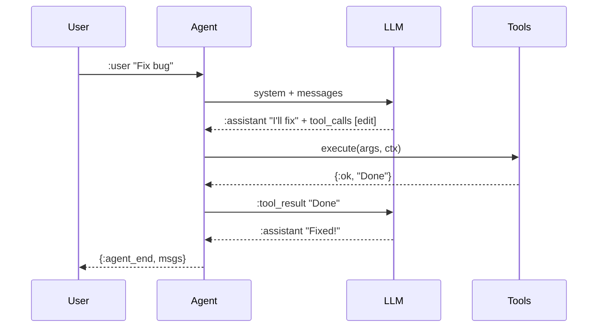

# The Agent Loop

This document explains how `Opal.Agent` implements the agentic loop pattern
on top of OTP's `GenServer`, and how every phase of the loop maps to native
OTP concepts: casts, handle_info, selective receive, and supervised tasks.

---

## Overview

An agent loop is a cycle: **prompt → stream LLM → execute tools → repeat**.
The loop runs until the LLM produces a text-only response with no tool calls.

In Opal, this cycle is expressed entirely through GenServer state transitions
and OTP message passing — no spawned loops, no recursive spawns, no custom
schedulers. The BEAM scheduler *is* the scheduler.



---

## State Machine

The Agent has four states, tracked by the `status` field:

| State              | Meaning                                    | Accepts prompts? |
|--------------------|--------------------------------------------|------------------|
| `:idle`            | Waiting for user input                     | Yes              |
| `:running`         | Processing (building messages, dispatching)| Via steering     |
| `:streaming`       | Receiving SSE chunks from the LLM          | Via steering     |
| `:executing_tools` | Running tool calls via Task.Supervisor     | Via steering     |

State transitions are driven by OTP callbacks:



---

## Phase 1: Receiving the Prompt

```elixir
def handle_cast({:prompt, text}, %State{} = state) do
  user_msg = Opal.Message.user(text)
  state = append_message(state, user_msg)
  state = %{state | status: :running}
  broadcast(state, {:agent_start})
  run_turn(state)
end
```

**Why `cast` instead of `call`?**

A `call` would block the caller until the agent finishes — which could be
minutes if the LLM runs multiple tool-use turns. Using `cast`:

- The caller gets `:ok` immediately
- The caller observes progress via `Opal.Events` (pubsub)
- The GenServer is free to process `handle_info` messages (SSE chunks)
  without a caller hanging

**OTP mapping:** This is a standard GenServer `handle_cast`. The prompt is
appended to the conversation history, status transitions to `:running`, and
`run_turn/1` is called synchronously within the same callback — it returns
`{:noreply, state}` once the streaming response is set up.

---

## Phase 2: Starting the LLM Stream

```elixir
defp run_turn(%State{} = state) do
  all_messages = build_messages(state)
  tools = active_tools(state)

  case state.provider.stream(state.model, all_messages, tools) do
    {:ok, resp} ->
      state = %{state | streaming_resp: resp, status: :streaming, ...}
      {:noreply, state}

    {:error, reason} ->
      broadcast(state, {:error, reason})
      {:noreply, %{state | status: :idle}}
  end
end
```

`run_turn/1` is always the last call in a `handle_cast` or at the end of tool
execution. It calls the configured `Provider.stream/4` which initiates an
async HTTP request via `Req`.

**How Req async streaming works with GenServer:**

1. `Req` opens an HTTP connection and returns a `%Req.Response{}` immediately
2. As SSE chunks arrive over the wire, `Req` sends them as regular Erlang
   messages to the calling process (the Agent GenServer)
3. The Agent's `handle_info/2` receives these messages

This is the key integration point: **Req's async streaming maps directly to
GenServer's `handle_info`**. No polling, no separate receiver process, no
callbacks — just messages in the GenServer mailbox.



---

## Phase 3: Processing the Stream

```elixir
def handle_info(message, %State{status: :streaming, streaming_resp: resp} = state)
    when resp != nil do
  case Req.parse_message(resp, message) do
    {:ok, chunks} ->
      state = Enum.reduce(chunks, state, fn
        {:data, data}, acc -> parse_sse_data(data, acc)
        :done, acc -> acc
        _other, acc -> acc
      end)

      if :done in chunks do
        finalize_response(state)
      else
        {:noreply, state}
      end

    :unknown ->
      {:noreply, state}
  end
end
```

Each `handle_info` invocation processes one batch of SSE chunks. The Agent
pattern-matches on `status: :streaming` to ensure it only processes stream
data when actually streaming.

**SSE event types and how they update state:**

| LLM Stream Event | State Mutation | Event Broadcast |
|---|---|---|
| `text_start` | (no state change) | `{:message_start}` |
| `text_delta "Hel"` | `current_text <> "Hel"` | `{:message_delta, %{delta: "Hel"}}` |
| `text_delta "lo"` | `current_text <> "lo"` | `{:message_delta, %{delta: "lo"}}` |
| `text_done "Hello"` | `current_text = "Hello"` | (none) |
| `tool_call_start` | append to `current_tool_calls` | (none) |
| `tool_call_delta` | append to `arguments_json` | (none) |
| `tool_call_done` | finalize tool call entry | (none) |
| `thinking_start` | (no state change) | `{:thinking_start}` |
| `thinking_delta` | (no state change) | `{:thinking_delta, ...}` |
| `response_done` | (no state change) | (none) |
| `:done` (Req) | triggers `finalize_response` | (see below) |

**OTP mapping:** Every SSE chunk is a `handle_info` call. Between chunks, the
GenServer is free to process other messages — including `abort` casts. The
BEAM scheduler interleaves chunk processing with any other work the VM needs
to do.

### Provider Abstraction

The raw SSE JSON is never interpreted by the Agent directly. Instead:

1. `Req.parse_message/2` extracts `{:data, iodata}` from the HTTP-level framing
2. The Agent calls `state.provider.parse_stream_event(json)` to get semantic events
3. The Agent dispatches on the semantic event type (`:text_delta`, `:tool_call_start`, etc.)

This means the Agent loop is **provider-agnostic**. The same GenServer handles
Anthropic's Responses API, OpenAI's Chat Completions API, or any custom provider.
The `Provider` behaviour defines the translation layer:



---

## Phase 4: Finalizing the Response

When `:done` arrives in the chunk list, `finalize_response/1` is called:

```elixir
defp finalize_response(%State{} = state) do
  tool_calls = finalize_tool_calls(state.current_tool_calls)
  assistant_msg = Opal.Message.assistant(state.current_text, tool_calls)
  state = append_message(state, assistant_msg)

  if tool_calls != [] do
    broadcast(state, {:turn_end, assistant_msg, []})
    Opal.Agent.ToolRunner.start_tool_execution(tool_calls, state)
  else
    broadcast(state, {:agent_end, Enum.reverse(state.messages), final_usage})
    {:noreply, %{state | status: :idle}}
  end
end
```

This is the branching point of the loop:

- **No tool calls** → The agent is done. Broadcast `agent_end` (with reversed
  messages), go `:idle`. The GenServer sits in its mailbox waiting for the
  next `handle_cast`.

- **Has tool calls** → Dispatch via `ToolRunner.start_tool_execution`, which
  sets status to `:executing_tools` and starts dispatching tools one at a
  time via `async_nolink` + `handle_info`.

**OTP mapping:** `finalize_response` is called from within `handle_info`.
It returns `{:noreply, state}` either directly (no tools) or through
`start_tool_execution` (tools). In both cases, the GenServer callback
contract is satisfied — the return value is always `{:noreply, state}`.

---

## Phase 5: Non-Blocking Tool Execution

Tool execution uses `Task.Supervisor.async_nolink` with `handle_info` callbacks,
keeping the GenServer responsive throughout. Tools are dispatched one at a time
via `Opal.Agent.ToolRunner`:

```elixir
def start_tool_execution(tool_calls, %State{} = state) do
  context = build_tool_context(state)

  state = %{
    state
    | status: :executing_tools,
      remaining_tool_calls: tool_calls,
      tool_results: [],
      tool_context: context
  }

  dispatch_next_tool(state)
end

def dispatch_next_tool(%State{remaining_tool_calls: [tc | rest]} = state) do
  state = drain_mailbox_steers(state)
  # ... steering check, skip remaining if steered ...

  task =
    Task.Supervisor.async_nolink(state.tool_supervisor, fn ->
      execute_single_tool(tool_mod, tc.arguments, ctx)
    end)

  state = %{state | remaining_tool_calls: rest, pending_tool_task: {task.ref, tc}}
  {:noreply, state}
end
```

Results arrive via `handle_info` in the Agent GenServer:

```elixir
def handle_info(
      {ref, result},
      %State{status: :executing_tools, pending_tool_task: {task_ref, tc}} = state
    ) when ref == task_ref do
  Process.demonitor(ref, [:flush])
  state = %{state | tool_results: state.tool_results ++ [{tc, result}], pending_tool_task: nil}
  ToolRunner.dispatch_next_tool(state)
end
```

### Why `Task.Supervisor.async_nolink` + `handle_info`?

This is the key architectural choice. Each tool runs as a supervised,
unlinked task. The Agent dispatches one tool at a time and receives results
via `handle_info` — keeping the GenServer **non-blocking** throughout.

| Property          | What it means for agents                        |
|-------------------|-------------------------------------------------|
| **Supervised**    | Tasks run under a `Task.Supervisor`, not wild   |
| **Unlinked**      | A crashing tool doesn't crash the Agent         |
| **Non-blocking**  | Agent can process abort/steer during execution  |
| **Sequential**    | Tools run one at a time with steering checks    |

Compare with the previous approach:

| Alternative | Verdict | Why |
|---|---|---|
| `async_stream_nolink` | ✗ | Blocks the GenServer, prevents abort/steer |
| `Task.async/1` | ✗ | Linked — crash propagates to Agent |
| `spawn/1` | ✗ | Unsupervised, no result collection |
| `async_nolink` + `handle_info` | ✓ | Supervised, isolated, non-blocking |

### The Non-Blocking Model

While tool tasks run, the Agent GenServer remains **responsive** — it can
process `handle_info`, `handle_cast`, and other messages. This is a deliberate
design choice:

1. Users can abort or steer mid-execution
2. Tool results arrive as messages, not blocking return values
3. Between tools, `drain_mailbox_steers` checks for steering

The `:executing_tools` status distinguishes tool execution from other states,
and `pending_tool_task: {ref, tc}` tracks the currently-running tool so
`handle_info` can match on the task reference.

### State Snapshot for Tools

Before dispatching tasks, the Agent captures its state into the context map:

```elixir
context = %{agent_state: state, ...}
```

Tools read from `context.agent_state` — a frozen snapshot — instead of
calling back to the live GenServer. The `SubAgent` tool uses
`spawn_from_state(context.agent_state, overrides)` instead of
`spawn(agent_pid, overrides)`.

### Steering Between Tools

Users may inject guidance while tools are running ("actually, skip
that file"). Since tools now execute non-blockingly, steering messages
arrive as normal `handle_cast` messages. Between each tool dispatch,
`drain_mailbox_steers` checks for pending steers:

```elixir
def drain_mailbox_steers(state) do
  receive do
    {:"$gen_cast", {:steer, text}} ->
      state = %{state | pending_steers: state.pending_steers ++ [text]}
      drain_mailbox_steers(state)
  after
    0 -> state
  end
end
```

If steering messages are found, remaining tools are **skipped** and the
batch is finalized immediately. The steer text is injected as a user
message before the next `run_turn`.



---

## The Full Cycle

Putting it all together, here's one complete agentic turn:



---

## Session Integration

When an `Opal.Session` process is attached, every message append is mirrored
to it:

```elixir
defp append_message(%State{session: nil} = state, msg) do
  %{state | messages: [msg | state.messages]}
end

defp append_message(%State{session: session} = state, msg) do
  Opal.Session.append(session, msg)        # ← GenServer.call to Session
  %{state | messages: [msg | state.messages]}
end
```

The Agent maintains its own `messages` list in **reverse order** (newest
first) for O(1) prepend. When building the LLM context, `build_messages/1`
calls `Enum.reverse/1` to produce chronological order. The Session maintains
a tree structure in ETS for branching, persistence, and history. Both are
always in sync.



The Session is a sibling process under the same `SessionServer` supervisor.
If the Session crashes, the `:rest_for_one` strategy restarts the Agent too
(since it was started after the Session), ensuring they stay in sync.

---

## Message Types

The conversation uses four message roles that form a protocol between the
Agent, the LLM, and the tools:



Each message is an `Opal.Message` struct with a unique `id` and optional
`parent_id` (used by Session for tree construction). The `call_id` field
links `:tool_call` entries in an assistant message to their corresponding
`:tool_result` messages — the LLM API requires this correlation.

---

## Auto-Save & Title Generation

When the agent goes idle and a Session is attached, two optional background
tasks fire:

```elixir
defp maybe_auto_save(%State{session: session, config: config} = state) do
  if config.auto_save do
    maybe_generate_title(state)
    Opal.Session.save(session, dir)
  end
end
```

Title generation is a fire-and-forget task started under the session's
`Task.Supervisor`:

```elixir
Task.Supervisor.start_child(state.tool_supervisor, fn ->
  generate_session_title(state, first_user_msg.content)
end)
```

This makes a separate LLM call to generate a concise title. It runs as a
supervised task — if it fails, nothing else is affected. The title is written
to Session metadata via `Session.set_metadata(session, :title, clean)`.

**OTP mapping:** `Task.Supervisor.start_child` starts a fire-and-forget task
(unlike `async` which expects the caller to await). The task runs under the
same per-session supervisor, so it's cleaned up if the session is terminated.

---

## Tool Behaviour

Tools are modules implementing the `Opal.Tool` behaviour:

```elixir
@callback name() :: String.t()
@callback description() :: String.t()
@callback parameters() :: map()         # JSON Schema
@callback execute(args :: map(), context :: map()) :: {:ok, String.t()} | {:error, String.t()}
```

The Agent converts tool modules to JSON Schema for the LLM via
`Provider.convert_tools/1`. When the LLM requests a tool call, the Agent
looks up the module by name and calls `execute/2` inside a supervised task.

**Context map passed to every tool** (built by `ToolRunner.build_tool_context/1`):

| Key              | Type              | Purpose                           |
|------------------|-------------------|-----------------------------------|
| `working_dir`    | `String.t()`      | Base directory for file operations|
| `session_id`     | `String.t()`      | For event broadcasting            |
| `config`         | `Opal.Config.t()` | Runtime configuration             |
| `agent_pid`      | `pid()`           | Reference only — do not call!     |
| `agent_state`    | `State.t()`       | Frozen snapshot of agent state    |

The `agent_state` snapshot keeps tool execution self-contained. Tools can read
any agent state they need without calling back to the GenServer.

---

## Error Handling

The Agent handles errors at every phase without crashing:

### Stream errors

```elixir
defp handle_stream_event({:error, reason}, state) do
  broadcast(state, {:error, reason})
  %{state | status: :idle, streaming_resp: nil}
end
```

A stream error (rate limit, network failure) resets the agent to `:idle`.
Subscribers see `{:error, reason}` and can retry.

### Tool crashes

```elixir
{{:exit, reason}, {tc, _tool_mod}} ->
  {tc, {:error, "Tool execution crashed: #{inspect(reason)}"}}
```

A crashing tool produces an error `tool_result` message. The LLM sees the
error and can decide how to proceed — retry, use a different tool, or explain
the failure to the user.

### Tool exceptions

```elixir
defp execute_single_tool(tool_mod, args, context) do
  tool_mod.execute(args, context)
rescue
  e -> {:error, "Tool raised an exception: #{Exception.message(e)}"}
end
```

Even if a tool raises (instead of crashing), the rescue converts it to an
error tuple. The tool task completes normally, and the Agent continues.

### Missing tools

```elixir
defp execute_single_tool(nil, _args, _context) do
  {:error, "Tool not found"}
end
```

If the LLM hallucinated a tool name, the Agent returns an error result. The
LLM learns the tool doesn't exist and adjusts.

**Design principle:** The Agent never crashes due to tool-layer failures.
Every error is converted to a message the LLM can reason about. The
supervision tree is the safety net for truly unexpected failures.
