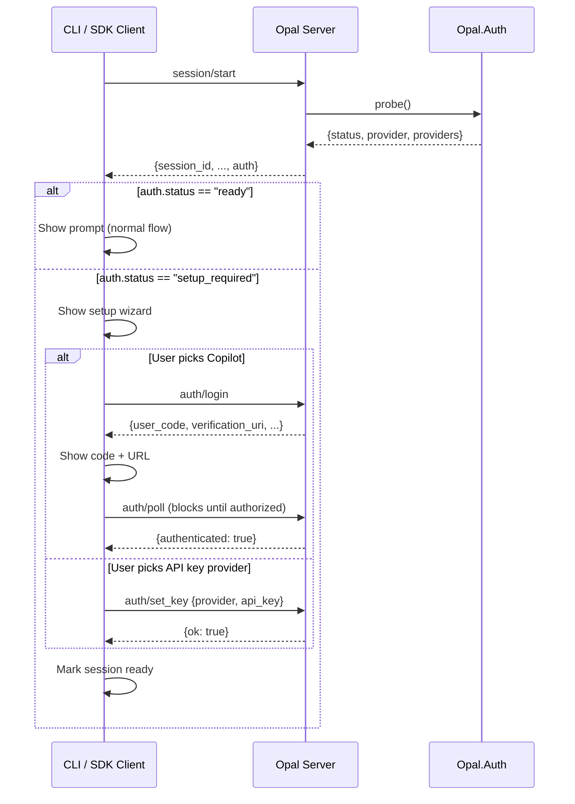

# Authentication

Opal uses a server-driven authentication system that automatically detects available credentials and guides users through setup when needed. The design keeps auth logic on the server so SDK integrators get credential management for free.

## How It Works

At session start, the server probes all credential sources and reports the result to the client. If any provider has valid credentials, the session is immediately ready. If not, the client receives a list of provider options to present as a setup wizard.



## Credential Detection

`Opal.Auth.probe/0` checks all sources in priority order:

| Source | What it checks | Example |
|--------|---------------|---------|
| Copilot token | `~/.opal/auth.json` on disk | Device-code OAuth token |
| Environment variables | `ANTHROPIC_API_KEY`, `OPENAI_API_KEY`, `GOOGLE_API_KEY` | Shell env or `.env` file |
| Saved settings | `~/.opal/settings.json` keys like `anthropic_api_key` | Set via `auth/set_key` RPC |

The first provider with valid credentials is auto-selected. The probe result includes all known providers with their readiness state, so the client can show a complete picture.

```elixir
Opal.Auth.probe()
#=> %{
#     status: "ready",
#     provider: "anthropic",
#     providers: [
#       %{id: "copilot", name: "GitHub Copilot", method: "device_code", ready: false},
#       %{id: "anthropic", name: "Anthropic", method: "api_key", env_var: "ANTHROPIC_API_KEY", ready: true},
#       %{id: "openai", name: "OpenAI", method: "api_key", env_var: "OPENAI_API_KEY", ready: false},
#       %{id: "google", name: "Google Gemini", method: "api_key", env_var: "GOOGLE_API_KEY", ready: false}
#     ]
#   }
```

## RPC Methods

### `auth/status`

Re-probes all credentials. Useful after a setup step completes to verify readiness.

```json
// Request
{"method": "auth/status", "params": {}}

// Response
{
  "authenticated": true,
  "auth": {"status": "ready", "provider": "copilot", "providers": [...]}
}
```

### `auth/login`

Starts the GitHub device-code OAuth flow for Copilot authentication.

```json
// Response
{
  "user_code": "ABCD-1234",
  "verification_uri": "https://github.com/login/device",
  "device_code": "...",
  "interval": 5
}
```

### `auth/poll`

Blocks until the user completes device-code authorization, then exchanges for a Copilot token and saves it to disk. Called after `auth/login`.

```json
// Request
{"method": "auth/poll", "params": {"device_code": "...", "interval": 5}}

// Response (after user authorizes)
{"authenticated": true}
```

### `auth/set_key`

Saves an API key for a direct provider. The key is persisted to `~/.opal/settings.json` AND set in the process environment so it takes effect immediately — no restart needed.

```json
// Request
{"method": "auth/set_key", "params": {"provider": "anthropic", "api_key": "sk-ant-..."}}

// Response
{"ok": true}
```

## CLI Setup Wizard

When the CLI receives `auth.status == "setup_required"` from `session/start`, it shows an interactive setup wizard:

1. **Provider picker** — Lists providers that still need setup with arrow-key navigation
2. **Copilot flow** — Shows the device code and verification URL, waits for authorization
3. **API key flow** — Shows a masked text input for pasting the key

The wizard is entirely driven by server data. The CLI has no provider-specific logic — it renders whatever the server's probe result contains.

## For SDK Integrators

The auth system is designed so integrators don't need to implement auth flows:

```elixir
# Session starts regardless of auth state
{:ok, agent} = Opal.start_session(%{working_dir: "/project"})

# Check auth programmatically
case Opal.Auth.probe() do
  %{status: "ready"} -> :ok
  %{status: "setup_required"} -> :setup_required
end

# Or just set credentials before starting
System.put_env("ANTHROPIC_API_KEY", "sk-ant-...")
```

If no auth check is done and credentials are missing, the agent will return an error on the first prompt attempt — the probe is a convenience for better UX, not a requirement.

## Source Files

- [`opal/lib/opal/auth/auth.ex`](../opal/lib/opal/auth/auth.ex) — Credential probe logic
- [`opal/lib/opal/auth/copilot.ex`](../opal/lib/opal/auth/copilot.ex) — Copilot OAuth device-code flow
- [`opal/lib/opal/rpc/server.ex`](../opal/lib/opal/rpc/server.ex) — RPC method handlers
- [`cli/src/components/device-auth.tsx`](../cli/src/components/device-auth.tsx) — Setup wizard UI
