# CLI

The CLI is a TypeScript terminal application built with [Ink](https://github.com/vadimdemedes/ink) (React for the terminal). It connects to the Elixir server over JSON-RPC via stdio and renders a full interactive coding agent UI.

## Architecture


The CLI spawns the Elixir server as a child process and communicates over stdin/stdout using newline-delimited JSON-RPC. All streaming events flow back as notifications and are reduced into React state.

## Server Resolution

The SDK finds the opal-server binary in three ways, tried in order:

1. **PATH** — `opal-server` installed globally
2. **Bundled binary** — `releases/opal_server_<platform>_<arch>` inside the npm package
3. **Dev mode** — Monorepo: runs `elixir -S mix run --no-halt` in `../core/`

Platform mapping: `darwin-arm64`, `darwin-x64`, `linux-x64`, `linux-arm64`.

## CLI Arguments

```
opal [options]

--model <provider/id> Model to use (e.g. anthropic/claude-sonnet-4-20250514)
--working-dir, -C     Working directory (default: cwd)
--auto-confirm        Auto-allow all tool executions
--verbose, -v         Pipe server stderr to terminal
--help, -h            Show usage
```

Working directory resolution: `OPAL_CWD` env → `INIT_CWD` (npm/pnpm sets this) → `process.cwd()`.

The CLI clears the screen on startup and fills the viewport initially; once the first user prompt is submitted, content flows naturally and scrolls like a regular terminal.

## UI Layout

```
┌─────────────────────────────────────────────┐
│ Header        workingDir · nodeName         │
├─────────────────────────────────────────────┤
│ MessageList                                 │
│   ● Loaded AGENTS.md                        │
│   ● Loaded skill: docs                      │
│                                             │
│   ❯ You                                     │
│     fix the failing test                    │
│                                             │
│   ✦ opal                                    │
│     I'll look at the test file...           │
│   ● read_file test/app_test.exs             │
│   ● edit_file test/app_test.exs             │
│                                             │
│ (◕‿◕) Editing test file…                    │
├─────────────────────────────────────────────┤
│ ❯ [input field]                             │
│                                             │
│ /help │ ctrl+c exit │ ctrl+o tool output    │
│                              claude-4 · 12k │
└─────────────────────────────────────────────┘
```

### Components

| Component | Purpose |
|-----------|---------|
| `header.tsx` | Working directory and node name |
| `message-list.tsx` | Timeline: messages, tools, context, skills |
| `thinking.tsx` | Animated kaomoji spinner with status label |
| `bottom-bar.tsx` | Text input, help shortcuts, model + token usage |
| `confirm-dialog.tsx` | Tool execution approval modal |
| `ask-user-dialog.tsx` | Agent question dialog with optional multiple-choice |
| `model-picker.tsx` | Interactive model/thinking-level selector |
| `device-auth.tsx` | `SetupWizard` — device-code OAuth and API key auth flow |
| `shimmer-text.tsx` | Animated iridescent text (used for loading state) |
| `token-bar.tsx` | Context window utilization bar |
| `tool-status.tsx` | Running/done/error icons for tool entries |
| `welcome.tsx` | Animated iridescent opal gem on startup |

## State Management

All UI state lives in the `useOpal()` hook, which returns `[OpalState, OpalActions]`.

### Key State Fields

State uses a nested `AgentView` shape. The `main` field holds the primary agent's view; sub-agents have their own views in `subAgents`.

| Field | Type | Purpose |
|-------|------|---------|
| `main` | `AgentView` | Primary agent view (timeline, isRunning, thinking, statusMessage) |
| `subAgents` | `Record<string, SubAgent>` | Sub-agent views keyed by session ID |
| `activeTab` | `string` | `"main"` or a sub-agent session ID |
| `currentModel` | `string \| null` | Active model display string |
| `tokenUsage` | `TokenUsage \| null` | Context window utilization |
| `confirmation` | `ConfirmRequest \| null` | Pending tool approval |
| `askUser` | `{ question, choices } \| null` | Pending agent question |
| `modelPicker` | `object \| null` | Model picker overlay state |
| `sessionReady` | `boolean` | Server connection established |
| `sessionDir` | `string` | Session data directory path |
| `availableSkills` | `string[]` | Discovered skill names from session start |
| `authFlow` | `AuthFlow \| null` | Active auth setup wizard state (providers, device code, API key input) |
| `error` | `string \| null` | Current error message |
| `workingDir` | `string` | Resolved working directory |
| `nodeName` | `string` | Erlang node name |
| `lastDeltaAt` | `number` | Timestamp of last message delta (stall detection) |

### Actions

| Action | When |
|--------|------|
| `submitPrompt(text)` | User sends a message (idle) |
| `submitSteer(text)` | User sends guidance (running) |
| `abort()` | Cancel current turn |
| `compact()` | Compress conversation history |
| `runCommand(input)` | Process slash commands |
| `selectModel(id, thinkingLevel?)` | Pick from model list |
| `dismissModelPicker()` | Close model picker without selecting |
| `resolveConfirmation(action)` | Respond to tool approval dialog |
| `resolveAskUser(answer)` | Respond to agent question dialog |
| `switchTab(tabId)` | Switch between main and sub-agent views |
| `authStartDeviceFlow()` | Start device-code OAuth flow |
| `authSubmitKey(providerId, apiKey)` | Submit API key for a provider |

## Slash Commands

| Command | Effect |
|---------|--------|
| `/help` | Show available commands |
| `/model` | Show current model |
| `/model <id>` | Switch model (e.g. `/model anthropic:claude-sonnet-4`) |
| `/models` | Open interactive model picker |
| `/compact` | Trigger conversation compaction |
| `/agents` | List active sub-agents |
| `/agents <n\|main>` | Switch view to a sub-agent or back to main |
| `/opal` | Open runtime configuration menu (toggle `sub_agents`, `skills`, `mcp`, `debug`, and tools) |

## Keyboard Shortcuts

| Key | Context | Action |
|-----|---------|--------|
| `ctrl+c` | Running | Abort agent |
| `ctrl+c` | Idle | Exit CLI |
| `ctrl+o` | Any | Toggle tool output visibility |
| `ctrl+y` | Any | Open plan in external editor |
| `↑` `↓` | Picker | Navigate options |
| `y` / `n` | Confirm | Quick allow/deny |

## Event Flow

Streaming events from the server drive all UI updates:

```mermaid
graph LR
    Server["Elixir Agent"] -- "SSE stream" --> Provider
    Provider -- "parsed events" --> Agent["Agent state machine"]
    Agent -- "broadcast" --> Events["Events.Registry"]
    Events -- "JSON-RPC notification" --> Stdio["RPC.Stdio"]
    Stdio -- "stdout" --> Client["OpalClient"]
    Client -- "applyEvent()" --> Reducer["State Reducer"]
    Reducer -- "setState" --> React["UI Components"]
```



Key event types and their UI effects:

| Event | UI Change |
|-------|-----------|
| `agentStart` | Show running state |
| `messageStart` / `messageDelta` | Append assistant text |
| `thinkingStart` / `thinkingDelta` | Show thinking indicator |
| `statusUpdate` | Update thinking label |
| `toolExecutionStart` / `End` | Show tool with spinner → result |
| `usageUpdate` | Update token counter |
| `agentEnd` | Clear running state, ring bell |
| `subAgentEvent` | Nest sub-tasks under parent tool |

## SDK

The TypeScript SDK (`cli/src/sdk/`) can be used independently of the CLI for programmatic access:

```typescript
import { Session } from "@unfinite/opal";

const session = await Session.start({ model: "claude-sonnet-4" });

session.on("messageDelta", (delta) => process.stdout.write(delta));
session.on("agentEnd", () => console.log("\nDone"));

await session.prompt("Fix the failing test in app_test.exs");
```

See [sdk.md](sdk.md) for the full SDK documentation.

## Source Files

| File | Purpose |
|------|---------|
| `cli/src/bin.ts` | CLI entry point, argument parsing |
| `cli/src/app.tsx` | Main Ink application layout |
| `cli/src/hooks/use-opal.ts` | State management, event reducer, actions |
| `cli/src/components/*.tsx` | UI components |
| `cli/src/sdk/client.ts` | JSON-RPC transport over subprocess stdio |
| `cli/src/sdk/session.ts` | High-level session API |
| `cli/src/sdk/resolve.ts` | Server binary discovery |
| `cli/src/sdk/protocol.ts` | Auto-generated type definitions |
| `cli/src/sdk/transforms.ts` | snake_case ↔ camelCase conversion |
