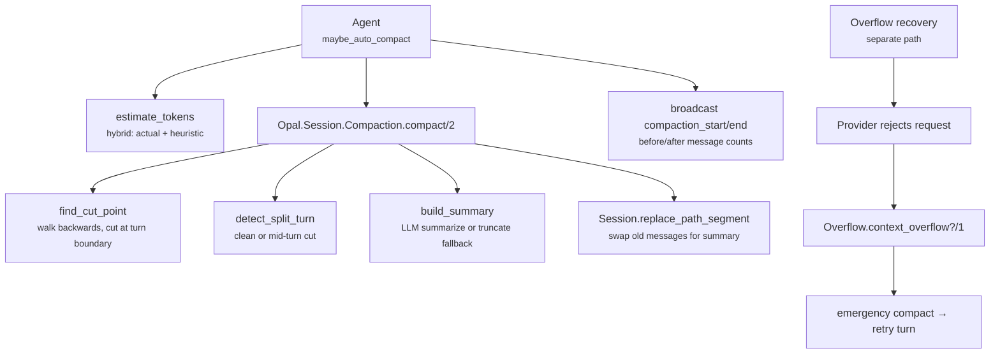

# Compaction

Compaction keeps conversations within the model's context window by summarizing
older messages. This document is the reference spec for the full subsystem.

## Architecture



**Key files:**
- `lib/opal/session/compaction.ex` — cut point, summarization, file-op tracking
- `lib/opal/agent/usage_tracker.ex` — auto-compact trigger, hybrid estimation
- `lib/opal/agent/overflow.ex` — overflow pattern matching and emergency compaction
- `lib/opal/agent/token.ex` — token estimation heuristics

## Token Metrics

Each API call sends the **entire** conversation. The provider returns
`prompt_tokens` (how many tokens it read) and `completion_tokens` (what it
generated).

| Metric | Definition | Compaction-relevant? |
|---|---|---|
| `currentContextTokens` | `prompt_tokens` from the last API call | **Yes** — actual context size |
| `totalTokens` | Cumulative `prompt + completion` across all turns | No — billing metric |

`totalTokens` double-counts because each turn re-reads the full history:

```
Turn 1: sends [sys, user1]                              → prompt=10k
Turn 2: sends [sys, user1, asst1, user2]                → prompt=14k
Turn 3: sends [sys, user1, asst1, user2, asst2, user3]  → prompt=19k

totalTokens = (10+2) + (14+3) + (19+1) = 49k   ← cumulative
currentContextTokens = 19k                       ← actual context size
```

The CLI compaction bar uses `currentContextTokens / contextWindow`.

## Auto-Compaction

**Trigger:** start of each turn, when estimated context ≥ 80% of context window.

**Estimation** (`estimate_tokens`): hybrid approach —
1. If `last_prompt_tokens > 0`: use as calibrated base, add heuristic (~4
   chars/token) for messages added since that usage report.
2. If no usage data yet (first turn): full heuristic via `Token.estimate_context`.

**Compaction flow:**
1. Broadcast `compaction_start`.
2. Call `Compaction.compact/2` with `keep_recent_tokens = contextWindow / 4`.
3. Broadcast `compaction_end` with before/after message counts.
4. Reset `last_prompt_tokens` and `last_usage_msg_index` to 0.

## Compaction Algorithm

### 1. Find Cut Point

Walk backwards from the newest message, accumulating estimated characters
(4 chars ≈ 1 token). When the accumulated total exceeds `keep_recent_tokens`,
find the nearest **user message boundary** at or after that point. If a clean
boundary is unavailable, split-turn handling (below) preserves continuity.

Default `keep_recent_tokens`: 20,000. Auto-compaction passes `contextWindow / 4`.

If no valid cut point exists and `force: true`, compact all but the last 2
messages.

### 2. Detect Split Turns

If the cut point lands inside a multi-message turn (e.g. a user message
followed by 30 assistant+tool messages), the kept portion doesn't start with a
user message. When detected and the turn prefix is ≥ 5 messages, dual summaries
are generated:

- **History summary** — everything before the split turn.
- **Turn-prefix summary** — the compacted portion of the in-progress turn,
  with instructions to focus on what was attempted and intermediate results.

Prefixes < 5 messages are treated as clean cuts (not worth a separate summary).

### 3. Generate Summary

**Strategies:**

- **`:summarize`** (default when provider available) — LLM-powered. Asks the
  model for a structured summary with: Goal, Constraints, Progress (Done / In
  Progress), Key Decisions, Next Steps, Critical Context, plus `<read-files>`
  and `<modified-files>` sections.

- **`:truncate`** (fallback) — No LLM. Produces `[Compacted N messages: ...]`
  with role frequencies and file-op tags.

**Anti-continuation measures:**
- Transcript wrapped in `<conversation>` tags (models treat as data, not dialogue).
- System prompt restricts the model to summarizer role only.
- User prompt includes explicit "do NOT continue the conversation" rules.

**Iterative updates:** When the first message being compacted is itself a
previous compaction summary (detected by `[Conversation summary` prefix), the
LLM is given the `@update_summary_prompt` which asks it to **merge** new
information rather than re-summarize from scratch. This prevents progressive
information loss across multiple compaction cycles.

### 4. Replace Messages

The old messages are replaced with a single summary message (role: `:user`)
via `Session.replace_path_segment`. The summary message carries structured
metadata:

```elixir
%{type: :compaction_summary, read_files: [...], modified_files: [...]}
```

### 5. Cumulative File-Op Tracking

File operations (read/write/edit tool calls) are tracked across compaction
cycles. Each cycle:

1. Extracts file ops from the previous summary's metadata.
2. Extracts file ops from tool calls in the current batch.
3. Merges and deduplicates — files that were read then later modified are
   promoted to modified-only.

## Overflow Recovery

When the provider rejects a request due to context overflow:

1. `Overflow.context_overflow?/1` pattern-matches against 17 known error
   strings from OpenAI, Anthropic, Google, and generic proxies.
2. If matched, emergency compaction fires with `keep_recent_tokens =
   contextWindow / 5` and `force: true`.
3. The turn is retried immediately. This is **not** counted as a retry attempt.

A second detection path (`Overflow.usage_overflow?/2`) checks if reported
`input_tokens` exceed the context window (silent truncation). This flags
`overflow_detected` so `finalize_response` can compact before the next turn.

If no session process exists, overflow is surfaced as an error (can't compact).

## Context Window Sizes

Looked up from LLMDB at agent initialization via `Opal.Provider.Registry.context_window/1`. Falls back to 128k if the model isn't found. For Copilot models, queries the `github_copilot` LLMDB provider; for direct providers, queries the upstream provider (e.g., `:anthropic`).

The `context_window` value is included in every `usage_update` and `agent_end` event, and is available via `agent/state` RPC from the moment the session starts.

## Manual Compaction

Users can trigger compaction via `/compact` in the CLI. The RPC handler
(`session/compact`) accepts `session_id` (required) and `keep_recent` (optional
token budget override). After compacting, it syncs the agent's message list
with the compacted session path.
