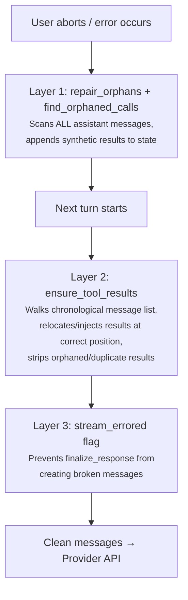
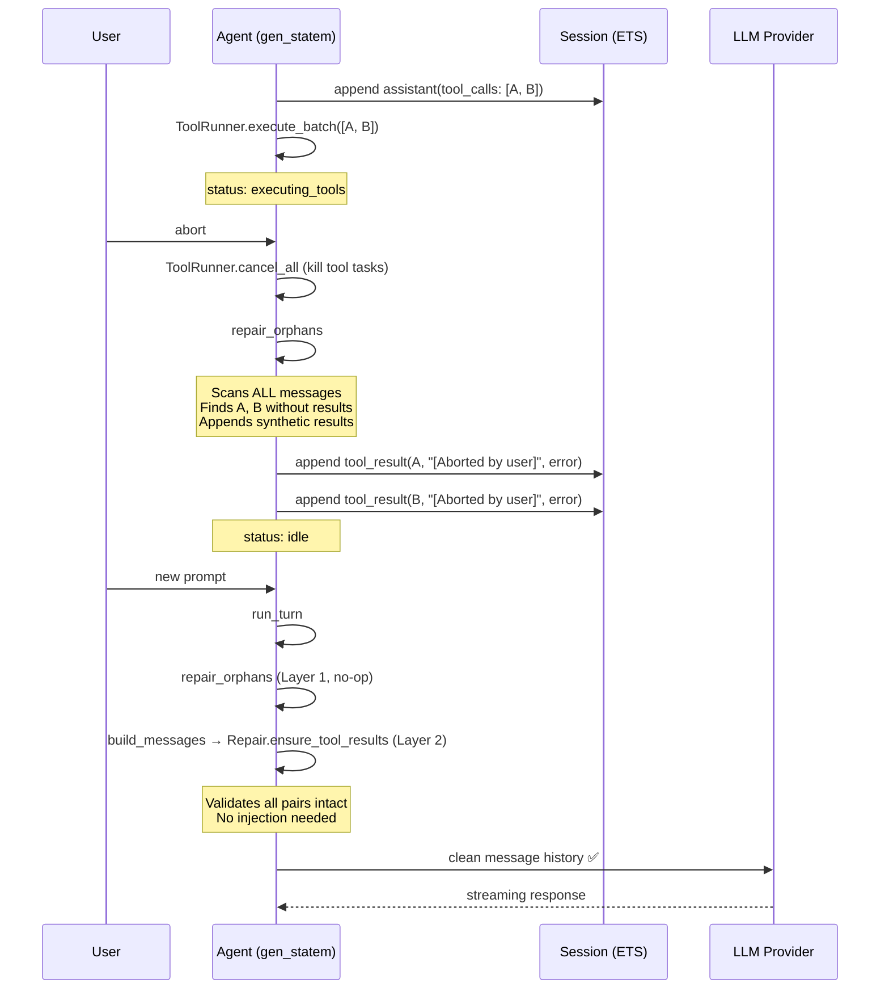

# Conversation Integrity

LLM providers require strict message sequencing: every assistant message with `tool_calls` must be followed by matching `tool_result` messages, and every `tool_result` must reference a preceding `tool_call`. Violations cause the provider to reject the entire request with errors like `invalid_request_body`. The conversation integrity system ensures the message history is always valid before it reaches the provider, regardless of what went wrong.

## The Problem

Several runtime scenarios can corrupt the message sequence:

| Scenario | What breaks |
|----------|-------------|
| **User abort during tool execution** | Assistant message with `tool_calls` committed, but `tool_result` messages never added |
| **Stream error from provider** | `finalize_response` creates a broken assistant message from partial stream data |
| **Compaction** | Summary replacement can orphan `tool_result` messages whose parent assistant was removed |
| **Session reload** | Previously-corrupted history can be reintroduced from persisted sessions |
| **Sub-agent abort** | Long-running `sub_agent` calls (120s timeout) are a common abort trigger |

A frequent trigger is aborting during `sub_agent` execution — it has a 120s blocking receive loop, so user aborts are common.

## Defense Layers

The fix uses three independent layers so that any single failure is caught by the next:



### Layer 1: Full-Scan Orphan Repair

Called on every turn start and on every abort. Walks the message list (stored newest-first) and finds ALL assistant messages whose `tool_calls` lack matching `tool_result` messages anywhere after them. Injects synthetic error results.

```elixir
# In run_turn, before building messages:
state = state |> UsageTracker.maybe_auto_compact(&build_messages/1) |> repair_orphans()

# In abort path, after killing tool tasks:
state = state |> ToolRunner.cancel_all() |> repair_orphans()
```

The key fix: `find_orphaned_calls` scans **every** assistant message in the conversation, not just the most recent. This catches "deep orphans" — orphaned tool_calls buried in history with valid turns after them.

**Source:** `lib/opal/agent/agent.ex` — `repair_orphans/1`; `lib/opal/agent/repair.ex` — `find_orphaned_calls/1`

### Layer 2: Positional Validation in `build_messages`

Even after Layer 1 repairs orphans by appending results, the appended results end up at the **end** of the chronological list — not immediately after the orphaned assistant message. Providers require tool results to directly follow their assistant message.

`ensure_tool_results/1` runs on the final chronological message list inside `build_messages`, right before messages are sent to the provider. It performs three operations:

1. **Relocate matching results** — pull matching `tool_result` messages from later in the list and move them immediately after their assistant message.

2. **Inject missing results** — for each assistant with `tool_calls`, if any call IDs still lack a result, inject synthetic error results immediately after the assistant.

3. **Strip orphaned/duplicate results** — remove any `tool_result` message whose `call_id` doesn't match any assistant `tool_call`, and drop duplicate results for the same `call_id`.

```elixir
# In build_messages:
repaired = state.messages |> Enum.reverse() |> Repair.ensure_tool_results()
# Then prepend system prompt if present.
```

**Source:** `lib/opal/agent/repair.ex` — `ensure_tool_results/1`; `lib/opal/agent/agent.ex` — `build_messages/1`

### Layer 3: Stream Error Guard

When the provider sends an error event mid-stream (e.g., `invalid_request_body`), the error handler sets `stream_errored` to the error reason on the state. The SSE handler checks this field **before** calling `finalize_response`:

```elixir
cond do
  state.stream_errored != false ->
    recover_stream_error(%{state | streaming_resp: nil})

  :done in chunks ->
    finalize_response(state)

  true ->
    {:keep_state, state, [stall_timeout()]}
end
```

Without this guard, `finalize_response` would override `status: :idle` (set by the error handler) back to `:running`, create an assistant message from partial/empty stream data, and potentially start tool execution on malformed tool calls.

**Source:** `lib/opal/agent/agent.ex` (streaming `:info` handler), `lib/opal/agent/stream.ex` (error event handler), `lib/opal/agent/state.ex` (`stream_errored` field)

## Additional Hardening

### Malformed Tool Call Filtering

`finalize_tool_calls` rejects tool calls with empty `call_id` or `name` fields. These can occur when a stream is interrupted mid-tool-call (partial delta received, no `tool_call_done`).

```elixir
|> Enum.reject(fn tc -> tc.call_id == "" or tc.name == "" end)
```

**Source:** `lib/opal/agent/agent.ex` — `finalize_tool_calls/1`

### Mixed Tool-Call Map Shapes

`tool_call_id/1` in `Opal.Agent.Repair` accepts both atom-keyed (`%{call_id: ...}`) and string-keyed (`%{"call_id" => ...}`) tool_call maps, preventing false orphan injection when histories contain mixed map shapes.

**Source:** `lib/opal/agent/repair.ex` — `tool_call_id/1`

## How It Works End-to-End

A typical abort recovery flow:



## Testing

The conversation integrity test suite (`test/opal/agent/conversation_integrity_test.exs`) covers:

- Clean conversations (no-op validation)
- Single orphaned tool_call injection
- Deep orphans not in the most recent assistant message
- Multiple orphans in the same assistant message
- Multiple orphan batches across the conversation
- Empty and nil tool_calls (edge cases)
- Orphaned tool_results stripped (reverse problem)
- Stream error recovery (agent goes idle, no broken messages)
- Agent accepts new prompts after stream error (self-healing)

## Source

- `lib/opal/agent/agent.ex` — `run_turn`, `repair_orphans`, `build_messages`, `finalize_tool_calls`, stream error handling
- `lib/opal/agent/repair.ex` — `find_orphaned_calls`, `ensure_tool_results`, `tool_call_id`
- `lib/opal/agent/stream.ex` — `stream_errored` flag on error events
- `lib/opal/agent/state.ex` — `stream_errored` field
- `test/opal/agent/conversation_integrity_test.exs` — test suite
