# Opal Daemon Mode

> **Status**: Draft
> **Companion**: Agent interrupts and scheduling are covered in [`interrupts.md`](interrupts.md).

## Executive Summary

This document describes how to evolve Opal from a per-invocation process into a **long-running daemon** that multiple CLI clients connect to via a local socket. The TUI stays exactly the same — same Ink/React app, same components, same UX. The _only_ change is in the lowest transport layer: `OpalClient` connects to a TCP socket instead of spawning a child process with stdio pipes. Everything above that (`Session`, hooks, reducers, components) is completely unaware of the switch.

The daemon manages agent sessions across terminal lifetimes and leverages OTP's fault tolerance for a production-grade background service.

> **Cross-platform from day one.** Every design decision, file path, and transport choice must work on macOS, Linux, and Windows. No "Unix-first with Windows fallback" — a single architecture that adapts to each platform through `Opal.Util.Platform`.

**The core insight**: Opal's existing OTP architecture — DynamicSupervisor for sessions, gen_statem agents, Registry pubsub, DETS persistence — is already 90% of a daemon. The work is primarily additive: a new transport layer and session lifecycle management.

### Key Value Propositions

| Feature | Value |
|---------|-------|
| **Persistent sessions** | Agent continues running after terminal closes. Resume from any terminal. |
| **Instant startup** | No BEAM boot per invocation (~2s saved). CLI connects to warm daemon. |
| **Multi-terminal** | Observe a running agent from a second terminal. Share sessions. |
| **Resource efficiency** | One BEAM VM instead of N. Shared model connections, auth tokens, memory. |
| **Zero configuration** | CLI auto-spawns daemon on first use. No setup, no service files, no ports. |

---

## Table of Contents

1. [Architecture Overview](#1-architecture-overview) — what changes vs. what doesn't, TypeScript before/after
2. [Supervision Tree](#2-supervision-tree)
3. [Transport Layer](#3-transport-layer)
4. [Session Lifecycle](#4-session-lifecycle)
5. [CLI UX Design](#5-cli-ux-design)
6. [Cross-Platform Daemon Lifecycle](#6-cross-platform-daemon-lifecycle)
7. [Socket Security](#7-socket-security)
8. [Fault Tolerance & Recovery](#8-fault-tolerance--recovery)
9. [MVP Implementation Plan](#9-mvp-implementation-plan)

---

## 1. Architecture Overview

### What Changes vs. What Doesn't

**The TUI is completely unchanged.** The Ink/React app, all components, hooks, reducers, and user interactions stay exactly the same. The _only_ thing that changes is the transport layer inside `OpalClient` — the lowest layer the TUI never sees.

```mermaid
graph TD
    subgraph "Unchanged — identical in both modes"
        TUI["TUI (Ink/React)"]
        Hooks["Hooks & Reducers"]
        Session["Session class"]
    end

    subgraph "Transport swap — the ONLY change"
        Client["OpalClient"]
        Stdio["stdio pipes<br/><i>(current)</i>"]
        TCP["TCP socket<br/><i>(daemon)</i>"]
    end

    TUI --> Hooks --> Session --> Client
    Client -.->|"today"| Stdio
    Client -.->|"daemon mode"| TCP

    style Stdio stroke-dasharray: 5 5
    style TCP stroke:#2da44e,stroke-width:2px
```



The JSON-RPC protocol is identical over both transports — same methods, same events, same notifications. The `Session` class calls `client.request("session/start", ...)` and `client.onEvent(...)` without knowing whether the bytes travel over a pipe or a socket.

#### TypeScript: Before & After

**Today** — `OpalClient` owns a child process:

```typescript
// client.ts (current)
this.process = spawn(cmd, args, { stdio: ["pipe", "pipe", "pipe"] });
this.rl = createInterface({ input: this.process.stdout! });
// write: this.process.stdin!.write(JSON.stringify(msg) + "\n")
```

**Daemon mode** — `OpalClient` owns a TCP socket:

```typescript
// client.ts (daemon mode)
import { connect } from "node:net";

const { port, token } = JSON.parse(readFileSync(`${dataDir}/daemon.json`, "utf-8"));
this.socket = connect({ host: "127.0.0.1", port });
this.rl = createInterface({ input: this.socket });
// write: this.socket.write(JSON.stringify(msg) + "\n")
```

Same `readline` interface. Same `handleLine()` parser. Same `send()` shape. The `Session` class, all React components, every hook — **zero changes**. The TUI renders identically because it's driven by `agent/event` notifications which are protocol-level, not transport-level.

### Current Model (per-invocation)


### Proposed Model (daemon)


**Daemon files:**

| File | Purpose |
|------|---------|
| `{data_dir}/daemon.pid` | PID for liveness checks |
| `{data_dir}/daemon.json` | Socket address + port + auth token (discovery file) |
| `{data_dir}/daemon.lock` | Advisory lock to prevent duplicate daemons |
| `{data_dir}/sessions/*.dets` | Session persistence (unchanged) |
| `{data_dir}/logs/daemon.log` | Daemon log output |

> **`data_dir`** = `~/.opal` on macOS/Linux, `%APPDATA%/opal` on Windows — already resolved by `Opal.Config.default_data_dir/0`.

The daemon runs as a standard Elixir release. Multiple CLI instances connect via socket, each getting a `Connection` process that routes JSON-RPC to the shared session infrastructure. The existing JSON-RPC 2.0 protocol is unchanged — only the transport switches from stdio to socket.

---

## 2. Supervision Tree

### Current Tree


**Problems for daemon mode**:
- `RPC.Server` is a sibling of `SessionSupervisor` under `:rest_for_one`. If sessions crash, the RPC listener restarts — catastrophic for a daemon.
- No central session lifecycle management. Sessions live until the CLI disconnects.
- No support for multiple concurrent client connections.

### Proposed Tree

```mermaid
graph TD
    Sup["Opal.Supervisor<br/><code>:one_for_one</code>"]

    Sup --> Infra["Opal.InfraSupervisor<br/><code>:one_for_all</code>"]
    Infra --> Reg["Opal.Registry<br/><code>:unique</code>"]
    Infra --> EvReg["Opal.Events.Registry<br/><code>:duplicate</code>"]

    Sup --> SM["🆕 Opal.SessionManager<br/><i>GenServer</i>"]
    Sup --> SeSup["Opal.SessionSupervisor<br/><i>DynamicSupervisor</i>"]
    SeSup --> SS["per-session trees<br/><i>unchanged</i>"]

    Sup --> Daemon["🆕 Opal.Daemon<br/><i>GenServer</i>"]
    Sup --> ConnSup["🆕 Opal.Transport.ConnectionSupervisor<br/><i>DynamicSupervisor</i>"]
    ConnSup --> C1["Opal.RPC.Connection ×N"]
```



**Key changes**:

1. **`:one_for_one` at top level** — Listener, sessions, and other components are independent failure domains. A session crash never takes down the listener. A listener crash never kills sessions.

2. **Registries in sub-supervisor** — If a Registry crashes (rare), both restart together via `:one_for_all`. Everything else is unaffected.

3. **`SessionManager`** — Coordinator that tracks session lifecycle, client bindings, and idle timeouts. Only process that calls `DynamicSupervisor.start_child/terminate_child`. Separates policy (when to start/stop) from mechanism (supervision).

4. **Per-session trees unchanged** — The existing `SessionServer` (`:rest_for_one`) with `Task.Supervisor → DynamicSupervisor → MCP → Session → Agent` is already correct for daemon mode.

### Agent Process Hibernation

When an agent enters `:idle` state, hibernate after 30 seconds:

```elixir
# In agent.ex — entering idle state
{:next_state, :idle, state, [{:state_timeout, 30_000, :hibernate}]}

# Handler
def idle(:state_timeout, :hibernate, state) do
  {:keep_state, state, [:hibernate]}
end
```

This is a ~5-line change with massive impact. An idle agent holds the full conversation history (potentially megabytes). `:hibernate` triggers a full GC, shrinking the heap to minimum. For a daemon running 20+ sessions where 2–3 are active, this is the difference between 50MB and 500MB RSS.

---

## 3. Transport Layer

### Design: Transport Abstraction

The current `RPC.Server` mixes four responsibilities: I/O, framing, dispatch, and connection state. Split these into composable modules:

```mermaid
graph TD
    Stdio["Transport.Stdio<br/><i>stdin/stdout port</i>"]
    Socket["Transport.Socket<br/><i>TCP / :gen_tcp</i>"]

    Stdio -->|implements<br/>Opal.Transport| Conn["Opal.RPC.Connection<br/><i>subscriptions, pending requests, framing</i>"]
    Socket -->|implements<br/>Opal.Transport| Conn

    Conn -->|delegates to| Handler["Opal.RPC.Handler<br/><i>pure dispatch: method → params → result</i>"]
```



### Transport Behaviour

```elixir
defmodule Opal.Transport do
  @callback send_message(conn :: term(), json :: String.t()) :: :ok | {:error, term()}
  @callback close(conn :: term()) :: :ok
  @callback connection_info(conn :: term()) :: String.t()
end
```

### Socket Transport (Daemon Mode)

**TCP on `127.0.0.1` is the primary transport on all platforms.** It works identically on macOS, Linux, and Windows with zero platform-specific code. The daemon binds to an OS-assigned port (`port 0`), writes the port to a discovery file, and the CLI reads it to connect.

Unix domain sockets are a **future optimization** for Unix platforms (lower overhead, filesystem-based permissions), not a launch requirement.

```elixir
defmodule Opal.Transport.Acceptor do
  use GenServer

  def init(opts) do
    data_dir = Keyword.fetch!(opts, :data_dir)
    listen_opts = [:binary, packet: :line, active: false, reuseaddr: true]

    # TCP 127.0.0.1:0 — works on macOS, Linux, and Windows
    {:ok, listen_socket} =
      :gen_tcp.listen(0, [{:ifaddr, {127, 0, 0, 1}} | listen_opts])

    {:ok, {_addr, port}} = :inet.sockname(listen_socket)

    # Write discovery file so CLI can find us
    write_discovery_file(data_dir, port)

    {:ok, _} = Task.start_link(fn -> accept_loop(listen_socket) end)
    {:ok, %{listen_socket: listen_socket, port: port, data_dir: data_dir}}
  end

  defp write_discovery_file(data_dir, port) do
    token = :crypto.strong_rand_bytes(32) |> Base.url_encode64(padding: false)
    info = %{port: port, pid: System.pid(), token: token,
             started_at: DateTime.utc_now()}
    path = Path.join(data_dir, "daemon.json")
    File.write!(path, Jason.encode!(info))
    # Restrictive permissions where supported
    File.chmod(path, 0o600)
  end
end
```

The discovery file (`daemon.json`) contains everything a CLI needs to connect:

```json
{
  "port": 49152,
  "pid": 12345,
  "token": "a1b2c3...",
  "started_at": "2026-02-19T04:30:00Z"
}
```

The CLI reads `{data_dir}/daemon.json`, connects to `127.0.0.1:{port}`, sends the token in the handshake — identical code on every platform.

### Why Not Erlang Distribution?

Erlang distribution is **wrong** for the CLI↔daemon channel:

1. **Security**: Any connected node can execute arbitrary code (`:erlang.halt()`). No authorization, no capability restriction.
2. **Protocol**: Uses Erlang Term Format — requires both sides to speak Erlang. The CLI is TypeScript.
3. **Lifecycle coupling**: Node disconnection triggers linked/monitored process exits, creating unwanted coupling.
4. **epmd**: Another process to manage, another port to secure.

**Keep distribution opt-in for debugging** (the existing `--sname` support). Use TCP `127.0.0.1` for daemon traffic.

### Protocol

The existing JSON-RPC 2.0 protocol over newline-delimited JSON stays unchanged. The wire format is identical for both stdio and socket transports. This means:

- `Opal.RPC.Protocol` (method definitions) — unchanged
- `Opal.RPC` (encode/decode) — unchanged
- All existing RPC methods — unchanged

New daemon-specific methods are additive:

| Method | Direction | Description |
|--------|-----------|-------------|
| `daemon/status` | client→server | Uptime, memory, session count |
| `session/list_active` | client→server | All active/suspended sessions |
| `session/resume` | client→server | Resume a suspended session |

---

## 4. Session Lifecycle

### Session States


- **Active → Suspended**: Automatic on client disconnect. Agent stays in memory but is idle.
- **Suspended → Active**: On client reconnect to the same session. Agent wakes from hibernate.
- **Suspended → Archived**: After configurable idle timeout (default 30 minutes). Entire `SessionServer` tree terminated; state persisted to DETS. Memory fully reclaimed.
- **Archived → Active**: On `session/resume` RPC. Reconstructs `SessionServer` tree from DETS. The agent's existing `maybe_recover_session` already handles this.

### SessionManager

A new `Opal.SessionManager` GenServer that acts as the central coordinator:

```elixir
defmodule Opal.SessionManager do
  @moduledoc "Central session lifecycle coordinator."
  use GenServer

  @type session_entry :: %{
    session_id: String.t(),
    state: :active | :suspended | :archived,
    client_id: String.t() | nil,
    connection: pid() | nil,
    working_dir: String.t(),
    last_active: DateTime.t()
  }

  # Public API
  def bind(session_id, client_id)
  def client_disconnected(client_id)
  def rebind(client_id, connection_pid)
  def list_active()
  def suspend(session_id)
  def resume(session_id, client_id)
  def connection_for(session_id)  # for routing server→client requests
end
```

**Idle Reaping**: `SessionManager` subscribes to `:all` events via `Opal.Events.Registry`. Any session activity resets that session's idle timer. After the timeout, the session is archived. This uses `Process.send_after/3` per session — not `:timer` (which uses a single global GenServer bottleneck).

**Resource Limits**: Before `DynamicSupervisor.start_child`, check the concurrent session count:

```elixir
def start_session(opts) do
  count = DynamicSupervisor.count_children(Opal.SessionSupervisor).active
  if count >= max_sessions(), do: {:error, :max_sessions_reached}
  # else proceed
end
```

Default max: 10 concurrent sessions. Configurable.

### Working Directory Semantics

**CWD is a per-session attribute, not a daemon attribute.** The daemon process runs from wherever it was started (irrelevant). Each session carries its own `working_dir`, set at creation from the client's `process.cwd()`. This already exists in `Opal.Agent.State.working_dir`.

- `opal` in `~/projectA` and `opal` in `~/projectB` → independent sessions
- Context discovery (`AGENTS.md`, `.opal/`) runs per-session against that session's `working_dir`
- One daemon serves agents across different repos with full isolation

**Session-to-directory affinity**: When a user runs `opal` in a directory with an active session, offer to resume:

```
$ cd ~/Projects/opal && opal
Active session found for this directory (abc123, 5m ago)
Resume? [Y/n]
```

---

## 5. CLI UX Design

### Day 1 Commands

| Command | Description |
|---------|-------------|
| `opal "prompt"` | Start or resume session (auto-starts daemon if needed) |
| `opal status` | Daemon status + active sessions overview |
| `opal sessions` | List active and recent sessions |
| `opal --resume [id]` | Resume a specific session |
| `opal --new` | Force new session even if one exists for current CWD |
| `opal daemon stop` | Graceful daemon shutdown |

### Connection Flow

The CLI **always auto-starts the daemon** — no `opal daemon start` needed. The daemon is an invisible infrastructure layer. On first `opal` invocation, the CLI spawns a detached daemon process if one isn't running. Subsequent invocations reuse it. This is the same pattern as `docker` (auto-starts dockerd) and `gpg-agent`.

From the user's perspective, nothing changes — they type `opal "fix the tests"` and see the same TUI. Whether the server is a child process (standalone) or a daemon (background) is invisible.

**Duplicate prevention**: The daemon acquires an exclusive advisory lock on `{data_dir}/daemon.lock` at startup. If the lock is held, it exits immediately. The CLI checks the PID file and liveness *before* attempting to spawn, so races are rare — the lock is the safety net.

```mermaid
flowchart TD
    Start["$ opal 'fix the tests'"] --> PID{"{data_dir}/daemon.json<br/>exists?"}
    PID -->|No| Spawn["Spawn daemon<br/>(detached, backgrounded)"]
    PID -->|Yes| Alive{"PID from daemon.json<br/>still alive?"}
    Alive -->|No| Clean["Remove stale daemon.json"]
    Clean --> Spawn
    Alive -->|Yes| Connect{"Connect to<br/>127.0.0.1:{port}"}
    Spawn --> Wait["Wait for daemon.json<br/>(poll ≤2s)"]
    Wait --> Connect
    Connect -->|Success| Session["Send session/start<br/>with CWD ✅"]
    Connect -->|Fail| Fallback["Fall back to standalone<br/>(spawn-per-invocation)"]
```



**What happens under the hood on first run:**

1. CLI checks `{data_dir}/daemon.json` — not found
2. CLI spawns `opal-server --daemon` as a detached process (no console, no stdio)
3. Daemon boots BEAM, acquires `daemon.lock`, writes `daemon.json` (port, pid, token) + `daemon.pid`
4. CLI polls for `daemon.json` (100ms intervals, 2s timeout)
5. CLI reads port + token, connects via TCP, sends handshake — user sees normal TUI, unaware daemon exists

**PID liveness check (cross-platform):**

```elixir
# Already available via Opal.Util.Platform patterns
defp pid_alive?(pid) do
  case :os.type() do
    {:unix, _}  -> match?({_, 0}, System.cmd("kill", ["-0", to_string(pid)],
                     stderr_to_stdout: true))
    {:win32, _} -> {out, 0} = System.cmd("tasklist", ["/FI", "PID eq #{pid}"],
                     stderr_to_stdout: true)
                   String.contains?(out, to_string(pid))
  end
end
```

**Daemon shutdown**: The daemon stays alive indefinitely after the CLI disconnects. It only stops when:
- User explicitly runs `opal daemon stop`
- System reboot / logout (unless auto-start is configured)
- All sessions are idle and no background tasks exist (optional idle-shutdown after configurable timeout, default: never)

**Standalone fallback is critical** — the CLI must always work, even without a daemon. If daemon spawn fails (permissions, disk full, port conflict), fall back silently with a single stderr line: `opal: daemon unavailable, running standalone`.

### Session Management

```
$ opal sessions
Active:
  abc123  ~/Projects/opal     idle     2m ago   "fix the flaky test in agent_test.exs"
  def456  ~/Projects/webapp   running  now      "add user auth endpoints"

Recent:
  ghi789  ~/Projects/opal     saved    2h ago   "refactor provider module"

$ opal --resume abc123              # by ID (prefix match)
$ opal --resume                     # most recent session in current directory
$ opal --resume abc123 "now fix the other test"  # resume + immediate prompt
```

### Status Display

```
$ opal status
Daemon:    running (pid 48291, uptime 3h 12m)
Sessions:  2 active, 14 saved
  • abc123  ~/Projects/opal     idle    2m ago
  • def456  ~/Projects/webapp   running (tool: grep)
Memory:    142 MB RSS
```

### Session Sharing (Future)

```
Terminal 1: $ opal --resume abc123          # primary, can send prompts
Terminal 2: $ opal --attach abc123          # read-only observer
```

The daemon routes events to all subscribed connections. The `--attach` mode renders the TUI but doesn't accept prompt input.

---

## 6. Cross-Platform Daemon Lifecycle

### MVP: CLI-Managed Daemon (All Platforms)

The MVP uses the same approach on every platform: the CLI spawns the daemon as a detached background process. No launchd, no systemd, no Windows Services. This is the simplest thing that works everywhere.

```elixir
# Opal.Daemon.Launcher — cross-platform process spawning
defp spawn_daemon(server_path) do
  case :os.type() do
    {:unix, _} ->
      # setsid detaches from terminal session
      System.cmd("setsid", [server_path, "--daemon"],
        env: [{"OPAL_TRANSPORT", "socket"}],
        stderr_to_stdout: true)

    {:win32, _} ->
      # Start-Process -WindowStyle Hidden detaches from console
      System.cmd("cmd", ["/C", "start", "/B", server_path, "--daemon"],
        env: [{"OPAL_TRANSPORT", "socket"}],
        stderr_to_stdout: true)
  end
end
```

The daemon writes `daemon.json` (port, PID, token) on startup. The CLI polls for this file. This is identical on every platform.

### Future: Platform-Native Service Management

For users who want auto-start on login and crash recovery, `opal daemon install` writes the appropriate service definition:

| Platform | Mechanism | Install Location | Auto-Start |
|----------|-----------|-----------------|------------|
| **macOS** | `launchd` plist | `~/Library/LaunchAgents/com.github.opal.daemon.plist` | `RunAtLoad` in plist |
| **Linux** | `systemd` user unit | `~/.config/systemd/user/opal-daemon.service` | `systemctl --user enable` |
| **Windows** | Registry run key | `HKCU\Software\Microsoft\Windows\CurrentVersion\Run` | Runs on login |

This is post-MVP. The CLI-managed approach covers all use cases for launch.

### PID File Management

```elixir
def init(opts) do
  data_dir = Keyword.fetch!(opts, :data_dir)
  pid_path = Path.join(data_dir, "daemon.pid")
  case check_existing_pid(pid_path) do
    :ok -> write_pid_file(pid_path)
    {:error, :already_running} -> {:stop, :already_running}
  end
  ...
end

def terminate(_reason, state) do
  File.rm(state.pid_file)
  File.rm(Path.join(state.data_dir, "daemon.json"))
end
```

Stale PID detection uses the cross-platform `pid_alive?/1` helper (see [§5 Connection Flow](#5-cli-ux-design)). If the PID file exists but the process is dead, remove it and proceed.

### Upgrade Path


No hot code loading needed. Clean restarts are simpler and safer.

---

## 7. Socket Security

### Auth Token (All Platforms)

The daemon generates a random auth token at startup and writes it to `{data_dir}/daemon.json` alongside the port. The CLI reads the token and includes it in the connection handshake. The daemon rejects connections without a valid token. Token rotates on every daemon restart.

This is the primary security mechanism on all platforms. It prevents:
- Other users on shared machines from hijacking sessions
- Malicious local processes from injecting prompts
- Accidental cross-user daemon connections

The `daemon.json` file is created with `0o600` permissions where supported (macOS/Linux). On Windows, file permissions are less granular, but the file lives in `%APPDATA%/opal/` which is user-scoped by default.

### Defense in Depth

| Layer | macOS/Linux | Windows |
|-------|-------------|---------|
| **Transport** | TCP `127.0.0.1` (no network exposure) | TCP `127.0.0.1` (same) |
| **Auth token** | Required in handshake | Required in handshake |
| **File permissions** | `daemon.json` is `0o600` | `%APPDATA%` is user-scoped |
| **Future: UDS** | Unix domain socket + file perms | N/A (TCP only) |

### Erlang Distribution

Erlang distribution remains **opt-in for debugging only** (`--sname`). It is never used for CLI↔daemon communication. See [§3 Transport Layer](#3-transport-layer) for rationale.

---

## 8. Fault Tolerance & Recovery

### Session Recovery After Daemon Crash

Session data survives crashes because DETS files persist on disk. The agent's existing `maybe_recover_session` loads messages and starts in `:idle`. In-flight tool calls are **not replayed** — tool execution isn't idempotent (shell commands, file writes), so replay would be dangerous.

On daemon restart, `SessionManager` scans `{data_dir}/sessions/*.dets` and knows which sessions can be resumed. Sessions are loaded **lazily** — only when a client reconnects to a specific session. No eager resume of 100 sessions at startup.

### DETS Corruption Handling

DETS is fragile under crashes. Defensive pattern:

```elixir
def safe_open(session_id, path) do
  case :dets.open_file(dets_name(session_id), file: to_charlist(path)) do
    {:ok, ref} -> {:ok, ref}
    {:error, {:not_a_dets_file, _}} ->
      File.rename!(path, path <> ".corrupt.#{System.os_time(:second)}")
      {:error, :corrupted}
  end
end
```

**Future improvement**: Replace DETS with atomic-rename persistence (`term_to_binary` → write `.tmp` → `File.rename!`). Atomic rename is crash-safe on all target filesystems.

### Graceful Shutdown

```mermaid
flowchart TD
    Stop["daemon/shutdown RPC"] --> Close["Close listener socket<br/>(stop accepting connections)"]
    Close --> Drain["Send :drain to each<br/>active agent"]

    Drain --> Idle{":idle"}
    Drain --> Run{":running /<br/>:streaming"}
    Drain --> Tools{":executing_tools"}

    Idle --> Save["Save & stop<br/>immediately"]
    Run --> Finish["Finish current turn<br/>→ save & stop"]
    Tools --> Wait["Wait for in-flight tools<br/>→ save & stop"]

    Save --> Check{"All agents<br/>drained?"}
    Finish --> Check
    Wait --> Check

    Check -->|Yes| Exit["Clean exit ✅"]
    Check -->|No, 30s timeout| Kill["Force-kill remaining<br/>sessions → exit"]
```



### Health Monitoring

`SessionManager` periodic sweep (every 60s):

1. **Stuck agents**: `Process.info(pid, :message_queue_len) > 100` → log warning, kill after 3 consecutive checks
2. **Memory pressure**: `:erlang.memory(:total) > threshold` → force-hibernate idle sessions, then terminate oldest idle
3. **Zombie sessions**: Sessions in `DynamicSupervisor.which_children` not tracked by `SessionManager` → terminate

---

## 9. MVP Implementation Plan

### Guiding Principles

1. **Every phase is backward-compatible** — standalone stdio mode always works
2. **Daemon mode is additive** — new modules, minimal modifications to existing code
3. **Ship incrementally** — each phase is independently useful and testable

### Phase 1: Transport Abstraction (Foundation)

Extract `RPC.Server` into composable modules. **Zero behavior change** — pure refactor.

| File | Action | Description |
|------|--------|-------------|
| `lib/opal/transport/transport.ex` | Create | Behaviour: `send_message/2`, `close/1`, `connection_info/1` |
| `lib/opal/rpc/handler.ex` | Create | Extract all `dispatch/2` clauses from `RPC.Server`. Pure dispatch logic. |
| `lib/opal/rpc/connection.ex` | Create | Extract subscription tracking, pending requests, event forwarding. |
| `lib/opal/transport/stdio.ex` | Create | Extract stdin/stdout I/O from `RPC.Server`. |
| `lib/opal/rpc/server.ex` | Modify | Thin shim delegating to `Transport.Stdio` + `RPC.Connection`. |
| `lib/opal/application.ex` | Modify | Replace `RPC.Server` child with `Transport.Stdio` when `:start_rpc`. |

**~400 lines of code. All existing tests pass unchanged.**

### Phase 2: Session Manager

| File | Action | Description |
|------|--------|-------------|
| `lib/opal/session/manager.ex` | Create | DETS-backed session registry, bind/unbind/list/connection_for. |
| `lib/opal.ex` | Modify | `start_session/1` optionally calls `SessionManager.bind/2`. |
| `lib/opal/rpc/handler.ex` | Modify | `session/start` calls `SessionManager.bind/2`. Add `session/list_active`. |
| `lib/opal/tool/ask_user.ex` | Modify | Route `request_client` through `RPC.Connection` with session-aware lookup. |

**~250 lines of code.**

### Phase 3: Socket Transport (Daemon Connectivity)

| File | Action | Description |
|------|--------|-------------|
| `lib/opal/transport/acceptor.ex` | Create | TCP `127.0.0.1:0` listener. Writes `daemon.json`. Spawns per-connection handlers. |
| `lib/opal/transport/socket.ex` | Create | Per-connection GenServer wrapping `:gen_tcp`. |
| `lib/opal/config.ex` | Modify | Add `daemon` field with `data_dir`, `pid_file` subfields. |

**~300 lines of code.**

### Phase 4: Daemon Lifecycle

| File | Action | Description |
|------|--------|-------------|
| `lib/opal/daemon/daemon.ex` | Create | PID file, status API, stale-daemon detection, graceful shutdown. |
| `lib/opal/application.ex` | Modify | Conditional child list: `:standalone` vs `:daemon` mode. |
| `lib/opal/rpc/handler.ex` | Modify | Add `daemon/status`, `daemon/shutdown` dispatch clauses. |
| `lib/opal/agent/agent.ex` | Modify | Add hibernate-on-idle (~5 lines). |

**~200 lines of code.**

### Phase 5: CLI Integration (TypeScript)

| File | Action | Description |
|------|--------|-------------|
| `cli/src/sdk/daemon-client.ts` | Create | Discover daemon, connect via socket, auth handshake. |
| `cli/src/sdk/client.ts` | Modify | Auto-spawn daemon on first use, fall back to standalone. Lock-based dedup. |
| `cli/src/bin.ts` | Modify | Add `daemon stop/status` subcommands (no `start` — it's automatic). |
| `cli/src/sdk/protocol.ts` | Regenerate | New daemon method types (via codegen). |

### Summary


| Phase | New Files | Modified | Lines (est.) | Dependency |
|-------|-----------|----------|-------------|------------|
| 1. Transport | 4 | 2 | ~400 | None |
| 2. Session Manager | 1 | 3 | ~250 | Phase 1 |
| 3. Socket Transport | 2 | 1 | ~300 | Phase 1 |
| 4. Daemon Lifecycle | 1 | 3 | ~200 | Phases 2, 3 |
| 5. CLI Integration | 1 | 3 | ~300 | Phase 4 |
| **Total** | **9** | **~12** | **~1450** | |

**The entire daemon layer is additive — it wraps the existing architecture rather than modifying it.** No changes to Agent, Session DETS, Tool implementations, Provider, MCP, or Events. This is the strongest validation of the current OTP design.

---

## Future Work

| Feature | Why Defer |
|---------|-----------|
| **Agent interrupts & scheduling** | Covered in companion document [`interrupts.md`](interrupts.md) |
| **Unix domain sockets** | TCP localhost is fast enough. UDS is a latency optimization (~2× faster) for later |
| **Session sharing (`--attach`)** | Requires multi-client event routing complexity |
| **Desktop notifications** | Platform-specific, not core to agent UX |
| **Agent-to-agent messaging** | Sub-agents already work for delegation |
| **Web UI for sessions** | Entirely separate project |
| **CubDB/SQLite for sessions** | DETS with atomic-rename fallback is sufficient |
| **Write-ahead log (WAL)** | Adds complexity; current auto-save covers most cases |
| **Platform-native service install** | Detached process covers MVP; launchd/systemd/registry run key later via `opal daemon install` |
| **HTTP health endpoint** | RPC health method is sufficient |

### Long-Term Vision

- **Distributed Opal**: Multiple daemon nodes sharing work via Erlang distribution (true multi-machine agent coordination)
- **Web dashboard**: Browser-based session viewer connecting via WebSocket
- **Team mode**: Shared daemon instance with role-based access control

---

## Appendix: Library Recommendations

| Need | Recommendation | Rationale |
|------|---------------|-----------|
| HTTP server (future) | Bandit | Pure Elixir, Plug-native, Phoenix 1.8+ default. Add only when needed (web UI, health endpoint). |
| PubSub | Keep `Registry` | Phoenix.PubSub only adds value for multi-node. Registry is zero-dep, lifecycle-aware, faster for local. |
| Config storage | `:persistent_term` (future) | `Application.get_env` is fine now. Add `:persistent_term` when profiling shows hot config reads. |
| Session persistence | DETS → atomic-rename → CubDB (evolution) | Start with DETS (works today), improve crash safety with atomic rename, consider CubDB if scale demands. |
| Telemetry | `telemetry` + `telemetry_metrics` | Standard BEAM instrumentation. Already a transitive dep via Req. |
