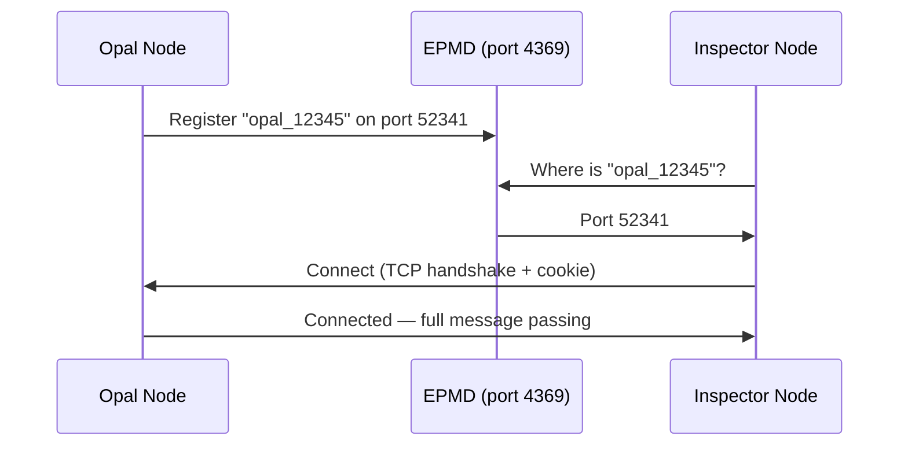

# Erlang Distribution

Opal uses Erlang's built-in distribution protocol to let you connect a second terminal to a running agent for live inspection and debugging. When you run `mise run inspect`, you're joining the same BEAM cluster as the agent — from there you can stream events, query process state, and run arbitrary Elixir expressions against the live system.

## Quick Start

```bash
# Terminal 1 — start opal normally
mise run dev

# Terminal 2 — connect and watch events
mise run inspect
```

The inspector connects to the running agent node and streams every event (tool calls, LLM deltas, errors) in real time. Press `Ctrl+C` twice to disconnect.

## How Erlang Distribution Works

Erlang was designed for telecom switches that need to be debugged and upgraded without downtime. Distribution is the mechanism that makes this possible — it lets multiple BEAM virtual machines (called "nodes") form a cluster and communicate via message passing, as if every process were local.

### Nodes and Names

A node is a running BEAM instance with a name. Opal uses **short names** (hostname-only, no DNS):

```
opal_12345@MacBook-Pro
```

The name is composed of a prefix (`opal_`) plus the OS process ID, making it unique per machine. Short names only allow connections between nodes on the same host (or same subnet with hostname resolution).

### EPMD — The Discovery Service

When a node starts with a name, it registers with the **Erlang Port Mapper Daemon** (epmd). EPMD is a tiny service that runs on port 4369 and maps node names to TCP ports:



EPMD starts automatically the first time any node on the machine needs it and stays running until explicitly stopped.

### Cookies — The Authentication Mechanism

Erlang distribution uses a **shared secret cookie** for authentication. Two nodes can only connect if they present the same cookie during the TCP handshake. This is the *only* authentication layer — there is no encryption, no authorization, no access control beyond "you know the cookie."

Opal generates a **cryptographically random cookie** each time distribution starts:

```elixir
:crypto.strong_rand_bytes(18) |> Base.url_encode64(padding: false) |> String.to_atom()
```

The cookie is written to `~/.opal/node` (permissions `0600`) so the inspect script can read it. This means each Opal session gets a unique cookie — even if someone knows the code, they can't predict the cookie.

To use a fixed cookie instead (e.g. for a persistent server), set it in your Elixir config:

```elixir
config :opal, distribution_cookie: :my_secret_cookie
```

### What a Connected Node Can Do

Once connected, the remote node has **full access** to the local node. It can:

- Send messages to any process by PID
- Call any function in any module (including `System.cmd/3`, `File.write/3`, etc.)
- Inspect and modify process state via `:sys`
- Spawn processes on the remote node
- Access ETS tables

This is by design — Erlang distribution is an operations tool, not a public API. It assumes the connecting party is trusted.

## Opal's Distribution Setup

### Startup Flow

When distribution is requested, `Opal.Application.start_distribution/0` runs:

```mermaid
flowchart TD
    A[start_distribution/0] --> B{Node.alive?}
    B -->|yes| C[Write existing node info to ~/.opal/node]
    B -->|no| D[Node.start opal_PID, :shortnames]
    D --> E[Generate random cookie]
    E --> F[Write node name + cookie to ~/.opal/node]
    F --> G[Return {:ok, node_name}]
    C --> G
```

### The Node File

The node name and cookie are written to `~/.opal/node` (with `0600` permissions — only readable by the owning user) so the inspector can discover them:

```
opal_12345@MacBook-Pro
aB3xQ7kM9nR2pS5vW1
```

The `mise run inspect` command runs `scripts/inspect.sh`, which reads the node name and cookie from this file and launches IEx with the correct arguments:

```bash
NODE_NAME=$(sed -n '1p' ~/.opal/node)
COOKIE=$(sed -n '2p' ~/.opal/node)
exec iex --sname "inspector_$$" --cookie "$COOKIE" --remsh "$NODE_NAME" ...
```

### Inspector Connection

`--remsh` tells IEx to open a **remote shell** on the target node. The inspector's IEx process runs on the agent's node, so all expressions evaluate in the agent's context. The `-e "Opal.Inspect.watch()"` flag auto-runs the event watcher on connect, which subscribes to the event registry and streams events to the terminal.

## Security

Opal applies these mitigations by default:

| Measure | Detail |
|---------|--------|
| **Random cookie** | A cryptographically random 24-char cookie is generated per session. Configurable via `config :opal, distribution_cookie: :my_cookie`. |
| **Restrictive file permissions** | `~/.opal/node` is written with `0600` — only the owning user can read it. |

### Remaining considerations

| Concern | Detail |
|---------|--------|
| **EPMD binds to all interfaces** | By default, epmd listens on `0.0.0.0:4369`. Set `ERL_EPMD_ADDRESS=127.0.0.1` to restrict to localhost. |
| **No encryption** | Distribution traffic is plaintext TCP. Use `-proto_dist inet_tls` for TLS. |
| **Full code execution** | A connected node can run any Elixir/Erlang code as the user who started Opal. |

## Ad-hoc IEx Commands

Since the inspector is a full IEx session on the agent node, you can do more than watch events:

```elixir
# List all active agents
Registry.select(Opal.Registry, [
  {{{:agent, :"$1"}, :"$2", :_}, [], [{{:"$1", :"$2"}}]}
])

# Get agent state machine state
pid = GenServer.whereis({:via, Registry, {Opal.Registry, {:agent, "session-id"}}})
:sys.get_state(pid)

# Subscribe to a single session's events
Opal.Events.subscribe("session-id")
flush()

# Check token usage
:sys.get_state(pid) |> elem(1) |> Map.get(:usage)
```

## Source Files

- `lib/opal/application.ex` — `start_distribution/0`, node file read/write
- `lib/opal/inspect.ex` — Event watcher for `mise run inspect`
- `lib/opal/events.ex` — Registry-based pub/sub
- `scripts/inspect.sh` — Wrapper script that reads `~/.opal/node` and launches IEx

## References

- [Erlang Distribution Protocol](https://www.erlang.org/doc/system/distributed.html) — Official docs covering node naming, cookies, and EPMD
- [Erlang Distribution Security Guide](https://www.erlang.org/doc/system/ssl_distribution.html) — How to enable TLS for inter-node traffic
