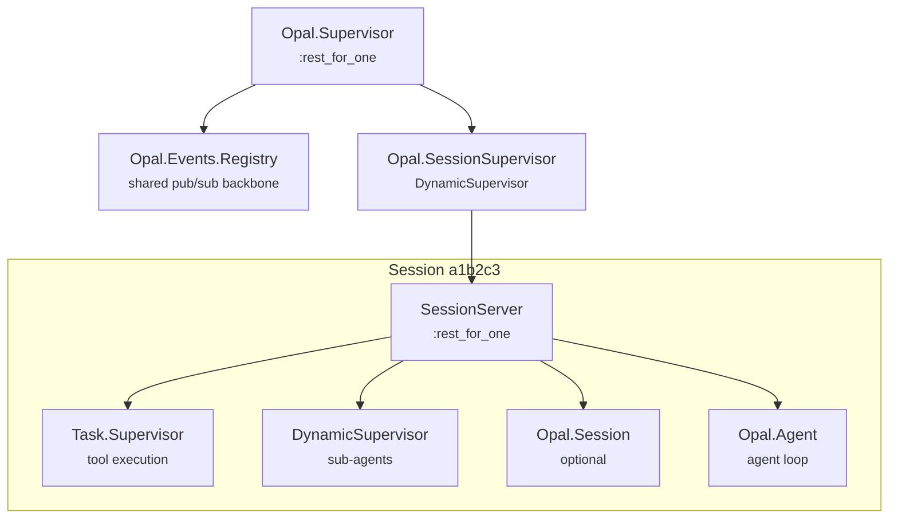
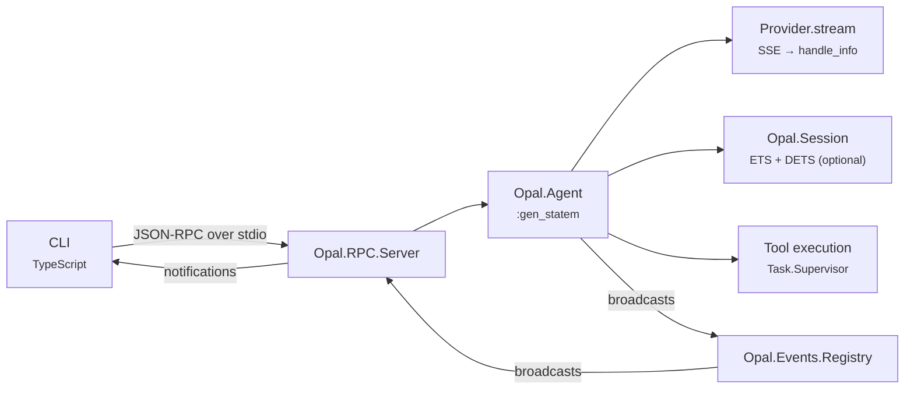

# Architecture Overview

Opal is a coding agent harness built on Elixir/OTP. The core (`opal/lib/opal/`) provides the agent runtime, and the CLI (`cli/`) provides a TypeScript terminal UI connected via JSON-RPC over stdio.

## Process Model

Every agent session is an isolated OTP supervision tree. No global state is shared between sessions except root registries (`Opal.Registry` and `Opal.Events.Registry`).



## Request Flow



## Subsystem Map

| Subsystem | What it does | Doc |
|-----------|-------------|-----|
| **Agent Loop** | `:gen_statem` FSM implementing prompt → stream → tools → repeat | [agent-loop.md](agent-loop.md) |
| **System Prompt** | Dynamic prompt assembly: context discovery, tool guidelines, skills | [system-prompt.md](system-prompt.md) |
| **Session** | Conversation tree with branching and persistence | [session.md](session.md) |
| **Compaction** | Summarizes old messages to stay within context window | [compaction.md](compaction.md) |
| **OTP Patterns** | State-machine/GenServer patterns, Registry, ETS/DETS, message passing | [otp.md](otp.md) |
| **Supervision** | Per-session process trees, fault isolation, message passing | [supervision.md](supervision.md) |
| **Resilience** | Crash recovery gaps, failure modes, and improvement roadmap | [resilience.md](resilience.md) |
| **Conversation Integrity** | Message sequence validation and self-healing for tool_use/tool_result pairing | [conversation-integrity.md](conversation-integrity.md) |
| **Tools** | Built-in tool implementations (read, edit, write, shell, sub-agent) | [tools.md](tools.md) |
| **RPC** | JSON-RPC 2.0 protocol over stdio between CLI and server | [rpc.md](rpc.md) |
| **Providers** | LLM integration (streaming, SSE parsing, model discovery) | [providers.md](providers.md) |
| **Authentication** | Server-driven credential detection and setup wizard | [auth.md](auth.md) |
| **MCP** | Model Context Protocol bridge for external tool servers | [mcp.md](mcp.md) |
| **Testing** | Fixture-based provider mocking, SSE simulation, no Mox | [testing.md](testing.md) |
| **CLI** | Terminal UI, components, state management, slash commands | [cli.md](cli.md) |
| **SDK** | TypeScript client library for the JSON-RPC protocol | [sdk.md](sdk.md) |
| **Integrating** | Embedding Opal via Elixir, JSON-RPC server, or TypeScript SDK | [integrating.md](integrating.md) |
| **Inspecting** | Live event stream via Erlang distribution for debugging | [inspecting.md](inspecting.md) |
| **Opinions** | Subjective design calls and the reasoning behind them | [opinions.md](opinions.md) |

## Key Design Decisions

- **Everything is a process.** The agent loop, session store, tool execution, and sub-agents are all OTP servers (`:gen_statem`/`GenServer`) or supervised tasks. The BEAM scheduler handles concurrency.
- **Per-session isolation.** Each session owns its entire process tree. Terminating a session cleanly stops all its tools, sub-agents, and streaming connections.
- **Provider-agnostic.** The agent loop never touches raw API formats. The `Provider` behaviour translates between semantic events and wire protocols.
- **Hashline editing.** `read_file` tags every line with a content hash. `edit_file` references lines by hash instead of reproducing content. See [tools/edit.md](tools/edit.md).
- **Registry pub/sub.** Events are plain Erlang terms routed via OTP's `Registry`. No message broker, no serialization overhead.

## Source Layout

```
opal/lib/opal/
├── application.ex           # Root supervisor and optional RPC/distribution startup
├── agent/agent.ex           # Agent loop :gen_statem
├── agent/state.ex           # Agent runtime state struct
├── agent/token.ex           # Token estimation heuristics
├── agent/                   # Stream/tools/retry/compaction helpers
├── session/session.ex       # Conversation tree (ETS + DETS persistence)
├── session/                 # Compaction helpers
├── events.ex                # Registry-based pub/sub
├── provider/provider.ex     # Provider behaviour
├── provider/copilot.ex      # GitHub Copilot implementation
├── auth/auth.ex             # Provider-agnostic auth probe
├── tool/tool.ex             # Tool behaviour
├── tool/                    # Built-in tools (read, edit, write, shell, etc.)
├── mcp/                     # MCP bridge (client, discovery, supervisor)
├── rpc/                     # JSON-RPC protocol and stdio server
├── config.ex                # Runtime configuration
├── context/context.ex       # Project context discovery (AGENTS.md, skills)
└── util/path.ex             # Path safety (traversal prevention)
```
