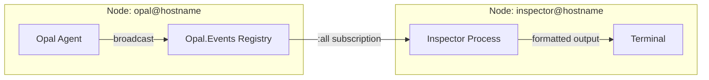

# Inspecting a Running Agent

Opal exposes a live event stream you can tap into from a second terminal. This uses Erlang's built-in distribution protocol — the running agent and the inspector are two BEAM nodes that talk directly via message passing, with zero serialization overhead.

## Quick Start

Start Opal normally in one terminal, then open a second terminal:

```bash
pnpm inspect
```

You'll see a colored, timestamped stream of every event the agent produces:

```
00:42:13.891 [a1b2c3d4] agent_start
00:42:14.002 [a1b2c3d4] message_delta "Let me look at that file..."
00:42:14.150 [a1b2c3d4] tool_start read_file %{path: "src/app.ts"}
00:42:14.312 [a1b2c3d4] tool_end read_file ok "import React from..."
```

Press `Ctrl+C` twice to disconnect.

## How It Works



### Distribution Setup

When Opal starts, `Opal.Application.start_distribution/0` activates Erlang distribution:

1. Calls `Node.start(:"opal_#{pid}", :shortnames)` to make the BEAM addressable
2. Generates a random cookie (or reads from `config :opal, :distribution_cookie`)
3. Writes the node name and cookie to `~/.opal/node` (permissions `0600`) for discovery

If the node was already started with `--sname` (e.g. during development with `iex -S mix`), this is a no-op — it just records the existing node info.

### Inspector Connection

The `pnpm inspect` command runs `scripts/inspect.sh`, which:

1. Reads the node name and cookie from `~/.opal/node`
2. Launches `iex --sname inspector_PID --cookie <cookie> --remsh <node> --dot-iex scripts/inspect.exs`

This creates a remote IEx shell (`--remsh`) that connects to the Opal node and automatically loads `scripts/inspect.exs`, which calls `Opal.Inspect.watch/0`.

### Event Subscription

`Opal.Inspect.watch/0` spawns a linked process that:

1. Calls `Opal.Events.subscribe_all()` to register on the `:all` wildcard key in the `Registry`
2. Enters a receive loop, printing each `{:opal_event, session_id, event}` message
3. Returns `{:ok, pid}` — call `Process.exit(pid, :normal)` to stop watching without leaving IEx

Since the inspector runs inside the same BEAM cluster, it receives events from every active session — including sub-agents.

## Event Reference

Events are color-coded by category:

| Color | Events | Description |
|-------|--------|-------------|
| Green | `agent_start`, `agent_end` | Agent lifecycle |
| Cyan | `message_start`, `message_delta` | LLM response streaming |
| Magenta | `thinking_start`, `thinking_delta` | Extended thinking output |
| Yellow | `tool_start`, `tool_end`, `agent_abort` | Tool execution |
| Blue | `sub_agent` | Sub-agent activity (wraps inner events) |
| Red | `error` | Errors |
| Dim | `request_start`, `request_end`, `usage_update`, others | HTTP requests, token usage |

Tool events include the tool name and a truncated preview of arguments or output. Message and thinking deltas show the first 60 characters.

## Ad-hoc Inspection from IEx

Since the inspector is a full IEx session on the remote node, you can run any Elixir expression against the live agent:

```elixir
# List active agents (returns [{session_id, pid}, ...])
Registry.select(Opal.Registry, [{{{:agent, :"$1"}, :"$2", :_}, [], [{{:"$1", :"$2"}}]}])

# Look up a specific agent by session ID
Registry.lookup(Opal.Registry, {:agent, "session-id"})

# Check agent state
:sys.get_state(agent_pid)

# Subscribe to a single session
Opal.Events.subscribe("session-id")
flush()
```

## Source Files

- `lib/opal/inspect.ex` — Watch loop and event formatting
- `lib/opal/events.ex` — Registry-based pub/sub
- `lib/opal/application.ex` — Distribution startup and `~/.opal/node` file
- `scripts/inspect.exs` — Auto-run script for `pnpm inspect`
