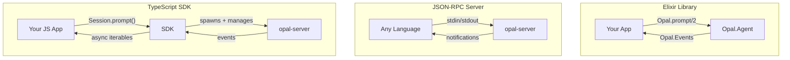

# Integrating with Opal

Opal can be embedded in three ways depending on your stack: as an Elixir library, as a standalone server over JSON-RPC, or through the TypeScript SDK. All three expose the same agent capabilities — sessions, streaming events, tool execution, model switching, and steering.



## Elixir Library

Add Opal as a Mix dependency and call the agent directly from your supervision tree. No server process, no serialization — just function calls and Erlang messages.

### Setup

```elixir
# mix.exs
defp deps do
  [
    {:opal, "~> 0.1.0"}
  ]
end
```

```bash
mix deps.get
```

Opal's application starts automatically and sets up the supervision tree (Registry, DynamicSupervisor). To disable the built-in JSON-RPC stdio transport, add:

```elixir
# config/config.exs
config :opal, start_rpc: false
```

### Starting a Session

```elixir
{:ok, agent} = Opal.start_session(%{
  system_prompt: "You are a helpful coding assistant.",
  working_dir: "/path/to/project",
  model: {:anthropic, "claude-sonnet-4-5"},
  tools: [Opal.Tool.Read, Opal.Tool.Write, Opal.Tool.Shell]
})
```

All keys are optional — defaults come from `config :opal` via `Opal.Config`. The model can be specified as:

- A `{provider, model_id}` tuple — `{:copilot, "gpt-5"}`
- A `"provider:model_id"` string — `"anthropic:claude-sonnet-4-5"`
- A bare model ID (defaults to Copilot) — `"claude-sonnet-4-5"`

### Prompting

```elixir
# Async — returns :ok immediately, stream via Events
:ok = Opal.prompt(agent, "Refactor the auth module")

# Sync — blocks until the agent finishes
{:ok, response} = Opal.prompt_sync(agent, "What does this function do?")

# Steer mid-run (picked up between tool executions)
:ok = Opal.steer(agent, "Focus on the tests instead")

# Abort
:ok = Opal.abort(agent)
```

### Streaming Events

Subscribe to the Registry-based pub/sub to receive real-time events:

```elixir
info = Opal.get_info(agent)
Opal.Events.subscribe(info.session_id)

receive do
  {:opal_event, _session_id, {:message_delta, %{delta: text}}} ->
    IO.write(text)

  {:opal_event, _session_id, {:tool_execution_start, tool, _call_id, args, _meta}} ->
    IO.puts("Calling #{tool}...")

  {:opal_event, _session_id, {:agent_end, _messages, usage}} ->
    IO.puts("Done. Tokens: #{usage.total_tokens}")
end
```

Use `Opal.Events.subscribe_all()` to receive events from every session.

### Custom Tools

Implement the `Opal.Tool` behaviour:

```elixir
defmodule MyApp.Tool.Lint do
  @behaviour Opal.Tool

  @impl true
  def name, do: "lint"

  @impl true
  def description, do: "Run the project linter and return results"

  @impl true
  def parameters do
    %{
      "type" => "object",
      "properties" => %{
        "path" => %{"type" => "string", "description" => "File or directory to lint"}
      },
      "required" => ["path"]
    }
  end

  @impl true
  def execute(%{"path" => path}, _context) do
    case System.cmd("mix", ["credo", path], stderr_to_stdout: true) do
      {output, 0} -> {:ok, output}
      {output, _} -> {:error, output}
    end
  end

  # Optional: shown in the UI during execution
  @impl true
  def meta(%{"path" => path}), do: path
end
```

Pass custom tools at session start:

```elixir
{:ok, agent} = Opal.start_session(%{
  tools: [Opal.Tool.Read, Opal.Tool.Edit, MyApp.Tool.Lint],
  working_dir: "/project"
})
```

### Session Lifecycle

```elixir
# Inspect agent state
info = Opal.get_info(agent)
# => %{session_id: "abc123", status: :idle, model: %Opal.Model{...}, ...}

# Switch models mid-session (history preserved)
Opal.set_model(agent, "anthropic:claude-sonnet-4-5", thinking_level: :high)

# Get full context (system prompt + messages)
messages = Opal.get_context(agent)

# Clean shutdown
Opal.stop_session(agent)
```

## JSON-RPC Server (`opal-server`)

For non-Elixir environments, Opal ships a standalone server that communicates over JSON-RPC 2.0 on stdin/stdout. Any language that can spawn a child process and read/write lines of JSON can integrate.

### Obtaining the Server

The `opal-server` binary is available as a pre-built release for each platform:

| Platform | Binary |
|----------|--------|
| macOS ARM | `opal_server_darwin_arm64` |
| macOS x64 | `opal_server_darwin_x64` |
| Linux x64 | `opal_server_linux_x64` |
| Linux ARM | `opal_server_linux_arm64` |

During development, you can also run from source:

```bash
cd core && elixir --erl "-noinput" -S mix run --no-halt
```

### Wire Protocol

Messages are **newline-delimited JSON** (one JSON object per line). The server speaks standard JSON-RPC 2.0 with three message types:

**Client → Server requests:**
```json
{"jsonrpc": "2.0", "id": 1, "method": "session/start", "params": {"working_dir": "/project"}}
```

**Server → Client responses:**
```json
{"jsonrpc": "2.0", "id": 1, "result": {"session_id": "abc123", "session_dir": "/home/user/.opal/sessions/abc123", "auth": {"status": "ready", "provider": "copilot", "providers": [...]}}}
```

**Server → Client notifications (events):**
```json
{"jsonrpc": "2.0", "method": "agent/event", "params": {"type": "message_delta", "delta": "Hello"}}
```

**Server → Client requests (user interaction):**
```json
{"jsonrpc": "2.0", "id": 100, "method": "client/confirm", "params": {"session_id": "abc123", "title": "Execute shell command?", "message": "rm -rf node_modules/", "actions": ["allow", "deny", "allow_session"]}}
```

### RPC Methods

| Method | Params | Description |
|--------|--------|-------------|
| `session/start` | `model?`, `system_prompt?`, `working_dir?`, `tools?`, `mcp_servers?`, `session?` | Start a session, returns `session_id`, `auth` probe |
| `agent/prompt` | `session_id`, `text` | Send a prompt (async — events stream via notifications) |
| `agent/steer` | `session_id`, `text` | Steer the agent mid-run |
| `agent/abort` | `session_id` | Cancel the current run |
| `agent/state` | `session_id` | Query agent status, model, tools, message count |
| `session/list` | — | List active sessions |
| `session/branch` | `session_id`, `entry_id` | Branch conversation at a point |
| `session/compact` | `session_id`, `keep_recent?` | Compact older messages |
| `models/list` | `providers?` | List available models |
| `model/set` | `session_id`, `model_id`, `thinking_level?` | Switch model |
| `thinking/set` | `session_id`, `level` | Set reasoning effort |
| `auth/status` | — | Check authentication state (includes full probe result) |
| `auth/login` | — | Start device-code OAuth flow |
| `auth/poll` | `device_code`, `interval` | Poll for device-code authorization |
| `auth/set_key` | `provider`, `api_key` | Save an API key for a provider |
| `settings/get` | — | Read persisted settings |
| `settings/save` | `settings` | Save settings |
| `tasks/list` | `session_id` | List tracked tasks |

### Server → Client Requests

The server may send requests back to the client that require a response:

| Method | Params | Expected Response |
|--------|--------|-------------------|
| `client/confirm` | `session_id`, `title`, `message`, `actions` | `{ "action": "allow" }` or `{ "action": "deny" }` |
| `client/input` | `session_id`, `prompt`, `sensitive?` | `{ "text": "user input" }` |
| `client/ask_user` | `session_id`, `question`, `choices?` | `{ "answer": "selected choice" }` |

### Event Types

All events arrive as `agent/event` notifications with a `type` field:

`agent_start`, `agent_end`, `agent_abort`, `message_start`, `message_delta`, `thinking_start`, `thinking_delta`, `tool_execution_start`, `tool_execution_end`, `turn_end`, `error`, `usage_update`, `status_update`, `context_discovered`, `skill_loaded`, `sub_agent_event`

### Example: Python Integration

```python
import subprocess, json

proc = subprocess.Popen(
    ["opal-server"],
    stdin=subprocess.PIPE,
    stdout=subprocess.PIPE,
    text=True,
)

def rpc(method, params={}, id=1):
    req = json.dumps({"jsonrpc": "2.0", "id": id, "method": method, "params": params})
    proc.stdin.write(req + "\n")
    proc.stdin.flush()

    # Read until we get our response
    while True:
        line = proc.stdout.readline()
        msg = json.loads(line)
        if "id" in msg and "method" not in msg:
            return msg  # response
        # otherwise it's a notification — handle events here

result = rpc("session/start", {"working_dir": "/my/project"})
session_id = result["result"]["session_id"]

rpc("agent/prompt", {"session_id": session_id, "text": "List all files"}, id=2)
```

## TypeScript SDK

The SDK is the highest-level integration. It spawns and manages the `opal-server` process, handles protocol transforms (snake_case ↔ camelCase), and exposes async iterables for streaming.

### Setup

```bash
npm install @unfinite/opal
```

### High-Level: Session

The `Session` class is the recommended entry point:

```typescript
import { Session } from "@unfinite/opal";

const session = await Session.start({
  workingDir: "/path/to/project",
  autoConfirm: true,
});

// Stream events from a prompt
for await (const event of session.prompt("Refactor the auth module")) {
  switch (event.type) {
    case "messageDelta":
      process.stdout.write(event.delta);
      break;
    case "toolExecutionStart":
      console.log(`\n🔧 ${event.tool}: ${event.meta}`);
      break;
    case "error":
      console.error(event.reason);
      break;
  }
}

session.close();
```

### Session Options

```typescript
const session = await Session.start({
  // Agent config
  model: { id: "claude-sonnet-4-5", provider: "anthropic" },
  systemPrompt: "You are an expert TypeScript developer.",
  workingDir: "/project",
  tools: ["read_file", "edit_file", "shell"],

  // Interaction handlers
  autoConfirm: true,  // auto-allow tool execution
  onConfirm: async (req) => {
    // Custom confirmation logic
    return req.tool === "shell" ? "deny" : "allow";
  },
  onAskUser: async ({ question, choices }) => {
    // Handle agent questions
    return choices?.[0] ?? "yes";
  },

  // Debugging
  verbose: true,  // pipe server stderr to console
});
```

### Typed Event Callbacks

```typescript
session.on("messageDelta", (delta) => {
  process.stdout.write(delta);
});

session.on("toolExecutionStart", (tool, callId, args, meta) => {
  console.log(`Running ${tool}: ${meta}`);
});

session.on("agentEnd", (usage) => {
  console.log(`Tokens used: ${usage?.totalTokens}`);
});

session.on("error", (reason) => {
  console.error(`Error: ${reason}`);
});
```

### Session Methods

```typescript
// Steer the agent mid-run
await session.steer("Focus on performance instead");

// Abort
await session.abort();

// Query state
const state = await session.getState();
console.log(state.status, state.model, state.messageCount);

// Switch model
await session.setModel("gpt-5", "high");

// Compact conversation history
await session.compact();

// List available models
const { models } = await session.listModels();
```

### Low-Level: OpalClient

For full control over the RPC layer, use `OpalClient` directly:

```typescript
import { OpalClient } from "@unfinite/opal";

const client = new OpalClient({
  onServerRequest: async (method, params) => {
    if (method === "client/confirm") return { action: "allow" };
    throw new Error(`Unhandled: ${method}`);
  },
});

const { sessionId } = await client.request("session/start", {
  workingDir: "/project",
});

client.onEvent((event) => {
  console.log(event.type, event);
});

await client.request("agent/prompt", {
  sessionId,
  text: "What does this codebase do?",
});
```

### Server Resolution

The SDK automatically locates `opal-server` using this fallback chain:

1. `opal-server` in `PATH` (user-installed binary)
2. Bundled platform binary in `releases/` (npm package distribution)
3. Monorepo dev mode (`elixir -S mix run --no-halt` in `core/`)

Override with an explicit path:

```typescript
const client = new OpalClient({
  serverPath: "/usr/local/bin/opal-server",
});
```

## Source Files

- `core/lib/opal.ex` — Elixir public API
- `core/lib/opal/tool.ex` — Tool behaviour definition
- `core/lib/opal/events.ex` — Registry-based pub/sub
- `core/lib/opal/rpc/stdio.ex` — JSON-RPC stdio transport
- `core/lib/opal/rpc/protocol.ex` — Method and event schema definitions
- `core/lib/opal/rpc/handler.ex` — RPC request dispatch
- `cli/src/sdk/` — TypeScript SDK (client, session, protocol types, transforms)
