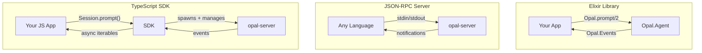
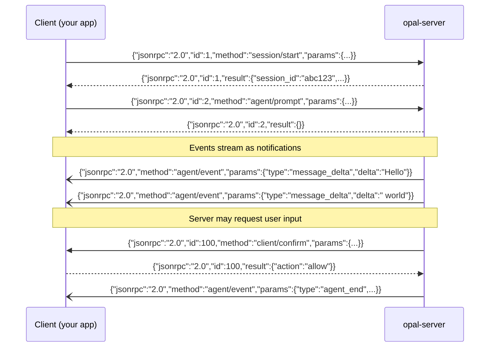

# Integrating with Opal

Opal can be embedded in three ways depending on your stack: as an Elixir library, as a standalone server over JSON-RPC, or through the TypeScript SDK. All three expose the same agent capabilities — sessions, streaming events, tool execution, model switching, and steering.



## Elixir Library

Add Opal as a Mix dependency and call the agent directly from your supervision tree. No server process, no serialization — just function calls and Erlang messages.

### Setup

```elixir
# mix.exs
defp deps do
  [
    {:opal, "~> 0.1.0"}
  ]
end
```

```bash
mix deps.get
```

Opal's application starts automatically and sets up the supervision tree (Registry, DynamicSupervisor). Since your app isn't using Opal's CLI, disable the built-in JSON-RPC stdio transport:

```elixir
# config/config.exs
config :opal, start_rpc: false
```

### Starting a Session

```elixir
{:ok, agent} = Opal.start_session(%{
  system_prompt: "You are a helpful coding assistant.",
  working_dir: "/path/to/project",
  model: {:copilot, "claude-sonnet-4"},
  tools: [Opal.Tool.Read, Opal.Tool.Write, Opal.Tool.Shell]
})
```

All keys are optional — defaults come from `config :opal` via `Opal.Config`. The full set of session options:

| Key | Type | Default | Description |
|-----|------|---------|-------------|
| `system_prompt` | `String.t()` | `""` | System instructions for the agent |
| `working_dir` | `String.t()` | `File.cwd!()` | Root directory for file tools and shell |
| `model` | tuple / string / struct | `{:copilot, "claude-sonnet-4"}` | LLM to use (see Model Formats below) |
| `tools` | `[module()]` | All built-in tools | Tool modules to enable |
| `provider` | `module()` | Auto-selected | Provider module (`Opal.Provider.Copilot`, etc.) |
| `session` | `boolean()` | `true` | Whether to persist session to disk |
| `session_id` | `String.t()` | Auto-generated | Resume an existing session |
| `thinking_level` | `atom()` | `:off` | Reasoning effort: `:off`, `:low`, `:medium`, `:high` |

### Model Formats

The model can be specified in three ways:

```elixir
# Tuple — {provider, model_id}
{:copilot, "gpt-5"}
{:anthropic, "claude-sonnet-4"}

# String — "provider:model_id" or bare model ID (defaults to Copilot)
"anthropic:claude-sonnet-4"
"claude-sonnet-4"

# Struct — full control
%Opal.Model{provider: :copilot, id: "claude-sonnet-4", thinking_level: :high}
```

### Prompting

```elixir
# Async — returns :ok immediately, stream results via Events
:ok = Opal.prompt(agent, "Refactor the auth module")

# Sync — blocks until the agent finishes, returns accumulated text
{:ok, response} = Opal.prompt_sync(agent, "What does this function do?")

# Redirect mid-run (queued and injected between tool executions)
%{queued: true} = Opal.prompt(agent, "Focus on the tests instead")

# Abort the current run
:ok = Opal.abort(agent)
```

### Streaming Events

Subscribe to the Registry-based pub/sub to receive real-time events as Erlang messages:

```elixir
info = Opal.get_info(agent)
Opal.Events.subscribe(info.session_id)

# Events arrive as {:opal_event, session_id, event_tuple}
defp listen do
  receive do
    {:opal_event, _sid, {:message_delta, %{delta: text}}} ->
      IO.write(text)
      listen()

    {:opal_event, _sid, {:tool_execution_start, tool, _call_id, _args, meta}} ->
      IO.puts("\n�� #{tool}: #{meta}")
      listen()

    {:opal_event, _sid, {:tool_execution_end, tool, _call_id, {:ok, _output}}} ->
      IO.puts("✓ #{tool} done")
      listen()

    {:opal_event, _sid, {:agent_end, _messages, usage}} ->
      IO.puts("\nDone. Tokens: #{usage.total_tokens}")

    {:opal_event, _sid, {:error, reason}} ->
      IO.puts("Error: #{inspect(reason)}")
  end
end
```

Use `Opal.Events.subscribe_all()` to receive events from every active session.

### Event Reference

All events are delivered as `{:opal_event, session_id, event}` messages. The event tuple varies by type:

| Event | Shape |
|-------|-------|
| Agent start/end | `{:agent_start}`, `{:agent_end, messages, usage}` |
| Agent abort | `{:agent_abort}` |
| Message streaming | `{:message_start}`, `{:message_delta, %{delta: text}}` |
| Thinking streaming | `{:thinking_start}`, `{:thinking_delta, %{delta: text}}` |
| Tool execution | `{:tool_execution_start, tool, call_id, args, meta}` |
| Tool result | `{:tool_execution_end, tool, call_id, {:ok, output} \| {:error, reason}}` |
| Turn boundary | `{:turn_end, message, tool_results}` |
| Token usage | `{:usage_update, %{prompt_tokens: n, total_tokens: n, ...}}` |
| Status | `{:status_update, message}` |
| Error | `{:error, reason}` |
| Sub-agent | `{:sub_agent_event, call_id, sub_session_id, inner_event}` |
| Context files | `{:context_discovered, [path]}` |
| Skills | `{:skill_loaded, name, description}` |
| Recovery | `{:agent_recovered}` |

### Custom Tools

Implement the `Opal.Tool` behaviour to give the agent new capabilities:

```elixir
defmodule MyApp.Tool.SearchDocs do
  @behaviour Opal.Tool

  @impl true
  def name, do: "search_docs"

  @impl true
  def description, do: "Search the project's documentation index"

  @impl true
  def parameters do
    %{
      "type" => "object",
      "properties" => %{
        "query" => %{"type" => "string", "description" => "Search query"},
        "limit" => %{"type" => "integer", "description" => "Max results", "default" => 5}
      },
      "required" => ["query"]
    }
  end

  @impl true
  def execute(%{"query" => query} = args, context) do
    limit = Map.get(args, "limit", 5)
    project_dir = context.working_dir

    case MyApp.DocIndex.search(project_dir, query, limit: limit) do
      {:ok, results} ->
        formatted = Enum.map_join(results, "\n\n", &format_result/1)
        {:ok, formatted}

      {:error, reason} ->
        {:error, "Search failed: #{reason}"}
    end
  end

  # Optional: short label shown in the UI during execution
  @impl true
  def meta(%{"query" => q}), do: "\"#{q}\""

  defp format_result(%{title: t, snippet: s, path: p}) do
    "### #{t}\n#{s}\n_Source: #{p}_"
  end
end
```

The `context` map passed to `execute/2` contains:

| Key | Type | Description |
|-----|------|-------------|
| `working_dir` | `String.t()` | The session's working directory |
| `session_id` | `String.t()` | Current session ID |
| `config` | `Opal.Config.t()` | Full runtime configuration |
| `agent_pid` | `pid()` | The agent process |
| `call_id` | `String.t()` | Unique ID for this tool invocation |
| `emit` | `(String.t() -> :ok)` | Emit streaming output chunks |

Pass custom tools at session start:

```elixir
{:ok, agent} = Opal.start_session(%{
  tools: [Opal.Tool.Read, Opal.Tool.Write, Opal.Tool.Shell, MyApp.Tool.SearchDocs],
  working_dir: "/project"
})
```

### Example: Phoenix Web App with Agent Backend

A Phoenix application that exposes an AI assistant over a LiveView WebSocket:

```elixir
# lib/my_app/ai/assistant.ex
defmodule MyApp.AI.Assistant do
  @moduledoc "Manages an Opal agent session per user."

  use GenServer

  def start_link(user_id) do
    GenServer.start_link(__MODULE__, user_id, name: via(user_id))
  end

  def prompt(user_id, text) do
    GenServer.cast(via(user_id), {:prompt, text})
  end

  @impl true
  def init(user_id) do
    {:ok, agent} = Opal.start_session(%{
      system_prompt: "You are a coding assistant for #{user_id}'s projects.",
      working_dir: MyApp.Users.workspace_path(user_id),
      model: {:copilot, "claude-sonnet-4"},
      tools: [Opal.Tool.Read, Opal.Tool.Write, MyApp.Tool.SearchDocs]
    })

    info = Opal.get_info(agent)
    Opal.Events.subscribe(info.session_id)

    {:ok, %{user_id: user_id, agent: agent, session_id: info.session_id}}
  end

  @impl true
  def handle_cast({:prompt, text}, state) do
    Opal.prompt(state.agent, text)
    {:noreply, state}
  end

  @impl true
  def handle_info({:opal_event, _sid, event}, state) do
    # Forward events to the user's LiveView process
    Phoenix.PubSub.broadcast(MyApp.PubSub, "agent:#{state.user_id}", {:agent_event, event})
    {:noreply, state}
  end
end
```

```elixir
# lib/my_app_web/live/chat_live.ex
defmodule MyAppWeb.ChatLive do
  use MyAppWeb, :live_view

  def mount(_params, %{"user_id" => user_id}, socket) do
    if connected?(socket) do
      Phoenix.PubSub.subscribe(MyApp.PubSub, "agent:#{user_id}")
      MyApp.AI.Assistant.start_link(user_id)
    end

    {:ok, assign(socket, user_id: user_id, response: "", tools: [])}
  end

  def handle_event("submit", %{"text" => text}, socket) do
    MyApp.AI.Assistant.prompt(socket.assigns.user_id, text)
    {:noreply, assign(socket, response: "")}
  end

  def handle_info({:agent_event, {:message_delta, %{delta: text}}}, socket) do
    {:noreply, assign(socket, response: socket.assigns.response <> text)}
  end

  def handle_info({:agent_event, {:tool_execution_start, tool, _, _, meta}}, socket) do
    {:noreply, assign(socket, tools: socket.assigns.tools ++ [{tool, meta}])}
  end

  def handle_info({:agent_event, _other}, socket) do
    {:noreply, socket}
  end
end
```

### Example: Mix Task / CLI Script

A one-shot script that sends a prompt and prints the response:

```elixir
# lib/mix/tasks/ask.ex
defmodule Mix.Tasks.Ask do
  use Mix.Task

  @shortdoc "Ask the AI agent a question"

  def run([question | _]) do
    Mix.Task.run("app.start")

    {:ok, response} = Opal.prompt_sync(start_agent(), question, 120_000)
    IO.puts(response)
  end

  defp start_agent do
    {:ok, agent} = Opal.start_session(%{
      working_dir: File.cwd!(),
      tools: [Opal.Tool.Read, Opal.Tool.Shell]
    })
    agent
  end
end
```

```bash
mix ask "What does the User module do?"
```

### Example: Event-Driven Agent Loop

A GenServer that runs the agent in a loop, collecting full responses and dispatching them:

```elixir
defmodule MyApp.AgentLoop do
  use GenServer

  def start_link(opts) do
    GenServer.start_link(__MODULE__, opts)
  end

  def ask(pid, question, reply_to) do
    GenServer.cast(pid, {:ask, question, reply_to})
  end

  @impl true
  def init(opts) do
    {:ok, agent} = Opal.start_session(%{
      working_dir: opts[:working_dir] || File.cwd!(),
      model: opts[:model] || {:copilot, "claude-sonnet-4"},
      tools: opts[:tools] || Opal.Config.new(%{}).default_tools
    })

    info = Opal.get_info(agent)
    Opal.Events.subscribe(info.session_id)

    {:ok, %{agent: agent, buffer: "", reply_to: nil}}
  end

  @impl true
  def handle_cast({:ask, question, reply_to}, state) do
    Opal.prompt(state.agent, question)
    {:noreply, %{state | buffer: "", reply_to: reply_to}}
  end

  @impl true
  def handle_info({:opal_event, _, {:message_delta, %{delta: text}}}, state) do
    {:noreply, %{state | buffer: state.buffer <> text}}
  end

  def handle_info({:opal_event, _, {:agent_end, _, _usage}}, state) do
    if state.reply_to, do: send(state.reply_to, {:agent_response, state.buffer})
    {:noreply, %{state | buffer: "", reply_to: nil}}
  end

  def handle_info({:opal_event, _, _other}, state) do
    {:noreply, state}
  end
end
```

### Session Lifecycle

```elixir
# Inspect agent state
info = Opal.get_info(agent)
# => %{session_id: "abc123", status: :idle, model: %Opal.Model{...}, ...}

# Switch models mid-session (conversation history preserved)
Opal.set_model(agent, {:copilot, "gpt-5"}, thinking_level: :high)

# Get full context (system prompt + messages)
messages = Opal.get_context(agent)

# Clean shutdown
Opal.stop_session(agent)
```

## JSON-RPC Server

For non-Elixir environments, Opal ships a standalone server that communicates over JSON-RPC 2.0 on stdin/stdout. Any language that can spawn a child process and read/write lines of JSON can integrate.

### Obtaining the Server

The `opal-server` binary is available as a pre-built release for each platform:

| Platform | Binary |
|----------|--------|
| macOS ARM | `opal_server_darwin_arm64` |
| macOS x64 | `opal_server_darwin_x64` |
| Linux x64 | `opal_server_linux_x64` |
| Linux ARM | `opal_server_linux_arm64` |
| Windows x64 | `opal_server_win32_x64.exe` |

During development, you can also run from source:

```bash
elixir --erl "-noinput" -S mix run --no-halt
```

### Wire Protocol

Messages are **newline-delimited JSON** (one JSON object per line on stdin/stdout). All logging goes to stderr. The server speaks standard JSON-RPC 2.0 with four message types:



### RPC Methods

| Method | Params | Description |
|--------|--------|-------------|
| `session/start` | `model?`, `system_prompt?`, `working_dir?`, `tools?`, `mcp_servers?`, `features?`, `session?` | Start a session, returns `session_id`, `auth` probe |
| `agent/prompt` | `session_id`, `text` | Send a prompt (queued if busy — events stream via notifications) |
| `agent/abort` | `session_id` | Cancel the current run |
| `agent/state` | `session_id` | Query agent status, model, tools, message count |
| `session/list` | — | List active sessions |
| `session/branch` | `session_id`, `entry_id` | Branch conversation at a point |
| `session/compact` | `session_id`, `keep_recent?` | Compact older messages |
| `models/list` | `providers?` | List available models |
| `model/set` | `session_id`, `model_id`, `thinking_level?` | Switch model |
| `thinking/set` | `session_id`, `level` | Set reasoning effort level |
| `auth/status` | — | Check authentication state (includes full probe result) |
| `auth/login` | — | Start device-code OAuth flow |
| `auth/poll` | `device_code`, `interval` | Poll for device-code authorization |
| `auth/set_key` | `provider`, `api_key` | Save an API key for a provider |
| `settings/get` | — | Read persisted settings |
| `settings/save` | `settings` | Save settings |
| `tasks/list` | `session_id` | List tracked tasks |
| `opal/ping` | — | Liveness check, returns `{}` |
| `opal/config/get` | `session_id` | Read runtime feature/tool config for a session |
| `opal/config/set` | `session_id`, `features?`, `tools?` | Update runtime feature/tool config for a session |

`features` accepts `sub_agents`, `skills`, `mcp`, and `debug` booleans at boot (`session/start`) or runtime (`opal/config/set`).

### Server → Client Requests

The server may send JSON-RPC **requests** (with an `id`) back to the client. Your app must respond with a matching `id` for the agent to continue.

| Method | Params | Expected Response |
|--------|--------|-------------------|
| `client/confirm` | `session_id`, `title`, `message`, `actions` | `{ "action": "allow" }` or `{ "action": "deny" }` |
| `client/input` | `session_id`, `prompt`, `sensitive?` | `{ "text": "user input" }` |
| `client/ask_user` | `session_id`, `question`, `choices?` | `{ "answer": "selected choice" }` |

### Event Types

All events arrive as `agent/event` notifications (no `id` field) with a `type` discriminator:

| Event | Key Fields | Description |
|-------|-----------|-------------|
| `agent_start` | — | Agent begins processing |
| `agent_end` | `usage` | Agent finished; `usage` has `prompt_tokens`, `total_tokens`, `context_window` |
| `agent_abort` | — | Agent run was cancelled |
| `message_start` | — | New assistant message begins |
| `message_delta` | `delta` | Streaming text chunk |
| `thinking_start` | — | Reasoning block begins |
| `thinking_delta` | `delta` | Streaming thinking chunk |
| `tool_execution_start` | `tool`, `call_id`, `args`, `meta` | Tool begins running |
| `tool_execution_end` | `tool`, `call_id`, `result` | Tool finished; `result.ok` is boolean |
| `turn_end` | `message` | LLM turn boundary |
| `usage_update` | `usage` | Live token counts |
| `status_update` | `message` | Brief human-readable status |
| `error` | `reason` | Something went wrong |
| `context_discovered` | `files` | Project context files found |
| `skill_loaded` | `name`, `description` | Agent skill activated |
| `sub_agent_event` | `parent_call_id`, `sub_session_id`, `inner` | Forwarded child agent event |
| `agent_recovered` | — | Agent restarted after crash |

### Example: Python Client

A complete Python client that handles all four message types:

```python
import subprocess
import json
import sys
import threading

class OpalClient:
    def __init__(self, server_path="opal-server"):
        self.proc = subprocess.Popen(
            [server_path],
            stdin=subprocess.PIPE,
            stdout=subprocess.PIPE,
            stderr=subprocess.DEVNULL,
            text=True,
        )
        self._next_id = 1
        self._pending = {}
        self._event_handler = None
        self._lock = threading.Lock()

        # Read responses/events on a background thread
        self._reader = threading.Thread(target=self._read_loop, daemon=True)
        self._reader.start()

    def request(self, method, params=None):
        """Send a JSON-RPC request and wait for the response."""
        with self._lock:
            req_id = self._next_id
            self._next_id += 1

        event = threading.Event()
        self._pending[req_id] = {"event": event, "result": None}

        msg = json.dumps({
            "jsonrpc": "2.0",
            "id": req_id,
            "method": method,
            "params": params or {},
        })
        self.proc.stdin.write(msg + "\n")
        self.proc.stdin.flush()

        event.wait(timeout=30)
        return self._pending.pop(req_id)["result"]

    def on_event(self, handler):
        """Register a callback for agent/event notifications."""
        self._event_handler = handler

    def _read_loop(self):
        for line in self.proc.stdout:
            msg = json.loads(line)

            if "id" in msg and "method" not in msg:
                # Response to our request
                entry = self._pending.get(msg["id"])
                if entry:
                    entry["result"] = msg.get("result") or msg.get("error")
                    entry["event"].set()

            elif "id" in msg and "method" in msg:
                # Server-to-client request (confirmation, input)
                self._handle_server_request(msg)

            elif "method" in msg:
                # Notification (event)
                if self._event_handler and msg["method"] == "agent/event":
                    self._event_handler(msg["params"])

    def _handle_server_request(self, msg):
        method = msg["method"]
        if method == "client/confirm":
            result = {"action": "allow"}
        elif method == "client/input":
            result = {"text": input(msg["params"].get("prompt", "> "))}
        elif method == "client/ask_user":
            result = {"answer": input(msg["params"]["question"] + " ")}
        else:
            result = {}

        resp = json.dumps({"jsonrpc": "2.0", "id": msg["id"], "result": result})
        self.proc.stdin.write(resp + "\n")
        self.proc.stdin.flush()

    def close(self):
        self.proc.stdin.close()
        self.proc.wait()


# Usage
client = OpalClient()

# Start a session
session = client.request("session/start", {"working_dir": "/my/project"})
session_id = session["session_id"]

# Stream events
def on_event(event):
    if event["type"] == "message_delta":
        print(event["delta"], end="", flush=True)
    elif event["type"] == "tool_execution_start":
        print(f"\n🔧 {event['tool']}: {event.get('meta', '')}")
    elif event["type"] == "agent_end":
        print("\n--- Done ---")

client.on_event(on_event)

# Send a prompt (events arrive asynchronously)
client.request("agent/prompt", {
    "session_id": session_id,
    "text": "List all Python files and summarize what they do",
})

# Keep running until the agent finishes
import time
time.sleep(60)
client.close()
```

### Example: Go Client

The same pattern works in any language. Here's a minimal Go client:

```go
package main

import (
"bufio"
"encoding/json"
"fmt"
"os"
"os/exec"
)

type RPCMessage struct {
JSONRPC string          `json:"jsonrpc"`
ID      *int            `json:"id,omitempty"`
Method  string          `json:"method,omitempty"`
Params  json.RawMessage `json:"params,omitempty"`
Result  json.RawMessage `json:"result,omitempty"`
}

func main() {
cmd := exec.Command("opal-server")
cmd.Stderr = os.Stderr
stdin, _ := cmd.StdinPipe()
stdout, _ := cmd.StdoutPipe()
cmd.Start()

scanner := bufio.NewScanner(stdout)
nextID := 1

send := func(method string, params any) int {
id := nextID
nextID++
msg, _ := json.Marshal(map[string]any{
"jsonrpc": "2.0", "id": id, "method": method, "params": params,
})
fmt.Fprintf(stdin, "%s\n", msg)
return id
}

// Start session
send("session/start", map[string]string{"working_dir": "/my/project"})

for scanner.Scan() {
var msg RPCMessage
json.Unmarshal(scanner.Bytes(), &msg)

if msg.ID != nil && msg.Method == "" {
// Response — extract session_id from first response, then prompt
var result map[string]any
json.Unmarshal(msg.Result, &result)
if sid, ok := result["session_id"].(string); ok {
send("agent/prompt", map[string]string{
"session_id": sid,
"text":       "What does this project do?",
})
}
} else if msg.Method == "agent/event" {
var event map[string]any
json.Unmarshal(msg.Params, &event)
switch event["type"] {
case "message_delta":
fmt.Print(event["delta"])
case "agent_end":
fmt.Println("\n--- Done ---")
return
}
} else if msg.ID != nil && msg.Method == "client/confirm" {
// Auto-approve tool execution
resp, _ := json.Marshal(map[string]any{
"jsonrpc": "2.0", "id": *msg.ID,
"result": map[string]string{"action": "allow"},
})
fmt.Fprintf(stdin, "%s\n", resp)
}
}
}
```

## TypeScript SDK

The SDK is the highest-level integration. It spawns and manages the `opal-server` process, handles protocol transforms (snake_case ↔ camelCase), and exposes async iterables for streaming.

### Setup

```bash
npm install @unfinite/opal
```

### High-Level: Session

The `Session` class is the recommended entry point:

```typescript
import { Session } from "@unfinite/opal";

const session = await Session.start({
  workingDir: "/path/to/project",
  autoConfirm: true,
});

// Stream events from a prompt
for await (const event of session.prompt("Refactor the auth module")) {
  switch (event.type) {
    case "messageDelta":
      process.stdout.write(event.delta);
      break;
    case "toolExecutionStart":
      console.log(`\n🔧 ${event.tool}: ${event.meta}`);
      break;
    case "agentEnd":
      console.log(`\nTokens: ${event.usage?.totalTokens}`);
      break;
    case "error":
      console.error(event.reason);
      break;
  }
}

session.close();
```

### Session Options

```typescript
const session = await Session.start({
  // Agent config
  model: { id: "claude-sonnet-4", provider: "copilot" },
  systemPrompt: "You are an expert TypeScript developer.",
  workingDir: "/project",
  tools: ["read_file", "edit_file", "shell"],

  // Features
  features: { subAgents: true, skills: true, mcp: false, debug: false },

  // Interaction handlers
  autoConfirm: true,
  onConfirm: async (req) => {
    return req.tool === "shell" ? "deny" : "allow";
  },
  onAskUser: async ({ question, choices }) => {
    return choices?.[0] ?? "yes";
  },

  // Debugging
  verbose: true,
});
```

### Typed Event Callbacks

```typescript
session.on("messageDelta", (delta) => {
  process.stdout.write(delta);
});

session.on("toolExecutionStart", (tool, callId, args, meta) => {
  console.log(`Running ${tool}: ${meta}`);
});

session.on("agentEnd", (usage) => {
  console.log(`Tokens used: ${usage?.totalTokens}`);
});

session.on("error", (reason) => {
  console.error(`Error: ${reason}`);
});
```

### Session Methods

```typescript
// Send another prompt while busy (queued and applied between tool calls)
await session.prompt("Focus on performance instead");

// Abort
await session.abort();

// Query state
const state = await session.getState();
console.log(state.status, state.model, state.messageCount);

// Switch model
await session.setModel("gpt-5", "high");

// Compact conversation history
await session.compact();

// List available models
const { models } = await session.listModels();
```

### Low-Level: OpalClient

For full control over the RPC layer, use `OpalClient` directly:

```typescript
import { OpalClient } from "@unfinite/opal";

const client = new OpalClient({
  onServerRequest: async (method, params) => {
    if (method === "client/confirm") return { action: "allow" };
    if (method === "client/input") return { text: "user input" };
    if (method === "client/ask_user") return { answer: "yes" };
    throw new Error(`Unhandled: ${method}`);
  },
});

const { sessionId } = await client.request("session/start", {
  workingDir: "/project",
});

client.onEvent((event) => {
  console.log(event.type, event);
});

await client.request("agent/prompt", {
  sessionId,
  text: "What does this codebase do?",
});
```

### Server Resolution

The SDK automatically locates `opal-server` using this fallback chain:

1. `opal-server` in `PATH` (user-installed binary)
2. Bundled platform binary in `releases/` (npm package distribution)
3. Monorepo dev mode (`elixir -S mix run --no-halt` at repo root)

Override with an explicit path:

```typescript
const client = new OpalClient({
  serverPath: "/usr/local/bin/opal-server",
});
```

## Source Files

- `lib/opal.ex` — Elixir public API
- `lib/opal/tool.ex` — Tool behaviour definition
- `lib/opal/events.ex` — Registry-based pub/sub
- `lib/opal/config.ex` — Configuration struct and defaults
- `lib/opal/model.ex` — Model spec parsing and coercion
- `lib/opal/rpc/stdio.ex` — JSON-RPC stdio transport
- `lib/opal/rpc/protocol.ex` — Method and event schema definitions
- `lib/opal/rpc/handler.ex` — RPC request dispatch
- `src/sdk/` — TypeScript SDK (client, session, protocol types, transforms)
