# Agent Interrupts: Async Notifications for Sequential Minds

> **Status**: Exploration / RFC  
> **Companion**: [`daemon-mode.md`](daemon-mode.md) (daemon infrastructure)

## The Question

LLMs are modeled sequentially. They process one turn at a time: prompt → response → tools → prompt → response. There are no background threads in an LLM's world. So what does an "interrupt" even mean? Is async anything even a good idea?

This document tries to answer that honestly.

---

## 1. The Problem Space

### What Would Interrupts Enable?

Four use cases keep coming up:

| Use Case | User Experience | Why It Doesn't Work Today |
|----------|----------------|--------------------------|
| **"Check if CI passes, let me know"** | User keeps coding. Minutes later, a notification appears with the result. | Sub-agents block the parent. The agent can't respond to the user while waiting for CI. |
| **"Run the full test suite in the background"** | Agent kicks off tests, continues helping with the current task. Reports results when ready. | `Spawner.run/3` subscribes to events and blocks in a `receive` loop until `:agent_end`. No concurrency. |
| **Sub-agent finishes a delegated task** | Parent asked a sub-agent to research something. Result arrives later, parent incorporates it. | Same blocking issue. Parent's `gen_statem` is stuck in `:executing_tools` waiting for the sub-agent's collector. |
| **"Remind me about X in an hour"** | Simple timer. Agent deposits a message for the user's next interaction. | No timer infrastructure. No mailbox. No way to inject messages outside the prompt→response cycle. |

### Why the Current Model Fails

The agent is a `:gen_statem` with four states:


The critical constraint: **in `:executing_tools`, the agent process is occupied**. `Spawner.run/3` calls `Agent.Collector.collect_response/3`, which blocks in a `receive` loop. The parent agent's GenServer can't process other messages — including new user prompts — until the sub-agent finishes.

Prompts that arrive while the agent is busy get appended to `pending_messages` and drained at the next tool boundary via `ToolRunner.drain_pending/1`. This is a queue, not a mailbox — it only handles user text, not structured results from background work.

---

## 2. The LLM Sequential Processing Problem

This is the hard part. Even if we solve the OTP concurrency problem (and we can — Elixir is good at this), we still have a fundamental issue: **the LLM doesn't have a background thread**. It processes a prompt, emits a response, and stops. It doesn't "notice" things between turns.

So an "interrupt" for an LLM really means: **injecting information into the sequential flow at the right moment**. Here are the options.

### Option A: Between-Turns Injection

Insert a system message with the interrupt result before the next user prompt. The agent sees it when the user sends their next message.

```mermaid
sequenceDiagram
    participant User
    participant Agent
    participant Background as Background Task

    User->>Agent: "Check if CI passes"
    Agent->>Background: spawn async sub-agent
    Agent->>User: "I'll check CI and let you know"
    
    Note over Background: Running for 3 minutes...
    
    User->>Agent: "Now help me with auth.ex"
    Background-->>Agent: CI result arrives (deposited in mailbox)
    
    Note over Agent: Turn starts. Check mailbox first.
    Agent->>Agent: Prepend: "[Background: CI passed ✓]"
    Agent->>User: "CI passed! Now, about auth.ex..."
```



**Pros**: Simple. The LLM sees the result as context, not as an interruption.  
**Cons**: Result is only visible when the user happens to send another message. If the user walks away, the result sits in the mailbox unseen.

### Option B: Tool-Call Interleaving

While the agent is executing tools in a batch, a background result arrives. Inject it as a synthetic tool result in the current batch.

**This is a bad idea.** The LLM requested specific tool calls. Injecting an unrequested result would confuse it — the model's response was conditioned on the tools it asked for, not on random arrivals. This breaks the tool-call contract.

### Option C: Mailbox Pattern (Process-Style)

The agent has a mailbox. On each turn start, check the mailbox. Process any pending interrupts before handling the user's message. This is essentially Option A with a name.

```elixir
# On :idle → :running transition
defp check_mailbox(%State{mailbox: []} = state), do: state

defp check_mailbox(%State{mailbox: items} = state) do
  interrupt_msg = format_interrupts(items)
  state
  |> State.prepend_system_message(interrupt_msg)
  |> struct!(mailbox: [])
end
```

**Pros**: Clean, OTP-idiomatic. The mailbox is just a list in the state struct.  
**Cons**: Same as Option A — results wait for the next user turn.

### Option D: Synthetic User Message

The daemon injects a synthetic user message when a background task completes, even if the user didn't say anything. This wakes the agent from `:idle` and triggers a full turn.

```mermaid
sequenceDiagram
    participant Daemon
    participant Agent
    participant User

    Note over Agent: idle, waiting
    Daemon->>Agent: prompt("[System] Background task 'run tests' completed.<br/>Result: 3 failures in auth_test.exs")
    Agent->>Agent: Processes result, formulates response
    Agent->>User: "Your tests finished — 3 failures in auth_test.exs:<br/>1. test_login_flow..."
```



**Pros**: The user gets notified immediately, even if they didn't send a message. Feels responsive.  
**Cons**: Burns tokens on a turn the user didn't initiate. The agent's response might be unwanted. Could interrupt the user's flow in a TUI.

### The Honest Answer

**Option C (mailbox) + Option D (synthetic message) as a configurable choice.**

The mailbox is the storage mechanism regardless. The question is delivery timing:

- **Passive delivery** (default): Results sit in the mailbox. On the user's next message, the agent sees them and mentions them naturally. Low overhead, no surprise interruptions.
- **Active delivery** (opt-in per task): When the result arrives, inject a synthetic prompt. The agent processes it immediately and notifies the user. Higher overhead, but feels like a real notification.

Most use cases are fine with passive delivery. "Check CI" doesn't need to interrupt you — you'll see the result next time you talk to the agent. But "the build is on fire" might warrant active delivery.

---

## 3. Async Sub-Agents

Currently, `Opal.Agent.Spawner.run/3` does this:

```elixir
def run(sub_agent, prompt, timeout \\ 120_000) do
  %{session_id: session_id} = Agent.get_state(sub_agent)
  Opal.Events.subscribe(session_id)
  try do
    Agent.prompt(sub_agent, prompt)
    Agent.Collector.collect_response(session_id, "", timeout)  # BLOCKS HERE
  after
    Opal.Events.unsubscribe(session_id)
  end
end
```

The parent's tool execution process blocks in `collect_response` until the sub-agent emits `:agent_end`. This is fine for fast sub-agents, but it means a 3-minute test suite freezes the parent.

### What Async Would Look Like

```elixir
def run_async(sub_agent, prompt, parent_session_id) do
  %{session_id: sub_session_id} = Agent.get_state(sub_agent)
  
  # Spawn a watcher process (not the parent's tool task)
  Task.Supervisor.start_child(Opal.Agent.TaskSupervisor, fn ->
    Opal.Events.subscribe(sub_session_id)
    Agent.prompt(sub_agent, prompt)
    
    case Agent.Collector.collect_response(sub_session_id, "", 300_000) do
      {:ok, result} ->
        Opal.Agent.Mailbox.deposit(parent_session_id, %{
          type: :sub_agent_result,
          task: prompt |> String.slice(0, 100),
          result: result,
          completed_at: DateTime.utc_now()
        })
      {:error, reason} ->
        Opal.Agent.Mailbox.deposit(parent_session_id, %{
          type: :sub_agent_error,
          task: prompt |> String.slice(0, 100),
          error: reason
        })
    end
  end)
  
  {:ok, sub_session_id}  # Return immediately with a handle
end
```

The parent gets back a handle and continues its turn. The watcher process blocks (that's fine — it's a separate process), and deposits the result in the parent's mailbox when done.

### The "But" Problem

Here's the tension: the LLM doesn't "continue working." When the parent agent dispatches an async sub-agent, it returns a response to the user ("I've kicked off a background task to run your tests") and transitions to `:idle`. It's done. There's nothing more for it to do until the user sends another message.

So when does the parent "see" the sub-agent's result? **Only on its next turn.** The sub-agent might finish in 30 seconds, but if the user doesn't send a message for 10 minutes, the result sits in the mailbox for 10 minutes.

Is that useful? **Yes, actually.** Consider the flow:

1. User: "Run the full test suite and let me know what fails"
2. Agent: dispatches async sub-agent, responds "Running tests in the background, I'll have results on your next message"
3. User continues working on something else
4. User: "OK, how'd the tests go?"
5. Agent: checks mailbox, finds test results, responds with analysis

This is exactly how a human colleague works. You ask them to check something, they go do it, you ask them later. The async model maps cleanly to this.

### Active Delivery Alternative

If the daemon supports active delivery (Option D from above), the flow changes:

1. User: "Run the full test suite and let me know what fails"
2. Agent: dispatches async sub-agent with `active_notify: true`
3. Sub-agent finishes → deposits result → daemon injects synthetic prompt
4. Agent wakes from `:idle`, processes result, notifies user immediately

This is more responsive but costs a full LLM turn for the notification.

---

## 4. Proposed Architecture

### State Changes

Add a `mailbox` field to `Agent.State`:

```elixir
# In Opal.Agent.State
@type mailbox_item :: %{
  type: :sub_agent_result | :sub_agent_error | :timer | :scheduled_task,
  task: String.t(),
  result: String.t() | nil,
  error: term() | nil,
  completed_at: DateTime.t()
}

defstruct [
  # ... existing fields ...
  mailbox: []  # [mailbox_item()]
]
```

### Mailbox Module

```elixir
defmodule Opal.Agent.Mailbox do
  @moduledoc """
  Per-agent message queue for async results.
  
  Background processes deposit items via `deposit/2`. The agent
  drains the mailbox on turn start, injecting results as system
  messages into the conversation context.
  """

  alias Opal.Agent.State

  @type item :: %{
    type: atom(),
    task: String.t(),
    result: String.t() | nil,
    error: term() | nil,
    completed_at: DateTime.t()
  }

  @doc "Deposit an item into an agent's mailbox via its session_id."
  @spec deposit(String.t(), item()) :: :ok
  def deposit(session_id, item) do
    Opal.Events.broadcast(session_id, {:mailbox_deposit, item})
  end

  @doc "Drain the mailbox, returning {formatted_message, cleared_state}."
  @spec drain(State.t()) :: {String.t() | nil, State.t()}
  def drain(%State{mailbox: []} = state), do: {nil, state}

  def drain(%State{mailbox: items} = state) do
    msg = format_items(Enum.reverse(items))
    {msg, %{state | mailbox: []}}
  end

  defp format_items(items) do
    header = "[System: #{length(items)} background task(s) completed]\n\n"

    body =
      items
      |> Enum.map_join("\n---\n", fn item ->
        case item.type do
          :sub_agent_result ->
            "**Task**: #{item.task}\n**Result**: #{item.result}"

          :sub_agent_error ->
            "**Task**: #{item.task}\n**Error**: #{inspect(item.error)}"

          :timer ->
            "**Reminder**: #{item.task}"

          :scheduled_task ->
            "**Scheduled task**: #{item.task}\n**Result**: #{item.result}"
        end
      end)

    header <> body
  end
end
```

### Integration with gen_statem

The mailbox check happens at the `:idle` → `:running` transition — the moment a new turn begins:


In the agent's `:idle` state handler:

```elixir
# In Opal.Agent (gen_statem)
def idle(:enter, _old_state, state) do
  # ... existing idle enter logic ...
  {:keep_state, state}
end

def idle({:call, from}, {:prompt, text}, state) do
  # Drain mailbox before starting the turn
  {interrupt_msg, state} = Opal.Agent.Mailbox.drain(state)
  
  state = case interrupt_msg do
    nil -> state
    msg -> State.append_message(state, Opal.Message.system(msg))
  end
  
  # Continue with normal prompt handling
  state = State.append_message(state, Opal.Message.user(text))
  {:next_state, :running, state, [{:reply, from, %{queued: false}}]}
end
```

### Receiving Deposits

The agent's `gen_statem` needs to handle `:mailbox_deposit` events. Since the agent is subscribed to its own session events (via Registry), and `Mailbox.deposit/2` broadcasts through `Opal.Events`:

```elixir
# Handle mailbox deposits in any state
def handle_event(:info, {:opal_event, _sid, {:mailbox_deposit, item}}, _state_name, state) do
  {:keep_state, %{state | mailbox: [item | state.mailbox]}}
end
```

This means deposits accumulate regardless of what state the agent is in. They're only processed when a new turn starts.

### Full Flow: Async Sub-Agent


### Full Flow: Timer / Reminder


---

## 5. The Schedule Tool (Lightweight Version)

This is a stripped-down version of the full scheduler from [`daemon-mode.md`](long-running-proposal.md). The key constraint: **it only works if the agent process stays alive** (daemon mode or long-running session). Without daemon mode, it degrades gracefully.

```elixir
defmodule Opal.Tool.Schedule do
  @behaviour Opal.Tool

  @impl true
  def name, do: "schedule"

  @impl true
  def description do
    """
    Register, list, or cancel timed tasks. Tasks fire after a delay and \
    deposit results in your mailbox. Only works while the session is active — \
    if the session ends, pending tasks are lost.
    """
  end

  @impl true
  def parameters do
    %{
      "type" => "object",
      "properties" => %{
        "action" => %{
          "type" => "string",
          "enum" => ["register", "unregister", "list"],
          "description" => "Action to perform"
        },
        "task_id" => %{
          "type" => "string",
          "description" => "Unique ID for the task (register/unregister)"
        },
        "prompt" => %{
          "type" => "string",
          "description" => "What the headless agent should do when the task fires"
        },
        "delay_seconds" => %{
          "type" => "integer",
          "description" => "Seconds from now to fire (one-shot)"
        },
        "interval_seconds" => %{
          "type" => "integer",
          "description" => "Repeat every N seconds (mutually exclusive with delay)"
        },
        "cancel_when" => %{
          "type" => "string",
          "description" => "Natural language condition — task self-cancels when true"
        }
      },
      "required" => ["action"]
    }
  end

  @impl true
  def execute(%{"action" => "register"} = args, ctx) do
    # Graceful no-op if scheduling isn't available
    case schedule_available?(ctx) do
      false ->
        {:ok, "Scheduling requires a persistent session (daemon mode). " <>
              "This task would need to outlive the current session."}
      true ->
        do_register(args, ctx)
    end
  end

  def execute(%{"action" => "unregister", "task_id" => id}, ctx) do
    case Opal.Agent.Mailbox.cancel_timer(ctx.session_id, id) do
      :ok -> {:ok, "Task #{id} cancelled."}
      {:error, :not_found} -> {:ok, "No active task with id '#{id}'."}
    end
  end

  def execute(%{"action" => "list"}, ctx) do
    tasks = Opal.Agent.Mailbox.list_timers(ctx.session_id)
    {:ok, format_tasks(tasks)}
  end

  defp schedule_available?(_ctx), do: true  # MVP: always available in-session

  defp do_register(args, ctx) do
    delay_ms = (args["delay_seconds"] || 0) * 1000
    interval_ms = args["interval_seconds"] && args["interval_seconds"] * 1000
    
    schedule = cond do
      interval_ms -> {:interval, interval_ms}
      delay_ms > 0 -> {:once, delay_ms}
      true -> {:once, 0}
    end

    task = %{
      id: args["task_id"] || Opal.Id.generate(),
      prompt: args["prompt"],
      cancel_when: args["cancel_when"],
      schedule: schedule,
      session_id: ctx.session_id,
      working_dir: ctx.working_dir
    }

    Opal.Agent.Mailbox.register_timer(task)
    {:ok, "Scheduled task '#{task.id}': fires #{describe(schedule)}."}
  end

  defp describe({:once, ms}), do: "once in #{div(ms, 1000)}s"
  defp describe({:interval, ms}), do: "every #{div(ms, 1000)}s"

  defp format_tasks([]), do: "No active scheduled tasks."
  defp format_tasks(tasks) do
    tasks
    |> Enum.map_join("\n", fn t ->
      "- #{t.id}: #{t.prompt |> String.slice(0, 60)} (#{describe(t.schedule)})"
    end)
  end
end
```

### Headless Agent Execution (When a Timer Fires)

When a scheduled task fires, it spawns a headless agent — a minimal, short-lived agent with restricted tools:

```elixir
defp fire_task(task) do
  headless_tools = [Opal.Tool.ReadFile, Opal.Tool.Grep, Opal.Tool.Schedule]
  
  opts = [
    session_id: "headless-" <> Opal.Id.session(),
    system_prompt: "You are a background task agent. Be concise. Report findings only.",
    tools: headless_tools,
    working_dir: task.working_dir,
    headless: true  # enables security guards
  ]

  prompt = build_headless_prompt(task)

  case Opal.start_session(opts) do
    {:ok, agent} ->
      result = Opal.prompt_sync(agent, prompt, _timeout = 300_000)
      Opal.Agent.Mailbox.deposit(task.session_id, %{
        type: :scheduled_task,
        task: task.prompt |> String.slice(0, 100),
        result: result,
        completed_at: DateTime.utc_now()
      })
      Opal.stop_session(agent)

    {:error, reason} ->
      Opal.Agent.Mailbox.deposit(task.session_id, %{
        type: :sub_agent_error,
        task: task.prompt,
        error: reason
      })
  end
end

defp build_headless_prompt(task) do
  base = task.prompt

  case task.cancel_when do
    nil -> base
    condition ->
      """
      #{base}

      ---
      You have a cancel condition: "#{condition}"
      If this condition is now satisfied, call the schedule tool with \
      action "unregister" and task_id "#{task.id}" to stop this recurring check.
      """
  end
end
```

---

## 6. Security Considerations for Autonomous Execution

Headless agents run without human supervision. This is a different trust model than interactive use, where the user sees every tool call and can ctrl-C. The full threat analysis is in [`daemon-mode.md` §8](long-running-proposal.md#8-security-autonomous-agent-threat-model). Here's the summary.

### Threat Model

```mermaid
graph TD
    subgraph "Threats"
        T1["💥 Destructive Commands<br/>rm -rf, git push --force,<br/>DROP TABLE"]
        T2["🔄 Infinite Loops<br/>Runaway token burn,<br/>stuck retry cycles"]
        T3["📤 Data Exfiltration<br/>curl secrets to external server,<br/>read ~/.ssh/id_rsa"]
    end

    subgraph "Defense Layers"
        D1["No shell by default<br/>(read_file, grep, schedule only)"]
        D2["Command denylist<br/>(rm -rf, sudo, curl|bash, etc.)"]
        D3["Resource limits<br/>(5min timeout, 50k tokens, 20 tool calls)"]
        D4["Loop detection<br/>(same tool+args twice → stop)"]
        D5["Network blocking<br/>(curl, wget, ssh, nc denied)"]
        D6["Path blocking<br/>(~/.ssh, ~/.aws, .env, secrets)"]
        D7["Env sanitization<br/>(strip API keys, tokens)"]
        D8["Audit trail<br/>(every tool call logged to JSONL)"]
    end

    T1 --> D1
    T1 --> D2
    T1 --> D3
    T2 --> D3
    T2 --> D4
    T3 --> D5
    T3 --> D6
    T3 --> D7
    T1 --> D8
    T2 --> D8
    T3 --> D8
```



### Non-Negotiable Guards (Even for MVP)

Every one of these must be present before any headless agent runs:

| Guard | Limit | Rationale |
|-------|-------|-----------|
| **No shell tool** | Headless agents get `read_file`, `grep`, `schedule` only | Eliminates entire classes of destructive commands |
| **Wall-clock timeout** | 5 minutes hard kill | Prevents runaway agents from burning compute forever |
| **Token budget** | 50,000 tokens per execution | Caps cost of a single headless run |
| **Max tool calls** | 20 per execution | Prevents tool-call loops |
| **Loop detection** | Same tool + same args twice → inject stop message, third time → hard kill | Catches the "check tests → fail → retry → fail" loop |
| **Sensitive path blocking** | `~/.ssh/*`, `~/.aws/*`, `~/.gnupg/*`, `*/.env`, `*/secrets*` | Prevents reading credentials even with `read_file` |
| **Audit trail** | Every tool call logged to `~/.opal/scheduler/audit.jsonl` | Post-hoc review of what headless agents did |

### The Fundamental Contract

> Headless scheduled agents are **observers that report**. They look at your code, run your tests (read-only), check your CI, and tell you what they found. They don't change things. If you want an agent to make changes, sit in front of the terminal and supervise it.

This isn't a limitation — it's the correct trust boundary for unsupervised AI execution.

---

## 7. Is This Even a Good Idea?

Let's be honest about the tradeoffs.

### Arguments For

**Natural UX.** "Check this for me, I'll keep working" is how people work with colleagues. The async pattern maps directly to human collaboration. You don't stare at your coworker while they run the tests.

**Enables monitoring patterns.** "Watch CI until it passes, then tell me" is a genuinely useful workflow that doesn't exist today. Developers alt-tab to check CI dashboards dozens of times a day.

**Async sub-agents could parallelize exploration.** "Research how auth works in this codebase" could fan out to three sub-agents (one reads the auth module, one greps for usage patterns, one checks tests) running in parallel. Results arrive in the mailbox and the parent synthesizes them.

**Minimal infrastructure.** The mailbox is a list. Timers are `Process.send_after`. Async sub-agents are `Task.Supervisor.start_child`. We're not building a job framework — we're adding ~500 lines to an existing OTP system that already has supervision, event broadcasting, and process isolation.

### Arguments Against

**LLMs have no real concurrency.** This is simulated. The agent doesn't "multitask" — it fires off a background process and goes idle. The result sits in a mailbox until the user's next message. We're building infrastructure to simulate something that is fundamentally sequential.

**Context window pollution.** Every interrupt result injected as a system message consumes tokens. If three background tasks complete between turns, that's potentially thousands of tokens of context added before the user's actual question. This directly competes with the conversation history for context window space.

**Coherence risk.** The agent was thinking about refactoring `auth.ex`. Suddenly its context includes "Background: test suite results: 47 failures." Does the agent context-switch to discuss tests? Does it ignore the interrupt and answer the user's question about auth? The LLM has to juggle two topics, which degrades quality on both.

**Complexity for a feature that might rarely be used.** How often do users actually need async agents? Most coding agent interactions are synchronous: ask a question, get an answer, ask a follow-up. The async use cases are real but might represent 5% of interactions. Is 500 lines of new code (plus security surface area) worth it?

**Security surface area.** Every headless agent is an unsupervised LLM execution. Even with all the guards, this is a fundamentally higher-risk mode than interactive use. More code, more attack surface, more things to audit.

### The Core Tension


The arrows are dotted because every "async" feature is really **sequential execution with deferred delivery**. We're not making the LLM concurrent — we're making the *infrastructure* concurrent and feeding results back into the LLM's sequential loop at the right moment.

Is that useful? Yes, for specific use cases. Is it "real" async? No. And being honest about that matters for setting expectations.

### Verdict

**Build the mailbox. Ship async sub-agents. Hold on timers and scheduling until daemon mode exists.**

The mailbox is ~100 lines of code and useful regardless. Async sub-agents are a straightforward extension of `Spawner` — maybe ~150 lines. Together they prove the concept: background work → mailbox → injection on next turn.

Timers and the `schedule` tool depend on the agent process staying alive (or a daemon). Building them before daemon mode means they only work for long-running sessions, which limits their value. Better to build the mailbox now and add scheduling when daemon mode lands.

---

## 8. MVP Proposal

### What's In

| Component | Estimate | Description |
|-----------|----------|-------------|
| **`Opal.Agent.Mailbox`** | ~100 lines | Deposit, drain, format. Operates on `State.mailbox` field. |
| **`State.mailbox` field** | ~5 lines | Add `mailbox: []` to the state struct and typespec. |
| **Mailbox drain on turn start** | ~15 lines | Check mailbox in `:idle` → `:running` transition. Prepend system message. |
| **`Spawner.run_async/3`** | ~40 lines | Non-blocking sub-agent dispatch. Watcher process deposits to mailbox. |
| **`sub_agent` tool `async` option** | ~30 lines | `"mode": "async"` in tool params. Returns handle instead of blocking. |
| **Event handling for deposits** | ~10 lines | `handle_event(:info, {:mailbox_deposit, item}, ...)` in agent. |
| **Tests** | ~200 lines | Mailbox unit tests, async spawner integration tests. |
| **Total** | **~400 lines** | |

### What's Out (Until Daemon Mode)

- `schedule` tool (needs persistent process)
- Headless agent execution (needs security guards fully built)  
- Active delivery / synthetic prompts (needs daemon to push to disconnected clients)
- Interval timers (needs persistent process)
- Audit trail infrastructure (overkill without headless agents)

### Implementation Sketch


### Success Criteria

The MVP is successful if:

1. A user can say "research how auth works in the background" and the agent dispatches an async sub-agent, responds immediately, and delivers the result on the next turn.
2. Mailbox items are visible in the TUI (event system already supports this via `{:mailbox_deposit, _}`).
3. No observable regression in synchronous sub-agent behavior.
4. Context window impact of injected mailbox items is measurable and bounded (max 2000 tokens per drain).

### What We'll Learn

- Do users actually use async sub-agents when they're available?
- Is passive delivery (wait for next turn) good enough, or do users expect immediate notification?
- How much context window pressure do mailbox items create in practice?
- Does the LLM handle injected interrupt context gracefully, or does it get confused?

These answers determine whether we invest in the full scheduling system or accept that sequential is fine.
