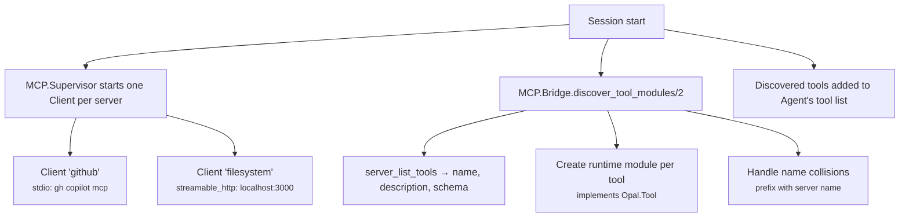

# MCP Bridge

Opal integrates with external tool servers via the [Model Context Protocol](https://modelcontextprotocol.io/). MCP tools appear alongside built-in tools — the agent and LLM treat them identically.

## How It Works



## Components

### MCP.Client

One client per configured MCP server. Wraps [Anubis](https://github.com/anubis-framework/anubis) (Elixir MCP library) and supports three transports:

| Transport | Config | Use case |
|-----------|--------|----------|
| `:stdio` | `{:stdio, command: "cmd", args: [...]}` | Local CLI tools |
| `:streamable_http` | `{:streamable_http, url: "http://..."}` | HTTP servers |
| `:sse` | `{:sse, url: "http://..."}` | SSE-based servers |

Clients register in the process registry under `{:mcp_client, server_name}` for lookup.

### MCP.Bridge

Discovers tools from all connected servers and wraps each as a runtime module implementing `Opal.Tool`:

```elixir
# Dynamically creates:
defmodule :"mcp_tool_github_create_issue" do
  @behaviour Opal.Tool
  def name, do: "create_issue"
  def execute(args, _ctx), do: Client.server_call_tool(client, "create_issue", args)
end
```

**Name collision handling:** If two servers expose a tool with the same name, the bridge prefixes with the server name (e.g. `github_create_issue` vs `jira_create_issue`). If no conflict, the original name is kept.

### MCP.Supervisor

A `:one_for_one` supervisor that owns all MCP client processes. Started as part of the application supervision tree. Each child is a Client GenServer managing its server connection.

### MCP.Resources

Provides access to MCP resources (non-tool data like documentation or configuration):

- `list(server_name)` — List available resources
- `read(server_name, uri)` — Fetch resource contents

## Configuration

MCP servers are configured in `Opal.Config`:

```elixir
mcp_servers: [
  %{name: "github", transport: {:stdio, command: "gh", args: ["copilot", "mcp"]}},
  %{name: "fs", transport: {:streamable_http, url: "http://localhost:3000/mcp"}}
]
```

## Source

- `packages/core/lib/opal/mcp/client.ex` — Server connection and tool/resource calls
- `packages/core/lib/opal/mcp/bridge.ex` — Tool discovery and runtime module creation
- `packages/core/lib/opal/mcp/supervisor.ex` — Process supervision
- `packages/core/lib/opal/mcp/resources.ex` — Resource access
