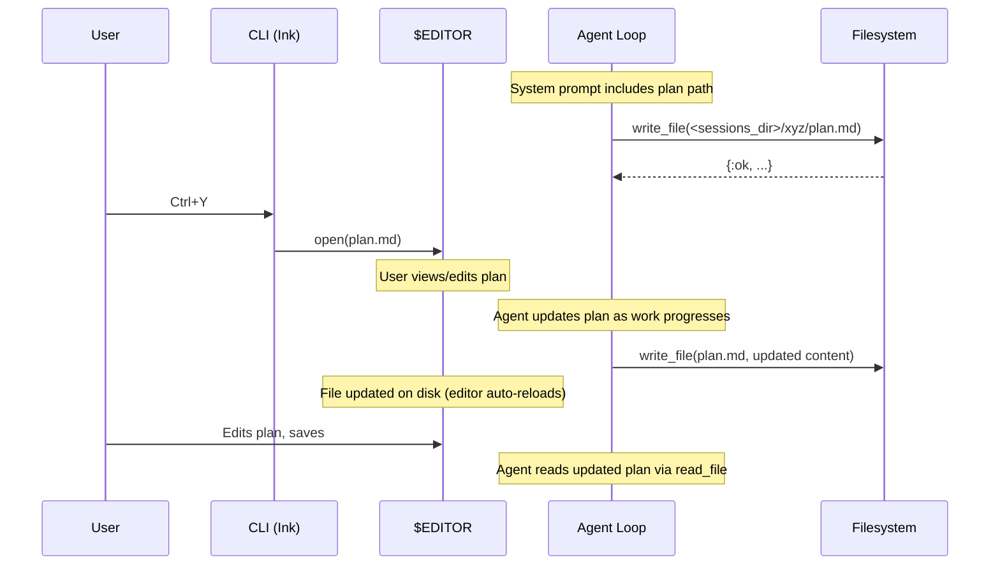

# Planning — Plan Documents & `Ctrl+Y` Editor

The planning system lets the agent create and maintain a structured plan document (`plan.md`) during complex tasks. The user can open the plan at any time by pressing `Ctrl+Y` in the CLI, which launches the file in the user's default editor (`$EDITOR` / `$VISUAL`, falling back to platform defaults). Plans are session-scoped, persisted to `<data_dir>/sessions/<session_id>/plan.md` (default `~/.opal/sessions/<session_id>/plan.md` on macOS/Linux), and survive conversation compaction.

## Interface

### Plan File Location

```
<data_dir>/sessions/<session_id>/plan.md
```

The agent writes to this path using the existing `write_file` tool — no new tool is needed. The full expanded path is provided in the system prompt at session start.

### User Interaction

- **`Ctrl+Y`** — open `plan.md` in the user's default editor
- Agent creates/updates plan via `write_file` (already available)
- User can edit `plan.md` in the opened editor; agent picks up changes via `read_file`

## How It Works

### Approach: System Prompt + `write_file`

Planning is implemented as **convention**, not new infrastructure. The agent already has `read_file` and `write_file` tools. We instruct it via system prompt to write plans to a well-known path, and the CLI adds a keybinding to view the file.

This is simpler and more flexible than a dedicated plan tool because:

1. The agent uses tools it already has (no new tool to maintain)
2. The plan format is freeform markdown — no schema to enforce
3. The plan file is a real file the user can edit in their editor
4. No new protocol events or RPC methods needed

### Data Flow



### System Prompt Injection

In `Opal.Agent.SystemPrompt.format_planning/1`, planning instructions are
added only when the agent has a session. The path is resolved from
`Opal.Config.sessions_dir(config)`:

```elixir
def format_planning(%State{session: nil}), do: ""

def format_planning(%State{config: config, session_id: session_id}) do
  session_dir = Path.join(Opal.Config.sessions_dir(config), session_id)
  """

  <planning>

  For complex multi-step tasks, create a plan document at:
    #{session_dir}/plan.md

  Write your plan before starting implementation. Update it as you
  complete steps. The user can review the plan at any time with Ctrl+Y.
  </planning>
  """
end
```

### CLI — `Ctrl+Y` Open in Editor

When the user presses `Ctrl+Y`, the CLI opens `<session_dir>/plan.md` from `session/start`. If the file doesn't exist yet, the CLI writes `No plan.md found yet.` to stderr.

**Editor resolution** (cross-platform):
1. `$VISUAL` environment variable (preferred for GUI editors)
2. `$EDITOR` environment variable
3. Platform fallback: `code` on Unix; `notepad` on Windows

**Keyboard handler** in `app.tsx`:

```typescript
if (input === "y" && key.ctrl) {
  openPlanInEditor(sessionDirRef.current);
}
```

The `openPlanInEditor` helper resolves `$VISUAL` → `$EDITOR` → platform default, then spawns the editor detached with `stdio: "ignore"` and `shell: true` so the Ink app remains responsive.

**Bottom bar**: `bottom-bar.tsx` includes the `ctrl+y plan` shortcut hint.

### Determining the Plan Path

The CLI gets the session directory directly from `session/start` (`session_dir` in RPC, `sessionDir` in the generated TypeScript client). This avoids hardcoding path conventions in the CLI.

## Implementation Checklist

1. **Core — Session directory path**
   - Resolve with `Path.join(Opal.Config.sessions_dir(config), session_id)`
   - `sessions_dir` comes from configurable `data_dir`

2. **Core — System prompt**
   - Planning instructions are injected in
     `Opal.Agent.SystemPrompt.format_planning/1`, including the resolved plan path
   - Only inject for interactive sessions (not sub-agents)

3. **Core — Protocol**
   - `session/start` includes `session_dir` in the result

4. **CLI — Keyboard handler** (`app.tsx`)
   - `Ctrl+Y` calls `openPlanInEditor(sessionDirRef.current)`
   - Missing file logs `No plan.md found yet.` to stderr

5. **CLI — Editor spawning** (`open-editor.ts`)
   - Resolve editor from `$VISUAL` → `$EDITOR` → platform default
   - Spawn detached with `stdio: "ignore"` and `shell: true`

6. **CLI — Bottom bar** (`components/bottom-bar.tsx`)
   - Includes `ctrl+y plan` shortcut hint

7. **CLI — Path resolution**
   - Compute `plan.md` path from `session_dir` returned by `session/start`

## Alternatives Considered

### Dedicated `plan` Tool

A `plan` tool that the agent calls with structured data (title, steps, status).
The tool writes the plan file and emits a `plan_updated` event.

**Pros**: Structured data, could render progress bars in the UI.
**Cons**: New tool to maintain, rigid schema, agent already has write_file.

This could be added later as an enhancement if we want richer plan rendering
(e.g. progress indicators, step completion tracking). The file-based approach
is a good foundation either way.

### `plan_updated` Event

Broadcast a `plan_updated` event whenever the agent writes to plan.md. The
CLI could then show a notification or auto-open the viewer.

**Decision**: Not needed for v1. The user can check the plan on demand. We
could add this later by having `write_file` detect writes to the plan path
and broadcast an event.

## Edge Cases

- **No session persistence**: If `session: false`, there's no session directory.
  Skip planning instructions in the system prompt.
- **Concurrent writes**: The agent writes sequentially (one tool at a time),
  so there's no write contention. Most editors handle external file changes
  gracefully (VS Code auto-reloads, vim shows a warning).
- **Terminal editors** (`vim`, `nano`): The current implementation uses the
  same detached spawn path for all editors; there is no TUI handoff mode.
- **No `$EDITOR` set**: Fall back to `code` on Unix and `notepad` on Windows.
- **Plan editing**: Changes the user makes in the editor are immediately
  visible to the agent via `read_file`. No special handling needed.

## References

- [Handle approvals and user input](https://platform.claude.com/docs/en/agent-sdk/user-input) — Anthropic, 2025. Claude Agent SDK documentation for user interaction patterns. Informed the overall approach to planning and user input as complementary features.
