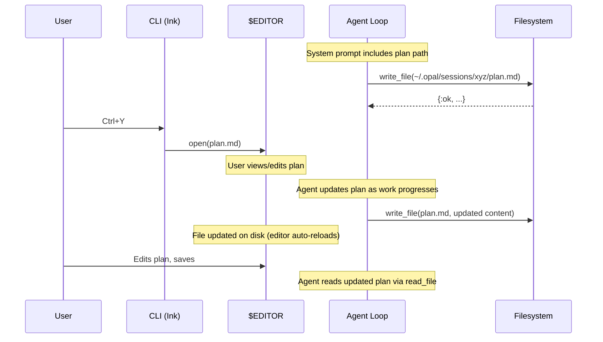

# Planning — Plan Documents & `Ctrl+Y` Editor

The planning system lets the agent create and maintain a structured plan document (`plan.md`) during complex tasks. The user can open the plan at any time by pressing `Ctrl+Y` in the CLI, which launches the file in the user's default editor (`$EDITOR` / `$VISUAL`, falling back to platform defaults). Plans are session-scoped, persisted to `~/.opal/sessions/<session_id>/plan.md`, and survive conversation compaction.

## Interface

### Plan File Location

```
~/.opal/sessions/<session_id>/plan.md
```

The agent writes to this path using the existing `write_file` tool — no new tool is needed. The full expanded path is provided in the system prompt at session start.

### User Interaction

- **`Ctrl+Y`** — open `plan.md` in the user's default editor
- Agent creates/updates plan via `write_file` (already available)
- User can edit `plan.md` in the opened editor; agent picks up changes via `read_file`

## How It Works

### Approach: System Prompt + `write_file`

Planning is implemented as **convention**, not new infrastructure. The agent already has `read_file` and `write_file` tools. We instruct it via system prompt to write plans to a well-known path, and the CLI adds a keybinding to view the file.

This is simpler and more flexible than a dedicated plan tool because:

1. The agent uses tools it already has (no new tool to maintain)
2. The plan format is freeform markdown — no schema to enforce
3. The plan file is a real file the user can edit in their editor
4. No new protocol events or RPC methods needed

### Data Flow



### System Prompt Injection

In `Opal.Agent` or `Opal.Context`, when building the system prompt, append
the planning instructions with the resolved path:

```elixir
defp planning_instructions(session_id) do
  session_dir = Opal.Session.session_dir(session_id)
  """

  ## Planning

  For complex multi-step tasks, create a plan document at:
    #{session_dir}/plan.md

  Write your plan before starting implementation. Update it as you
  complete steps. The user can review the plan at any time with Ctrl+Y.
  """
end
```

### CLI — `Ctrl+Y` Open in Editor

When the user presses `Ctrl+Y`, the CLI opens `~/.opal/sessions/<session_id>/plan.md` in the user's preferred editor. If the file doesn't exist yet, the CLI shows a brief inline message: "No plan yet."

**Editor resolution** (cross-platform):
1. `$VISUAL` environment variable (preferred for GUI editors)
2. `$EDITOR` environment variable
3. Platform fallback: `code --wait` → `nano` → `vi` on Unix; `notepad` on Windows

**Keyboard handler** in `app.tsx`:

```typescript
import { execSync } from "child_process";
import { existsSync } from "fs";

if (input === "y" && key.ctrl) {
  const planPath = path.join(sessionDir, "plan.md");
  if (!existsSync(planPath)) {
    addSystemMessage("No plan yet.");
    return;
  }
  const editor = process.env.VISUAL
    || process.env.EDITOR
    || (process.platform === "win32" ? "notepad" : "code --wait");
  // Spawn detached so the CLI stays responsive
  const child = spawn(editor, [planPath], {
    detached: true,
    stdio: "ignore",
    shell: true,
  });
  child.unref();
}
```

The editor is spawned detached so the Ink app remains fully interactive. If the user's editor is terminal-based (e.g. `vim`, `nano`), we may need to temporarily surrender stdin/stdout — this can be handled by detecting whether the editor is a TUI (heuristic: no `--wait` flag, not in a known GUI list) and using `spawnSync` with `stdio: "inherit"` instead.

**Bottom bar**: Add `ctrl+y plan` to the shortcuts display in `bottom-bar.tsx`.

### Determining the Plan Path

The CLI needs to know the session directory. The recommended approach is to
return `session_dir` in the `session/start` RPC result — add a `session_dir`
field to the response. This avoids hardcoding the path convention in two
places. As a fallback, the CLI can derive it from `~/.opal/sessions/${sessionId}/plan.md` using `os.homedir()` and `path.join`.

## Implementation Checklist

1. **Core — Session directory helper**
   - Ensure `Opal.Session.session_dir(session_id)` returns the path
   - Ensure the directory exists at session start

2. **Core — System prompt**
   - Add planning instructions to the system prompt in `Opal.Agent` or
     `Opal.Context`, including the resolved plan path
   - Only inject for interactive sessions (not sub-agents)

3. **Core — Protocol** (optional, for Option B)
   - Add `session_dir` field to `session/start` result

4. **CLI — Keyboard handler** (`app.tsx`)
   - Add `Ctrl+Y` handler to open plan in `$VISUAL` / `$EDITOR`
   - Show "No plan yet." if file doesn't exist

5. **CLI — Editor spawning** (`app.tsx` or utility)
   - Resolve editor from `$VISUAL` → `$EDITOR` → platform default
   - Spawn detached for GUI editors; `spawnSync` with inherited stdio for TUI editors

6. **CLI — Bottom bar** (`components/bottom-bar.tsx`)
   - Add `ctrl+y plan` shortcut hint

7. **CLI — Path resolution**
   - Compute plan path from session ID (or `session_dir` from start result)

## Alternatives Considered

### Dedicated `plan` Tool

A `plan` tool that the agent calls with structured data (title, steps, status).
The tool writes the plan file and emits a `plan_updated` event.

**Pros**: Structured data, could render progress bars in the UI.
**Cons**: New tool to maintain, rigid schema, agent already has write_file.

This could be added later as an enhancement if we want richer plan rendering
(e.g. progress indicators, step completion tracking). The file-based approach
is a good foundation either way.

### `plan_updated` Event

Broadcast a `plan_updated` event whenever the agent writes to plan.md. The
CLI could then show a notification or auto-open the viewer.

**Decision**: Not needed for v1. The user can check the plan on demand. We
could add this later by having `write_file` detect writes to the plan path
and broadcast an event.

## Edge Cases

- **No session persistence**: If `session: false`, there's no session directory.
  Skip planning instructions in the system prompt.
- **Concurrent writes**: The agent writes sequentially (one tool at a time),
  so there's no write contention. Most editors handle external file changes
  gracefully (VS Code auto-reloads, vim shows a warning).
- **Terminal editors** (`vim`, `nano`): Need `spawnSync` with `stdio: "inherit"` 
  which temporarily takes over the terminal. The Ink app must pause rendering
  and resume after the editor exits.
- **No `$EDITOR` set**: Fall back to `code --wait` (common for developers),
  then `nano`, then `vi`. On Windows, `notepad`.
- **Plan editing**: Changes the user makes in the editor are immediately
  visible to the agent via `read_file`. No special handling needed.

## References

- [Handle approvals and user input](https://platform.claude.com/docs/en/agent-sdk/user-input) — Anthropic, 2025. Claude Agent SDK documentation for user interaction patterns. Informed the overall approach to planning and user input as complementary features.
