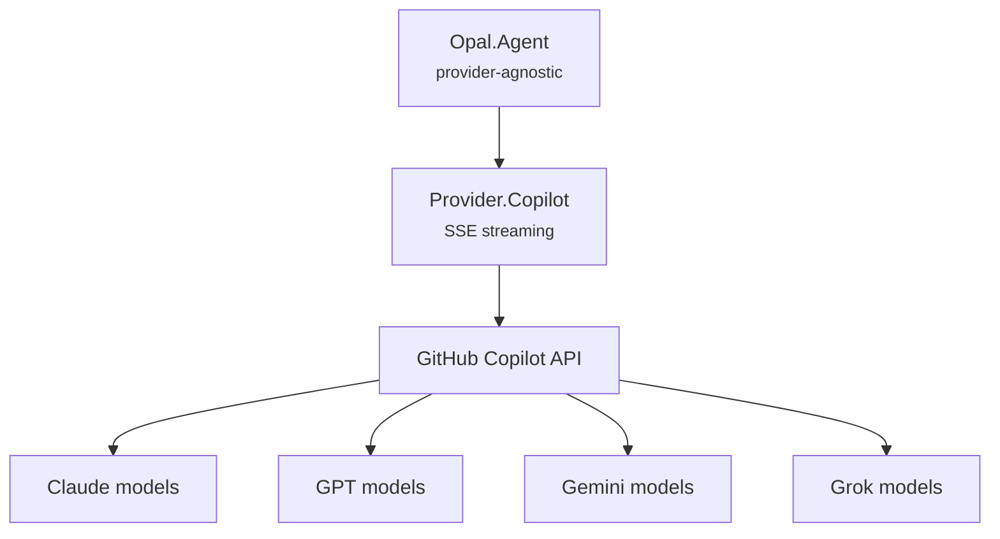

# Providers

The provider subsystem abstracts LLM APIs behind a common behaviour. The agent loop is provider-agnostic — it works with any model through the same `stream/4` → `parse_stream_event/1` pipeline.

## Built-in Provider: Copilot

Opal currently ships with one provider — `Opal.Provider.Copilot` — which connects to the GitHub Copilot API. The API proxies multiple model families (Claude, GPT, Gemini, Grok) through a single OAuth-authenticated endpoint.



```elixir
# Use Copilot (default)
{:ok, agent} = Opal.start_session(%{
  model: {:copilot, "claude-sonnet-4"},
  working_dir: "/project"
})

# Bare model IDs default to :copilot
{:ok, agent} = Opal.start_session(%{
  model: "gpt-5",
  working_dir: "/project"
})

# Switch model mid-session
Opal.set_model(agent, "claude-opus-4.6")
```

## Provider Behaviour

Any module implementing `Opal.Provider` can serve as a provider. The behaviour has four callbacks:

```elixir
@callback stream(model, messages, tools, opts) :: {:ok, Req.Response.t()} | {:error, term()}
@callback parse_stream_event(String.t()) :: [stream_event()]
@callback convert_messages(model, [Opal.Message.t()]) :: [map()]
@callback convert_tools([module()]) :: [map()]
```

- `stream/4` — Initiates an SSE streaming request. Returns `{:ok, %Req.Response{}}` with an async body. The agent receives chunks in its mailbox via `Req.parse_message/2`.
- `parse_stream_event/1` — Parses one SSE JSON line into semantic event tuples.
- `convert_messages/2` — Translates `Opal.Message` structs into the provider's wire format.
- `convert_tools/1` — Translates tool modules into the provider's function-calling schema.

### Semantic Events

All providers normalize streaming data into the same event vocabulary:

| Semantic Event | Meaning |
|---------------|---------|
| `{:text_start, %{}}` | New text block began |
| `{:text_delta, "Hello"}` | Streaming text token |
| `{:thinking_start, %{}}` | Reasoning began |
| `{:thinking_delta, "..."}` | Reasoning token |
| `{:tool_call_start, %{call_id, name}}` | Tool call began |
| `{:tool_call_delta, json_fragment}` | Tool call arguments chunk |
| `{:tool_call_done, %{arguments: map}}` | Tool call complete |
| `{:response_done, %{usage: ...}}` | Response complete |
| `{:usage, %{...}}` | Token usage report |
| `{:text_done, text}` | Full text block complete (Responses API) |
| `{:error, reason}` | Provider-level error |

### Shared Helpers

`Opal.Provider` doubles as a utility module with reusable helpers for OpenAI-compatible providers:

- `parse_chat_event/1` — Parses Chat Completions SSE format (`choices[0].delta`)
- `convert_messages_openai/2` — Converts `Opal.Message` to Chat Completions wire format
- `convert_tools/2` — Converts tool modules to OpenAI function-calling format
- `reasoning_effort/1` — Maps thinking level atoms to OpenAI effort strings
- `compact_map/1` — Strips nil/empty values from maps
- `decode_json_args/1` — Safe JSON argument decoding
- `collect_text/3` — Consumes an SSE stream into a plain text string

The `use Opal.Provider` macro injects the behaviour and a default `convert_tools/1`.

## Model Discovery

`Opal.Provider.Registry` provides auto-discovery of available models backed by [LLMDB](https://hexdocs.pm/llmdb), a bundled model database with metadata for context windows, capabilities, and deprecation status.

```elixir
# List Copilot models
Opal.Provider.Registry.list_copilot()
#=> [%{id: "claude-opus-4.6", name: "Claude Opus 4.6", supports_thinking: true}, ...]

# Look up context window
Opal.Provider.Registry.context_window(%Opal.Provider.Model{provider: :copilot, id: "claude-opus-4.6"})
#=> 128_000

# Resolve full model metadata
Opal.Provider.Registry.resolve(%Opal.Provider.Model{provider: :copilot, id: "claude-opus-4.6"})
#=> {:ok, %LLMDB.Model{limits: %{context: 128_000}, ...}}
```

### Model Specification

All APIs accept any model spec form via `Opal.Provider.Model.coerce/2`:

```elixir
Opal.Provider.Model.coerce({:copilot, "gpt-5"})
#=> %Opal.Provider.Model{provider: :copilot, id: "gpt-5"}

Opal.Provider.Model.coerce("claude-sonnet-4")
#=> %Opal.Provider.Model{provider: :copilot, id: "claude-sonnet-4"}

Opal.Provider.Model.parse("copilot:claude-opus-4.6")
#=> %Opal.Provider.Model{provider: :copilot, id: "claude-opus-4.6"}
```

### Copilot Naming Quirks

The Copilot API uses its own model ID scheme that differs from upstream providers. The key difference is **dots vs dashes** in version numbers:

| Copilot ID | Upstream (Anthropic) ID |
|------------|-------------------------|
| `claude-opus-4.6` | `claude-opus-4-6` |
| `claude-sonnet-4.5` | `claude-sonnet-4-5-20250929` |
| `claude-haiku-4.5` | `claude-haiku-4-5-20251001` |

LLMDB's `github_copilot` provider maps these correctly, so callers don't need to translate.

## Copilot Provider

`Opal.Provider.Copilot` implements the behaviour for GitHub Copilot's API, which proxies multiple model families through a single authenticated endpoint.

### Two API Variants

The provider auto-detects which API to use based on model ID:

| API | Models | Endpoint |
|-----|--------|----------|
| Chat Completions | Claude, Gemini, GPT-4o, Grok | `/chat/completions` |
| Responses API | GPT-5 family | `/responses` |

Detection: model IDs starting with `gpt-5` or `oswe` use Responses API; everything else uses Chat Completions.

### SSE Parsing

Both APIs stream Server-Sent Events, but with different JSON structures:

**Chat Completions** — delegates to `Opal.Provider.parse_chat_event/1`:
```json
{"choices": [{"delta": {"content": "Hello"}}]}
{"choices": [{"delta": {"tool_calls": [...]}}]}
{"usage": {"prompt_tokens": 1500, "completion_tokens": 200}}
```

**Responses API** — parsed inline in Copilot:
```json
{"type": "response.output_text.delta", "delta": "Hello"}
{"type": "response.function_call_arguments.delta", "delta": "{\"path"}
{"type": "response.completed", "response": {"usage": {"input_tokens": 1500}}}
```

## Auth

`Opal.Auth.Copilot` implements GitHub's device-code OAuth flow:

1. `start_device_flow()` — POST to `/login/device/code`, get a user code + verification URL
2. User visits the URL and enters the code
3. `poll_for_token()` — Poll until GitHub returns an access token
4. `exchange_copilot_token()` — Exchange the GitHub token for a Copilot API token

Tokens are persisted to `~/.opal/auth.json`. `get_token/0` auto-refreshes expired tokens (5-minute buffer before expiry).

The parent module `Opal.Auth` provides `probe/0`, which checks credential sources and returns a unified readiness result. See [Authentication](auth.md) for the full probe + setup flow.

## Settings Persistence

Model preferences are saved to `~/.opal/settings.json` via `Opal.Settings`. When a user switches models in the CLI (via `/model` or `/models`), the choice is persisted as `default_model`. On next session start, this saved preference is loaded automatically (unless overridden by `--model` or explicit config).

```json
{"default_model": "claude-sonnet-4"}
```

RPC methods: `settings/get`, `settings/save`. See [directories.md](directories.md) for the full storage layout.

## Adding a Custom Provider

1. Create a module with `use Opal.Provider, name: :my_provider`
2. Implement `stream/4` to return `{:ok, %Req.Response{}}` with SSE streaming
3. Implement `parse_stream_event/1` to normalize your API's SSE events
4. Implement `convert_messages/2` and `convert_tools/1` for your API's format
5. Pass it in config: `Opal.start_session(%{provider: MyProvider})`

For OpenAI-compatible APIs, reuse the shared helpers in `Opal.Provider`: `parse_chat_event/1` for SSE parsing and `convert_messages_openai/2` for message conversion.

## References

- [LLMDB](https://hexdocs.pm/llmdb) — Model database powering auto-discovery of models, context windows, and capabilities.

## Source

- `lib/opal/provider/provider.ex` — Behaviour definition, shared helpers, and `collect_text/3`
- `lib/opal/provider/copilot.ex` — GitHub Copilot implementation (Chat Completions + Responses API)
- `lib/opal/provider/model.ex` — Model struct with `parse/2` and `coerce/2` for string/tuple specs
- `lib/opal/provider/registry.ex` — LLMDB-backed model discovery and metadata
- `lib/opal/auth/auth.ex` — Provider-agnostic credential probe (`Opal.Auth.probe/0`)
- `lib/opal/auth/copilot.ex` — Device-code OAuth and token management
