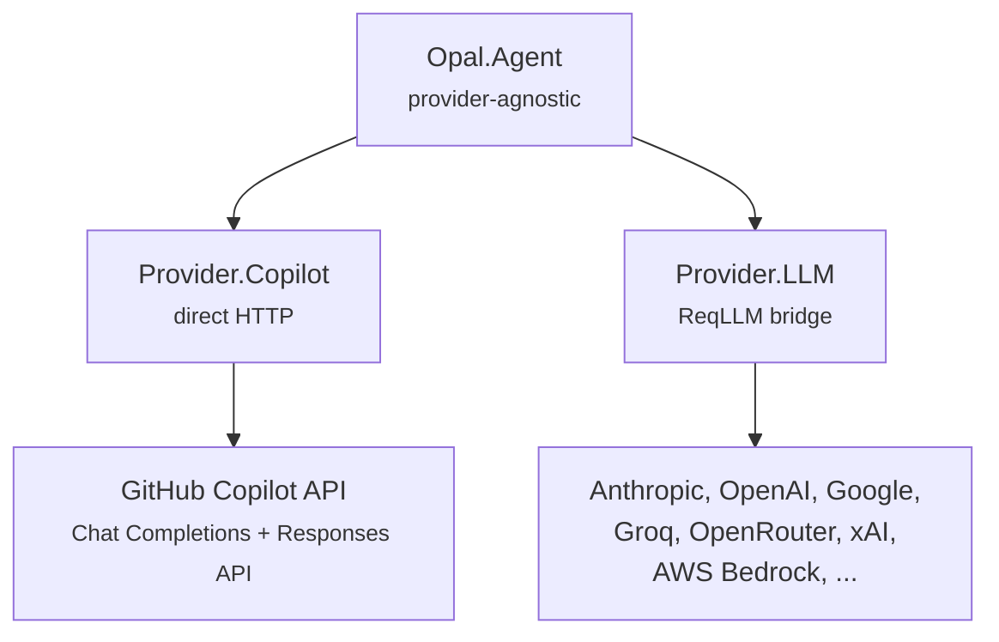

# Providers

The provider subsystem abstracts LLM APIs behind a common behaviour. The agent loop is provider-agnostic — it works with any model through the same interface.

## Two Built-in Providers

Opal ships with two providers, auto-selected based on the model specification:

| Provider | Module | Use Case |
|----------|--------|----------|
| **Copilot** | `Opal.Provider.Copilot` | GitHub Copilot API (requires OAuth) |
| **LLM** | `Opal.Provider.LLM` | Any ReqLLM-supported provider (Anthropic, OpenAI, Google, Groq, xAI, etc.) |

**Auto-selection:** Models with provider `:copilot` use the Copilot provider; everything else uses the LLM provider.



## Quick Start

```elixir
# Use Anthropic directly
{:ok, agent} = Opal.start_session(%{
  model: "anthropic:claude-sonnet-4-5",
  working_dir: "/project"
})

# Use OpenAI
{:ok, agent} = Opal.start_session(%{
  model: "openai:gpt-4o",
  working_dir: "/project"
})

# Use Copilot (default)
{:ok, agent} = Opal.start_session(%{
  model: {:copilot, "claude-sonnet-4"},
  working_dir: "/project"
})

# Switch model mid-session
Opal.set_model(agent, {:anthropic, "claude-sonnet-4-5"})
```

### API Key Management (LLM Provider)

The LLM provider uses ReqLLM's key management. Set keys via environment variables:

```bash
# .env or shell
ANTHROPIC_API_KEY=sk-ant-...
OPENAI_API_KEY=sk-...
GOOGLE_API_KEY=...
```

Or save a key via the `auth/set_key` RPC (persists to `~/.opal/settings.json` and takes effect immediately):

```json
{"method": "auth/set_key", "params": {"provider": "anthropic", "api_key": "sk-ant-..."}}
```

On first run, if no credentials are found for any provider, the CLI presents a setup wizard. See [Authentication](auth.md) for the full flow.

## Provider Behaviour

```elixir
@callback stream(model, messages, tools, opts) :: {:ok, Req.Response.t()} | {:error, term()}
@callback parse_stream_event(String.t()) :: [event]
@callback convert_messages(model, [Opal.Message.t()]) :: [map()]
@callback convert_tools([module()]) :: [map()]
```

- `stream/4` — Initiates an async streaming request. Returns a `Req.Response` whose body streams chunks as Erlang messages into the calling process (the Agent GenServer).
- `parse_stream_event/1` — Parses one data line into semantic events (`:text_delta`, `:tool_call_start`, etc.).
- `convert_messages/2` — Translates `Opal.Message` structs into the provider's wire format.
- `convert_tools/1` — Translates tool modules into the provider's function-calling schema.

### Semantic Events

All providers normalize streaming data into the same event vocabulary:

| Semantic Event | Meaning |
|---------------|---------|
| `{:text_start, %{}}` | New text block began |
| `{:text_delta, "Hello"}` | Streaming text token |
| `{:thinking_start, %{}}` | Reasoning began |
| `{:thinking_delta, "..."}` | Reasoning token |
| `{:tool_call_start, %{call_id, name}}` | Tool call began |
| `{:tool_call_delta, json_fragment}` | Tool call arguments chunk |
| `{:tool_call_done, %{arguments: map}}` | Tool call complete |
| `{:response_done, %{usage: ...}}` | Response complete |
| `{:usage, %{...}}` | Token usage report |
| `{:text_done, text}` | Full text block complete (Responses API) |
| `{:error, reason}` | Provider-level error |

## Model Discovery

`Opal.Models` provides auto-discovery of available models backed by [LLMDB](https://hexdocs.pm/llmdb), which ships with ReqLLM. This replaces hardcoded model lists and context window lookups.

```elixir
# List Copilot models (auto-discovered from LLMDB)
Opal.Models.list_copilot()
#=> [%{id: "claude-opus-4.6", name: "Claude Opus 4.6"}, ...]

# List models for a direct provider
Opal.Models.list_provider(:anthropic)
#=> [%{id: "claude-opus-4-6", name: "Claude Opus 4.6"}, ...]

# Look up context window for any model
Opal.Models.context_window(%Opal.Model{provider: :copilot, id: "claude-opus-4.6"})
#=> 128_000

# Resolve full model metadata (limits, capabilities, aliases)
Opal.Models.resolve(%Opal.Model{provider: :anthropic, id: "claude-sonnet-4-5"})
#=> {:ok, %LLMDB.Model{limits: %{context: 200_000}, ...}}
```

The `models/list` RPC also accepts an optional `providers` param to include direct provider models:

```json
{"method": "models/list", "params": {"providers": ["anthropic", "openai"]}}
```

### Copilot Naming Quirks

The Copilot API uses its own model ID scheme that differs from upstream providers. The key difference is **dots vs dashes** in version numbers:

| Copilot ID | Upstream (Anthropic) ID |
|------------|-------------------------|
| `claude-opus-4.6` | `claude-opus-4-6` |
| `claude-sonnet-4.5` | `claude-sonnet-4-5-20250929` |
| `claude-haiku-4.5` | `claude-haiku-4-5-20251001` |
| `claude-opus-41` | `claude-opus-4-1-20250805` |

LLMDB's `github_copilot` provider maps these correctly, so when using the Copilot provider you use the dotted form (e.g., `claude-opus-4.6`), and when using a direct provider you use the upstream form (e.g., `anthropic:claude-opus-4-6`).

Context windows also differ — Copilot typically limits context to 128k even for models that support 200k upstream (e.g., Claude). LLMDB reflects the Copilot-specific limits.

## LLM Provider (ReqLLM)

`Opal.Provider.LLM` bridges ReqLLM's streaming into Opal's mailbox-based agent loop.

### How It Works

1. Converts Opal messages and tools to ReqLLM format (`ReqLLM.Context`, `ReqLLM.Tool`)
2. Calls `ReqLLM.stream_text/3` to get a `StreamResponse` with a lazy chunk stream
3. Spawns a bridge process that iterates the stream and sends events through a `Req.Response.Async` ref
4. The agent's existing SSE processing loop receives and dispatches these events via `parse_stream_event/1`

The bridge encodes each `ReqLLM.StreamChunk` as a JSON object with an `_opal` type tag, which `parse_stream_event/1` decodes back into Opal's semantic events. This avoids modifying the agent loop while supporting any ReqLLM provider.

### Model Specification

All APIs accept any model spec form via `Opal.Model.coerce/2`:

```elixir
# Tuple form (preferred)
Opal.Model.coerce({:anthropic, "claude-sonnet-4-5"})
#=> %Opal.Model{provider: :anthropic, id: "claude-sonnet-4-5"}

# String form
Opal.Model.coerce("openai:gpt-4o")
#=> %Opal.Model{provider: :openai, id: "gpt-4o"}

# Bare ID defaults to :copilot
Opal.Model.coerce("claude-sonnet-4")
#=> %Opal.Model{provider: :copilot, id: "claude-sonnet-4"}

# Struct passes through as-is
Opal.Model.coerce(%Opal.Model{provider: :anthropic, id: "claude-sonnet-4-5"})
```

## Copilot Provider

`Opal.Provider.Copilot` implements the behaviour for GitHub Copilot's API, which proxies multiple model families.

### Two API Variants

The provider auto-detects which API to use based on model ID:

| API | Models | Endpoint |
|-----|--------|----------|
| Chat Completions | Claude, Gemini, GPT-4o, Grok | `/chat/completions` |
| Responses API | GPT-5 family | `/responses` |

Detection: model IDs starting with `gpt-5` or `oswe` use Responses API; everything else uses Chat Completions.

### SSE Parsing

Both APIs stream Server-Sent Events, but with different JSON structures:

**Chat Completions:**
```json
{"choices": [{"delta": {"content": "Hello"}}]}
{"choices": [{"delta": {"tool_calls": [...]}}]}
{"usage": {"prompt_tokens": 1500, "completion_tokens": 200}}
```

**Responses API:**
```json
{"type": "response.output_text.delta", "delta": "Hello"}
{"type": "response.function_call_arguments.delta", "delta": "{\"path"}
{"type": "response.completed", "response": {"usage": {"input_tokens": 1500}}}
```

## Auth (Copilot Only)

`Opal.Auth.Copilot` implements GitHub's device-code OAuth flow:

1. `start_device_flow()` — POST to `/login/device/code`, get a user code + verification URL
2. User visits the URL and enters the code
3. `poll_for_token()` — Poll until GitHub returns an access token (handles `authorization_pending` and `slow_down`)
4. `exchange_copilot_token()` — Exchange the GitHub token for a Copilot API token

Tokens are persisted to `~/.opal/auth.json`. `get_token/0` auto-refreshes expired tokens (5-minute buffer before expiry).

The parent module `Opal.Auth` provides `probe/0`, which checks all credential sources (Copilot token, env-var API keys, saved settings) and returns a unified readiness result. See [Authentication](auth.md) for the full probe + setup flow.

Auth is only required for the Copilot provider. The LLM provider uses standard API keys.

## Settings Persistence

Model preferences are saved to `~/.opal/settings.json` via `Opal.Settings`. When a user switches models in the CLI (via `/model` or `/models`), the choice is persisted as `default_model`. On next session start, this saved preference is loaded automatically (unless overridden by `--model` or explicit config).

```json
{"default_model": "anthropic:claude-sonnet-4-5"}
```

RPC methods: `settings/get`, `settings/save`. See [directories.md](directories.md) for the full storage layout.

## Adding a Custom Provider

To add a custom LLM provider:

1. Create a module implementing `Opal.Provider`
2. Implement `stream/4` to return a `Req.Response` with async streaming
3. Implement `parse_stream_event/1` to normalize your API's events
4. Implement `convert_messages/2` and `convert_tools/1` for your API's format
5. Pass it in config: `Opal.start_session(%{provider: MyProvider})`

For most use cases, `Opal.Provider.LLM` already covers the provider via ReqLLM. Custom providers are only needed for proprietary APIs not supported by ReqLLM.

## References

- [ReqLLM](https://github.com/agentjido/req_llm) — Composable Elixir LLM library built on Req. Powers the LLM provider with support for 45+ providers and 665+ models.
- [ReqLLM StreamResponse](https://hexdocs.pm/req_llm/ReqLLM.StreamResponse.html) — Streaming API used by the bridge layer.
- [LLMDB](https://hexdocs.pm/llmdb) — Model database bundled with ReqLLM. Powers auto-discovery of models, context windows, and capabilities.

## Source

- `core/lib/opal/provider.ex` — Behaviour definition and event types
- `core/lib/opal/provider/copilot.ex` — GitHub Copilot implementation
- `core/lib/opal/provider/llm.ex` — ReqLLM-based multi-provider implementation
- `core/lib/opal/models.ex` — LLMDB-backed model discovery and metadata
- `core/lib/opal/auth.ex` — Provider-agnostic credential probe (`Opal.Auth.probe/0`)
- `core/lib/opal/auth/copilot.ex` — Device-code OAuth and token management (Copilot only)
- `core/lib/opal/model.ex` — Model struct with `parse/1` and `coerce/1` for string/tuple specs
