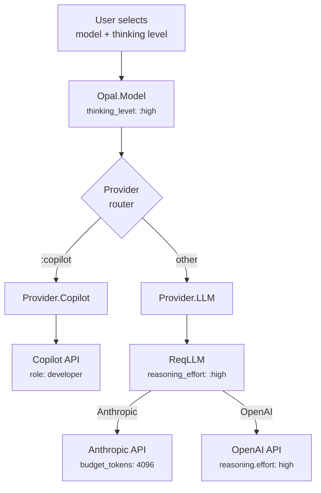

# Reasoning Effort

Opal supports configuring reasoning effort (extended thinking) for models that support it. This controls how much internal reasoning the model performs before responding — higher effort means more thorough analysis at the cost of latency and tokens.

## Supported Levels

| Level | Description |
|-------|-------------|
| `off` | No extended thinking (default) |
| `low` | Minimal reasoning — fast, economical |
| `medium` | Balanced reasoning and speed |
| `high` | Thorough reasoning — slower, more tokens |

Supported levels are discovered per-model via LLMDB. Not all models support reasoning — the `models/list` RPC returns `supports_thinking` and `thinking_levels` for each model.

## How It Works Across Providers



### Copilot Provider

The Copilot API proxies multiple model families but has limited reasoning control:

- **Responses API models** (GPT-5 family): When thinking is enabled, the system message role switches from `"system"` to `"developer"` — required by OpenAI for reasoning models. The Copilot proxy handles reasoning effort internally.
- **Chat Completions models** (Claude, Gemini, etc.): Thinking output arrives as `reasoning_content` in the SSE stream delta. The role stays `"system"`.

```elixir
# In Provider.Copilot — Responses API system message routing
defp convert_msg_responses(model, %Message{role: :system, content: content}) do
  role = if model.thinking_level != :off, do: "developer", else: "system"
  [%{role: role, content: content}]
end
```

Thinking output (regardless of API variant) is parsed into Opal's semantic events:

| SSE Data | Opal Event |
|----------|------------|
| `{"choices": [{"delta": {"reasoning_content": "..."}}]}` | `{:thinking_delta, text}` |
| `{"type": "response.output_item.added", "item": {"type": "reasoning"}}` | `{:thinking_start, %{item_id: id}}` |
| `{"type": "response.reasoning_summary_text.delta", "delta": "..."}` | `{:thinking_delta, text}` |

### LLM Provider (Direct)

For direct provider access via ReqLLM, the thinking level maps to `reasoning_effort`:

```elixir
# In Provider.LLM
defp maybe_add_thinking(opts, %{thinking_level: :off}), do: opts
defp maybe_add_thinking(opts, %{thinking_level: level}) do
  Keyword.put(opts, :reasoning_effort, level)
end
```

ReqLLM then translates per provider:

| Opal Level | Anthropic | OpenAI |
|------------|-----------|--------|
| `:low` | `budget_tokens: 1024` | `reasoning.effort: "low"` |
| `:medium` | `budget_tokens: 2048` | `reasoning.effort: "medium"` |
| `:high` | `budget_tokens: 4096` | `reasoning.effort: "high"` |

## Setting Reasoning Effort

### Via Model Picker (CLI)

The `/models` command opens an interactive picker. After selecting a model that supports thinking, a second picker appears with the available thinking levels (fetched from the server, not hardcoded).

### Via RPC

```json
// Set model with thinking level
{"method": "model/set", "params": {
  "session_id": "...",
  "model_id": "claude-opus-4.6",
  "thinking_level": "high"
}}

// Change thinking level without switching models
{"method": "thinking/set", "params": {
  "session_id": "...",
  "level": "medium"
}}
```

### Via Elixir API

```elixir
# At session start
Opal.start_session(%{
  model: {:copilot, "claude-opus-4.6"},
  thinking_level: :high
})

# Mid-session
model = Opal.Model.new(:copilot, "claude-opus-4.6", thinking_level: :high)
GenServer.call(agent, {:set_model, model})
```

## Model Discovery

The `models/list` RPC returns reasoning capability per model:

```json
{
  "models": [
    {
      "id": "claude-opus-4.6",
      "name": "Claude Opus 4.6",
      "provider": "copilot",
      "supports_thinking": true,
      "thinking_levels": ["low", "medium", "high"]
    },
    {
      "id": "gpt-4o",
      "name": "GPT-4o",
      "provider": "copilot",
      "supports_thinking": false,
      "thinking_levels": []
    }
  ]
}
```

This data comes from LLMDB's `reasoning.enabled` capability flag. The CLI model picker uses this to decide whether to show the thinking level step.

## Event Flow

When a model reasons, the thinking content flows through Opal's event pipeline:

```
Provider SSE → parse_stream_event/1 → {:thinking_start, %{}}
                                     → {:thinking_delta, "Let me analyze..."}
                                     → {:thinking_delta, "Step 1: ..."}
            → Agent broadcasts     → {:thinking_start}
                                     → {:thinking_delta, %{delta: "..."}}
            → RPC serializes       → {"type": "thinking_start"}
                                     → {"type": "thinking_delta", "delta": "..."}
            → CLI renders          → ThinkingIndicator component
```

The agent accumulates thinking text in state during streaming. It is displayed to the user but not persisted in the conversation history (reasoning tokens are ephemeral, matching upstream provider behavior).

## Source

- `core/lib/opal/model.ex` — `thinking_level` field and validation
- `core/lib/opal/models.ex` — `thinking_levels` per model from LLMDB
- `core/lib/opal/provider/copilot.ex` — Role switching and SSE parsing
- `core/lib/opal/provider/llm.ex` — `maybe_add_thinking/2` → ReqLLM `reasoning_effort`
- `core/lib/opal/rpc/handler.ex` — `thinking/set` and `model/set` with `thinking_level`
- `cli/src/components/model-picker.tsx` — Two-step picker (model → thinking level)
- `core/test/opal/reasoning_effort_test.exs` — Comprehensive reasoning effort tests
