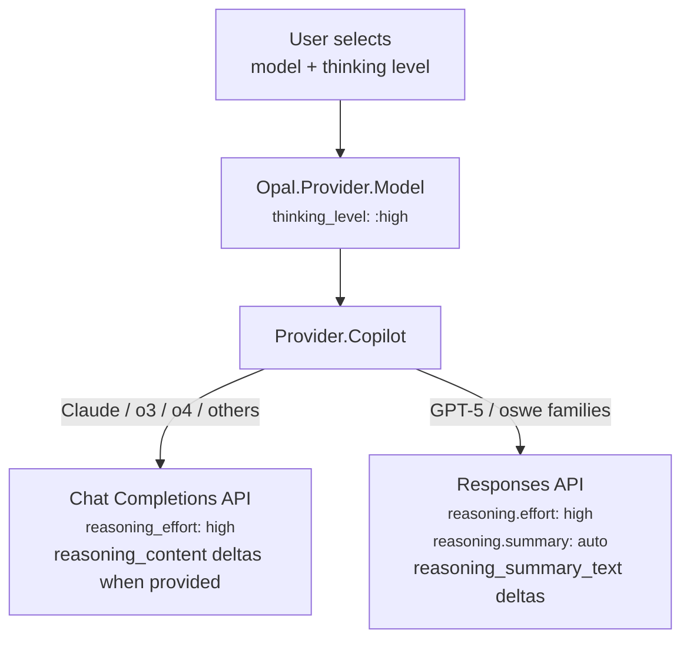
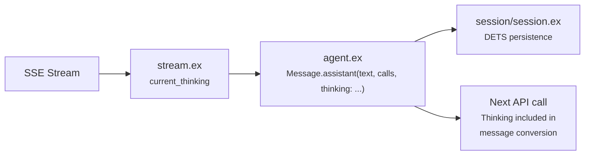

# Reasoning Effort

Opal supports configuring reasoning effort (extended thinking) for models that support it. This controls how much internal reasoning the model performs before responding — higher effort means more thorough analysis at the cost of latency and tokens.

## Supported Levels

| Level | Description |
|-------|-------------|
| `low` | Minimal reasoning — fast, economical |
| `medium` | Balanced reasoning and speed |
| `high` | Thorough reasoning — slower, more tokens (default for thinking-capable models) |
| `max` | Unconstrained reasoning (Opus 4.6+ only) |

Thinking-capable models (Claude, GPT-5, o3, o4) default to `high`. Models that don't support reasoning (e.g. GPT-4o, GPT-4.1) always run without it. The `off` level is not user-selectable for thinking-capable models — reasoning is always enabled at `low` or above.

## How It Works Across Providers



### Copilot Provider

The Copilot API proxies multiple model families through two API variants. Reasoning effort is sent in the request body for thinking-capable models, and Opal parses thinking deltas when providers emit them.

**Chat Completions**: Adds `reasoning_effort` string to the request body for thinking-capable model IDs.

```elixir
# In Provider.Copilot — delegates to shared Provider module
defp maybe_add_reasoning(body, %{thinking_level: level, id: id}, :completions) do
  if thinking_capable?(id) do
    Map.put(body, :reasoning_effort, Opal.Provider.reasoning_effort(level))
  else
    body
  end
end
```

**Responses API** (`gpt-5*` and `oswe*`): Adds `reasoning` object with effort level and `summary: "auto"`, and switches system role to `"developer"` when thinking is enabled.

```elixir
# In Provider.Copilot — Responses API reasoning
defp maybe_add_reasoning(body, %{thinking_level: :off}, :responses), do: body
defp maybe_add_reasoning(body, %{thinking_level: level}, :responses) do
  Map.put(body, :reasoning, %{effort: Opal.Provider.reasoning_effort(level), summary: "auto"})
end
```

**Level mapping** (via `Opal.Provider.reasoning_effort/1`): `:low` → `"low"`, `:medium` → `"medium"`, `:high` → `"high"`, `:max` → `"high"` (clamped — the Copilot proxy doesn't support `"max"` natively).

**Thinking-capable models** are detected by model ID prefix: `gpt-5*`, `claude-sonnet-4*`, `claude-opus-4*`, `claude-haiku-4.5`, `o3*`, `o4*`. Other models (e.g. `gpt-4o`, `gpt-4.1`) don't receive reasoning params.

**Copilot thinking support matrix:**

| Model Family | API Path | Reasoning Sent? | Thinking Event Parsed |
|-------------|----------|----------------|-----------------------|
| GPT-5, GPT-5.1, GPT-5.2, GPT-5.3, `oswe*` | Responses API | ✅ `reasoning.effort` | `response.reasoning_summary_text.delta` → `{:thinking_delta, text}` |
| Claude Sonnet 4, Opus 4.x, Haiku 4.5, o3/o4 | Chat Completions | ✅ `reasoning_effort` (thinking-capable IDs) | `choices[].delta.reasoning_text` → `{:thinking_delta, text}` (summary) |
| GPT-4o, GPT-4.1 | Chat Completions | ❌ Not sent | N/A |

Thinking output is parsed from SSE into Opal's semantic events:

| SSE Data | Opal Event | Notes |
|----------|------------|-------|
| `{"choices": [{"delta": {"reasoning_text": "..."}}]}` | `{:thinking_delta, text}` | Copilot proxy for Claude — human-readable summary |
| `{"choices": [{"delta": {"reasoning_content": "..."}}]}` | `{:thinking_delta, text}` | Standard Chat Completions (Anthropic direct) |
| `{"choices": [{"delta": {"reasoning_opaque": "..."}}]}` | *(ignored)* | Encrypted round-trip data; not displayable |
| `{"type": "response.output_item.added", "item": {"type": "reasoning"}}` | `{:thinking_start, %{item_id: id}}` | Responses API |
| `{"type": "response.reasoning_summary_text.delta", "delta": "..."}` | `{:thinking_delta, text}` | Responses API |

### Copilot API Thinking Format (Chat Completions)

The Copilot proxy wraps Claude's extended thinking in a non-standard Chat Completions SSE format that differs from both Anthropic's native API and OpenAI's `reasoning_content` convention. Each thinking chunk includes **three keys**:

```json
{
  "choices": [{
    "delta": {
      "role": "assistant",
      "content": "",
      "reasoning_text": "Let me analyze this step by step..."
    }
  }]
}
```

| Key | Purpose |
|-----|---------|
| `reasoning_text` | Human-readable thinking text (displayed in UI) |
| `reasoning_opaque` | Encrypted blob for round-tripping to the API (not displayable) |
| `content` | Always `""` during thinking chunks |

Every thinking chunk also carries `role: "assistant"` and `content: ""`. Without special handling, the `role_start` parser would emit a spurious `{:text_start}` on **every** thinking chunk, creating dozens of empty assistant message entries. The parser guards against this by checking for `reasoning_text`, `reasoning_content`, and `reasoning_opaque` keys before emitting `text_start`. As a second safety net, `stream.ex` deduplicates `{:message_start}` broadcasts via the `message_started` flag (reset each streaming cycle in `begin_stream/2`).

After the thinking phase, an opaque-only chunk signals the end of reasoning:

```json
{"choices": [{"delta": {"role": "assistant", "content": "", "reasoning_opaque": "1b9UghY8..."}}]}
```

Then normal text content follows with non-empty `content` values.

### LLM Provider (Direct)

> **Note:** Direct LLM provider support (Anthropic, OpenAI, etc.) has been removed in the current version. The behaviour is designed for future re-addition. The section below is kept for reference.

For direct provider access, the thinking level would map to provider-specific reasoning parameters:

| Opal Level | Anthropic (adaptive) | OpenAI |
|------------|---------------------|--------|
| `:low` | `effort: "low"` | `reasoning.effort: "low"` |
| `:medium` | `effort: "medium"` | `reasoning.effort: "medium"` |
| `:high` | `effort: "high"` | `reasoning.effort: "high"` |
| `:max` | `effort: "max"` | clamped → `"high"` |

## Thinking Persistence and Roundtripping

Thinking content is **persisted in messages** via the `thinking` field on `Opal.Message`. When the agent finalizes a response, accumulated thinking text is stored alongside the assistant message content and tool calls.



**Why roundtrip?** OpenAI's docs recommend passing back reasoning items between tool calls to maintain reasoning continuity. Anthropic's thinking blocks have cryptographic signatures for context continuity. Without roundtripping, the model loses its chain of thought at every tool call.

**How it roundtrips per API variant:**

- **Chat Completions**: Previous assistant messages include `reasoning_content` field if they had thinking content.
- **Responses API**: A `reasoning` item with `summary: [%{type: "summary_text", text: ...}]` is prepended to the assistant's output items in the input array.

The `stream.ex` handler auto-emits a `thinking_start` event before the first `thinking_delta` if the provider didn't send one (Chat Completions doesn't emit explicit start events). This is detected via `current_thinking` being `nil` (not started) vs `""` (started).

## CLI Display

Thinking content is displayed in the CLI timeline when **Ctrl+O** is toggled on (the same toggle that shows tool output):

- Thinking blocks appear as `{ kind: "thinking", text: string }` entries in the timeline, interspersed with messages and tool calls in the order they occurred.
- Rendered with a `💭` prefix in dim/italic gray to distinguish from assistant text.
- Truncated to 8 lines when viewing historical thinking blocks.
- During streaming, the animated `ThinkingIndicator` kaomoji still appears below the timeline.

When Ctrl+O is off (default), thinking entries are hidden from the timeline view.

## Setting Reasoning Effort

### Via Model Picker (CLI)

The `/models` command opens an interactive picker. After selecting a model that supports thinking, a second picker appears with the available thinking levels (fetched from the server, not hardcoded).

### Via RPC

```json
// Set model with thinking level
{"method": "model/set", "params": {
  "session_id": "...",
  "model_id": "claude-opus-4.6",
  "thinking_level": "high"
}}

// Change thinking level without switching models
{"method": "thinking/set", "params": {
  "session_id": "...",
  "level": "medium"
}}
```

### Via Elixir API

```elixir
# At session start
Opal.start_session(%{
  model: {:copilot, "claude-opus-4.6"},
  thinking_level: :high
})

# Mid-session
model = Opal.Provider.Model.new(:copilot, "claude-opus-4.6", thinking_level: :high)
Opal.set_model(agent, model)
```

## Model Discovery

The `models/list` RPC returns reasoning capability per model:

```json
{
  "models": [
    {
      "id": "claude-opus-4.6",
      "name": "Claude Opus 4.6",
      "provider": "copilot",
      "supports_thinking": true,
      "thinking_levels": ["low", "medium", "high", "max"]
    },
    {
      "id": "claude-sonnet-4.5",
      "name": "Claude Sonnet 4.5",
      "provider": "copilot",
      "supports_thinking": true,
      "thinking_levels": ["low", "medium", "high"]
    },
    {
      "id": "gpt-4o",
      "name": "GPT-4o",
      "provider": "copilot",
      "supports_thinking": false,
      "thinking_levels": []
    }
  ]
}
```

This data comes from LLMDB's `reasoning.enabled` capability flag. Opus 4.6+ models get the additional `"max"` level. The CLI model picker uses this to decide whether to show the thinking level step.

## Event Flow

```
Provider SSE → parse_stream_event/1 → {:thinking_start, %{}}
  (Copilot)                          → {:thinking_delta, "Let me analyze..."}

             → stream.ex             → Accumulates into current_thinking
                                      → Auto-emits thinking_start if missing
             → Agent broadcasts      → {:thinking_start}
                                      → {:thinking_delta, %{delta: "..."}}
             → RPC serializes        → {"type": "thinking_start"}
                                      → {"type": "thinking_delta", "delta": "..."}
             → CLI reducer           → Timeline: {kind: "thinking", text: "..."}
                                      → AgentView.thinking: "..." (indicator)
             → finalize_response     → Message.assistant(text, calls, thinking: "...")
                                      → Persisted via Session DETS store
```

## Source

- `lib/opal/provider/model.ex` — `thinking_level` field and validation (`:off | :low | :medium | :high | :max`)
- `lib/opal/provider/registry.ex` — Per-model `thinking_levels` from LLMDB, `supports_max_thinking?/1`
- `lib/opal/message.ex` — `thinking` field on Message struct
- `lib/opal/provider/provider.ex` — Shared `parse_chat_event/1`, `convert_messages_openai/2`, `reasoning_effort/1`. Parses `reasoning_text` and `reasoning_content` as `{:thinking_delta, text}`.
- `lib/opal/provider/copilot.ex` — `maybe_add_reasoning/3`, `thinking_capable?/1`, Responses API conversion
- `lib/opal/agent/stream.ex` — Thinking accumulation, auto-start detection, and `message_started` dedup guard
- `lib/opal/agent/state.ex` — `message_started` boolean prevents duplicate `{:message_start}` broadcasts per streaming cycle
- `lib/opal/agent/agent.ex` — `current_thinking` state, SSE stream handling, `finalize_response`
- `lib/opal/session/session.ex` — Thinking persistence on messages in the session store (DETS)
- `lib/opal/rpc/server.ex` — `thinking/set` and `model/set` with `thinking_level`
- `src/hooks/use-opal.ts` — Timeline thinking entries, `appendThinkingDelta`
- `src/components/message-list.tsx` — `ThinkingBlock` component
- `src/components/model-picker.tsx` — Two-step picker (model → thinking level)
- `test/opal/reasoning_effort_test.exs` — Reasoning effort unit tests
- `test/opal/thinking_integration_test.exs` — Full-stack thinking integration tests (fixture replay)
- `test/opal/live_thinking_test.exs` — Live API tests that record thinking fixtures
- `test/opal/provider/openai_test.exs` — Shared provider helpers tests

## References

- [OpenAI Reasoning Guide](https://developers.openai.com/api/docs/guides/reasoning) — Official docs for `reasoning.effort` and `reasoning.summary` parameters on the Responses API.
- [Anthropic Extended Thinking](https://platform.claude.com/docs/en/build-with-claude/extended-thinking) — Official docs for budget-based and adaptive thinking modes, including `output_config.effort` levels.
