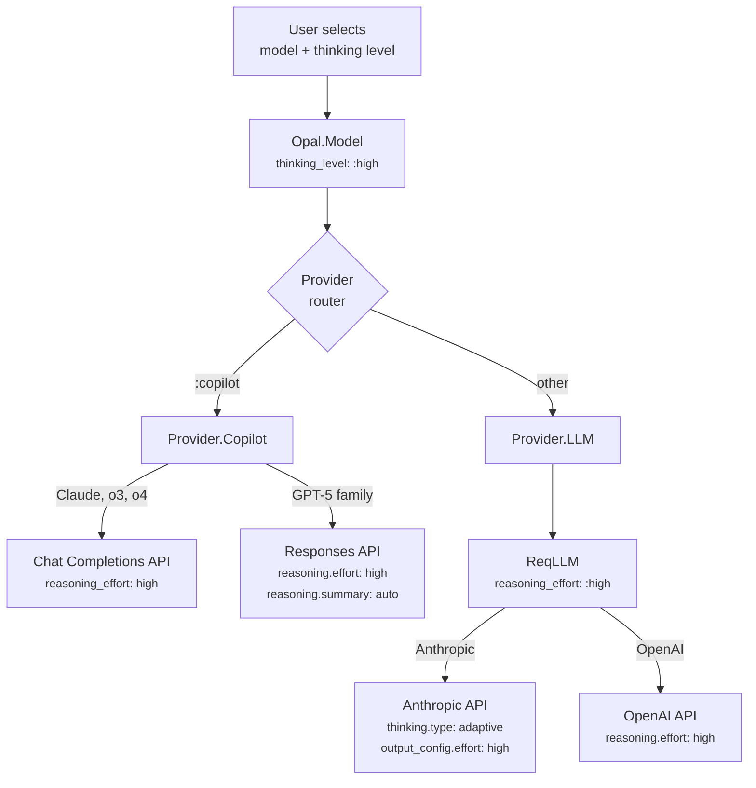
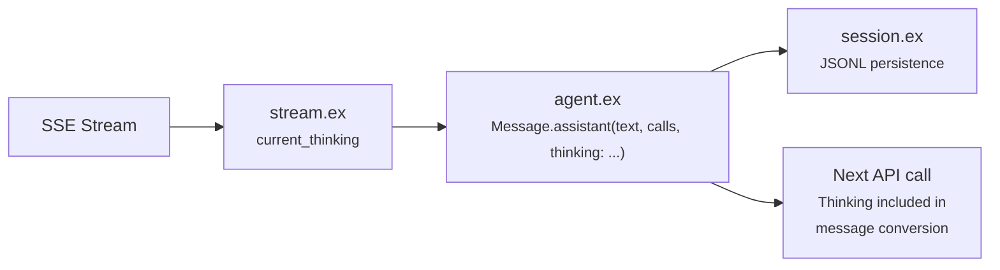

# Reasoning Effort

Opal supports configuring reasoning effort (extended thinking) for models that support it. This controls how much internal reasoning the model performs before responding — higher effort means more thorough analysis at the cost of latency and tokens.

## Supported Levels

| Level | Description |
|-------|-------------|
| `off` | No extended thinking (default) |
| `low` | Minimal reasoning — fast, economical |
| `medium` | Balanced reasoning and speed |
| `high` | Thorough reasoning — slower, more tokens |
| `max` | Unconstrained reasoning (Opus 4.6+ only) |

Supported levels are discovered per-model via LLMDB. Not all models support reasoning — the `models/list` RPC returns `supports_thinking` and `thinking_levels` for each model. Most thinking-capable models expose `["low", "medium", "high"]`; Opus 4.6+ models also include `"max"`.

## How It Works Across Providers



### Copilot Provider

The Copilot API proxies multiple model families through two API variants. Reasoning effort is sent in the request body for all thinking-capable models.

**Chat Completions** (Claude, o3, o4): Adds `reasoning_effort` string to the request body.

```elixir
# In Provider.Copilot — delegates to shared OpenAI module
defp maybe_add_reasoning_effort(body, %{thinking_level: level, id: id}) do
  if supports_thinking?(id) do
    Map.put(body, :reasoning_effort, Opal.Provider.OpenAI.reasoning_effort(level))
  else
    body
  end
end
```

**Responses API** (GPT-5 family): Adds `reasoning` object with effort level and `summary: "auto"` (required to get reasoning summary text in the stream). Also switches system role to `"developer"`.

```elixir
# In Provider.Copilot — Responses API reasoning
defp maybe_add_reasoning_config(body, %{thinking_level: :off}), do: body
defp maybe_add_reasoning_config(body, %{thinking_level: level}) do
  Map.put(body, :reasoning, %{effort: thinking_level_to_effort(level), summary: "auto"})
end
```

**Level mapping** (via `Opal.Provider.OpenAI.reasoning_effort/1`): `:low` → `"low"`, `:medium` → `"medium"`, `:high` → `"high"`, `:max` → `"high"` (clamped — the Copilot proxy doesn't support `"max"` natively; use the direct LLM provider for Anthropic's adaptive `"max"`).

**Thinking-capable models** are detected by model ID prefix: `gpt-5*`, `claude-sonnet-4*`, `claude-opus-4*`, `claude-haiku-4.5`, `o3*`, `o4*`. Other models (e.g. `gpt-4o`, `gpt-4.1`) don't receive reasoning params.

Thinking output is parsed from SSE into Opal's semantic events:

| SSE Data | Opal Event |
|----------|------------|
| `{"choices": [{"delta": {"reasoning_content": "..."}}]}` | `{:thinking_delta, text}` |
| `{"type": "response.output_item.added", "item": {"type": "reasoning"}}` | `{:thinking_start, %{item_id: id}}` |
| `{"type": "response.reasoning_summary_text.delta", "delta": "..."}` | `{:thinking_delta, text}` |

### LLM Provider (Direct)

For direct provider access via ReqLLM, the thinking level maps to `reasoning_effort`:

```elixir
# In Provider.LLM
defp maybe_add_thinking(opts, %{thinking_level: :off}), do: opts
defp maybe_add_thinking(opts, %{thinking_level: level}) do
  Keyword.put(opts, :reasoning_effort, level)
end
```

ReqLLM then translates per provider:

| Opal Level | Anthropic (Opus 4.6+ adaptive) | Anthropic (older, budget) | OpenAI |
|------------|-------------------------------|---------------------------|--------|
| `:low` | `effort: "low"` | `budget_tokens: 2048` | `reasoning.effort: "low"` |
| `:medium` | `effort: "medium"` | `budget_tokens: 8192` | `reasoning.effort: "medium"` |
| `:high` | `effort: "high"` | `budget_tokens: 16384` | `reasoning.effort: "high"` |
| `:max` | `effort: "max"` | clamped → `:high` | clamped → `"high"` |

## Thinking Persistence and Roundtripping

Thinking content is **persisted in messages** via the `thinking` field on `Opal.Message`. When the agent finalizes a response, accumulated thinking text is stored alongside the assistant message content and tool calls.



**Why roundtrip?** OpenAI's docs recommend passing back reasoning items between tool calls to maintain reasoning continuity. Anthropic's thinking blocks have cryptographic signatures for context continuity. Without roundtripping, the model loses its chain of thought at every tool call.

**How it roundtrips per API variant:**

- **Chat Completions**: Previous assistant messages include `reasoning_content` field if they had thinking content.
- **Responses API**: A `reasoning` item with `summary_text` is prepended to the assistant's output items in the input array.

The `stream.ex` handler auto-emits a `thinking_start` event before the first `thinking_delta` if the provider didn't send one (Chat Completions doesn't emit explicit start events). This is detected via `current_thinking` being `nil` (not started) vs `""` (started).

## CLI Display

Thinking content is displayed in the CLI timeline when **Ctrl+O** is toggled on (the same toggle that shows tool output):

- Thinking blocks appear as `{ kind: "thinking", text: string }` entries in the timeline, interspersed with messages and tool calls in the order they occurred.
- Rendered with a `💭` prefix in dim/italic gray to distinguish from assistant text.
- Truncated to 8 lines when viewing historical thinking blocks.
- During streaming, the animated `ThinkingIndicator` kaomoji still appears below the timeline.

When Ctrl+O is off (default), thinking entries are hidden from the timeline view.

## Setting Reasoning Effort

### Via Model Picker (CLI)

The `/models` command opens an interactive picker. After selecting a model that supports thinking, a second picker appears with the available thinking levels (fetched from the server, not hardcoded).

### Via RPC

```json
// Set model with thinking level
{"method": "model/set", "params": {
  "session_id": "...",
  "model_id": "claude-opus-4.6",
  "thinking_level": "high"
}}

// Change thinking level without switching models
{"method": "thinking/set", "params": {
  "session_id": "...",
  "level": "medium"
}}
```

### Via Elixir API

```elixir
# At session start
Opal.start_session(%{
  model: {:copilot, "claude-opus-4.6"},
  thinking_level: :high
})

# Mid-session
model = Opal.Model.new(:copilot, "claude-opus-4.6", thinking_level: :high)
GenServer.call(agent, {:set_model, model})
```

## Model Discovery

The `models/list` RPC returns reasoning capability per model:

```json
{
  "models": [
    {
      "id": "claude-opus-4.6",
      "name": "Claude Opus 4.6",
      "provider": "copilot",
      "supports_thinking": true,
      "thinking_levels": ["low", "medium", "high", "max"]
    },
    {
      "id": "claude-sonnet-4.5",
      "name": "Claude Sonnet 4.5",
      "provider": "copilot",
      "supports_thinking": true,
      "thinking_levels": ["low", "medium", "high"]
    },
    {
      "id": "gpt-4o",
      "name": "GPT-4o",
      "provider": "copilot",
      "supports_thinking": false,
      "thinking_levels": []
    }
  ]
}
```

This data comes from LLMDB's `reasoning.enabled` capability flag. Opus 4.6+ models get the additional `"max"` level. The CLI model picker uses this to decide whether to show the thinking level step.

## Event Flow

```
Provider SSE → parse_stream_event/1 → {:thinking_start, %{}}
  (Copilot)                          → {:thinking_delta, "Let me analyze..."}

Provider EventStream → {ref, {:events, [{:thinking_delta, "..."}]}}
  (LLM/ReqLLM)         (no JSON round-trip)

             → stream.ex             → Accumulates into current_thinking
                                      → Auto-emits thinking_start if missing
             → Agent broadcasts      → {:thinking_start}
                                      → {:thinking_delta, %{delta: "..."}}
             → RPC serializes        → {"type": "thinking_start"}
                                      → {"type": "thinking_delta", "delta": "..."}
             → CLI reducer           → Timeline: {kind: "thinking", text: "..."}
                                      → AgentView.thinking: "..." (indicator)
             → finalize_response     → Message.assistant(text, calls, thinking: "...")
                                      → Persisted to session JSONL
```

## Source

- `core/lib/opal/model.ex` — `thinking_level` field and validation (`:off | :low | :medium | :high | :max`)
- `core/lib/opal/models.ex` — Per-model `thinking_levels` from LLMDB, `supports_max_thinking?/1`
- `core/lib/opal/message.ex` — `thinking` field on Message struct
- `core/lib/opal/provider/openai.ex` — Shared `parse_chat_event/1`, `convert_messages/2`, `reasoning_effort/1`
- `core/lib/opal/provider/copilot.ex` — `maybe_add_reasoning_effort/2`, `maybe_add_reasoning_config/2`, `supports_thinking?/1`, Responses API conversion
- `core/lib/opal/provider/llm.ex` — `maybe_add_thinking/2` → ReqLLM `reasoning_effort`, thinking roundtrip via metadata
- `core/lib/opal/provider/event_stream.ex` — EventStream struct for native event delivery
- `core/lib/opal/agent/stream.ex` — Thinking accumulation and auto-start detection
- `core/lib/opal/agent.ex` — `current_thinking` state, dual `handle_info` (SSE + EventStream), `finalize_response`
- `core/lib/opal/session.ex` — Thinking persistence in JSONL
- `core/lib/opal/rpc/handler.ex` — `thinking/set` and `model/set` with `thinking_level`
- `cli/src/hooks/use-opal.ts` — Timeline thinking entries, `appendThinkingDelta`
- `cli/src/components/message-list.tsx` — `ThinkingBlock` component
- `cli/src/components/model-picker.tsx` — Two-step picker (model → thinking level)
- `core/test/opal/reasoning_effort_test.exs` — Reasoning effort tests
- `core/test/opal/provider/openai_test.exs` — Shared OpenAI module tests

## References

- [OpenAI Reasoning Guide](https://developers.openai.com/api/docs/guides/reasoning) — Official docs for `reasoning.effort` and `reasoning.summary` parameters on the Responses API.
- [Anthropic Extended Thinking](https://docs.anthropic.com/en/docs/build-with-claude/extended-thinking) — Official docs for budget-based and adaptive thinking modes, including `output_config.effort` levels.
