# Resilience & Crash Recovery

Opal's OTP supervision tree ensures process crashes are contained and restarted automatically. However, the current architecture has gaps between "process restarts" and "user-visible recovery" — a restarted agent loses in-flight state, and the CLI doesn't detect or recover from backend failures. This document maps those gaps and outlines the path to closing them.

## Current Behavior

### What works

The supervision tree provides solid **process-level** fault tolerance:


- **Tool crashes** are non-fatal — `{:DOWN, ref, ...}` is caught and converted to an error tool result so the LLM always gets a response.
- **Sub-agent crashes** are contained — the parent agent's tool call receives an error and continues.
- **Agent crashes** trigger a `:rest_for_one` restart. The `Task.Supervisor`, `DynamicSupervisor`, and `Session` GenServer survive because they're started before the agent.
- **Session isolation** — one session's crash cannot affect another.

### What breaks

The gaps are in the layer between process restarts and user experience:

```mermaid
sequenceDiagram
    participant User
    participant CLI as CLI (React/Ink)
    participant RPC as RPC.Stdio
    participant Agent as Agent (:gen_statem)

    User->>CLI: types a prompt
    CLI->>RPC: agent/prompt
    RPC->>Agent: cast prompt
    Agent->>Agent: streaming response...

    Note over Agent: 💥 crash (e.g. unhandled event shape)

    Agent->>Agent: supervisor restarts with blank state
    Note over CLI: UI still shows last message<br/>No error displayed<br/>No indication agent died<br/>Input appears to work but does nothing
```



## Gap 1: Silent Death in the CLI

**Problem:** When the agent crashes after `sessionReady`, the CLI captures the error in state but never renders it. The error-display path only triggers pre-session. The user sees a working-looking UI that silently does nothing.

**Where it happens:**

- `cli/src/hooks/use-opal.ts` — `"error"` event sets `state.error`, but the UI only checks `state.error` when `!state.sessionReady` (`cli/src/app.tsx`).
- `cli/src/sdk/client.ts` — on process exit, pending requests reject with `"opal-server exited"` but no reconnect is attempted.

**What recovery looks like:** The CLI should detect the crash and display a clear message: *"The agent crashed and lost its current turn. Your conversation history is saved. Press Enter to continue."* The input should remain functional.

## Gap 2: Restarted Agent Has Blank State

**Problem:** When the supervisor restarts the agent after a crash, the new process starts in `:idle` with an empty message history. The `Session` GenServer (which holds the ETS conversation tree) survives the crash (`:rest_for_one` only restarts children after the crashed one), but the restarted agent doesn't reload from it.

**Where it happens:**

- `core/lib/opal/agent/agent.ex` `init/1` — initializes fresh state, does not check for an existing `Session` process or load prior messages.
- `core/lib/opal/session_server.ex` — starts children in order but has no post-restart hook to reconnect the agent to the surviving session.

**What recovery looks like:** On init, the agent should detect whether a `Session` process already exists for its session ID. If so, it should call `Session.get_path/1` to reload the conversation history into its state. The user loses the in-flight turn but keeps the full conversation.


## Gap 3: No Crash Notification to Subscribers

**Problem:** When the agent crashes, event subscribers (the CLI, the inspect watcher, tests) receive no notification. The `Events.Registry` subscription is per-process — the *old* agent process's broadcasts stop, and the *new* agent process hasn't broadcast anything yet. Subscribers are left waiting for events that will never arrive.

**Where it happens:**

- `core/lib/opal/events.ex` — no mechanism for broadcasting lifecycle events about the agent process itself (as opposed to events *from* the agent).
- `core/lib/opal/rpc/stdio.ex` — subscribes to events but has no monitor on the agent process.

**What recovery looks like:** The `SessionServer` (or a dedicated monitor process) should detect agent termination and broadcast a recovery event:

```elixir
{:agent_crashed, %{reason: reason, recovered: true}}
```

Subscribers can then update their UI, flush pending state, and wait for the recovered agent to become ready.

## Gap 4: No Heartbeat or Liveness Detection

**Problem:** The CLI spawns the backend as a child process and communicates over stdio JSON-RPC. If the backend hangs (deadlock, infinite loop in a tool, blocked on I/O), the CLI has no way to detect it. There is no heartbeat, ping/pong, or request timeout.

**Where it happens:**

- `core/lib/opal/rpc/stdio.ex` — reads stdin in a loop, writes to stdout. No periodic liveness signal.
- `cli/src/sdk/client.ts` — sends requests and waits for responses. No timeout on individual requests. Server→client requests use a 30s timeout, but client→server requests wait indefinitely.

**What recovery looks like:** A `ping` method (or periodic heartbeat notification) that the CLI can use to verify the backend is responsive. If N consecutive pings fail, surface a "backend unresponsive" message and offer to restart.

## Gap 5: Auto-Save is Not the Default

**Problem:** Session persistence depends on `config.auto_save == true`. When auto-save is off (or the agent crashes mid-turn before reaching `:idle`), conversation history exists only in the ETS table. If the entire `SessionServer` crashes (not just the agent), the ETS table is destroyed and the conversation is gone.

**Where it happens:**

- `core/lib/opal/agent/agent.ex` — `maybe_auto_save/1` only runs on transition to `:idle`.
- `core/lib/opal/session.ex` — ETS table is owned by the `Session` GenServer. If that process dies, the table is deleted (`terminate/2` cleans up).

**What recovery looks like:**

1. **Auto-save should be on by default.** Every transition to `:idle` should persist.
2. **Save on crash:** The `Session` GenServer's `terminate/2` should save to disk before the ETS table is destroyed (best-effort — `terminate` is not guaranteed to run on brutal kills, but it covers normal shutdowns and linked crashes).
3. **Session resume in the CLI:** A `--resume` flag or automatic "resume last session" flow that loads the saved JSONL on startup.

## Gap 6: CLI Has No Reconnection Logic

**Problem:** The CLI spawns the Elixir backend once. If the process exits (crash, OOM, signal), all pending RPC requests reject and the CLI effectively dies. There is no retry, no respawn, no reconnect.

**Where it happens:**

- `cli/src/sdk/client.ts` — `spawn` is called once in the constructor. The `"exit"` handler rejects pending requests but does not attempt recovery.
- `cli/src/bin.ts` — renders the app once, no top-level error boundary or restart wrapper.

**What recovery looks like:** The client should catch backend exits and attempt to respawn the process, re-establish the session (loading from the last auto-saved state), and resume. The UI should show a brief "reconnecting..." status rather than silently dying.

## Gap 7: Orphaned tool_use After Abort Causes Provider Rejection

**Problem:** When the user aborts during tool execution, the assistant message (containing `tool_calls`) is already in `state.messages` but the corresponding `tool_result` messages are never added. On the next prompt, the provider rejects the malformed history with `invalid_request_body` ("tool_use ids were found without tool_result blocks"). This error is classified as permanent (not retryable, not overflow), so the agent broadcasts the error and goes idle — effectively stalling.

**Where it happens:**


- `core/lib/opal/agent/agent.ex` lines 804–805 — `finalize_response` appends the assistant message with `tool_calls` before tools start executing.
- `core/lib/opal/agent/tool_runner.ex` lines 98–113 — `cancel_all_tasks` clears `pending_tool_tasks` and `tool_results` but does not touch `state.messages`.
- `core/lib/opal/agent/agent.ex` lines 362–366 — `handle_cast(:abort, ...)` calls `cancel_tool_execution` then goes idle.
- `core/lib/opal/agent/retry.ex` — `invalid_request_body` matches neither transient nor overflow patterns, so the error is treated as permanent.

**What recovery looks like:**

1. **Abort repair (prevention):** ✅ When `cancel_tool_execution` runs, `repair_orphaned_tool_calls/1` injects synthetic `tool_result` messages (content: `"[Aborted by user]"`) for every `tool_call` in the most recent assistant message that doesn't already have a result. This keeps the history always valid.

2. **Pre-send validation (defense-in-depth):** ✅ Before calling `provider.stream` in `run_turn_internal`, `repair_orphaned_tool_calls/1` scans the message list for any assistant `tool_calls` without matching `tool_result` messages after them. If found, injects synthetic results and logs a warning. This catches edge cases beyond abort (crashes, compaction bugs, etc.).

## Summary

| Gap | Severity | Effort | Description |
|-----|----------|--------|-------------|
| Silent death in CLI | Critical | Low | Surface `state.error` in post-ready UI |
| Blank state on restart | High | Medium | Agent init loads from surviving Session |
| No crash notification | High | Medium | SessionServer broadcasts recovery event |
| No heartbeat | Medium | Low | Add `ping` RPC method + client timeout |
| Auto-save not default | Medium | Low | Flip default, add terminate-save |
| No CLI reconnection | Medium | High | Client respawn + session resume flow |
| Orphaned tool_use on abort | High | Low | Inject synthetic tool_results on cancel + pre-send validation |

## Source

- `core/lib/opal/agent/agent.ex` — Agent state machine, init, auto-save
- `core/lib/opal/session.ex` — Session GenServer, ETS storage, persistence
- `core/lib/opal/session_server.ex` — Per-session supervisor
- `core/lib/opal/rpc/stdio.ex` — Stdio transport
- `core/lib/opal/events.ex` — Event broadcasting
- `core/lib/opal/agent/tool_runner.ex` — Tool execution, cancel_all_tasks
- `core/lib/opal/agent/retry.ex` — Error classification (transient vs permanent)
- `cli/src/sdk/client.ts` — RPC client, process lifecycle
- `cli/src/hooks/use-opal.ts` — Agent state management in the UI
- `cli/src/app.tsx` — Error display logic
