# Resilience & Crash Recovery

Opal's OTP supervision tree ensures process crashes are contained and restarted automatically. Since this audit was first written, most resilience gaps have been fixed: agent state recovery, crash signaling, heartbeat checks, and auto-save defaults are now in place. The main remaining gap is automatic backend respawn/reconnect in the CLI.

## Current Behavior

### What works

The supervision tree provides solid **process-level** fault tolerance:


- **Tool crashes** are non-fatal — `{:DOWN, ref, ...}` is caught and converted to an error tool result so the LLM always gets a response.
- **Sub-agent crashes** are contained — the parent agent's tool call receives an error and continues.
- **Agent crashes** trigger a `:rest_for_one` restart. The `Task.Supervisor`, `DynamicSupervisor`, and `Session` GenServer survive because they're started before the agent.
- **Session isolation** — one session's crash cannot affect another.

### What breaks

The gaps are in the layer between process restarts and user experience:

```mermaid
sequenceDiagram
    participant User
    participant CLI as CLI (React/Ink)
    participant RPC as RPC.Server
    participant Agent as Agent (:gen_statem)

    User->>CLI: types a prompt
    CLI->>RPC: agent/prompt
    RPC->>Agent: call prompt
    Agent->>Agent: streaming response...

    Note over Agent: 💥 crash (e.g. unhandled event shape)

    Agent->>Agent: supervisor restarts and recovers session state
    Note over CLI: UI now surfaces recovery/error state<br/>but backend process exits still require manual restart
```



## Gap 1: Silent Death in the CLI — Resolved

**Status:** Resolved for post-ready crash visibility. The CLI now renders errors after startup and shows an explicit recovery message when the agent restarts.

**Where it happens:**

- `cli/src/lib/reducers.ts` — `"error"` sets `state.error`; `"agentRecovered"` adds a visible recovery timeline message.
- `cli/src/app.tsx` — renders `state.error` even when `state.sessionReady` is true.
- `cli/src/sdk/client.ts` — still does not auto-reconnect after process exit (covered in Gap 6).

**Current UX:** Users now see either an error banner (`⚠ ...`) or the recovery message *"⚠ Agent crashed and recovered — conversation history preserved."* rather than a silent no-op UI.

## Gap 2: Restarted Agent Has Blank State — Resolved

**Status:** Resolved. A restarted agent reloads conversation history from the surviving `Session` process.

**Where it happens:**

- `opal/lib/opal/agent/agent.ex` `init/1` → `maybe_recover_session/1` loads `Opal.Session.get_path/1` and emits `{:agent_recovered}`.
- `opal/lib/opal/session/server.ex` — uses `:rest_for_one` and starts `Opal.Session` before `Opal.Agent`, so the session survives agent-only crashes.

**Current behavior:** In-flight work is lost, but prior conversation history is restored automatically.


## Gap 3: No Crash Notification to Subscribers — Partially Resolved

**Status:** Partially resolved. Subscribers now get a recovery lifecycle event, but there is still no crash-reason payload.

**Where it happens:**

- `opal/lib/opal/agent/agent.ex` — broadcasts `{:agent_recovered}` during startup recovery.
- `opal/lib/opal/rpc/server.ex` — serializes this as `"agent_recovered"` on `agent/event`.
- `cli/src/lib/reducers.ts` — handles `agentRecovered` and appends a visible timeline notice.

**Current recovery event:**

```elixir
{:agent_recovered}
```

Subscribers can recover UI state, but they still cannot inspect the original crash reason through the event stream.

## Gap 4: No Heartbeat or Liveness Detection — Resolved

**Status:** Resolved for liveness detection (not automatic restart).

**Where it happens:**

- `opal/lib/opal/rpc/server.ex` — exposes `opal/ping`.
- `cli/src/sdk/client.ts` — `ping(timeoutMs = 5000)` issues a timed JSON-RPC request.
- `cli/src/hooks/use-opal.ts` — pings every 15s while idle; after 2 failures sets `state.error = "Server is unresponsive"`.

**Current behavior:** The CLI detects an unresponsive backend and surfaces an error; reconnect/respawn is still an open gap (see Gap 6).

## Gap 5: Auto-Save is Not the Default — Resolved

**Status:** Resolved.

**Where it happens:**

- `opal/lib/opal/config.ex` — `auto_save: true` by default.
- `opal/lib/opal/agent/agent.ex` — `auto_save/1` persists on transition to `:idle`.
- `opal/lib/opal/session/session.ex` — `terminate/2` attempts best-effort DETS persistence on non-`:normal` exits.

**Current behavior:**

1. Auto-save is enabled by default.
2. Non-normal session termination attempts one last save before ETS cleanup.
3. CLI resume is available via `opal --session <id>` (`cli/src/bin.ts`).

## Gap 6: CLI Has No Reconnection Logic

**Problem:** The CLI spawns the Elixir backend once. If the process exits (crash, OOM, signal), all pending RPC requests reject and the CLI effectively dies. There is no retry, no respawn, no reconnect.

**Where it happens:**

- `cli/src/sdk/client.ts` — `spawn` is called once in the constructor. The `"exit"` handler rejects pending requests but does not attempt recovery.
- `cli/src/bin.ts` — renders the app once, no top-level restart wrapper.

**What recovery looks like:** The client should catch backend exits and attempt to respawn the process, re-establish the session (loading from the last auto-saved state), and resume. The UI should show a brief "reconnecting..." status rather than requiring manual restart.

## Gap 7: Orphaned tool_use After Abort — Resolved

**Problem:** When the user aborts during tool execution (especially long-running tools like `sub_agent`), the assistant message containing `tool_calls` is already committed but the corresponding `tool_result` messages are never added. On the next prompt, the provider rejects the malformed history with `invalid_request_body`.

**Status: Fixed** — see [Conversation Integrity](conversation-integrity.md) for the full design.

Three defense layers prevent this class of error:

1. **Full-scan orphan repair** — `repair_orphans` + `find_orphaned_calls` scan ALL assistant messages (not just the most recent) on every turn start and abort.
2. **Positional validation** — `ensure_tool_results` runs on the final message list in `build_messages`, injecting synthetic results at the correct position and stripping orphaned results.
3. **Stream error guard** — a `stream_errored` flag prevents `finalize_response` from creating broken assistant messages when the provider sends an error event mid-stream.

## Summary

| Gap | Severity | Effort | Description |
|-----|----------|--------|-------------|
| Silent death in CLI | ~~Critical~~ | ~~Low~~ | ✅ Resolved — post-ready errors render in `cli/src/app.tsx` |
| Blank state on restart | ~~High~~ | ~~Medium~~ | ✅ Resolved — agent reloads `Opal.Session.get_path/1` on restart |
| Crash notification detail | Medium | Medium | ⚠ Partial — `agent_recovered` exists, but no crash reason payload |
| No heartbeat | ~~Medium~~ | ~~Low~~ | ✅ Resolved — `opal/ping` + CLI liveness checks |
| Auto-save not default | ~~Medium~~ | ~~Low~~ | ✅ Resolved — `auto_save: true` + best-effort terminate save |
| No CLI reconnection | Medium | High | Open — no client respawn/reconnect flow yet |
| Orphaned tool_use on abort | ~~High~~ | ~~Low~~ | ✅ Resolved — three-layer defense (see [conversation-integrity.md](conversation-integrity.md)) |

## Source

- `opal/lib/opal/agent/agent.ex` — Agent state machine, session recovery, auto-save
- `opal/lib/opal/agent/repair.ex` — Orphan/tool-result integrity repairs
- `opal/lib/opal/session/session.ex` — Session GenServer, ETS storage, DETS persistence
- `opal/lib/opal/session/server.ex` — Per-session supervisor
- `opal/lib/opal/rpc/server.ex` — JSON-RPC server + `opal/ping`
- `opal/lib/opal/events.ex` — Event broadcasting
- `opal/lib/opal/agent/tool_runner.ex` — Tool execution, cancel_all
- `opal/lib/opal/agent/retry.ex` — Error classification (transient vs permanent)
- `cli/src/sdk/client.ts` — RPC client, process lifecycle, ping timeout
- `cli/src/hooks/use-opal.ts` — Agent state management, heartbeat handling
- `cli/src/lib/reducers.ts` — UI event reduction (`error`, `agentRecovered`)
- `cli/src/app.tsx` — Error display logic
- `cli/src/bin.ts` — CLI entrypoint and resume flag (`--session`)
