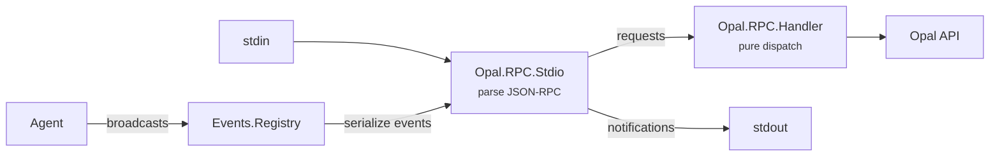

# JSON-RPC Protocol

The CLI communicates with the Elixir server over JSON-RPC 2.0 on stdio (stdin/stdout). This is the same transport pattern used by LSP and MCP.

## Wire Format

Newline-delimited JSON. Each message is one JSON object per line:

```
→ {"jsonrpc":"2.0","method":"session/start","params":{...},"id":1}
← {"jsonrpc":"2.0","result":{...},"id":1}
← {"jsonrpc":"2.0","method":"agent/event","params":{"type":"message_delta","delta":"Hello"}}
```

Requests have an `id` and get a response. Notifications (events) have no `id`.

## Methods

Client → Server requests:

| Method | Purpose |
|--------|---------|
| `session/start` | Start a new agent session |
| `agent/prompt` | Send a user message |
| `agent/steer` | Inject guidance mid-turn |
| `agent/abort` | Cancel the current turn |
| `agent/state` | Get agent state (model, usage, status) |
| `session/list` | List saved sessions |
| `session/branch` | Branch conversation at a message |
| `session/compact` | Manually trigger compaction |
| `models/list` | List available models |
| `model/set` | Switch the active model |
| `thinking/set` | Change reasoning effort level |
| `auth/status` | Probe all credential sources |
| `auth/login` | Start device-code OAuth flow |
| `auth/poll` | Poll for device-code authorization |
| `auth/set_key` | Save an API key for a provider |
| `tasks/list` | List tracked tasks for a session |
| `settings/get` | Get persistent user settings |
| `settings/save` | Save user settings (merged) |

Server → Client requests:

| Method | Purpose |
|--------|---------|
| `client/confirm` | Ask user to approve a tool action |
| `client/input` | Ask user for freeform text input |
| `client/ask_user` | Ask user a question with optional choices |

## Events

The server streams agent events as notifications on `agent/event`. The CLI subscribes automatically when starting a session.

| Event | When |
|-------|------|
| `agent_start` | Agent begins processing |
| `message_start` | New assistant message begins |
| `message_delta` | Streaming text token |
| `thinking_start` | Reasoning/thinking begins |
| `thinking_delta` | Streaming thinking token |
| `tool_execution_start` | Tool begins running |
| `tool_execution_end` | Tool finished |
| `turn_end` | LLM turn complete, tools follow |
| `usage_update` | Live token usage snapshot |
| `status_update` | Brief human-readable status of current work |
| `agent_end` | Agent done, returning to idle |
| `agent_abort` | Agent was cancelled |
| `error` | Something went wrong |
| `context_discovered` | Project context files found |
| `skill_loaded` | Agent skill activated |
| `sub_agent_event` | Forwarded event from child agent |

## Protocol Spec

All methods, events, and their schemas are defined declaratively in `Opal.RPC.Protocol`:

```elixir
@methods [
  %{method: "session/start", params: [...], result: [...]},
  ...
]

@event_types [
  %{type: "message_delta", fields: [%{name: "delta", type: :string}]},
  ...
]
```

This module is the single source of truth. The TypeScript SDK types are auto-generated from it via `scripts/codegen_ts.exs`.

## Architecture

`Opal.RPC.Stdio` is started by default as part of the core supervision tree. To
use the core library as an embedded SDK without the stdio transport, disable it:

```elixir
config :opal, start_rpc: false
```

The default is `true`, preserving backward compatibility. The CLI relies on the
default and does not need any extra configuration.



`Stdio` handles transport (reading/writing lines, framing). `Handler` is a pure function that maps method names to Opal API calls — it has no transport awareness. This separation makes it easy to add WebSocket or HTTP transports later.

## Source

- `core/lib/opal/rpc/protocol.ex` — Method/event definitions, codegen source of truth
- `core/lib/opal/rpc/stdio.ex` — Stdio transport, event serialization
- `core/lib/opal/rpc/handler.ex` — Method dispatch
- `scripts/codegen_ts.exs` — TypeScript type generation
