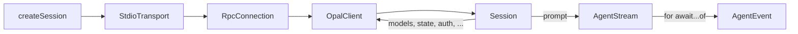

# Opal SDK (`sdk2`)

The Opal SDK is a TypeScript client library for the Opal agent runtime. It communicates over JSON-RPC 2.0 via stdio, providing fully typed operations, async-iterable event streams, and structured error handling. It lives at `cli/src/sdk/`.

## Quick Start

```ts
import { createSession } from "./sdk/index.js";

const session = await createSession({ workingDir: "." });

for await (const event of session.prompt("List all files")) {
  if (event.type === "messageDelta") process.stdout.write(event.delta);
}

session.close();
```

`createSession` handles the full bootstrap sequence — spawning the server, establishing the RPC connection, and running `session/start`. The returned `Session` is the only object most consumers ever need.

## Architecture



| Layer     | Module               | Concern                                                            |
| --------- | -------------------- | ------------------------------------------------------------------ |
| Transport | `transport/stdio.ts` | Spawn server process, read/write newline-delimited JSON            |
| RPC       | `rpc/connection.ts`  | JSON-RPC 2.0 framing, request/response correlation, timeouts       |
| Client    | `client.ts`          | Typed `request<M>()`, event routing, server→client method handling |
| Session   | `session.ts`         | Domain API: prompt, models, auth, config, history                  |
| Stream    | `stream.ts`          | Push→pull bridge: `AgentStream` is an `AsyncIterable<AgentEvent>`  |

## Session API

### Creating a Session

```ts
const session = await createSession({
  workingDir: "/path/to/project",
  sessionId: "resume-this-id", // optional: resume existing session
  model: "claude-sonnet-4-5", // string shorthand
  model: { id: "gpt-4", thinkingLevel: "high" }, // full spec
  systemPrompt: "You are a code reviewer",
  features: { skills: true, mcp: false },
  callbacks: {
    onAskUser: async ({ question, choices }) => "user response",
    onRpcMessage: (entry) => console.log(entry),
    onStderr: (line) => process.stderr.write(line),
  },
});
```

### Prompting

```ts
// Stream events one by one
for await (const event of session.prompt("Explain this code")) {
  // event is fully typed as AgentEvent
}

// Or collect the final response in one shot
const { text, usage, aborted } = await session
  .prompt("Summarize")
  .finalMessage();

// Steer the agent while it's running
const queued = await session.steer("Focus on the auth module instead");

// Cancel the current run
await session.abort();
```

`session.prompt()` returns an `AgentStream` — an `AsyncIterable<AgentEvent>` that also exposes `.finalMessage()` for one-shot consumption and `.toReadableStream()` for Web Streams interop.

### Models

```ts
const { models } = await session.models();
await session.setModel("claude-haiku-3-5");
await session.setModel({ id: "gpt-4", thinkingLevel: "high" });
await session.setThinking("medium");
```

### Auth

```ts
const { authenticated } = await session.auth_.status();
const { userCode, verificationUri, deviceCode, interval } =
  await session.auth_.login();
await session.auth_.poll(deviceCode, interval);
```

### History & State

```ts
const history = await session.history();
const state = await session.state();
await session.compact(10); // keep 10 most recent messages
await session.branch("entry-id"); // branch conversation
```

### Configuration

```ts
const settings = await session.config.getSettings();
await session.config.saveSettings({ theme: "dark" });
const runtime = await session.config.getRuntime();
await session.config.setRuntime({ features: { debug: true } });
```

### Lifecycle

```ts
await session.ping(); // liveness check
const { version } = await session.version();
session.close(); // clean shutdown

// Or use explicit resource management
using session = await createSession({ workingDir: "." });
// session.close() called automatically at end of scope
```

## Event Matching

The SDK provides type-safe pattern matching over the 19 event types.

### Exhaustive Match

```ts
import { matchEvent } from "./sdk/index.js";

// Compile error if any event type is missing
const label = matchEvent(event, {
  agentStart: () => "Starting...",
  agentEnd: (e) => `Done (${e.usage?.totalTokens} tokens)`,
  messageDelta: (e) => e.delta,
  toolExecutionStart: (e) => `⚙ ${e.tool}`,
  // ... all 19 types must be handled
});
```

### Partial Match

```ts
import { matchEventPartial } from "./sdk/index.js";

const text = matchEventPartial(event, {
  messageDelta: (e) => e.delta,
  thinkingDelta: (e) => `💭 ${e.delta}`,
  _: () => null, // default for everything else
});
```

### Type Predicate

```ts
import { isEventType } from "./sdk/index.js";

if (isEventType(event, "messageDelta")) {
  event.delta; // narrowed to MessageDeltaEvent
}
```

## Error Handling

All SDK errors extend `OpalError` with a `.code` discriminant for structured handling.

```ts
import { isOpalError, isErrorCode } from "./sdk/index.js";

try {
  for await (const event of session.prompt("hello")) {
    /* ... */
  }
} catch (e) {
  if (isOpalError(e)) {
    switch (e.code) {
      case "CONNECTION_LOST": // server exited — e.exitCode, e.signal, e.stderr
      case "TIMEOUT": // request timed out — e.method, e.timeoutMs
      case "SERVER_ERROR": // JSON-RPC error — e.rpcCode, e.data
      case "ABORTED": // agent run cancelled
      case "CLIENT_CLOSED": // used after close()
    }
  }
}
```

| Error Class         | Code              | When                                  |
| ------------------- | ----------------- | ------------------------------------- |
| `ConnectionError`   | `CONNECTION_LOST` | Server process exited or pipe broke   |
| `TimeoutError`      | `TIMEOUT`         | RPC request exceeded deadline         |
| `RpcError`          | `SERVER_ERROR`    | Server returned a JSON-RPC error      |
| `AbortError`        | `ABORTED`         | Agent run was cancelled via `abort()` |
| `ClientClosedError` | `CLIENT_CLOSED`   | Method called after `session.close()` |

## Advanced: Low-Level Client

For custom transports or non-standard setups, use `OpalClient` directly:

```ts
import { OpalClient, RpcConnection, StdioTransport } from "./sdk/index.js";

const transport = new StdioTransport({ serverPath: "/custom/opal-server" });
const rpc = new RpcConnection(transport);
const client = new OpalClient(rpc);

// Fully typed requests
const result = await client.request("session/start", { workingDir: "." });

// Event subscription
client.onEvent((event) => console.log(event.type));

// Server→client method handlers
client.addServerMethod("client/confirm", async (params) => {
  return { action: "allow" };
});
```

## How It Works

The SDK is structured as a layered pipeline where each layer adds one concern:

**Transport** handles raw bytes. `StdioTransport` spawns the `opal-server` process and communicates via newline-delimited JSON over stdin/stdout. It captures stderr for diagnostics. A `createMemoryTransport()` factory exists for testing.

**RpcConnection** adds JSON-RPC 2.0 framing. It assigns request IDs, correlates responses, manages timeouts, and routes incoming notifications and server→client method calls to registered handlers. An optional `RpcObserver` hook captures all traffic for debugging.

**OpalClient** adds type safety. Its `request<M>()` method infers params and result types from the protocol's `MethodTypes` map. It also routes `agent/event` notifications to registered event handlers, transforming wire-format `snake_case` event types to `camelCase`.

**Session** adds domain semantics. It's the public API — `prompt()`, `models()`, `auth_`, `config`. The factory `createSession()` wires all layers together and runs `session/start`.

**AgentStream** bridges the push/pull gap. Events arrive as notifications (push), but consumers iterate with `for await...of` (pull). The stream buffers events and resolves a pending promise when new events arrive. Terminal events (`agentEnd`, `agentAbort`, `error`) close the stream.

## Codegen

`cli/src/sdk/protocol.ts` is **auto-generated** — do not edit manually.

```bash
# Regenerate from Elixir protocol definitions
cd opal && mix opal.gen.json_schema  # → priv/rpc_schema.json
cd opal && mix run ../scripts/codegen_ts.exs  # → cli/src/sdk/protocol.ts

# Verify in CI
cd opal && mix run ../scripts/codegen_ts.exs --check
```

The pipeline: `protocol.ex` → `rpc_schema.json` → `codegen_ts.exs` → `protocol.ts`.

## Source

| File                             | Purpose                                   |
| -------------------------------- | ----------------------------------------- |
| `cli/src/sdk/session.ts`         | Session class and `createSession` factory |
| `cli/src/sdk/client.ts`          | Typed JSON-RPC client                     |
| `cli/src/sdk/stream.ts`          | `AgentStream` async iterable              |
| `cli/src/sdk/match.ts`           | Event matching utilities                  |
| `cli/src/sdk/errors.ts`          | Structured error hierarchy                |
| `cli/src/sdk/rpc/connection.ts`  | JSON-RPC 2.0 connection                   |
| `cli/src/sdk/transport/stdio.ts` | Stdio transport                           |
| `cli/src/sdk/index.ts`           | Public API barrel export                  |
| `cli/src/sdk/protocol.ts`        | Auto-generated types (do not edit)        |
| `opal/lib/opal/rpc/protocol.ex`  | Source of truth for all types             |

## References

- [JSON-RPC 2.0 Specification](https://www.jsonrpc.org/specification) — The wire protocol
