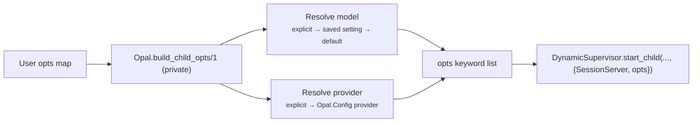
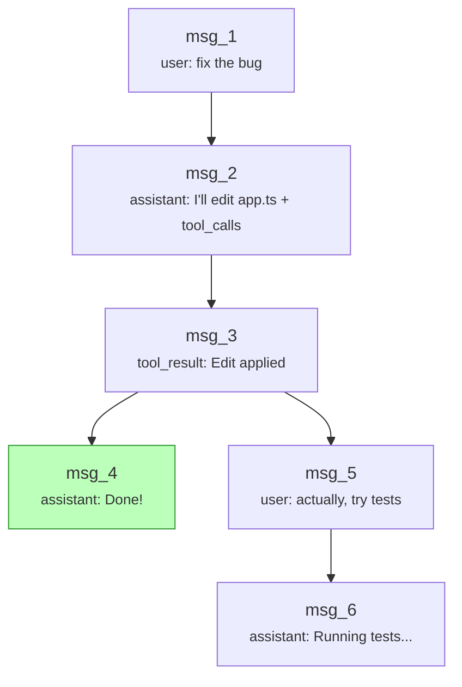

# Session

The session is a conversation tree stored in an ETS table, managed by an `Opal.Session` GenServer. It supports branching (rewinding to any past message and forking), persistence to disk, and compaction.

## Session Startup

`Opal.start_session/1` builds child options internally (`build_child_opts/1` in `Opal`) and starts `Opal.SessionServer` under `Opal.SessionSupervisor`. Model/provider selection uses a priority cascade:



**Model resolution** follows a three-level cascade:

1. Explicit `:model` key in the opts map
2. Saved `"default_model"` preference via `Opal.Settings`
3. `Opal.Config` default model

**Provider resolution** follows a similar cascade:

1. Explicit `:provider` module in the opts map
2. `Opal.Config` provider value (from app/session config)
3. Struct default in `Opal.Config` (`Opal.Provider.Copilot`)

## Data Model

Each message is an `Opal.Message` struct with a unique `id` and a `parent_id` that links it to the previous message. This forms a tree, not a flat list.

### Roles

| Role           | Constructor                  | Purpose                                                          |
| -------------- | ---------------------------- | ---------------------------------------------------------------- |
| `:system`      | `Opal.Message.system/1`      | System-level instructions (system prompt, summarizer directives) |
| `:user`        | `Opal.Message.user/1`        | User-originated text                                             |
| `:assistant`   | `Opal.Message.assistant/2`   | Model response with optional tool calls                          |
| `:tool_call`   | `Opal.Message.tool_call/3`   | Tool invocation (call_id, name, arguments)                       |
| `:tool_result` | `Opal.Message.tool_result/3` | Tool execution output, keyed by call_id                          |

### Tree Structure



The `current_id` pointer tracks the active leaf. `get_path/1` walks parent links from the current leaf back to the root and returns the messages in order — this is the flat list the agent sends to the LLM.

## Storage

Messages live in a `:set` ETS table (one per session). ETS gives O(1) lookups by message ID and in-process access without serialization.

**State fields:**

- `table` — ETS table reference
- `current_id` — pointer to the active leaf message
- `metadata` — session-level data (title, created_at, etc.)

## Branching

`Opal.Session.branch(session, message_id)` rewinds the `current_id` pointer to `message_id`. The next `append/2` call creates a new child of that message — a fork in the tree. Old branches remain intact and can be navigated back to.

Branching itself only moves the pointer; summaries are introduced by compaction (`Opal.Session.Compaction`), not by `branch/2`.

## Persistence

Sessions persist to DETS (`.dets`) files:

```
{:__session_meta__, %{session_id: "abc", current_id: "msg_2", metadata: %{title: "Fix auth bug"}}}
{"msg_1", %Opal.Message{parent_id: nil, role: :user, content: "fix the bug"}}
{"msg_2", %Opal.Message{parent_id: "msg_1", role: :assistant, content: "...", tool_calls: [...]}}
...
```

The reserved `:__session_meta__` record stores session metadata and `current_id`; each message is keyed by message ID. Loading reconstructs ETS and restores `current_id` from metadata.

## Segment Replacement

`replace_path_segment/3` swaps a range of messages with a replacement (used by compaction). It:

1. Removes the target messages from ETS
2. Inserts the replacement message
3. Re-parents orphaned children to the replacement

This is how compaction summarizes old messages without breaking the tree structure.

## Source

- `lib/opal/session/session.ex` — `Opal.Session` GenServer, ETS operations, DETS persistence
- `lib/opal/session/server.ex` — `Opal.SessionServer` supervision and session process wiring
- `lib/opal.ex` — `Opal.start_session/1` option resolution (`build_child_opts/1`)
- `lib/opal/session/compaction.ex` — Compaction algorithm (see [compaction.md](compaction.md))
