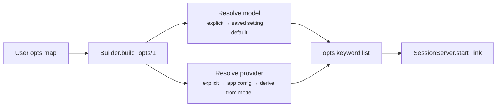
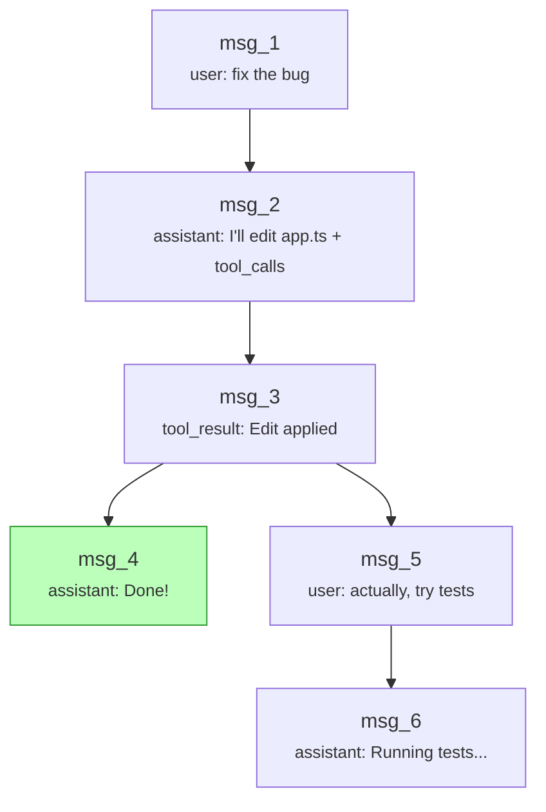

# Session

The session is a conversation tree stored in an ETS table, managed by an `Opal.Session` GenServer. It supports branching (rewinding to any past message and forking), persistence to disk, and compaction.

## Session Startup

`Opal.Session.Builder` resolves all configuration needed to start a new session. `Opal.start_session/1` delegates to `Builder.build_opts/1`, which applies a priority cascade and returns a keyword list ready for `SessionServer.start_link`:



**Model resolution** follows a three-level cascade:

1. Explicit `:model` key in the opts map
2. Saved `"default_model"` preference via `Opal.Settings`
3. `Opal.Config` default model

**Provider resolution** follows a similar cascade:

1. Explicit `:provider` module in the opts map
2. App-level `Opal.Config` provider (if not the default Copilot)
3. Auto-derived from the resolved model via `Opal.Model.provider_module/1`

## Data Model

Each message is an `Opal.Message` struct with a unique `id` and a `parent_id` that links it to the previous message. This forms a tree, not a flat list.

### Roles

| Role           | Constructor                  | Purpose                                                          |
| -------------- | ---------------------------- | ---------------------------------------------------------------- |
| `:system`      | `Opal.Message.system/1`      | System-level instructions (system prompt, summarizer directives) |
| `:user`        | `Opal.Message.user/1`        | User-originated text                                             |
| `:assistant`   | `Opal.Message.assistant/2`   | Model response with optional tool calls                          |
| `:tool_call`   | `Opal.Message.tool_call/3`   | Tool invocation (call_id, name, arguments)                       |
| `:tool_result` | `Opal.Message.tool_result/3` | Tool execution output, keyed by call_id                          |

### Tree Structure



The `current_id` pointer tracks the active leaf. `get_path/1` walks parent links from the current leaf back to the root and returns the messages in order — this is the flat list the agent sends to the LLM.

## Storage

Messages live in a `:set` ETS table (one per session). ETS gives O(1) lookups by message ID and in-process access without serialization.

**State fields:**

- `table` — ETS table reference
- `current_id` — pointer to the active leaf message
- `metadata` — session-level data (title, created_at, etc.)

## Branching

`Session.branch(session, message_id)` rewinds the `current_id` pointer to `message_id`. The next `append/2` call creates a new child of that message — a fork in the tree. Old branches remain intact and can be navigated back to.

**Branch summaries:** When branching, an optional LLM-generated summary of the abandoned path can be stored as metadata. This is used by the system prompt to give the model context about what was tried before.

## Persistence

Sessions serialize to JSONL (JSON Lines) files:

```
{"metadata": {"title": "Fix auth bug", "created_at": "..."}}
{"id": "msg_1", "parent_id": null, "role": "user", "content": "fix the bug"}
{"id": "msg_2", "parent_id": "msg_1", "role": "assistant", "content": "...", "tool_calls": [...]}
...
```

Line 1 is metadata. Each subsequent line is one message. Loading reconstructs the ETS table and sets `current_id` to the last message in the longest path.

## Segment Replacement

`replace_path_segment/3` swaps a range of messages with a replacement (used by compaction). It:

1. Removes the target messages from ETS
2. Inserts the replacement message(s)
3. Re-parents orphaned children to the replacement

This is how compaction summarizes old messages without breaking the tree structure.

## Source

- `lib/opal/session.ex` — GenServer, ETS operations, persistence
- `lib/opal/session/builder.ex` — Session startup config resolution
- `lib/opal/session/compaction.ex` — Compaction algorithm (see [compaction.md](compaction.md))
- `lib/opal/session/branch_summary.ex` — LLM-generated branch summaries
