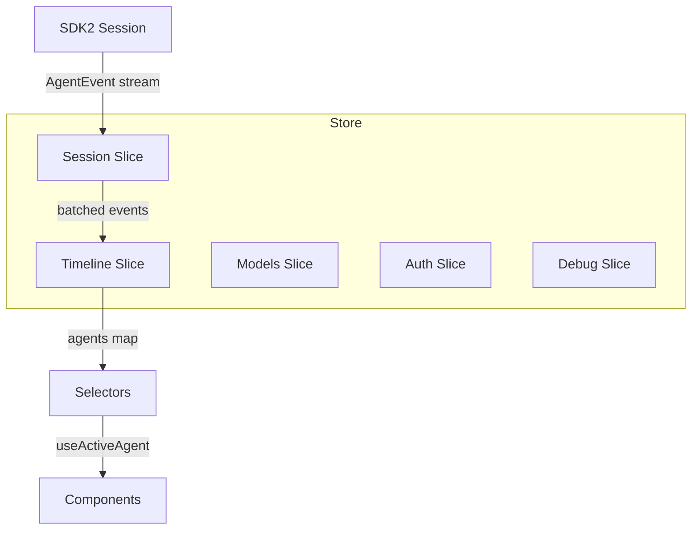

# State Management (`state/`)

The TUI's state layer is a single Zustand store composed of five independent slices. It lives at `cli/src/state/` and provides reactive state for React/Ink components via selector-based subscriptions.

The key design principle is **normalized agent views** — every agent (root and sub-agents) is stored in the same `AgentView` shape inside a single map. A focus stack controls which agent the UI is viewing. Components read from the focused agent via `useActiveAgent()` and never need to know whether they're rendering the root agent or a sub-agent.

## Quick Start

```tsx
import { useOpalStore } from "../state/index.js";
import { useActiveAgent } from "../state/selectors.js";

function Conversation() {
  // Reads from whichever agent is focused — root or sub-agent
  const { entries, isRunning, thinking } = useActiveAgent();

  return entries.map((entry) =>
    entry.kind === "message" ? <Text>{entry.message.content}</Text> : null,
  );
}

function StatusBar() {
  const model = useOpalStore((s) => s.currentModel);
  const usage = useOpalStore((s) => s.tokenUsage);
  return <Text>{model?.displayName} — {usage?.totalTokens} tokens</Text>;
}
```

## Architecture



| Slice | File | Concern |
|-------|------|---------|
| Session | `session.ts` | Connection lifecycle, event wiring, ping |
| Timeline | `timeline.ts` | Agent events → normalized agent views |
| Models | `models.ts` | Model listing and selection |
| Auth | `auth.ts` | Copilot device-code authentication |
| Debug | `debug.ts` | RPC message log, stderr capture |

## The Agents Map

The timeline slice stores all agent state in a normalized map:

```ts
interface TimelineSlice {
  agents: Record<string, AgentView>;   // root + sub-agents
  focusStack: string[];                // navigation breadcrumb
  tokenUsage: TokenUsage | null;       // shared across agents
  queuedMessages: string[];            // pending steering messages
  timelineError: string | null;        // last error

  applyEvents(events: AgentEvent[]): void;
  focusAgent(id: string): void;        // push onto focus stack
  focusBack(): void;                   // pop focus stack
  resetTimeline(): void;
}
```

The root agent always lives at `agents["root"]`. Sub-agents are added when a `subAgentEvent` with `inner.type === "sub_agent_start"` arrives, and removed when `inner.type === "agent_end"` fires. Every agent has the same shape:

```ts
interface AgentView {
  id: string;                        // "root" or sub-session ID
  parentCallId: string | null;       // null for root
  label: string;                     // "Opal" for root, task label for subs
  model: string;
  tools: string[];
  entries: TimelineEntry[];          // the conversation timeline
  thinking: string | null;           // current thinking text
  statusMessage: string | null;      // status bar message
  isRunning: boolean;
  startedAt: number;
  toolCount: number;
}
```

### Focus Navigation

The `focusStack` is a breadcrumb trail. Components call `focusAgent(id)` to drill into a sub-agent and `focusBack()` to return. The focused agent is always the last element:

```ts
// Navigate into a sub-agent
store.getState().focusAgent("sub-abc");
// focusStack: ["root", "sub-abc"]

// Go back
store.getState().focusBack();
// focusStack: ["root"]
```

When a focused sub-agent finishes (`agent_end`), the focus automatically pops back to the parent. The root agent can never be popped.

### Reading from the Focused Agent

Use `useActiveAgent()` — it's a selector that reads from whichever agent is currently focused:

```tsx
import { useActiveAgent } from "../state/selectors.js";

function MessageList() {
  const { entries, isRunning } = useActiveAgent();
  // Works identically for root or any sub-agent
}
```

For fine-grained subscriptions, use raw selectors:

```ts
// Only re-render when entries change
const entries = useOpalStore(
  (s) => s.agents[s.focusStack[s.focusStack.length - 1]!]?.entries ?? [],
);
```

### Listing All Agents

To build a tab bar or sidebar showing all running agents:

```tsx
function AgentTabs() {
  const agents = useOpalStore((s) => s.agents);
  const focusAgent = useOpalStore((s) => s.focusAgent);
  const focusStack = useOpalStore((s) => s.focusStack);
  const focusedId = focusStack[focusStack.length - 1];

  return Object.values(agents).map((agent) => (
    <Tab
      key={agent.id}
      label={agent.label}
      active={agent.id === focusedId}
      running={agent.isRunning}
      onPress={() => focusAgent(agent.id)}
    />
  ));
}
```

## Session Slice

Manages the SDK connection lifecycle:

```ts
interface SessionSlice {
  session: Session | null;
  sessionStatus: "connecting" | "ready" | "error";
  sessionError: string | null;
  sessionId: string;
  sessionDir: string;
  workingDir: string;
  contextFiles: string[];
  availableSkills: string[];

  connect(opts: SessionOptions): void;
  disconnect(): void;
}
```

`connect()` creates the SDK session, wires events into the timeline slice (via batched `applyEvents`), starts liveness pings, and triggers auth checking and model fetching. Events are coalesced in a 32ms window to avoid excessive re-renders during streaming.

## Auth Slice

A simple state machine for Copilot device-code authentication:

```
checking → needsAuth → deviceCode → polling → authenticated
                                            → error
```

```tsx
const authStatus = useOpalStore((s) => s.authStatus);
const deviceCode = useOpalStore((s) => s.deviceCode);
const startFlow = useOpalStore((s) => s.startDeviceFlow);
```

## Models Slice

```ts
const models = useOpalStore((s) => s.availableModels);
const current = useOpalStore((s) => s.currentModel);
const selectModel = useOpalStore((s) => s.selectModel);

await selectModel(session, "claude-haiku-3-5", "high");
```

## Debug Slice

Capped ring buffers for RPC traffic and stderr output:

```ts
const rpcLog = useOpalStore((s) => s.rpcEntries);     // last 200 messages
const stderr = useOpalStore((s) => s.stderrLines);     // last 50 lines
const toggle = useOpalStore((s) => s.toggleDebug);
```

## Timeline Entry Types

The `entries` array in each `AgentView` is a discriminated union:

```ts
type TimelineEntry =
  | { kind: "message"; message: { role: "user" | "assistant"; content: string } }
  | { kind: "tool";    tool: ToolCall }
  | { kind: "thinking"; text: string }
  | { kind: "skill";   skill: { name: string; description: string } }
  | { kind: "context"; context: { files: string[] } };
```

Use `entry.kind` to discriminate:

```tsx
entries.map((entry) => {
  switch (entry.kind) {
    case "message":  return <Message {...entry.message} />;
    case "tool":     return <ToolCard {...entry.tool} />;
    case "thinking": return <ThinkingBubble text={entry.text} />;
    case "skill":    return <SkillBadge {...entry.skill} />;
    case "context":  return <ContextFiles files={entry.context.files} />;
  }
});
```

## How It Works

**Event flow.** The session slice receives raw `AgentEvent` objects from the SDK's event subscription. It batches them in a 32ms window (coalescing streaming deltas) then calls `applyEvents()` on the timeline slice. Terminal events (`agentEnd`, `agentAbort`, `error`) flush immediately.

**Event normalization.** Inside `applyEvent()`, most event types route to the root agent via `reduceView()` — a pure function that updates entries, thinking, and status. `subAgentEvent` is the exception: the reducer unwraps the envelope, extracts the `subSessionId`, and routes the inner event to the correct agent in the map. This normalization happens once, at the boundary — downstream logic never deals with envelopes.

**The reducer is pure.** `applyEvent(state, event) → state` is a pure function with no side effects. It's exported for unit testing outside of Zustand. The Zustand slice simply loops over the event batch and applies each one.

**Sub-agent lifecycle.** When `subAgentEvent` arrives with `inner.type === "sub_agent_start"`, a new `AgentView` is created in the map with the sub-agent's metadata (label, model, tools). Subsequent inner events update that agent's view. When `inner.type === "agent_end"` arrives, the agent is removed from the map and focus auto-pops if it was the focused agent. A top-level `agentEnd` or `agentAbort` clears all sub-agents and resets focus to root.

## Testing

The pure reducer is tested independently:

```ts
import { applyEvent } from "../state/timeline.js";

const state = applyEvent(initial, { type: "agentStart" });
expect(state.agents["root"].isRunning).toBe(true);
```

The Zustand slice is tested with `zustand/vanilla`:

```ts
import { createStore } from "zustand/vanilla";
import { createTimelineSlice } from "../state/timeline.js";

const store = createStore(createTimelineSlice);
store.getState().applyEvents([ev.agentStart(), ev.messageDelta("Hi")]);
```

## Source

| File | Purpose |
|------|---------|
| `cli/src/state/store.ts` | Store creation, slice composition |
| `cli/src/state/timeline.ts` | Agents map, focus stack, event reducer |
| `cli/src/state/selectors.ts` | `useActiveAgent()` and `selectFocusedAgent()` |
| `cli/src/state/session.ts` | Connection lifecycle, event batching |
| `cli/src/state/auth.ts` | Copilot auth state machine |
| `cli/src/state/models.ts` | Model listing and selection |
| `cli/src/state/debug.ts` | RPC log, stderr ring buffers |
| `cli/src/state/types.ts` | Shared types: `AgentView`, `TimelineEntry`, etc. |
| `cli/src/state/index.ts` | Public API barrel export |
