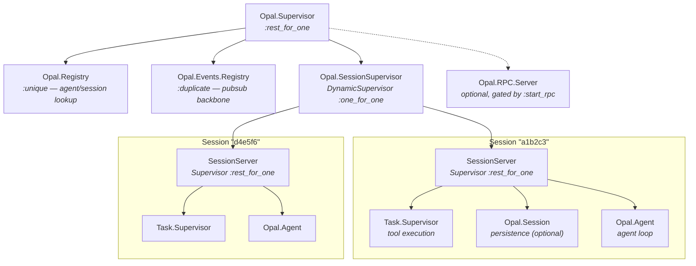
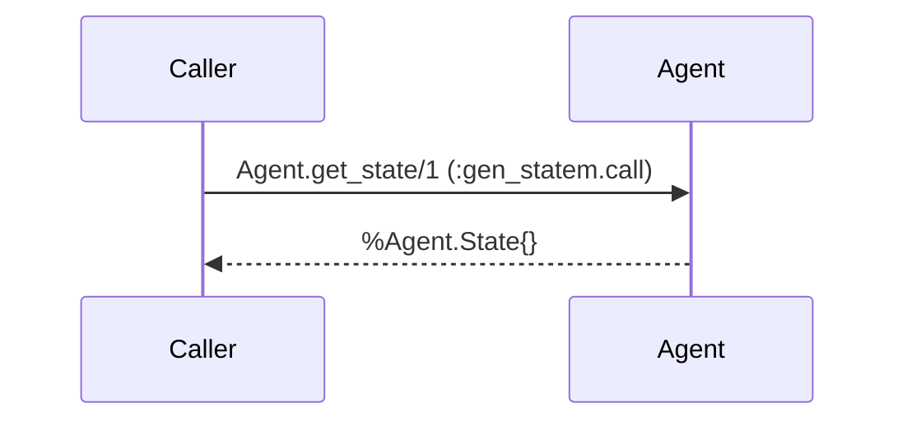
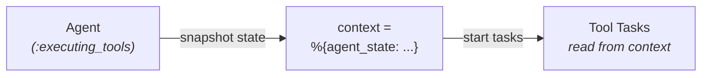
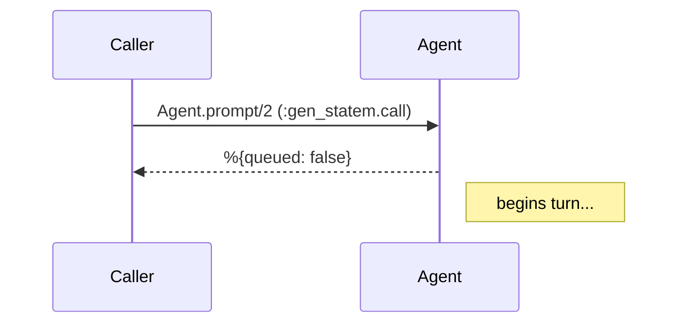
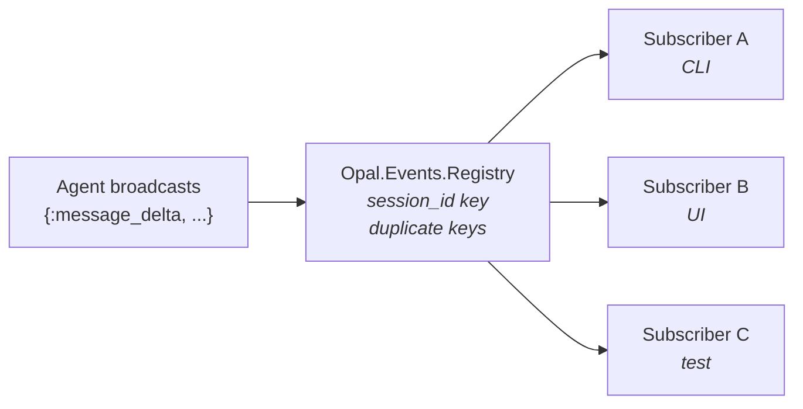
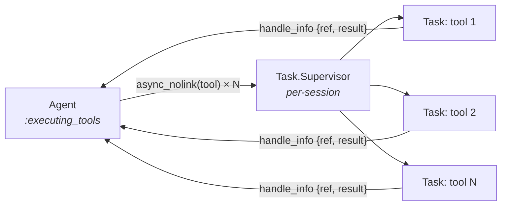
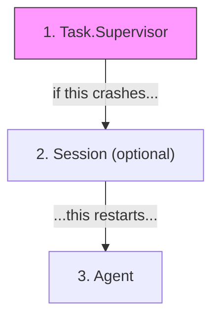

# Supervision & Message Passing

This document describes Opal's OTP supervision architecture, process lifecycle,
message passing patterns, and the design rationale behind each decision.

---

## Supervision Tree

Opal uses a **per-session supervision tree** so that every active session is a
fully isolated unit — its own processes, its own failure domain, its own cleanup.



---

## Process Roles

### `Opal.Registry`

A `Registry` with `:unique` keys used for looking up agent and session
processes by session ID. Processes register with keys like `{:agent, session_id}`
and `{:session, session_id}`, enabling direct lookup without walking supervisor
children.

### `Opal.Events.Registry`

A `Registry` with `:duplicate` keys. Any process can subscribe to a session ID
and receive events. This is the **pubsub backbone** — everything else
is per-session. The registry never holds state; it simply routes messages.

### `Opal.RPC.Server` (optional)

The stdio JSON-RPC transport. Started by default but can be disabled by setting
`config :opal, start_rpc: false` — useful when embedding the core library as an
SDK without stdio transport. See [rpc.md](rpc.md) for details.

### `Opal.SessionSupervisor`

A `DynamicSupervisor` that acts as the container for all active sessions. When
`Opal.start_session/1` is called, a new `SessionServer` child is started here.
When `Opal.stop_session/1` is called, the entire `SessionServer` subtree is
terminated — one call cleans up the agent, all running tools,
and the session store.

### `Opal.SessionServer`

A per-session `Supervisor` using the `:rest_for_one` strategy. Children are
started in order:

1. **`Task.Supervisor`** — executes tool calls as supervised tasks
2. **`Opal.Session`** — conversation persistence *(optional, started when `session: true`)*
3. **`Opal.Agent`** — the agent loop

The `:rest_for_one` strategy means if the `Task.Supervisor` crashes, the Agent (which depends on it) is restarted
too. But a crash in the Agent does not affect the supervisor above it.

Each child is registered via `Opal.Registry` for discoverability:

| Process              | Registry key                 |
|----------------------|------------------------------|
| Task.Supervisor      | `{:tool_sup, session_id}`    |
| Session              | `{:session, session_id}`     |

### `Opal.Agent`

A `:gen_statem` process that implements the core agent loop:

1. Receive a user prompt (`:call`)
2. Stream an LLM response via the configured `Provider`
3. If the LLM returns tool calls → execute them via supervised tasks → loop to step 2
4. If the LLM returns text only → broadcast `agent_end` → go idle

The Agent holds a reference to its session-local `tool_supervisor` in its state — it never touches global process names.

### `Opal.Session`

A `GenServer` backed by an ETS table that stores conversation messages in a
tree structure (each message has a `parent_id`). Supports branching — rewinding
to any past message and forking the conversation. Persistence is via DETS.

---

## Message Passing

Opal uses three distinct message passing patterns, each chosen for a specific
purpose.

### 1. Synchronous Calls — State Access



Used for: `Agent.get_state/1`, `Session.append/2`, `Session.get_path/1`

These are synchronous server calls — the caller blocks until the
server replies. Used when the caller needs a consistent snapshot of state.

**Key design decision:** Tool tasks never call `Agent.get_state(agent_pid)`
during execution. Instead, the Agent snapshots its state into the tool
execution context *before* dispatching tasks:



### 2. Command Calls & Casts



Used for: `Agent.prompt/2` (call), `Agent.abort/1` (cast)

Prompts are synchronous calls that return `%{queued: boolean}`. The caller
observes progress through events (pattern 3). This keeps the UI responsive —
critical for interactive CLI and web UIs.

### 3. Registry PubSub — Event Broadcasting



Used for: all agent lifecycle events

The Agent (and tool tasks) call `Opal.Events.broadcast(session_id, event)`.
Every process that called `Opal.Events.subscribe(session_id)` receives the
event as a regular Erlang message:

```elixir
{:opal_event, session_id, event}
```

**Event types:**

| Event                                | Emitted when                         |
|--------------------------------------|--------------------------------------|
| `{:agent_start}`                     | Agent begins processing a prompt     |
| `{:message_delta, %{delta: text}}`   | Streaming text token from the LLM    |
| `{:thinking_delta, %{delta: text}}`  | Streaming thinking/reasoning token   |
| `{:turn_end, message, _results}`     | LLM turn complete                    |
| `{:tool_execution_start, name, call_id, args, meta}` | Tool begins executing |
| `{:tool_execution_end, name, call_id, result}` | Tool finished executing |
| `{:agent_end, messages, usage}`      | Agent is done, returning to idle     |
| `{:error, reason}`                   | Unrecoverable error occurred         |

This is built on OTP's `Registry` — no external dependencies, no message
broker, no serialization overhead. Events are plain Erlang terms sent via
`send/2` under the hood.

---

## Tool Execution

Tool calls are executed in parallel using `Task.Supervisor.async_nolink` — all tools
in a batch are spawned concurrently, with results delivered via mailbox `:info` events,
keeping the agent process non-blocking:



**Why `async_nolink` + `handle_info`?**

- **`async_stream_nolink`** — blocks the server loop until all tools finish.
  Prevents abort/steer during execution.
- **`async_nolink`** — tasks are *not* linked, and results arrive as messages.
  The Agent stays responsive to abort, steer, and other messages throughout.

**Why per-session `Task.Supervisor`?**

- **Isolation:** If session A's tool tasks are misbehaving, session B is
  unaffected.
- **Cleanup:** Terminating the `SessionServer` automatically kills all running
  tool tasks for that session.
- **Observability:** You can inspect `Task.Supervisor.children(sup)` to see
  what tools are currently running in a specific session.

### Crash Recovery

When a tool task crashes, the Agent receives a `{:DOWN, ref, :process, _pid, reason}`
message via `handle_info`. It converts this to an error tool result and continues:

```elixir
def handle_info(
      {:DOWN, ref, :process, _pid, reason},
      %State{status: :executing_tools, pending_tool_tasks: tasks} = state
    ) when is_map_key(tasks, ref) do
  {_task, tc} = Map.fetch!(tasks, ref)
  Opal.Agent.ToolRunner.collect_result(ref, tc, {:error, "Tool crashed: #{inspect(reason)}"}, state)
  |> next()
end
```

This ensures the LLM always receives a `tool_result` message with the correct
`call_id` — even if the tool crashed. Without this, the LLM API rejects the
request with "tool call must have a tool call ID".

---

## Failure Domains & Isolation

### Session Isolation

Each session is a self-contained subtree. Failures in one session cannot
propagate to another:

| Failure                            | Impact                              |
|------------------------------------|-------------------------------------|
| Tool task crashes                  | Error result to LLM, agent continues|
| Agent state machine crashes        | SessionServer restarts it (`:rest_for_one`) |
| Task.Supervisor crashes            | Agent restarts too (`:rest_for_one`)  |
| Entire SessionServer crashes       | Only that session is lost             |
| `Events.Registry` crashes          | All sessions lose pubsub temporarily  |

### `:rest_for_one` Strategy

The SessionServer uses `:rest_for_one` — if a child crashes, all children
started *after* it are restarted. The child order is:



This guarantees the Agent never runs without a working `Task.Supervisor`. But
if the Agent crashes, the supervisor and session store remain intact.

### State Snapshot for Tools

Although the Agent is no longer blocked during tool execution (tools use
`async_nolink` + `handle_info`), tools still receive a state **snapshot**
in their execution context rather than calling back to the agent process. This
avoids race conditions and keeps tool execution self-contained:

```elixir
context = %{
  working_dir: state.working_dir,
  session_id: state.session_id,
  config: state.config,
  agent_pid: self(),          # for reference only, never call into it
  agent_state: state          # snapshot — tools read from this
}
```

Tools use `context.agent_state` instead of calling back
to the Agent.

---

## Design Rationale

### Why per-session supervision trees?

**Before:** A single global `Task.Supervisor` handled all tool execution across
all sessions. This had several problems:

- No isolation between sessions
- No way to cleanly shut down one session's tasks without affecting others
- No way to inspect what a specific session is doing
- Cleanup required manual tracking

**After:** Each session owns its entire process tree. `stop_session/1` is a
single `DynamicSupervisor.terminate_child/2` call that cleanly shuts down
everything.

### Why Registry-based pubsub?

- **No external dependencies** — built into OTP
- **No serialization** — events are plain Erlang terms, delivered via `send/2`
- **Duplicate keys** — multiple subscribers per session ID
- **Process-native** — subscribers just use `receive`, no callback modules
- **Automatic cleanup** — when a subscriber process dies, its registrations
  are removed

### Why `async_nolink` + `handle_info` for tools?

- **Non-blocking execution** — the Agent stays responsive during tool runs
- **Fault isolation** — one crashing tool doesn't take down the agent
- **Parallel batches** — tool calls in a turn are spawned concurrently
- **Abort support** — in-flight tasks can be cancelled without blocking the loop
