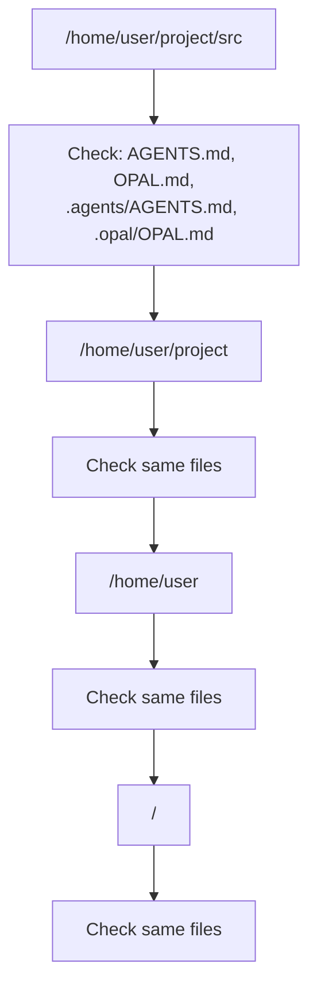
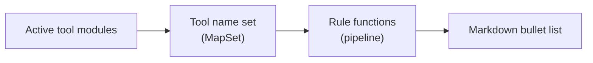
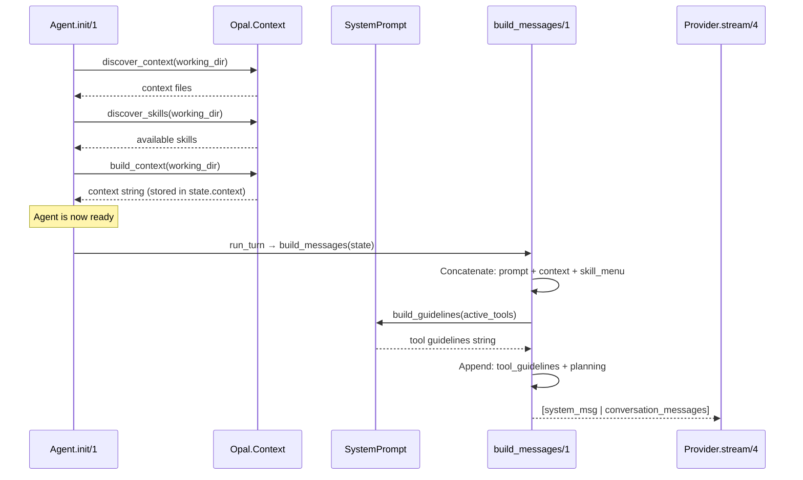

# System Prompt Generation

This document explains how Opal assembles the system prompt that is sent to the LLM on every turn. The system prompt is not a static string — it is dynamically composed from multiple sources, each contributing a layer of context, instructions, or guardrails.

---

## Overview

The system prompt is assembled in `Opal.Agent.build_messages/1` just before each LLM call. It concatenates five components into a single system message that is prepended to the conversation history:

```
┌─────────────────────────────────────────┐
│  1. Base system prompt (user-provided)  │
│  2. Project context (AGENTS.md, etc.)   │
│  3. Skill menu (progressive disclosure) │
│  4. Tool usage guidelines (dynamic)     │
│  5. Planning instructions               │
└─────────────────────────────────────────┘
```

```elixir
full_prompt =
  [prompt, context, skill_menu, tool_guidelines, planning]
  |> Enum.reject(&(&1 == ""))
  |> Enum.join("\n")
```

Each component is independently optional — if it produces an empty string, it is excluded from the final prompt.

---

## Component 1: Base System Prompt

The static system prompt string passed when starting the agent:

```elixir
Opal.Agent.start_link(
  system_prompt: "You are a coding assistant.",
  ...
)
```

This is the foundation. It defines the agent's persona and high-level behavior. If not provided, it defaults to `""`.

**Source:** `state.system_prompt` (set at init from the `:system_prompt` option).

---

## Component 2: Project Context

Discovered automatically by `Opal.Context` by walking up the directory tree from the agent's `working_dir` to the filesystem root.

### Discovery Algorithm



At each directory level, Opal checks for these files (configurable via `Opal.Config.Features`):

| File | Location variants |
|------|-------------------|
| `AGENTS.md` | `dir/AGENTS.md`, `dir/.agents/AGENTS.md`, `dir/.opal/AGENTS.md` |
| `OPAL.md` | `dir/OPAL.md`, `dir/.agents/OPAL.md`, `dir/.opal/OPAL.md` |

**Ordering:** Files found closer to the filesystem root appear first; files closer to `working_dir` appear last (higher priority). This means project-specific instructions override organization-wide ones.

Each discovered file is wrapped with a source comment:

```markdown
## Project Context

<!-- From: /home/user/project/AGENTS.md -->
<contents of AGENTS.md>

<!-- From: /home/user/AGENTS.md -->
<contents of AGENTS.md>
```

**Source:** `Opal.Context.discover_context/2` → `Opal.Context.build_context/2`, stored in `state.context`.

**Config:** `config.features.context.enabled` (default: `true`), `config.features.context.filenames` (default: `["AGENTS.md", "OPAL.md"]`).

---

## Component 3: Skill Menu

When skills are discovered (see [Skills](#skills-discovery) below), a summary menu is injected so the LLM knows what skills are available without loading their full instructions.

```markdown
## Available Skills

Use the `use_skill` tool to load a skill's full instructions when relevant.

- **my-skill**: Does something useful for the project.
- **testing**: Runs and fixes tests following project conventions.
```

This follows the **progressive disclosure** pattern: only the name and one-line description are included. The full instructions for a skill are loaded into the conversation only when the agent (or auto-loading) activates it.

### Skills Discovery

`Opal.Context.discover_skills/2` scans these directories for subdirectories containing `SKILL.md`:

| Directory | Scope |
|-----------|-------|
| `<working_dir>/.agents/skills/*/SKILL.md` | Project-local |
| `<working_dir>/.github/skills/*/SKILL.md` | Project-local (GitHub convention) |
| `~/.agents/skills/*/SKILL.md` | User-global |
| `~/.opal/skills/*/SKILL.md` | User-global |
| Additional dirs from config | Custom |

Each `SKILL.md` must have YAML frontmatter with at least `name` and `description`. Skills that fail to parse or validate are silently skipped.

**Auto-loading:** When a file-modifying tool (`write_file`, `edit_file`) touches a path matching a skill's `globs` patterns, the skill is automatically loaded into the conversation context.

**Source:** `Opal.Context.discover_skills/2`, stored in `state.available_skills`.

**Config:** `config.features.skills.enabled` (default: `true`), `config.features.skills.extra_dirs`.

---

## Component 4: Tool Usage Guidelines

`Opal.Agent.SystemPrompt` dynamically generates guardrail instructions based on which tools are active in the current session. This prevents common LLM mistakes like using `cat` via shell when `read_file` is available.

### How It Works



1. The active tool modules are collected and their names extracted into a `MapSet`
2. A pipeline of rule functions is evaluated against the name set
3. Each rule returns `nil` (not applicable), a string, or a list of strings
4. All non-nil results are collected into a `## Tool Usage Guidelines` section

### Rule Pipeline

| Rule Function | Triggers When | Guideline Produced |
|---------------|---------------|--------------------|
| `read_vs_shell` | `read_file` + any shell tool | "Use `read_file` to read files. Do NOT use `cat`, `head`, `tail`, or `less` via shell." + offset/limit hint |
| `edit_vs_shell` | `edit_file` + any shell tool | "Use `edit_file` for all file modifications. Do NOT use `sed`, `awk`, `perl -i`, or shell redirects." |
| `write_guidelines` | `write_file` present | "Use `write_file` to create new files. Do NOT use shell redirects or `tee`." |
| `shell_display_warning` | Any shell tool present | "When summarizing, output plain text directly. Do NOT use `cat` or `echo` to display files." |
| `search_guidelines` | Shell present but `read_file` absent | "Use shell commands like `cat`, `grep`, `find`, and `ls` for file exploration." |
| `status_tags` | Any known tool present | Emit `<status>...</status>` tags during multi-step tasks. |

**Shell detection** recognizes any of: `shell`, `bash`, `zsh`, `cmd`, `powershell`.

### Composability

Adding a new rule requires only:

1. Define a new `defp my_rule(names)` function that returns `nil`, a string, or a list of strings
2. Add `&my_rule/1` to the pipeline list in `collect_rules/1`

No other code needs to change.

### Example Output

Given tools `[Opal.Tool.Read, Opal.Tool.Edit, Opal.Tool.Write, Opal.Tool.Shell]`:

```markdown
## Tool Usage Guidelines

- Use the `read_file` tool to read files. Do NOT use `cat`, `head`, `tail`, or `less` via shell.
- Use `read_file` with `offset` and `limit` to read specific line ranges.
- Use the `edit_file` tool for all file modifications. Do NOT use `sed`, `awk`, `perl -i`, or shell redirects (`>`, `>>`).
- Use the `write_file` tool to create new files. Do NOT use shell redirects or `tee`.
- When summarizing your actions, output plain text directly in your response. Do NOT use `cat`, `echo`, or shell to display files you just wrote.
- Before starting each major step in a multi-step task, emit a short status tag: `<status>Analyzing test failures</status>`. Keep it under 6 words.
```

**Source:** `Opal.Agent.SystemPrompt.build_guidelines/1`.

---

## Component 5: Planning Instructions

When a `Session` process is attached (i.e., this is a top-level agent, not a sub-agent), planning instructions are appended telling the agent where to write plan documents:

```markdown
## Planning

For complex multi-step tasks, create a plan document at:
  /home/user/.opal/sessions/<session_id>/plan.md

Write your plan before starting implementation. Update it as you
complete steps. The user can review the plan at any time with Ctrl+Y.
```

Sub-agents (where `state.session` is `nil`) do not receive planning instructions, since they handle delegated subtasks rather than top-level planning.

**Source:** `Opal.Agent.planning_instructions/1`.

---

## Assembly Flow

Here is the complete flow from agent init to the first LLM call:



### Key Design Decisions

1. **Context is discovered once at init, not per-turn.** The `state.context` string is computed during `Agent.init/1` and reused for every turn. This avoids filesystem I/O on every LLM call.

2. **Tool guidelines are computed per-turn.** Since the active tool set can change (e.g., MCP tools coming online, config-gated tools), `build_guidelines/1` runs on every call to `build_messages/1`.

3. **Skills use progressive disclosure.** Only names and descriptions go into the system prompt. Full instructions are injected as user messages when activated — this keeps the system prompt small and lets skill instructions age out during compaction.

4. **The system prompt is a single message.** All components are concatenated and sent as one `:system` role message. This is the first message in the list sent to the provider.

---

## Sub-Agent Differences

Sub-agents (spawned via `Opal.Tool.SubAgent`) receive a stripped-down system prompt:

| Component | Top-level Agent | Sub-Agent |
|-----------|-----------------|-----------|
| Base prompt | ✓ (from session config) | ✓ (custom task prompt) |
| Project context | ✓ | ✓ (inherited from parent state) |
| Skill menu | ✓ | ✓ (if skills discovered) |
| Tool guidelines | ✓ | ✓ (based on sub-agent's tool set) |
| Planning instructions | ✓ | ✗ (no session attached) |

---

## Module Reference

| Module | Role |
|--------|------|
| `Opal.Agent` | Assembles the final system message in `build_messages/1` |
| `Opal.Agent.SystemPrompt` | Generates tool usage guidelines from active tools |
| `Opal.Context` | Discovers context files and skills from the filesystem |
| `Opal.Skill` | Parses and validates `SKILL.md` files |
| `Opal.Config.Features` | Feature toggles for context and skill discovery |
