# Testing

Opal's test suite uses ExUnit with no external mocking libraries. External dependencies (LLM APIs, HTTP) are handled through in-test provider modules and pre-recorded SSE fixtures. This keeps tests fast, deterministic, and free of network calls.

## Running Tests

```bash
pnpm test                             # all tests from repo root (runs nx run-many -t test)

cd core

mix test                              # all tests (excludes :live)
mix test --include live               # include real API tests (needs GitHub token)
mix test --include live --include save_fixtures  # re-record fixtures from live API
mix test test/opal/agent_test.exs     # single file
```

Tests tagged `:live` are excluded by default — they hit the real GitHub Copilot API and require authentication.

## Test Structure

```mermaid
graph TD
    Unit["Unit tests<br/><small>async: true, isolated</small>"]
    Integration["Integration tests<br/><small>async: false, multi-process</small>"]
    Live["Live tests<br/><small>:live tag, real API</small>"]

    Unit --> Modules["Pure module tests<br/><small>protocol, message, token, path, model</small>"]
    Unit --> Tools["Tool tests<br/><small>read, write, edit, hashline, encoding</small>"]
    Unit --> Parsing["Provider parsing<br/><small>SSE event format, Copilot, LLM</small>"]

    Integration --> Agent["Agent loop<br/><small>full turn cycle with test providers</small>"]
    Integration --> RPC["RPC stack<br/><small>JSON-RPC encode → dispatch → response</small>"]
    Integration --> Session["Session tree<br/><small>append, branch, compaction</small>"]
    Integration --> MCP["MCP bridge<br/><small>tool discovery, dynamic modules</small>"]

    Live --> Record["Record fixtures<br/><small>save real API responses to JSON</small>"]
    Live --> Verify["Verify against live API<br/><small>end-to-end with GitHub Copilot</small>"]
```



## Provider Mocking (No Mox)

Instead of a mocking framework, each integration test defines its own provider module that implements the `Opal.Provider` behaviour. This is the central testing pattern.

### How It Works

A test provider controls the agent's LLM responses by injecting pre-built `Req.Response.Async` structs that simulate SSE streaming:

```elixir
defmodule TestProvider do
  @behaviour Opal.Provider

  def stream(_messages, _tools, _config, _opts) do
    # Build a fake streaming response from a fixture
    FixtureHelper.build_fixture_response("responses_api_text")
  end

  def parse_stream_event(event), do: Opal.Provider.Copilot.parse_stream_event(event)
  def convert_messages(msgs, _s, _c), do: msgs
  def convert_tools(tools), do: tools
end
```

The fixture helper spawns a task that sends SSE events as process messages, exactly mimicking how `Req` delivers real HTTP streaming:

```elixir
# What build_fixture_response does internally:
spawn(fn ->
  for event <- fixture_events do
    send(caller, {ref, {:data, event}})
  end
  send(caller, {ref, :done})
end)
```

### Scenario-Based Testing

For tests that need multiple different responses (e.g. first turn returns tool calls, second turn returns text), providers use `:persistent_term` to select scenarios:

```elixir
# In the test
:persistent_term.put({__MODULE__, :scenario}, :tool_then_text)

# In the provider
def stream(_messages, _tools, _config, _opts) do
  case :persistent_term.get({TestProvider, :scenario}) do
    :tool_then_text -> build_fixture_response("responses_api_tool_call")
    :text_only -> build_fixture_response("responses_api_text")
  end
end
```

This gives each test full control over multi-turn agent behaviour without any shared mutable state.

## Fixtures

Pre-recorded SSE event sequences live in `core/test/support/fixtures/`:

| Fixture | Format | Content |
|---------|--------|---------|
| `responses_api_text.json` | Responses API | Simple text response |
| `responses_api_tool_call.json` | Responses API | Tool call + arguments |
| `responses_api_error.json` | Responses API | Error response |
| `responses_api_high_usage.json` | Responses API | Near-limit token usage |
| `chat_completions_text.json` | Chat Completions | Text response (legacy format) |
| `chat_completions_tool_call.json` | Chat Completions | Tool call (legacy format) |

Each fixture is a JSON file:

```json
{
  "events": [
    {"data": "{\"type\":\"response.output_text.delta\",\"delta\":\"Hello\"}"},
    {"data": "{\"type\":\"response.completed\",\"response\":{...}}"}
  ],
  "description": "Simple text response from Responses API",
  "recorded_at": "2026-02-10T..."
}
```

Fixtures can be re-recorded from live API calls with `mix test --include live --include save_fixtures`.

## File I/O Tests

Tool tests (`read`, `write`, `edit`, `edit_lines`, `shell`) use ExUnit's built-in `:tmp_dir` tag for automatic temporary directory management:

```elixir
@moduletag :tmp_dir

test "reads an existing file", %{tmp_dir: dir} do
  File.write!(Path.join(dir, "hello.txt"), "world")
  {:ok, result} = Read.execute(%{"path" => "hello.txt"}, %{working_dir: dir})
  assert result =~ "world"
end
```

ExUnit creates a unique temporary directory per test and cleans it up automatically. No manual cleanup needed.

## Event Testing

Integration tests subscribe to agent events and assert on the sequence:

```elixir
setup do
  {:ok, agent} = start_agent(TestProvider)
  Opal.Events.subscribe(agent.session_id)
  {:ok, agent: agent}
end

test "agent broadcasts events during a turn", %{agent: agent} do
  Opal.prompt(agent, "hello")

  assert_receive {:opal_event, _, {:message_start, _}}, 5000
  assert_receive {:opal_event, _, {:message_delta, %{delta: text}}}, 5000
  assert_receive {:opal_event, _, {:agent_end, _}}, 5000
end
```

## Test Tags

| Tag | Purpose | Default |
|-----|---------|---------|
| `:live` | Real GitHub Copilot API calls | Excluded |
| `:save_fixtures` | Record API responses to fixture files (checked conditionally inside the test, not excluded by ExUnit) | Included |
| `:mcp` | MCP integration tests | Included |
| `:tmp_dir` | ExUnit auto-creates/cleans temp directory | Included |

## Source Files

| File | Purpose |
|------|---------|
| `core/test/test_helper.exs` | ExUnit config, tag exclusions |
| `core/test/support/fixture_helper.ex` | Fixture loading, `Req.Response.Async` simulation |
| `core/test/support/fixtures/*.json` | Pre-recorded SSE event sequences |
| `core/config/test.exs` | Logger level for tests |
