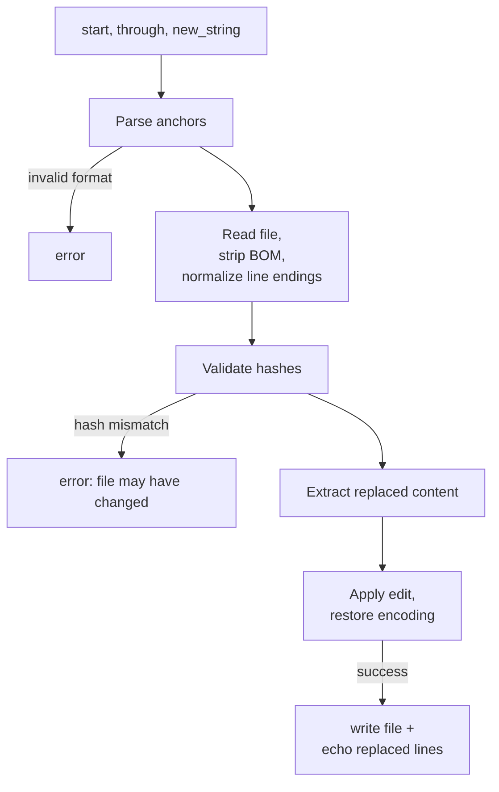

# Edit Tool

How Opal's hashline-based edit tool works and the reasoning behind it.

## Overview

Opal exposes three file tools to the LLM:

| Tool         | Purpose                                                                      | Module            |
| ------------ | ---------------------------------------------------------------------------- | ----------------- |
| `read_file`  | Read file contents with hashline tags, offset/limit slicing, head-truncation | `Opal.Tool.Read`  |
| `edit_file`  | Edit lines by hash-anchored references from `read_file` output               | `Opal.Tool.Edit`  |
| `write_file` | Create or overwrite an entire file                                           | `Opal.Tool.Write` |

The **edit tool** is the primary way the agent modifies existing code. Instead of reproducing old content (str_replace), the model references lines by their `N:hash` tags from `read_file` output.

## How it works

### Reading: hashline-tagged output

When the model reads a file, every line is tagged with a 2-character content hash:

```
1:a3|function hello() {
2:f1|  return "world";
3:0e|}
```

The hash is computed from the trimmed line content via `:erlang.phash2/2` (mod 256, lowercase hex). The line number identifies the line; the hash verifies it hasn't changed since the last read.

### Editing: hash-anchored references

The edit tool accepts `start` and `through` anchors in `N:hash` format:

```json
{
  "path": "src/app.ts",
  "start": "2:f1",
  "through": "2:f1",
  "new_string": "  return \"hello\";"
}
```

Three operations are supported:

| Operation           | Behavior                                                          |
| ------------------- | ----------------------------------------------------------------- |
| `replace` (default) | Replace lines `start` through `through` (inclusive) with `new_string` |
| `insert_after`      | Insert `new_string` after the `start` line                        |
| `insert_before`     | Insert `new_string` before the `start` line                       |

Omitting `through` defaults to a single-line edit. Omitting `new_string` deletes the line range.

> **Note:** The parameter was previously named `end`. Using `through` avoids a
> naming collision with Elixir/Ruby/Lua's `end` keyword, which caused models to
> confuse the tool parameter with language syntax. The legacy `end` parameter is
> still accepted as a fallback.

### Pipeline



### Replaced content echo

On success, the edit tool returns the replaced (or anchor) lines alongside the confirmation. This lets the model self-check what it removed:

```
Edit applied to: /path/to/file.ex

Replaced content:
5:a3|  defp old_helper do
6:f1|    :ok
7:0e|  end
```

For insert operations, the anchor line is echoed instead.

### Hash validation

Before applying any edit, the tool recomputes the hash for each referenced line and compares it against the anchor. If the file was modified since the last `read_file` call, the hashes won't match and the edit is rejected with a clear error. This prevents silent corruption from stale references.

### Encoding preservation

Same as the legacy edit tool — BOM and CRLF are stripped before processing and restored after, so the file's encoding style is preserved.

### Safety checks

- Path must resolve within the session's working directory (no directory traversal).
- File must exist.
- Start line must not exceed end line.
- Line numbers must be in range.
- Hash must match current file content.

## Why hashline over str_replace?

The previous `edit_file` tool used `str_replace` (find exact old text, swap in new text). This is the most common edit format across coding agents but has a fundamental weakness: **the model must perfectly reproduce content it already saw**, including whitespace and indentation.

The blog post [The Harness Problem](https://blog.can.ac/2026/02/12/the-harness-problem/) by Can Bölük benchmarked three edit formats (patch, str_replace, hashline) across 16 models and 180 tasks. Key findings:

- **Patch** (diff-based): worst format for nearly every model. Grok 4's failure rate was 50.7%.
- **str_replace**: reliable baseline, but depends on perfect content recall.
- **Hashline**: matched or beat str_replace for most models. Weak models gained the most.

Selected results:

- Grok Code Fast 1: 6.7% → 68.3% (10× improvement)
- Gemini: +8% (bigger than most model upgrades)
- Output tokens dropped up to 61% (no retry loops from match failures)

> "None of these tools give the model a stable, verifiable identifier for the lines it wants to change without wasting tremendous amounts of context and depending on perfect recall."

The hashline format gives the model a cheap, verifiable anchor. If it can recall a 2-char hash, it knows what it's editing. No content reproduction needed.

## Source files

- `lib/opal/tool/hashline.ex` — Hash computation, line tagging, anchor parsing, hash validation
- `lib/opal/tool/edit.ex` — Hashline edit tool (`edit_file`)
- `lib/opal/tool/read.ex` — File reading with hashline-tagged output
- `lib/opal/tool/encoding.ex` — BOM and CRLF handling
- `lib/opal/tool/file_helper.ex` — Shared path resolution and file I/O helpers

## References

- [The Harness Problem](https://blog.can.ac/2026/02/12/the-harness-problem/) — Can Bölük, 2026. Benchmark of edit formats across 16 models showing hashline outperforms str_replace and patch.
- [oh-my-pi react-edit-benchmark](https://github.com/can1357/oh-my-pi/tree/main/packages/react-edit-benchmark) — Benchmark code and per-run reports.
- [Diff-XYZ benchmark](https://arxiv.org/abs/2510.12487) — JetBrains. No single edit format dominates across models and use cases.
- [EDIT-Bench](https://arxiv.org/abs/2511.04486) — Only one model achieves over 60% pass@1 on realistic editing tasks.
- [Aider benchmarks](https://aider.chat/docs/benchmarks.html) — Format choice swung GPT-4 Turbo from 26% to 59%.
- [Cursor Instant Apply](https://cursor.com/blog/instant-apply) — Fine-tuned 70B model for edit application; full rewrite outperforms diffs for files under 400 lines.
