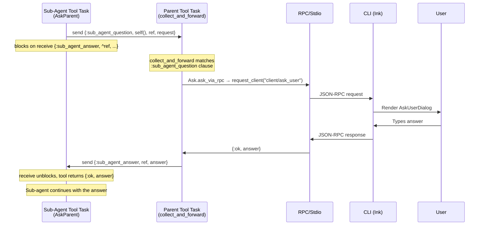

# sub_agent

Spawns a child agent for delegated tasks. The sub-agent runs in parallel under the session's DynamicSupervisor and its events are forwarded to the parent session in real-time.

## Parameters

| Param | Type | Required | Description |
|-------|------|----------|-------------|
| `prompt` | string | yes | Task description for the sub-agent |
| `tools` | string[] | no | Subset of tool names to make available (default: all parent tools) |
| `model` | string | no | Model ID override (e.g. use a cheaper model for simple tasks) |
| `system_prompt` | string | no | Custom system prompt override |

## Behavior

1. Spawns a new `Opal.Agent` via `Opal.SubAgent.spawn_from_state/2`
2. Sub-agent inherits the parent's config, provider, and working directory
3. Sends the prompt and blocks until the sub-agent finishes (120s timeout)
4. Collects the sub-agent's final response text and a log of tool executions
5. Terminates the sub-agent process

## Depth Enforcement

Sub-agents are limited to **one level** — no recursive spawning. This is enforced by excluding `Opal.Tool.SubAgent` from the sub-agent's tool list. The LLM literally cannot request it because the tool doesn't exist in its schema.

## Event Forwarding

While the sub-agent runs, all its events (text deltas, tool executions, etc.) are re-broadcast to the parent session as `{:sub_agent_event, parent_call_id, sub_session_id, inner_event}`. The CLI renders these with visual nesting.

## Tool Filtering

If `tools` is specified, only those named tools are made available. This lets the parent agent restrict sub-agents to specific capabilities (e.g. read-only tasks).

`Opal.Tool.AskUser` is always removed from the sub-agent's tool list (sub-agents must not prompt the user directly). `Opal.Tool.AskParent` is injected in its place so the sub-agent can ask questions that get routed back through the parent.

## Question Escalation

Sub-agents can ask the user questions via the `ask_user` tool (backed by `Opal.Tool.AskParent`). The mechanism uses plain OTP message passing — no extra processes, no GenServer calls, just `send`/`receive` with a `make_ref` for correlation.

### How it works

When the parent's `sub_agent` tool spawns a child, it creates a `question_handler` closure that captures its own PID (the parent tool task process). This closure is passed through `SubAgent.do_spawn` → `Agent.init` → `build_tool_context` → `AskParent.execute`.

### Why this works without deadlocks

The parent tool task is **not** the Agent GenServer — it's a supervised `Task` started by `Task.Supervisor.async_nolink`. While this task blocks in `collect_and_forward`, the Agent GenServer remains responsive (processing other `handle_info` messages). The sub-agent's tool task sends directly to the parent task, bypassing both GenServers entirely.

During the RPC call (waiting for the user), the sub-agent is blocked too (its tool task is in a `receive`), so no new events flow. Once the user answers, everything unblocks in order: parent task replies → sub-agent task resumes → sub-agent continues its agent loop → events flow again → parent task collects them.

### Module wiring

| Layer | What happens |
|-------|-------------|
| `Opal.SubAgent.do_spawn` | Removes `AskUser`, injects `AskParent`, passes `question_handler` in opts |
| `Opal.Agent.init` | Stores `question_handler` in agent state |
| `Opal.Agent.build_tool_context` | Puts `question_handler` in the tool context map |
| `Opal.Tool.AskParent.execute` | Calls `handler.(request)` if present; falls back to direct RPC |
| `Opal.Tool.SubAgent.collect_and_forward` | Receives `:sub_agent_question`, calls `Ask.ask_via_rpc`, replies |

## Source

`core/lib/opal/tool/sub_agent.ex`, `core/lib/opal/sub_agent.ex`, `core/lib/opal/tool/ask_parent.ex`, `core/lib/opal/tool/ask.ex`
