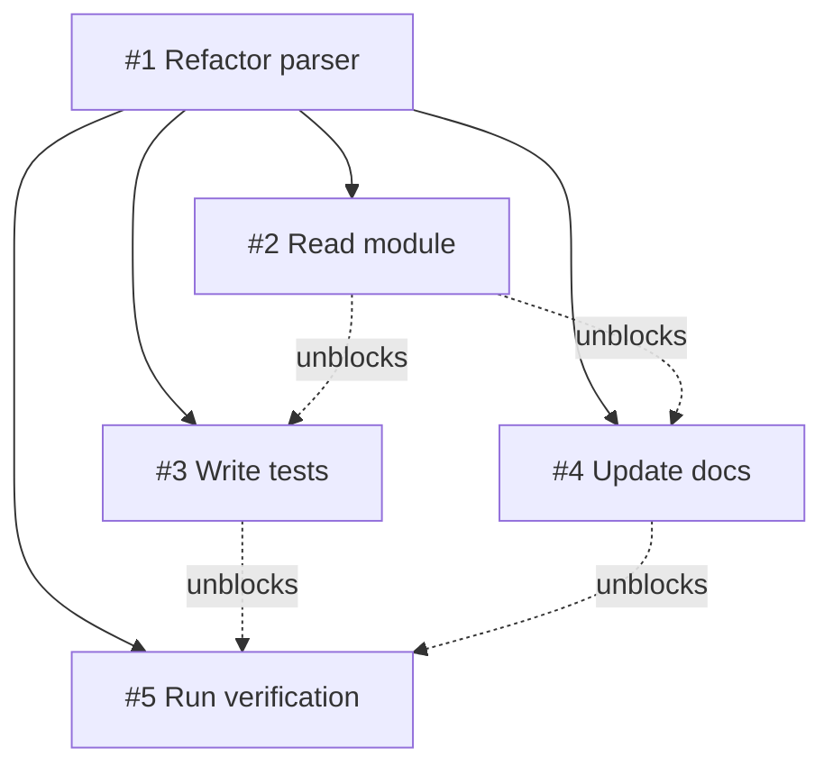

# tasks

Persistent task tracker backed by DETS with DAG dependency support. The LLM uses this to plan and track structured work — breaking complex tasks into subtasks with `parent_id` for hierarchy and `blocked_by` for ordering. Completing a task auto-unblocks its dependents, and the `ready` view surfaces dispatchable work for parallel `sub_agent` execution.

## Parameters

| Param        | Type    | Required | Description                                          |
| ------------ | ------- | -------- | ---------------------------------------------------- |
| `action`     | string  | yes      | `insert`, `list`, `update`, `delete`, or `batch`     |
| `id`         | integer | no       | Task ID (auto-generated for insert; required for update/delete) |
| `view`       | string  | no       | Named list preset: `open`, `done`, `blocked`, `in_progress`, `ready` |
| `tree`       | boolean | no       | When true, order tasks by parent hierarchy with `depth` field |
| `label`      | string  | no       | Task description (required for insert)               |
| `status`     | string  | no       | `open`, `in_progress`, `done`, `blocked`             |
| `parent_id`  | integer | no       | Parent task ID for hierarchical breakdown             |
| `prompt`     | string  | no       | Full sub-agent instructions for executing the task   |
| `result`     | string  | no       | Sub-agent output (written on completion)             |
| `notes`      | string  | no       | Additional notes                                     |
| `blocked_by` | string  | no       | Comma-separated IDs of blocking tasks                |
| `ops`        | array   | no       | Array of operations for `batch`                      |

## Actions

- **insert** — Create a task. Auto-generates ID. Defaults to `status: "open"`, or `"blocked"` when `blocked_by` is provided. Validates that `blocked_by` and `parent_id` reference existing tasks.
- **list** — Query tasks. Supports named views (`open`, `done`, `blocked`, `in_progress`, `ready`) or field-level filters. Pass `tree: true` for depth-first parent hierarchy ordering.
- **update** — Modify a task by ID. When a task transitions to `"done"`, auto-unblock cascades to dependents.
- **delete** — Remove a task by ID.
- **batch** — Process an array of operations atomically. Validates the full dependency graph before committing — rejects the entire batch if cycles or invalid refs are found.

All actions return a structured JSON payload with:

- `kind: "tasks"`, `action`
- `tasks` — task snapshot (filtered when `view`/filters are used)
- `total` and `counts` (`open`, `in_progress`, `done`, `blocked`)
- `changes` — operation-specific changes (insert/update/delete/auto_unblock)
- `operations` — per-op batch results (batch only)

## DAG Dependencies

The `blocked_by` field expresses a directed acyclic graph of task dependencies. Tasks reference other tasks by ID — a task cannot start until all its blockers are complete.

### Auto-Unblock

When a task is marked `"done"`:

1. Its ID is removed from every dependent task's `blocked_by` list.
2. Any task whose `blocked_by` becomes empty and whose status is `"blocked"` transitions to `"open"`.
3. Unblocked task IDs appear in the response as `auto_unblock` changes.

### Ready View

`{action: "list", view: "ready"}` returns tasks that are `"open"` with an empty `blocked_by` — exactly the work available for dispatch. Use this to find the next parallelizable layer.

### Batch Validation

When a `batch` contains inserts with `blocked_by`, the tool validates the dependency graph atomically before committing:

- **Ref existence** — every ID in `blocked_by` and `parent_id` must reference an existing task or another task being inserted in the same batch.
- **Cycle detection** — the resulting graph must be acyclic (checked via DFS with three-color marking).

The entire batch is rejected on failure with a clear error:

```
"Cycle detected: 3 → 5 → 3"
"Task #2: blocked_by references unknown task #99"
```

## Hierarchical Tasks

The `parent_id` field enables hierarchical task breakdown — a root task for the goal with subtasks for each step. Pass `tree: true` to `list` to order tasks depth-first by parent hierarchy, with a `depth` field on each task in the response.



## Parallel Sub-Agent Workflow

The tasks tool pairs with `sub_agent` for parallel execution. The LLM acts as scheduler:

1. **Plan** — `batch` insert a DAG of tasks with `parent_id` and `blocked_by`.
2. **Query** — `list` with `view: "ready"` to find dispatchable work.
3. **Dispatch** — Call `sub_agent` for each ready task (multiple calls in one response run in parallel).
4. **Complete** — `update` tasks to `"done"` with their `result`. Auto-unblock cascades to reveal the next layer.
5. **Repeat** from step 2 until all tasks are done.

## Storage

Tasks are stored in a DETS file at `~/.opal/tasks/<hash>.dets`, where `<hash>` is derived from the scope key (`session:<id>` when available, otherwise working directory). DETS is Erlang's disk-based term storage — tasks survive agent restarts. Each task has `created_at` and `updated_at` timestamps.

## Source

`lib/opal/tool/tasks.ex`
