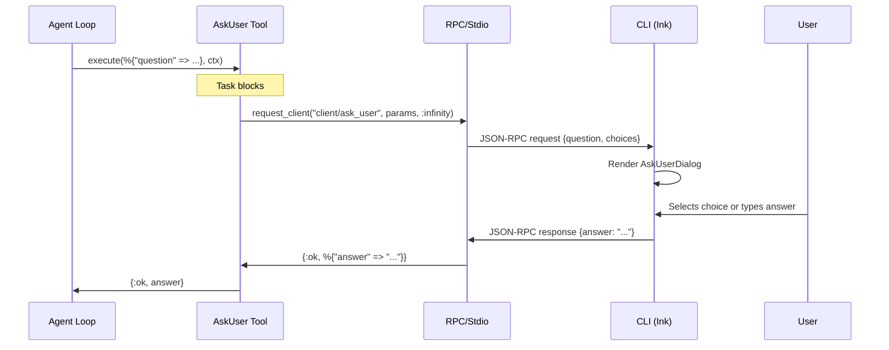

# User Input — `ask_user` Tool

The `ask_user` tool lets the agent pause execution and ask the user a question — freeform text, multiple choice, or both — then resume with the answer. It bridges the agent loop to the CLI's interactive UI via a server→client RPC request, reusing the same promise-based pattern as `client/confirm`.

Only top-level agents have access to this tool. Sub-agents cannot ask questions — `AskUser` is excluded from their tool list at spawn time.

## Module Structure

```
lib/opal/tool/
└── ask_user.ex     # Self-contained tool: spec, RPC call, execution
```

**`Opal.Tool.AskUser`** (`lib/opal/tool/ask_user.ex`) — A single module implementing the full `Opal.Tool` behaviour. Defines the tool name, description, parameters, and execution logic. Sends a `client/ask_user` RPC request and blocks until the user responds.

## Interface

### Tool Schema

The schema is defined directly in `Opal.Tool.AskUser`:

```elixir
defmodule Opal.Tool.AskUser do
  @behaviour Opal.Tool

  alias Opal.Tool.Args, as: ToolArgs

  @args_schema [
    question: [type: :string, required: true],
    choices: [type: {:list, :string}, default: []]
  ]

  def name, do: "ask_user"

  def description do
    "Ask the user a question and wait for their response. " <>
      "Provide optional choices for a multiple-choice question."
  end

  def parameters do
    %{
      "type" => "object",
      "properties" => %{
        "question" => %{
          "type" => "string",
          "description" => "The question to ask."
        },
        "choices" => %{
          "type" => "array",
          "items" => %{"type" => "string"},
          "description" => "Optional list of choices for multiple-choice."
        }
      },
      "required" => ["question"]
    }
  end

  def meta(%{"question" => q}), do: Opal.Util.Text.truncate_preview(q, 60)
  def meta(_), do: "ask_user"

  def execute(args, context) when is_map(args) do
    with {:ok, opts} <-
           ToolArgs.validate(args, @args_schema,
             required_message: "Missing required parameter: question"
           ) do
      params = %{
        session_id: context.session_id,
        question: opts[:question],
        choices: opts[:choices]
      }

      case Opal.RPC.Server.request_client("client/ask_user", params, :infinity) do
        {:ok, %{"answer" => answer}} -> {:ok, answer}
        {:ok, result} -> {:ok, inspect(result)}
        {:error, reason} -> {:error, "User input request failed: #{inspect(reason)}"}
      end
    end
  end

  def execute(_args, _context), do: {:error, "Missing required parameter: question"}
end
```

### Protocol: `client/ask_user`

Server→client request method in `Opal.RPC.Protocol` (`lib/opal/rpc/protocol.ex`):

```elixir
%{
  method: "client/ask_user",
  direction: :server_to_client,
  description: "Ask the user a question with optional multiple-choice answers.",
  params: [
    %{name: "session_id", type: :string, required: true,
      description: "Session this question belongs to."},
    %{name: "question", type: :string, required: true,
      description: "The question to display."},
    %{name: "choices", type: {:array, :string}, required: false,
      description: "Optional multiple-choice options."}
  ],
  result: [
    %{name: "answer", type: :string, description: "The user's response text."}
  ]
}
```

> **Why a new method instead of reusing `client/input`?**
> `client/input` is a low-level primitive for simple text prompts (e.g. "Enter
> your API key"). `client/ask_user` is richer: it carries structured choices,
> a question string, and is rendered with a dedicated UI component.

## How It Works

### Data Flow



### Tool Registration

`AskUser` is in the default tool list (`lib/opal/config.ex`). During sub-agent spawning, `Opal.Agent.Spawner.resolve_tools/2` filters it out from the child tool list:

```elixir
overrides
|> Map.get(:tools, parent.tools)
|> Enum.reject(&(&1 == Opal.Tool.AskUser))
```

### CLI Integration

**Session SDK** (`cli/src/sdk/session.ts`) — handles `client/ask_user` in `onServerRequest`, exposes `onAskUser` callback in `SessionOptions`.

**State** (`cli/src/hooks/use-opal.ts`) — `askUser` state field + `resolveAskUser` action, wired with a promise-based resolver ref.

**Component** (`cli/src/components/ask-user-dialog.tsx`) — Ink component with arrow-key choice navigation, freeform text input, and combined mode.

**App** (`cli/src/app.tsx`) — conditionally renders `<AskUserDialog>` when `state.askUser` is non-null.

## Edge Cases

- **Timeout**: `execute/2` calls `request_client(..., :infinity)` since user input has no upper bound.
- **Abort during input**: If the user presses Ctrl+C while `ask_user` is pending, the agent shuts down and the pending `request_client` call fails.
- **Sub-agents**: `AskUser` is excluded from sub-agent tool lists. Sub-agents cannot ask the user questions.
- **SDK (non-interactive)**: SDK users who don't set `onAskUser` get an error (same as `onInput` today).

## References

- [Handle approvals and user input](https://platform.claude.com/docs/en/agent-sdk/user-input) — Anthropic, 2025. Claude Agent SDK documentation for surfacing approval requests and clarifying questions to users. Informed the `ask_user` tool design and the promise-based resolution pattern.
