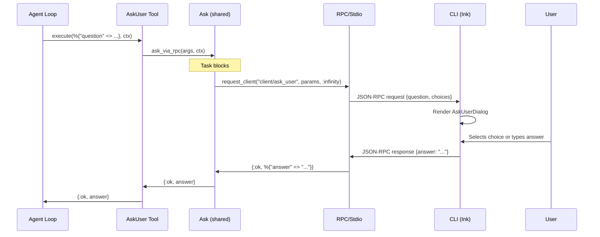
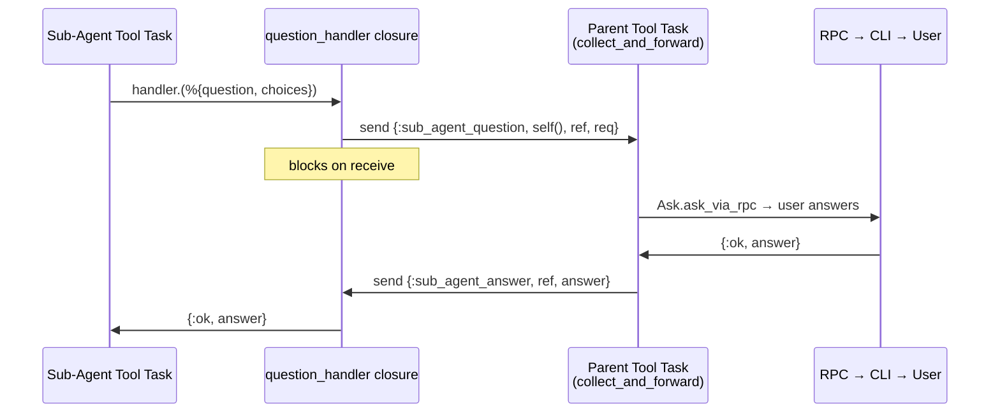

# User Input — `ask_user` Tool

The `ask_user` tool lets the agent pause execution and ask the user a question — freeform text, multiple choice, or both — then resume with the answer. It bridges the agent loop to the CLI's interactive UI via a server→client RPC request, reusing the same promise-based pattern as `client/confirm`.

Two modules expose this tool to the LLM under the same `ask_user` name — one for top-level agents, one for sub-agents. They share a common spec and RPC helper via `Opal.Tool.Ask` so that only the delivery path differs.

## Module Structure

```
core/lib/opal/tool/
├── ask.ex          # Shared spec (name, description, parameters, meta) + RPC helper
├── ask_user.ex     # Top-level agent tool — delegates to Ask, calls RPC directly
└── ask_parent.ex   # Sub-agent tool — tries question_handler callback, falls back to RPC
```

- **`Opal.Tool.Ask`** (`core/lib/opal/tool/ask.ex`) — Not a tool itself. Holds the shared `name/0`, `description/0`, `parameters/0`, `meta/1`, and `ask_via_rpc/2` so the two real tools stay DRY.
- **`Opal.Tool.AskUser`** (`core/lib/opal/tool/ask_user.ex`) — Registered in the default tool list for top-level agents. Delegates its spec callbacks to `Ask` and calls `Ask.ask_via_rpc/2` in `execute/2`.
- **`Opal.Tool.AskParent`** (`core/lib/opal/tool/ask_parent.ex`) — Injected for sub-agents (replacing `AskUser`). Delegates its spec to `Ask`, but `execute/2` first tries a `question_handler` callback from the tool context. If no handler exists (standalone sub-agent), it falls back to `Ask.ask_via_rpc/2`.

## Interface

### Tool Schema

Both tools present identical schemas to the LLM — the shared spec lives in `Opal.Tool.Ask`:

```elixir
defmodule Opal.Tool.Ask do
  def name, do: "ask_user"

  def description do
    "Ask the user a question and wait for their response. " <>
      "Provide optional choices for a multiple-choice question."
  end

  def parameters do
    %{
      "type" => "object",
      "properties" => %{
        "question" => %{
          "type" => "string",
          "description" => "The question to ask."
        },
        "choices" => %{
          "type" => "array",
          "items" => %{"type" => "string"},
          "description" => "Optional list of choices for multiple-choice."
        }
      },
      "required" => ["question"]
    }
  end

  def meta(%{"question" => q}), do: String.slice(q, 0, 60)
  def meta(_), do: "ask_user"

  def ask_via_rpc(args, context) do
    params = %{
      session_id: context.session_id,
      question: args["question"],
      choices: Map.get(args, "choices", [])
    }

    case Opal.RPC.Stdio.request_client("client/ask_user", params, :infinity) do
      {:ok, %{"answer" => answer}} -> {:ok, answer}
      {:ok, result} -> {:ok, inspect(result)}
      {:error, reason} -> {:error, "User input request failed: #{inspect(reason)}"}
    end
  end
end
```

`AskUser` delegates everything:

```elixir
defmodule Opal.Tool.AskUser do
  @behaviour Opal.Tool

  defdelegate name, to: Opal.Tool.Ask
  defdelegate description, to: Opal.Tool.Ask
  defdelegate parameters, to: Opal.Tool.Ask
  defdelegate meta(args), to: Opal.Tool.Ask

  def execute(%{"question" => _} = args, context),
    do: Opal.Tool.Ask.ask_via_rpc(args, context)
end
```

`AskParent` adds the handler path:

```elixir
defmodule Opal.Tool.AskParent do
  @behaviour Opal.Tool

  defdelegate name, to: Opal.Tool.Ask
  defdelegate description, to: Opal.Tool.Ask
  defdelegate parameters, to: Opal.Tool.Ask
  defdelegate meta(args), to: Opal.Tool.Ask

  def execute(%{"question" => question} = args, context) do
    case Map.get(context, :question_handler) do
      handler when is_function(handler, 1) ->
        request = %{
          question: question,
          choices: Map.get(args, "choices", [])
        }

        case handler.(request) do
          {:ok, answer} -> {:ok, answer}
          {:error, reason} -> {:error, "Question failed: #{inspect(reason)}"}
        end

      nil ->
        Opal.Tool.Ask.ask_via_rpc(args, context)
    end
  end
end
```

### Protocol: `client/ask_user`

Server→client request method in `Opal.RPC.Protocol` (`core/lib/opal/rpc/protocol.ex`):

```elixir
%{
  method: "client/ask_user",
  direction: :server_to_client,
  description: "Ask the user a question with optional multiple-choice answers.",
  params: [
    %{name: "session_id", type: :string, required: true,
      description: "Session this question belongs to."},
    %{name: "question", type: :string, required: true,
      description: "The question to display."},
    %{name: "choices", type: {:array, :string}, required: false,
      description: "Optional multiple-choice options."}
  ],
  result: [
    %{name: "answer", type: :string, description: "The user's response text."}
  ]
}
```

> **Why a new method instead of reusing `client/input`?**
> `client/input` is a low-level primitive for simple text prompts (e.g. "Enter
> your API key"). `client/ask_user` is richer: it carries structured choices,
> a question string, and is rendered with a dedicated UI component.

## How It Works

### Data Flow — Top-Level Agent



### Data Flow — Sub-Agent

When a sub-agent calls `ask_user`, `AskParent` invokes the `question_handler` closure — which sends a message to the parent's tool task process. The parent's `collect_and_forward` loop handles the message, escalates via RPC to the CLI, and replies. See [sub-agent docs](sub-agent.md#question-escalation) for the full sequence diagram.



### Tool Registration

`AskUser` is in the default tool list (`core/lib/opal/config.ex`). When spawning sub-agents, `Opal.SubAgent.do_spawn` removes `AskUser` and injects `AskParent` in its place, along with a `question_handler` callback:

```elixir
tools =
  parent_tools
  |> Enum.reject(&(&1 == Opal.Tool.AskUser))
  |> then(fn ts ->
    if Opal.Tool.AskParent in ts, do: ts, else: ts ++ [Opal.Tool.AskParent]
  end)
```

### CLI Integration

**Session SDK** (`cli/src/sdk/session.ts`) — handles `client/ask_user` in `onServerRequest`, exposes `onAskUser` callback in `SessionOptions`.

**State** (`cli/src/hooks/use-opal.ts`) — `askUser` state field + `resolveAskUser` action, wired with a promise-based resolver ref.

**Component** (`cli/src/components/ask-user-dialog.tsx`) — Ink component with arrow-key choice navigation, freeform text input, and combined mode.

**App** (`cli/src/app.tsx`) — conditionally renders `<AskUserDialog>` when `state.askUser` is non-null.

## Edge Cases

- **Timeout**: `ask_via_rpc` passes `timeout: :infinity` since user input has no upper bound.
- **Abort during input**: If the user presses Ctrl+C while `ask_user` is pending, the agent shuts down and the pending `request_client` call fails.
- **Sub-agents**: `AskUser` is excluded from sub-agent tool lists. Sub-agents get `AskParent` instead, which routes questions through the parent's `question_handler` callback.
- **SDK (non-interactive)**: SDK users who don't set `onAskUser` get an error (same as `onInput` today).

## References

- [Handle approvals and user input](https://platform.claude.com/docs/en/agent-sdk/user-input) — Anthropic, 2025. Claude Agent SDK documentation for surfacing approval requests and clarifying questions to users. Informed the `ask_user` tool design and the promise-based resolution pattern.
